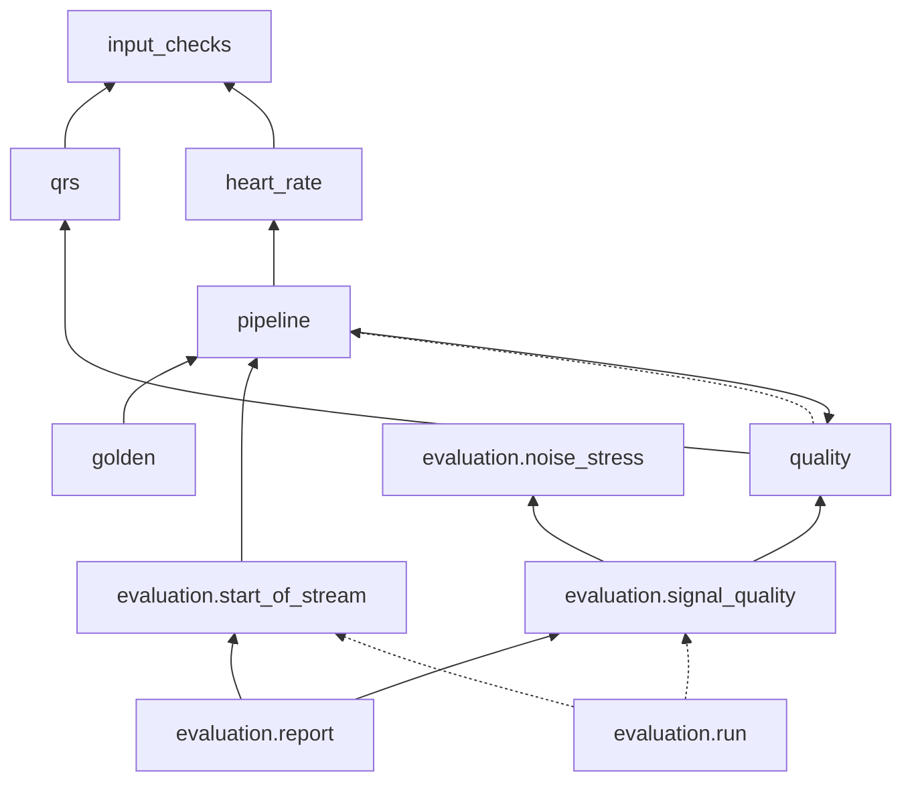

# Software architecture: Milestone 2 detailed design

_Part of the software architecture of Sinus. [`architecture.md`](architecture.md) holds the general architecture (§1 to §7 and §9 to §12) and the version, status and revision history of every part. Section numbers are those of the whole architecture: a reference such as §7.3 points to `architecture.md`, §8 to [`architecture-m1.md`](architecture-m1.md)._

## 13. Milestone 2 detailed design of `dsp`

This section is the detailed design (IEC 62304 §5.4) of the reference side of the Milestone 2 requirements: the change of SRS-003, the reference parts of SRS-022 and SRS-024 to SRS-028, and SRS-023, SRS-029, SRS-030 and SRS-033, with the documented maximum delay of SRS-021. Everything in §8.1 and §8.2 holds unchanged (module rules, types, argument defaults, times in samples, determinism, writing files, requirement citations, errors). The detection rules of §8.7 do not change (OP-056): the trace of §13.3 records what the detector already does.

The real-time library reproduces §13.3, §13.5 and §13.6 sample by sample; its own design (memory layout, arithmetic, interfaces) is in §14. Wherever a quantity below decides a mark, a status or a count, it is computed on integers, so that the reference and the library decide alike; only the reported values (heart rate in bpm, signal quality index) are floating-point, compared within the tolerances of SRS-034 (OP-005).

The choices below were checked with a prototype on synthetic signals only (the waveform of §7.2 at any heart rate, morphology variants, synthetic noise), never on the reference databases: the signal quality index in particular is fixed before its first run on them (§13.6).

### 13.1 Module structure (changes from §8.1)

| Module (`dsp/sinus_dsp/`) | Change | Requirements |
|---|---|---|
| `_types.py` | New alias `BoolArray = numpy.typing.NDArray[numpy.bool_]` | — |
| `input_checks.py` | The 1000 mV bound; `validate_fs` factored out of `validate_input` (§13.2) | SRS-003 |
| `qrs.py` | The detection trace: `QrsTrace`, `Detections`, `trace_qrs`, the path names; `detect_qrs` unchanged in result (§13.3) | SRS-006, SRS-022 |
| `heart_rate.py` (new) | Heart rate from the detections (§13.5) | SRS-024, SRS-025, SRS-026 |
| `quality.py` (new) | Signal quality index per window (§13.6) | SRS-027, SRS-028 |
| `pipeline.py` | `PipelineResult` gains the detections, the heart-rate events and the quality windows; new `detect_marked` (§13.3, §13.8) | SRS-006, SRS-010, SRS-015, SRS-022, SRS-024, SRS-027, SRS-033 |
| `synthetic.py` | The event inputs (§13.9) | SRS-033 |
| `golden.py` | Format version 2 (§13.8) | SRS-015, SRS-033 |
| `data/records.py` | `load_record(..., annotator=None)` and `load_signal`, for records without an annotation file (§13.7.1) | SRS-002 (unchanged behaviour with an annotator) |
| `evaluation/noise_stress.py` | Noise records, noisy stretches (§13.7.1) | SRS-014, SRS-029 |
| `evaluation/start_of_stream.py` (new) | Segments of SRS-023 and their scoring (§13.7.2) | SRS-023 |
| `evaluation/signal_quality.py` (new) | Window summaries, the criteria of SRS-029, the figures of SRS-030 (§13.7.3) | SRS-029, SRS-030 |
| `evaluation/run.py` | `ValidationResults` gains the quality and start-of-stream results; `RecordEvaluation` keeps its false negatives and false positives (§13.7.4) | SRS-023, SRS-029, SRS-030 |
| `evaluation/report.py` | Two new sections of the full report (§13.7.5) | SRS-030 |

Scripts: `validate.py` and `export_golden.py` keep their options; their output grows. No new script. No new runtime dependency: everything below uses the standard library, NumPy and SciPy, already in `soup.md`.

**Pipeline.** `run_pipeline` (§8.7) stays the single definition of the chain and computes everything the real-time library outputs:

```python
@dataclass(frozen=True)
class PipelineResult:
    ...                                      # the fields of §8.7, unchanged (beats = detections.indices)
    detections: Detections                   # §13.3
    heart_rate: tuple[HeartRateEvent, ...]   # §13.5
    quality: QualityWindows                  # §13.6
```

After the conditioning: `trace = _trace(mains_mv, fs)`; `heart_rate = track_heart_rate(trace.detections.indices, trace.detections.startup, fs, n_samples, reported_at=trace.detections.reported_at)`; `quality = assess_quality(input_mv, trace)`. `detect_beats` and `detect_marked` stop after the trace (§13.3), so that the evaluation of detection does not pay for the rest.

**Citations.** `heart_rate.py` and `quality.py` cite SRS-024 to SRS-026 and SRS-027, SRS-028 respectively; `qrs.trace_qrs` cites SRS-022. These requirements belong to both `dsp` and `libs/sinus-dsp` (`srs.md` v0.8). Until v0.3 the traceability matrix counted any verifying test, so a Python requirement test alone showed them verified; from v0.4 each software item that implements a requirement needs its own verifying test (§13.12, ADR 0006), so the C++ requirement test is required as well.

### 13.2 Amplitude bound of the input (SRS-003; OP-063)

**Module.** `sinus_dsp.input_checks`.

```python
MAX_ABS_SAMPLE_MV: Final = 1000.0

def validate_fs(fs_hz: float) -> float: ...                 # checks 1 and 2 below; returns float(fs_hz)
def validate_input(signal_mv: npt.ArrayLike, fs_hz: float) -> FloatArray: ...
```

`validate_input` checks, in this order, and raises `InvalidInputError` at the first failure (§8.5, with one new check):
1. `fs_hz` is a real number (not `bool`) and finite;
2. `125.0 ≤ fs_hz ≤ 1000.0`;
3. the signal converts to a one-dimensional array of integer or floating-point kind;
4. the signal is not empty;
5. every sample is finite; the message gives the number of non-finite samples and the index of the first;
6. **new:** every sample has `abs(sample) ≤ 1000.0`, compared on the float64 copy; the message gives the number of samples beyond the bound, the index of the first and its value (`repr`);
7. the duration is at least 10 s.

`validate_fs` performs checks 1 and 2 alone, with the same messages; `validate_input` calls it first. It is also used by the functions of §13.5 that take a sampling frequency without a signal.

**Behaviour.** The comparison is exact in binary64: `1000.0` is accepted; `math.nextafter(1000.0, math.inf)` (1000.0000000000001) and its negative are rejected, the values of the SRS-003 verification. An integer input is converted to float64 first (check 3), so a large integer is rejected by check 6. Check 6 comes after check 5 so that a NaN, whose comparisons are all false, is reported as non-finite.

**Consequences.**
- Every function that calls `validate_input` (§8.5 "Where it is called", `golden_vector` through `run_pipeline`, and the functions of §13.3 and §13.6) rejects such an input. The MIT-BIH Arrhythmia Database lies within ±5.12 mV and the noise records of the Noise Stress Test Database within ±5 mV (largest magnitude 4.85 mV, in `bw`), so no result changes; the source digest changes, so both reports are regenerated (§8.11).
- With every sample within 1000 mV, no filter or detection value of an accepted input can overflow: the integrated signal stays below about 10¹³ (mV/s)² at 1000 Hz, and its sums over 2 s below about 10¹⁷. `NonFiniteOutputError` and the `OverflowError` of the threshold initialisation reported with OP-063 cannot occur any more (§8.2).
- The real-time library rejects the same samples (SRS-018). In binary32 the bound is the same number; the smallest binary32 value above it, `1000.00006103515625`, is the one of the SRS-018 verification.

**Verification notes.** QA updates the SRS-003 tests (rejected: one sample equal to `math.nextafter(1000.0, math.inf)`, one equal to its negative; accepted: a 10 s input at 360 Hz with samples equal to 1000.0 and −1000.0), for the filters of SRS-004 and SRS-005 and the detection of SRS-006. Tests that used inputs above 1000 mV to provoke non-finite filter outputs change: `NonFiniteOutputError` is exercised by rendering a hand-built `GoldenVector` with a non-finite value (§8.12, developer's unit tests). OP-063 can be closed when these tests are merged and SRS-003 is verified again.

### 13.3 Detection trace: marks, report sample and path (SRS-022; used by SRS-021, SRS-024, SRS-026, SRS-027)

**Module.** `sinus_dsp.qrs`; `sinus_dsp.pipeline`.

**Purpose.** The detector of §8.7 is causal and decides sample by sample, so the sample at which the real-time library reports each detection is defined by the same procedure: it is the sample `n` of §8.7.3 at which the index is appended to the output. The trace records, for every detection, its index, its mark, that sample and the rule that found it. The heart rate (§13.5) needs the report sample, because "no recent beat" (SRS-026) is counted from the detections reported so far; the signal quality index (§13.6) needs it, because a window uses the detections reported by its own report sample.

**Interface.**

```python
# qrs.py
PATH_NORMAL: Final = "normal"            # classified at its confirmation (§8.7.3, step 1 of the procedure)
PATH_SEARCH_BACK: Final = "search_back"  # accepted by search-back (§8.7.3, step 3 of the procedure)
PATH_LEARNING: Final = "learning"        # classified during an initialisation (§8.7.3)
DETECTION_PATHS: Final = (PATH_NORMAL, PATH_SEARCH_BACK, PATH_LEARNING)

@dataclass(frozen=True)
class Detections:
    indices: IndexArray           # fiducial points f, strictly increasing (= detect_qrs)
    startup: BoolArray            # True: mark "start-up" (SRS-022); False: "reliable"
    reported_at: IndexArray       # sample n at which each detection is reported; non-decreasing;
                                  # indices[i] <= reported_at[i] < n_samples
    peaks: IndexArray             # m, the peak of the integrated signal of each detection
    paths: tuple[str, ...]        # one of DETECTION_PATHS per detection
    initialisations: IndexArray   # sample of every initialisation, increasing; the first is L - 1

@dataclass(frozen=True)
class QrsTrace:
    fs_hz: float
    samples: DetectorSamples
    signals: QrsSignals
    detections: Detections

def trace_qrs(conditioned_mv: npt.ArrayLike, fs_hz: float) -> QrsTrace: ...   # SRS-006, SRS-022
def detect_qrs(conditioned_mv: npt.ArrayLike, fs_hz: float) -> IndexArray: ... # trace_qrs(...).detections.indices

# pipeline.py
def detect_marked(signal_mv: npt.ArrayLike, fs_hz: float, mains_hz: int) -> Detections: ...
```

`trace_qrs` validates its input (§13.2) and runs the private `_trace(x, fs_hz) -> QrsTrace`, which is the procedure of §8.7.3 unchanged, with the bookkeeping below. `_detect` is removed; `pipeline` imports `_trace` instead (the one allowed private import of §8.1). `detect_marked` checks the input and the mains setting once, conditions the signal (§8.6) and returns `_trace(mains_mv, fs).detections`; it computes no heart rate and no quality window. `detect_beats` keeps its result and is computed as `detect_marked(...).indices`, so that the evaluation does not compute what it does not use.

**Bookkeeping in `_trace`** (no decision changes):
- The procedure keeps the current sample `n` and a current path, `PATH_NORMAL` by default. Search-back (step 3) sets it to `PATH_SEARCH_BACK` for its own acceptance; an initialisation (at `n = L − 1` or at a re-learning) sets it to `PATH_LEARNING` while it classifies the stored peaks again; both restore `PATH_NORMAL`.
- An initialisation at sample `n` appends `n` to `initialisations` before it classifies any peak (when `init_n = n` is set, §8.7.3).
- Each time a peak `p` is accepted as a QRS (the one place where `p.f` is appended to the output), the trace appends: `p.f` to `indices`; its mark (below); `n` to `reported_at`; `p.m` to `peaks`; the current path to `paths`.

**The mark** (SRS-022). With `i = init_n` at the moment of the acceptance (the latest initialisation) and `L` the learning samples, the detection is **start-up** if `max(0, i − L + 1) ≤ p.f ≤ i`, and **reliable** otherwise.
- This is the stretch of `L` samples from which that initialisation learned its levels (§8.7.3, "Initialisation at sample n"): `[0, L − 1]` for the first one (the start-up period of SRS-022), `[i − L + 1, i]` for a re-learning at `i`. `L = round(2 · fs_hz)` samples (720 at 360 Hz, 500 at 250 Hz): the 2 s of SRS-022.
- **Only the latest initialisation matters.** A detection accepted before a re-learning at `i` has `p.m ≤ last.m ≤ i − G` (re-learning needs `G` samples without a QRS), so `p.f < i − L + 1` because `G > L`. A detection accepted after an initialisation at `i₂` comes from a peak classified at `i₂` (`p.m ≥ i₂ − L + 1`) or confirmed after `i₂` (`p.m ≥ i₂ − P`), so `p.f ≥ i₂ − L − N − 1 − D`, while every earlier initialisation `i₁` satisfies `i₁ ≤ i₂ − G`. A detection can therefore lie only in the stretch of the latest initialisation at its acceptance, and the mark never changes after the detection is reported.
- A detection whose peak `m` lies just after the learning stretch can have its index inside it (`f` is up to `N + 1 + D` samples before `m`): it is marked start-up, because SRS-022 states the rule on the index.
- The mark changes no detection and no index (SRS-022): `indices` equals the output of §8.7 exactly.

**Edge cases.** A flat input gives no detection, the initialisation at `L − 1` and a re-learning every `G` samples. Detections reported at the first initialisation share the sample `L − 1`, so `reported_at` is non-decreasing, not strictly increasing. A re-learning stretch that lies in a flat stretch contains no detection, so no start-up mark follows it: the detections after the signal returns are marked reliable. On the waveform of §7.2, after flat stretches of 9 s and 20 s at 60, 75 and 120 bpm, every following beat was detected at +8 ms with no false detection (prototype on synthetic signals). That case is covered by the heart rate, which stays withheld until 4 new intervals exist (SRS-026), as the rationale of SRS-022 states.

**Verification notes.**
- Developer's unit tests: `trace_qrs(...).detections.indices` equals the output of the Milestone 1 detector on the synthetic set of §7.2 and on noise (the per-sample procedure is unchanged); `initialisations` starts with `L − 1`; each path occurs on the event inputs of §13.9 as documented there; `reported_at[i] ≥ indices[i]`; the start-up rule on hand-placed detections around a learning stretch, including an index inside the stretch whose peak lies after it.
- QA (SRS-022, reference part): on the synthetic ECGs of SRS-006 at 40, 75 and 180 bpm (360 Hz and 250 Hz), the detections with index at most `L − 1` are start-up and the others reliable, and `indices` equals `detect_beats` on the same input. For the stretch from which detection learns its levels again, the input to use is the event input `artefact` of §13.9 (its re-learning stretch contains beats). A flat stretch followed by the ECG gives a re-learning stretch without detections (edge cases above), so on such an input the check finds no start-up detection after the first 2 s.

### 13.4 Delays of the detection rules (SRS-021; OP-049)

The delay of a detection is `reported_at − index` samples (`srs.md`, "delay": from the sample at its index to its report, in samples given). With the parameters of §8.7 in samples (`N` window, `P` peak timeout, `D` band delay, `R` refractory, `L` learning, `G` re-learning), the bounds by path are:

| Path | Bound (samples) | Why | 125 Hz | 250 Hz | 360 Hz | 1000 Hz |
|---|---|---|---|---|---|---|
| Normal thresholds | `N + P + D + 2` | Confirmed at most `P + 1` samples after `m`; `f ≥ m − N − 1 − D` | 38 (0.304 s) | 73 (0.292 s) | 103 (0.286 s) | 283 (0.283 s) |
| First initialisation | `L − 1` | Reported at `L − 1`; `f ≥ 0` | 249 (1.992 s) | 499 (1.996 s) | 719 (1.997 s) | 1999 (1.999 s) |
| Re-learning | `L + N + D` | Reported at the re-learning sample `n`; `m ≥ n − L + 1` | 274 (2.192 s) | 547 (2.188 s) | 787 (2.186 s) | 2186 (2.186 s) |
| Search-back | `G + N + D + 1 − R` | Search-back fires at the latest at `last.m + G` (in the same sample as the re-learning, before it); the candidate was classified after the last QRS, so `c.m ≥ last.m + R` and `c.f ≥ c.m − N − 1 − D` | 1000 (8.000 s) | 1998 (7.992 s) | 2876 (7.989 s) | 7987 (7.987 s) |

(At 125 Hz, with the conversions of §8.2: N = 19, P = 12, D = 5, R = 25, L = 250, G = 1000.)

**Documented maximum** (SRS-021). Every detection is reported at most **`G + N + D + 1 − R` samples** after the sample at its index: 2876 samples (7.989 s) at 360 Hz, 1998 samples (7.992 s) at 250 Hz, and **at most 8.01 s at any sampling frequency from 125 Hz to 1000 Hz** (the expression is 7.986 s · fs_hz + 1 sample, plus at most 1.5 samples of rounding). The bound is set by search-back, whose candidate has no age limit (OP-056 (a), unchanged in Milestone 2); the rationale of SRS-021 calls it "about 8 s".

**Regular rhythm after the start-up period.** For a noise-free regular rhythm from 30 to 200 bpm, every detection after the first 2 s is found by the normal thresholds, so its delay is at most `N + P + D + 2` samples: at most 0.31 s at every accepted sampling frequency, within the 0.35 s of SRS-021. On the 30 inputs of SRS-006 and SRS-010 (60 s each, prototype), every detection after 2 s was found on the normal path, with a largest delay of 0.172 s at 360 Hz and 0.212 s at 250 Hz (200 bpm).

**Verification notes.** The delays of the real-time library are verified on the library (SRS-021, QA). The inputs that make detection report a beat found during its learning period, by search-back and after a re-learning are the event inputs of §13.9: every input has beats in its first 2 s; `small-beat` gives a search-back detection at both rates (delay 0.62 s) and `artefact` a search-back detection 5.8 s late at 250 Hz; `artefact` gives detections after a re-learning at both rates. QA can check on the reference trace (`Detections.paths`) that each input exercises its path, then check the delays of the library against the bound above.

### 13.5 Heart rate (SRS-024, SRS-025, SRS-026)

**Module.** `sinus_dsp.heart_rate`.

**Requirements on the estimator.** SRS-024 asks for 2 bpm on a regular rhythm from 30 to 200 bpm and the new rate from the fifth interval after a change; SRS-025 asks for 5 bpm with one missed or one added detection; SRS-026 fixes the first estimate at the fourth interval and the range 30–200 bpm. Two consequences shape the design:
- **Averaging is needed for 2 bpm.** One interval rounded to the sample changes the rate by up to HR² / (60 · fs) bpm: 1.85 bpm at 200 bpm and 360 Hz, but 2.67 bpm at 250 Hz and 5.3 bpm at 125 Hz. The mean of k consecutive intervals of rounded positions is the span between the first and the last detection divided by k, so its error is below 1/k sample.
- **Robustness is needed for 5 bpm, with at most five intervals.** A plain mean fails SRS-025 (one missed beat moves a mean of four intervals at 75 bpm to 60 bpm). An added detection splits one interval into two short ones, so the estimator must tolerate two adjacent outliers among four or five intervals. And to reach the new rate at the fifth interval, the window can hold no more than five intervals.

**Estimator** (`estimate_intervals`), from the last up to six intervals of the stream (oldest first, at least four), in samples:
1. `w` = the last `min(5, len)` intervals. `M` = the third smallest value of `w` (the middle of five; the upper middle of four). `M` is one of the intervals, an integer.
2. The **outliers** of `w` are the intervals `v` with `100 · v < 92 · M` or `100 · v > 116 · M`. These are the limits of P&T's RR AVERAGE2 (92% and 116%; Pan and Tompkins 1985), around `M` instead of a running average, so that they hold from the first estimate. They are wide enough for rounding: one sample is at most 2.7% of the shortest interval in range (37.5 samples at 125 Hz and 200 bpm).
3. **Robust estimate** if `w` has no outlier, one outlier, or two outliers that are adjacent in `w`: the patterns of a missed detection (one interval about twice as long), of an added detection (two adjacent short intervals, or one of them at either end of the window) and of an isolated premature beat with its compensatory pause (a short interval followed by a long one). Then `k` = the number of non-outliers of `w` and `S` = their sum.
4. **Mean estimate** otherwise (three or more outliers, or two that are not adjacent: an irregular rhythm): `k` = the number of intervals given (up to six) and `S` = their sum. Six intervals hold a whole number of cycles of bigeminy and trigeminy, so these rhythms read as their mean rate.
5. The rate is `60.0 * fs_hz * k / S` bpm, computed in float64 in this order. It is **in range** if `ceil(300 · k · fs_hz / 1000) ≤ S ≤ floor(2000 · k · fs_hz / 1000)` (mean interval from 300 ms to 2000 ms, i.e. 200 to 30 bpm, both included), computed as in §8.2 ("at least" with `ceil`, "at most" with `floor`; exact for every integer `fs_hz`). The status therefore never depends on the rounding of the rate.

All decisions use integers only; the real-time library makes the same decisions and computes only the rate in binary32.

**Interface.**

```python
STATUS_VALID: Final = "valid"
STATUS_NOT_ENOUGH_BEATS: Final = "not_enough_beats"
STATUS_NO_RECENT_BEAT: Final = "no_recent_beat"
STATUS_OUT_OF_RANGE: Final = "out_of_range"
HEART_RATE_STATUSES: Final = (STATUS_VALID, STATUS_NOT_ENOUGH_BEATS, STATUS_NO_RECENT_BEAT,
                              STATUS_OUT_OF_RANGE)
MIN_INTERVALS: Final = 4            # SRS-026
ROBUST_WINDOW: Final = 5            # intervals
MEAN_WINDOW: Final = 6              # intervals
INLIER_LOW_PERCENT: Final = 92
INLIER_HIGH_PERCENT: Final = 116
MIN_INTERVAL_MS: Final = 300        # 200 bpm
MAX_INTERVAL_MS: Final = 2000       # 30 bpm
NO_RECENT_BEAT_MS: Final = 3000     # SRS-026
METHOD_ROBUST: Final = "robust"
METHOD_MEAN: Final = "mean"

@dataclass(frozen=True)
class IntervalEstimate:
    n_intervals: int        # k
    span_samples: int       # S, the sum of the k intervals used
    method: str             # METHOD_ROBUST or METHOD_MEAN

@dataclass(frozen=True)
class HeartRateEvent:
    sample: int             # stream sample at which it is reported
    beat_index: int | None  # index of the reliable detection it is reported at; None for a change of
                            # status at no detection
    status: str             # one of HEART_RATE_STATUSES
    bpm: float | None       # the rate for STATUS_VALID and STATUS_OUT_OF_RANGE; None otherwise

def no_recent_beat_samples(fs_hz: float) -> int: ...      # ceil(3000 * fs_hz / 1000): 1080 at 360 Hz
def estimate_intervals(intervals: Sequence[int]) -> IntervalEstimate: ...
def interval_rate_bpm(estimate: IntervalEstimate, fs_hz: float) -> float: ...
def interval_in_range(estimate: IntervalEstimate, fs_hz: float) -> bool: ...
def track_heart_rate(indices: npt.ArrayLike, startup: npt.ArrayLike, fs_hz: float, n_samples: int, *,
                     reported_at: npt.ArrayLike | None = None) -> tuple[HeartRateEvent, ...]: ...
```

**`track_heart_rate`** (SRS-024 to SRS-026) processes the stream sample by sample, `n` from 0 to `n_samples − 1`, as the library does. `reported_at` gives the sample at which each detection is reported (§13.3); `None` means that each detection is reported at its own index, which is how a test gives a sequence of detections directly. State: up to six intervals; the number of intervals since the last reset (`count`); the reset sample `reset_at`, initially −1; the previous detection (its index and mark); the last reliable detection reported (`last`); the last reliable detection for which "no recent beat" has fired; the current status, initially `not_enough_beats`. No event is reported at sample 0: the initial status is part of the definition.

At sample `n`:
1. For each detection reported at `n`, in order:
   - **start-up**: it becomes the previous detection; no event (SRS-024: the heart rate is reported at reliable detections, and start-up detections never enter it).
   - **reliable**: if the previous detection exists, is reliable and its index is greater than `reset_at`, the interval between the two indices is added (the oldest dropped beyond six) and `count` increases. It becomes the previous detection and `last`. Then:
     - if `count < 4`: status `no_recent_beat` if `reset_at ≥ 0` (a "no recent beat" has started since the stream began), otherwise `not_enough_beats`; no rate;
     - otherwise: `estimate_intervals` on the last `min(6, count)` intervals; status `valid` if in range, otherwise `out_of_range`; the rate in both cases.

     An event `(n, index, status, rate)` is reported, whatever the status (SRS-024: at each reliable detection).
2. **No recent beat.** If `last` exists, "no recent beat" has not fired for it yet, and `n − last.index ≥ no_recent_beat_samples(fs_hz)`: it fires for `last`; `reset_at = n`; the intervals are cleared and `count = 0`; if the status is not already `no_recent_beat`, it becomes so and the event `(n, None, no_recent_beat, None)` is reported (SRS-024: at each change of its validity or of the reason for which it is withheld).

**Readings of SRS-026** that this procedure makes exact:
- "The last detection marked reliable reported up to and including that sample" is `last` after step 1 of sample `n`: a detection reported at `n` counts at `n`. With the detector's report delay (§13.4, up to about 0.29 s on the normal path), a stretch without detections a little shorter than 3 s (from about 2.7 s) also gives "no recent beat", because the next detection is reported only after the 3 s have passed: this is what the statement says. A sequence given with `reported_at=None` reproduces the verification of SRS-026 literally (a stretch shorter than 3 s gives none).
- "4 intervals whose detections all have their index after that sample": both detections of an interval have an index greater than `reset_at`. A detection with an earlier index reported later (for example by search-back) does not count.
- When "not enough beats" and "no recent beat" both hold, the status is `no_recent_beat`. Every rule that ends "no recent beat" (four new intervals) also ends "not enough beats".
- If "no recent beat" fires again while it holds (a new gap after fewer than four new intervals), `reset_at` moves to the new sample and no event is reported (the status does not change).

**Input checks** (design behaviours, developer's unit tests): `fs_hz` through `validate_fs`; `n_samples` an `int` (not `bool`), at least 1; `indices` a one-dimensional integer array, strictly increasing, within `[0, n_samples)`; `startup` a one-dimensional boolean array of the same length; `reported_at` (when given) a one-dimensional integer array of the same length, non-decreasing, with `indices[i] ≤ reported_at[i] < n_samples`. Otherwise `InvalidInputError`. `estimate_intervals` takes four to six positive integers, otherwise `InvalidInputError`.

**Results on synthetic sequences** (prototype; positions rounded to the sample):
- Regular rhythms at 30, 40, 75, 120, 150, 180, 197 and 200 bpm, at 125, 250, 360 and 1000 Hz: largest error 0.72 bpm (125 Hz, 180 bpm); first valid rate with the fourth interval.
- One missed detection at any position: largest error 1.82 bpm; one added detection in the middle of an interval or 200 ms after a detection (rates up to 150 bpm): 1.01 bpm.
- Changes 40↔180, 75↔120, 75↔150, 30↔200 and 75↔80 bpm: largest error 0.29 bpm from the fifth interval of the new rhythm.
- 29 and 201 bpm: `out_of_range`; 30 and 200 bpm: `valid`. Gaps of 3.1 s and 3.5 s at 30 and 75 bpm: `no_recent_beat` 3 s after the last detection, next valid rate at the fourth new interval; a gap of 2.9 s: none.

**Irregular rhythms** (not specified by `srs.md`; a property of this design, not verified). Ventricular bigeminy and trigeminy at an underlying 75 bpm (couplings 0.5 to 0.67 of the interval): 75 to 83 bpm. Random intervals from 0.5 s to 1.1 s (mean 75.8 bpm): 56 to 115 bpm, following the last five or six intervals. An estimator that keeps only the middle cluster (steps 1 to 3 without step 4) alternates between 54 and 122 bpm in bigeminy, which is why step 4 exists.

**Alternatives considered.** A plain mean fails SRS-025. A median alone meets SRS-024 to SRS-026 but alternates in bigeminy (above). Correcting the intervals (merging two short ones, splitting a doubled one) before averaging handles bigeminy but merges intervals wrongly in trigeminy at some couplings and needs more rules. A Kalman filter on the intervals, planned in v0.1 of this document, still needs a gating rule for missed and added detections, and its process noise would be a parameter to tune; it brings nothing for these criteria.

**Verification notes.** QA (reference part of SRS-024 to SRS-026) calls `track_heart_rate` with sequences built as in `srs.md` (reported at their own index unless a test needs a delay), at 360 Hz and 250 Hz, and checks the events: statuses as the strings above, rates within the bounds, the first valid rate at the fourth interval, "no recent beat" at the first sample at least `no_recent_beat_samples(fs_hz)` after the last detection. "A sequence that begins with detections marked start-up gives the same heart rates as the sequence of its reliable detections alone" holds because start-up detections produce no event and no interval. Developer's unit tests: `estimate_intervals` on each pattern of step 3 and step 4 (including the outlier at either end of the window and two non-adjacent outliers), the integer range bounds at 125, 250, 360 and 1000 Hz, the input checks, a reliable detection reported after a reset with an earlier index.

### 13.6 Signal quality index (SRS-027, SRS-028)

**Module.** `sinus_dsp.quality`.

**What the index measures.** The index estimates, in each window, how far the QRS complexes found by detection stand above everything else, in the signal that detection itself uses: the squared derivative `s = d²` of the detection band (§8.7.1). Each detection `p` defines a **zone**, the `N` samples `[p.m − N + 1, p.m]` whose mean is the integrated value `y[p.m]` of its peak (§8.7.1, step 4). Over a window:
- `S` = the mean of `s` inside the zones of its detections (the mean QRS power, in (mV/s)²);
- `B` = the mean of `s` outside them (the power of everything else: P and T waves, noise, interference, missed QRS complexes);
- `ρ = B / S`, an inverse signal-to-noise ratio in the detection domain; the index is `S / (S + K · B) = 1 / (1 + K · ρ)`, with `K = 16`.

Properties that follow from the definition:
- It does not depend on the heart rate (both are means per sample), nor on the amplitude of the signal (both scale alike).
- It does not depend on the rhythm: an ectopic beat is one more zone, so bigeminy and trigeminy are not penalised (synthetic bigeminy at 75 bpm: ρ = 0.012, as a normal rhythm).
- False detections move it towards "not usable": their zones hold noise, which lowers `S`. Missed QRS complexes do too: their energy falls outside the zones and raises `B`.
- Zones are disjoint: consecutive detections are at least `R > N` samples apart (§8.7.3, refractory period), so `S` and `B` share no sample.

Two gates set the index to 0 whatever `ρ`:
- **Held input** (SRS-028): the input stays at one value for at least 5 s inside the window. The test is on the input samples as given, by exact equality of consecutive samples, so a saturated or disconnected acquisition is caught however the conditioning responds to it.
- **Implausible number of detections**: fewer than 4 or more than 34 detections with an index in the window. A regular rhythm from 30 to 200 bpm gives 5 to 34 in a window of 10 s; 4 allows one missed beat at 30 bpm. A flat line, or a signal without beats, gives none.

**Parameters.**

| Parameter | Value | In samples | 250 Hz | 360 Hz |
|---|---|---|---|---|
| Block `H` (window spacing) | 1 s | `round_samples_ms(1000, fs_hz)` | 250 | 360 |
| Window `W` | 10 blocks | `10 · H` | 2500 | 3600 |
| Held stretch | 5 blocks | `5 · H` | 1250 | 1800 |
| Report delay `Δ` | 0.5 s (at most, SRS-027) | `floor_samples_ms(500, fs_hz)` | 125 | 180 |
| Zone | the detector's `N` | §8.7 | 38 | 54 |
| Detections per window | 4 to 34 | — | — | — |
| `K` (`BACKGROUND_WEIGHT`) | 16 | — | — | — |
| Threshold (`USABLE_THRESHOLD`) | 0.5 (usable when the index is at or above it) | — | — | — |

At an integer sampling frequency the window is exactly 10 s and the spacing exactly 1 s (SRS-027); at another frequency both are a whole number of blocks of `round(fs_hz)` samples, which keeps every window aligned on blocks.

**The threshold, fixed before any run on the reference databases.** The mark is usable when `ρ ≤ 1/16`. It is justified without the reference databases, in two ways:
- **From the detector.** Pan–Tompkins accept a peak as a QRS when its integrated value exceeds the first threshold, a quarter of the way from the noise level to the signal level (§8.7.3). Over 10 s, the largest 150 ms average of the power of Gaussian noise limited to the detection band (about 10 Hz wide, so about three degrees of freedom per average) is about 4 times its mean. A background whose mean power reaches 1/16 of the QRS power therefore produces noise peaks near the first threshold: the point where false detections begin.
- **On synthetic signals** (prototype; the waveform of §7.2 with Gaussian noise added at the signal-to-noise ratios of the noise stress test, defined as by the WFDB program `nst`: QRS peak-to-peak amplitude squared over 8, divided by the noise power; noise white, limited to 15 Hz, or limited to 5 Hz; 75 and 150 bpm; 300 s per level, from 14 dB to −2 dB in steps of 1 dB): every clean window has `ρ ≤ 0.029` (index ≥ 0.69, at 200 bpm); no window with a detection error has `ρ` below 0.0495, and windows with an error and `ρ < 1/16` occur only with noise limited to 5 Hz at 5 to 7 dB (single errors). At 18 dB and above every window was usable for the three noises; wherever detection made errors on more than a few windows (0 dB and below for all three, 6 dB for the noise limited to 15 Hz), none was.

No parameter of this section was chosen from results on the MIT-BIH Arrhythmia Database or the Noise Stress Test Database. A change after the evaluation of SRS-029 has been seen is reported as tuned on the evaluation data (`sdp.md` §6).

**Known sensitivities** (from the same prototype, synthetic morphologies): energy of P and T waves in the detection band counts as background. A tall, peaked T wave (0.9 mV, about 100 ms wide) is not usable from 75 bpm; a wide QRS complex (σ 20 ms) or an rSR' pattern reaches the threshold only near 200 bpm. Electrode motion noise is concentrated at low frequencies and is impulsive; how the index behaves on it is what SRS-029 measures.

**Interface.**

```python
BLOCK_MS: Final = 1000
WINDOW_BLOCKS: Final = 10
HELD_BLOCKS: Final = 5
REPORT_DELAY_MS: Final = 500
MIN_DETECTIONS: Final = 4
MAX_DETECTIONS: Final = 34
BACKGROUND_WEIGHT: Final = 16.0
USABLE_THRESHOLD: Final = 0.5

@dataclass(frozen=True)
class QualitySamples:
    block: int               # H
    window: int              # W = WINDOW_BLOCKS * H
    held: int                # HELD_BLOCKS * H
    report_delay: int        # floor(500 * fs_hz / 1000)
    zone: int                # N of the detector

@dataclass(frozen=True)
class QualityWindows:
    first: IndexArray            # first sample of each window, k * H
    last: IndexArray             # first + W - 1
    reported_at: IndexArray      # last + report_delay
    index: FloatArray            # signal quality index, in [0, 1]
    usable: BoolArray            # index >= USABLE_THRESHOLD
    held: BoolArray              # gate: held input (diagnostic)
    n_detections: IndexArray     # detections with an index in the window, reported by reported_at
    signal_power: FloatArray     # S, (mV/s)^2; NaN when no zone lies in the window
    background_power: FloatArray # B, (mV/s)^2; NaN when no zone lies in the window

def quality_samples(fs_hz: float) -> QualitySamples: ...
def assess_quality(input_mv: npt.ArrayLike, trace: QrsTrace) -> QualityWindows: ...       # SRS-027, SRS-028
def quality_windows(signal_mv: npt.ArrayLike, fs_hz: float, mains_hz: int) -> QualityWindows: ...  # run_pipeline(...).quality
```

`QrsTrace` (§13.3) carries `fs_hz`, so that `assess_quality` needs no other argument. `assess_quality` validates `input_mv` with `validate_input(input_mv, trace.fs_hz)` and requires its length to equal that of the trace's signals (`InvalidInputError` otherwise). `run_pipeline` calls it with its validated input and the trace of the conditioned signal.

**Computation** (`n` samples; every sum with `math.fsum`, §8.2):
1. `s = d * d` from `trace.signals.derivative_mv_per_s`.
2. **Held run.** `h[0] = 1`; `h[k] = h[k − 1] + 1` if `input[k] == input[k − 1]`, else 1 (exact float64 equality).
3. **Blocks.** Block `j` covers `[j · H, (j + 1) · H − 1]`, for every `j` whose last sample is below `n`. For each: `E_t(j) = fsum(s over the block)`; `hmax(j)` = the largest `h` in the block; `hend(j)` = `h` at its last sample.
4. **Zone parts.** For each detection (index `f`, peak `m`, `reported_at`): its zone `[max(0, m − N + 1), m]`, split at block boundaries into at most two parts (`N < H` at every sampling frequency); for each part inside a complete block, the block, `fsum` of `s` over the part, and its number of samples.
5. **Windows** `k = 0, 1, …`, with `first = k · H`, `last = first + W − 1`, `reported_at = last + Δ`, as long as `reported_at ≤ n − 1` (a window whose report sample lies beyond the end of the stream is never reported, as in the library). For each:
   - `held` if `max(hend(k + 4), hmax(k + 5), …, hmax(k + 9)) ≥ 5 · H`: a run of `5 · H` equal samples lies inside the window exactly when one ends at a sample from `first + 5 · H − 1` to `last`;
   - `n_detections` = the detections with `first ≤ f ≤ last` and `reported_at ≤` the window's `reported_at`;
   - `E_t = fsum(E_t(k), …, E_t(k + 9))`; over the zone parts in blocks `k` to `k + 9` of the detections reported by the window's `reported_at`: `E_z = fsum` of their sums and `n_z` the sum of their sample counts;
   - if `n_z > 0`: `S = E_z / n_z` and `B = max(0.0, E_t − E_z) / (W − n_z)`; otherwise both NaN;
   - `index = 0.0` if `held`, or `n_detections < 4`, or `n_detections > 34`, or `n_z = 0`; otherwise `S / (S + 16.0 * B)`;
   - `usable = index >= 0.5`.

A window uses the detections reported by its own report sample, as the library can. With `Δ ≥ N + P + D + 2` at every sampling frequency (62 against 38 samples at 125 Hz, 180 against 103 at 360 Hz), every detection found by the normal thresholds whose index or zone lies in the window is included; a detection reported later (search-back, re-learning) is not, and its energy counts as background. The mark is decided on the reported index, so a window is usable exactly when its reported index is at or above the threshold (SRS-027).

**Results of the prototype on the cases of SRS-028** (synthetic, 360 Hz and 250 Hz): every window from 2 s of the ECGs of SRS-006 and SRS-010 at 30, 40, 75, 180 and 200 bpm usable (index 0.68 to 0.98, the lowest at 200 bpm); flat inputs at 0 mV and 1 mV: no detection, index 0; white Gaussian noise of RMS 0.01, 0.1 and 1 mV: 21 to 31 detections per window, `ρ` 0.39 to 0.49, index about 0.12, all not usable; an ECG held at 2 mV from 20 s to 40 s: not usable exactly for the windows that start from 15 s to 35 s, those with at least 5 s of the held stretch.

**Edge cases.** A stream shorter than `W + Δ` samples has no window. The first windows contain the start-up period and the settling of the notch (§8.6): SRS-028 does not require them to be usable. An input of very small amplitude whose integrated signal stays below `MIN_INTEGRATED` (§8.7.2) gives no detection and index 0.

**Verification notes.**
- QA (reference part of SRS-027, SRS-028) uses `quality_windows` on synthetic inputs built with the waveform of §7.2 (any heart rate), on flat inputs and on white Gaussian noise; the windows, their sample indices, report samples (`last + Δ`, within 0.5 s) and marks as above. The guarantees on clean ECGs hold for the waveform of §7.2; another waveform with sharper P or T waves can have a higher `ρ` (known sensitivities), so QA's own generator, if used, must follow §7.2.
- Developer's unit tests: the held gate at a run of exactly `5 · H` and `5 · H − 1` samples at each position in the window; the count gates at 3, 4, 34 and 35 detections; zone parts across a block boundary; a detection reported after the window's report sample left out; `S` equal to the mean of the zones' integrated values; the index of hand-built `S` and `B`.

### 13.7 Evaluation and report (SRS-023, SRS-029, SRS-030)

#### 13.7.1 Records without annotations, noise records and noisy stretches

**Records without an annotation file.** The three noise records of the Noise Stress Test Database (`bw`, `em`, `ma`) have no annotation file (`ANNOTATORS` lists `atr` for the ECG records only), so `load_record` cannot read them as it is.

```python
# data/records.py
def load_record(record_path: Path, channel: int = 0, annotator: str | None = "atr") -> Record: ...
def load_signal(record_path: Path, channel: int = 0) -> Record: ...   # load_record(record_path, channel, None)
```

With `annotator=None` no annotation file is read: `beat_samples` is an empty `int64` array, `beat_symbols` and `other_annotations` are empty. Everything else (channel and units checks, signal in mV) is as in §8.4. The headers of the noise records give an ADC gain of 0 and no units; wfdb reads the gain as 200 adu/mV (the WFDB default for an uncalibrated signal) and the units as mV, so the signals load in mV (checked: 650000 samples at 360 Hz, two signals `noise1` and `noise2`, first stored signal used, largest magnitude 4.85 mV).

**Noisy stretches.**

```python
# evaluation/noise_stress.py
NOISE_RECORDS: Final = ("bw", "em", "ma")
NOISE_FREE_S: Final = 300        # no noise added in the first 5 min
NOISE_PERIOD_S: Final = 240      # a noisy stretch starts every 4 min
NOISY_STRETCH_S: Final = 120     # and lasts 2 min

def noisy_stretches(n_samples: int, fs_hz: float) -> tuple[tuple[int, int], ...]: ...
```

Stretch `i` (`i = 0, 1, …`) starts at `round_samples(300 + 240 · i, fs_hz)` and ends at `min(round_samples(420 + 240 · i, fs_hz) − 1, n_samples − 1)`, both included, for every `i` whose start is below `n_samples`. For the records of the database (650000 samples at 360 Hz): seven stretches, `[108000, 151199]`, `[194400, 237599]`, …, `[540000, 583199]` and `[626400, 649999]`, i.e. 5:00–7:00, 9:00–11:00, …, 25:00–27:00 and 29:00 to the end.

Checked against the documentation of the database and the data:
- the database page (version 1.0.0): "Noise was added beginning after the first 5 minutes of each record, during two-minute segments alternating with two-minute clean segments";
- the manual of the WFDB program `nst`, which made the records: its standard protocol is "a five-minute noise-free learning period, followed by two-minute periods of noisy and noise-free signals alternately until the end of the clean record";
- the stored samples of records 118e24, 118e00 and 119e_6 minus those of records 118 and 119 of the MIT-BIH Arrhythmia Database: the difference changes only inside the seven stretches above and is a constant between them (`nst` recomputes an offset at each change of gain).

#### 13.7.2 Start of real recordings (SRS-023)

**Module.** `sinus_dsp.evaluation.start_of_stream`.

```python
SEGMENT_S: Final = 60
SEGMENT_STARTS_S: Final = tuple(range(0, 1800, 60))   # 0:00, 1:00, ..., 29:00: 30 starts
MarkedDetector = Callable[[FloatArray, float, int], Detections]   # (signal_mv, fs_hz, mains_hz)

@dataclass(frozen=True)
class StartOfStreamRecord:
    record: str
    signal_name: str
    n_segments: int
    counts: RecordCounts            # summed over the segments of the record
    continuation_samples: int = 0   # from v0.4.3: continuation_samples(fs_hz) of the record
    short_continuations: int = 0    # from v0.4.3: segments whose continuation the record end cuts

@dataclass(frozen=True)
class StartOfStreamResults:
    segment_s: int                             # SEGMENT_S
    starts_s: tuple[int, ...]                  # the starts used, in s from the record start
    records: tuple[StartOfStreamRecord, ...]   # sorted by record name
    statistics: AggregateStatistics            # aggregate_statistics of the per-record counts (§8.9)

def continuation_samples(fs_hz: float) -> int: ...   # from v0.4.3: G + N + D + 1 − R (§13.4)
def evaluate_segment(record: Record, start_sample: int, settings: EvaluationSettings,
                     detector: MarkedDetector = detect_marked) -> MatchResult: ...
def evaluate_start_of_stream(database_dir: Path, records: Sequence[str], settings: EvaluationSettings, *,
                             detector: MarkedDetector = detect_marked,
                             loader: RecordLoader = load_record,
                             starts_s: Sequence[int] = SEGMENT_STARTS_S) -> StartOfStreamResults: ...
```

The start sample of a segment is `round_samples(t, record.fs_hz)` for each `t` of `starts_s`. `starts_s` must be non-empty, of distinct non-negative integers in increasing order (`InvalidInputError` otherwise); it is a parameter so that fixture records can be short, and `run_validation` always passes `SEGMENT_STARTS_S`, the starts of SRS-023.

**Continuation after the segment (v0.4.3, owner decision of 2026-10-09).** Detection reports a beat after the sample at its index (§13.4): by up to `N + P + D + 2` samples (0.286 s at 360 Hz) on the normal path, and by more after a re-learning or by search-back. Up to v0.4.2 a segment was cut at its last sample, so the beats of its last fraction of a second were never reported and counted as false negatives: in the first run on the database, 319 of the 617 false negatives were reference beats in the last 0.3 s of a segment. This is an artefact of the evaluation, not a behaviour of a stream, which goes on after any minute. The method is therefore corrected: detection keeps running on the record past the end of the segment, and only what lies in the segment is scored. The detection algorithm does not change.
- **Length.** `continuation_samples(fs_hz)` returns the documented maximum delay of §13.4, `G + N + D + 1 − R` samples, from `detector_samples(fs_hz)`: 2876 samples (7.989 s) at 360 Hz, 1998 at 250 Hz. With it, every detection whose index lies in the segment has been reported before the input ends, whatever its path (normal, re-learning or search-back), so the scored detections are exactly those that a continuing stream reports for the segment. The normal-path bound (`N + P + D + 2`, 103 samples) is not used: it would leave out the late detections of a re-learning or of search-back, and the scored set would then depend on a second, arbitrary length. The cost is at most 8 s of extra detection per 60 s segment (about 13 %).
- **Record end.** The continuation is `min(continuation_samples(fs_hz), record.n_samples − (s0 + n_seg))` samples: it stops at the last sample of the record when that comes first. The segment itself must still fit (step 1). For the records of the database (650000 samples, 30:05.6), the last segment, 29:00 to 30:00, is followed by 2000 samples (5.556 s) instead of 2876. A detection with its index in that segment is then left out only if it is reported more than 2000 samples after its index, which only search-back can do (§13.4). Such a segment is counted in `short_continuations` and the report states the count (§13.7.5), 48 for the database (one per record).
- **Marks.** The marks are those that the detector gives on the longer input, decided when each detection is reported (§13.3). The detector is causal, so its output up to the last sample of the segment is unchanged; a detection reported in the continuation is marked by the latest initialisation at its report. A re-learning in the continuation whose learning stretch reaches back into the segment marks the detections of that stretch start-up, and they are not scored (SRS-023 scores the reliable detections only).

**`evaluate_segment(record, s0, settings, detector)`**, with `n_seg = round_samples(60, record.fs_hz)` (21600 at 360 Hz), `L = detector_samples(record.fs_hz).learning` and `c = min(continuation_samples(fs), record.n_samples − (s0 + n_seg))`:
1. If `s0 < 0` or `s0 + n_seg > record.n_samples`, `InvalidInputError` naming the record and the start (all 48 records hold 650000 samples, so the last segment, 29:00 to 30:00, fits).
2. The input `record.signal_mv[s0 : s0 + n_seg + c]` (float64) is processed on its own, from its first sample: `detector(input, record.fs_hz, settings.mains_hz)`. The detections kept are those marked reliable **with `index < n_seg`**: a detection whose index lies in the continuation is not scored, and is not a false positive.
3. Reference beats: those of the record with `s0 ≤ sample < s0 + n_seg`, minus `s0` (the beats of the continuation are not scored). Episodes: `vf_episodes(record.other_annotations, record.n_samples)` (§8.8.1) on the whole record, each one that overlaps the segment clipped to it and shifted by `−s0`, so that an episode that begins before the segment and ends inside it is still excluded.
4. `match_beats(reference, reliable, window_samples=match_window_samples(fs), start_sample=L, vf=clipped episodes)` (§8.8): the rules of SRS-008 with the start-up period `[0, L − 1]` in place of the first 5 minutes.

A reference beat inside a re-learning stretch whose only nearby detection is marked start-up is a false negative: only reliable detections are scored (SRS-023).

**Edge of the segment.** Both lists stop at the last sample of the segment, and the pairing of §8.8 has no look beyond its last element, as at the end of a record in Milestone 1. A reference beat in the last 150 ms whose detection has its index just after the segment is therefore a false negative, and a detection in the last 150 ms whose reference beat lies just after the segment a false positive. This follows from scoring only what lies in the segment (the owner's rule); it is small and is not corrected (on the database: 16 FN and 10 FP in the last 150 ms of a segment, over 1440 segments).

**Expected effect** (prototype of the v0.4.3 method on the reference, on the whole database, before implementation): FN from 617 to 314, FP from 204 to 214, TP from 104864 to 105167 (the reference beats scored, 105481, do not change); gross Se from 99.415 % to 99.702 %, gross +P from 99.806 % to 99.797 %. A continuation of 103 samples (normal path only) gives FN 316; any length from 787 samples (the re-learning bound) up gives the same counts as the full continuation. The figures of record are those of the regenerated report.

**`evaluate_start_of_stream`** checks the names with `checked_record_names` of `evaluation.run` (public from v0.4.3, the check that `evaluate_records` uses, §8.10), loads each record once with `loader(path, settings.channel)`, evaluates its 30 segments in order, sums their counts per record, counts the segments with `record.n_samples − (s0 + n_seg) < continuation_samples(fs)` in `short_continuations`, and returns the records sorted by name with `aggregate_statistics` of the per-record counts: the gross values are over all the segments, the averages over the records (SRS-011). The targets use `meets_target` with FN for Se and FP for +P (§8.10). Cost: 1440 segments of 60 s plus their continuations, about 27 h of ECG, a little more than the time of the Milestone 1 evaluation.

```python
# evaluation/run.py (public from v0.4.3; was the private _checked_names)
def checked_record_names(records: Sequence[str]) -> tuple[str, ...]: ...   # InvalidInputError as in §8.10
```

**Verification notes (v0.4.3).**
- Developer's unit tests: `continuation_samples` at 125, 250, 360 and 1000 Hz equals the documented maximum of §13.4 (1000, 1998, 2876, 7987); with a fake `MarkedDetector` that records the length of its input, the input of a segment is `n_seg + continuation_samples(fs)` samples, and `n_seg + c` with the shorter `c` for a segment near the record end (and `n_seg` exactly when the segment ends at the last sample); a reliable detection with index `n_seg − 1` is scored and one with index `n_seg` is not (neither TP nor FP); a reference beat whose detection is reported only in the continuation is a TP; a start-up detection in the segment stays unscored; `short_continuations` counts the cut segments.
- QA (SRS-030, fixtures of §13.7.5): fakes of `marked_detector` now receive the segment plus its continuation, so a fake must return indices relative to the start of its input and below its length.

#### 13.7.3 Signal quality on the reference databases (SRS-029, SRS-030)

**Module.** `sinus_dsp.evaluation.signal_quality`.

```python
QualityFunction = Callable[[FloatArray, float, int], QualityWindows]   # (signal_mv, fs_hz, mains_hz)

CLEAN_MIN_USABLE_PERCENT: Final = 95       # records 118 and 119 from 5:00
HIGH_SNR_MIN_USABLE_PERCENT: Final = 90    # 24 dB and 18 dB
LOW_SNR_MAX_USABLE_PERCENT: Final = 20     # 6, 0 and -6 dB
NOISE_MAX_USABLE_PERCENT: Final = 10       # bw, em, ma
HIGH_SNRS_DB: Final = (24, 18)
LOW_SNRS_DB: Final = (6, 0, -6)

@dataclass(frozen=True)
class WindowSummary:
    n_windows: int
    n_usable: int
    median_index: float | None           # statistics.median of the indices; None without windows

@dataclass(frozen=True)
class RecordQuality:                     # one record of the MIT-BIH Arrhythmia Database
    record: str
    from_start: WindowSummary            # windows whose first sample is at or after 5:00
    fn_in_not_usable: int                # false negatives (§8.8) inside a window marked not usable
    fp_in_not_usable: int                # false positives (§8.8) inside a window marked not usable

@dataclass(frozen=True)
class QualityResults:
    records: tuple[RecordQuality, ...]                       # the records of the full report, sorted
    by_snr: tuple[tuple[int, WindowSummary], ...]            # 24, 18, 12, 6, 0, -6 dB
    clean: WindowSummary                                     # records 118 and 119, from 5:00, together
    noise_records: tuple[tuple[str, WindowSummary], ...]     # bw, em, ma
    criteria: tuple[tuple[str, bool], ...]                   # (criterion, passed), in QUALITY_CRITERIA order

QUALITY_CRITERIA: Final = ("median_non_increasing", "median_lower_at_lowest_snr", "clean_usable",
                           "usable_24", "usable_18", "usable_6", "usable_0", "usable_-6",
                           "noise_bw", "noise_em", "noise_ma")

def summarize_windows(windows: QualityWindows, selected: BoolArray) -> WindowSummary: ...
def windows_within(windows: QualityWindows, first_sample: int, last_sample: int) -> BoolArray: ...
def count_in_not_usable(samples: Sequence[int], windows: QualityWindows) -> int: ...
def quality_criteria(by_snr, clean, noise_records) -> tuple[tuple[str, bool], ...]: ...

# Helpers recorded in v0.4.3 (as implemented; no change of behaviour):
def summarize_pooled(parts: Sequence[tuple[QualityWindows, BoolArray]]) -> WindowSummary: ...
def windows_from(windows: QualityWindows, first_sample: int) -> BoolArray: ...
def record_quality(record: str, windows: QualityWindows, fs_hz: float,
                   false_negatives: Sequence[int], false_positives: Sequence[int]) -> RecordQuality: ...
def build_quality_results(records: Sequence[RecordQuality], by_snr: Sequence[tuple[int, WindowSummary]],
                          clean: WindowSummary,
                          noise_records: Sequence[tuple[str, WindowSummary]]) -> QualityResults: ...
def evaluate_quality(mitdb_dir: Path, nstdb_dir: Path, evaluations: Sequence[RecordEvaluation],
                     settings: EvaluationSettings, *, quality: QualityFunction,
                     loader: RecordLoader, noise_loader: RecordLoader) -> QualityResults: ...
```

- `summarize_pooled` summarises the selected windows of several inputs as one set (the two records of an SNR, records 118 and 119): counts summed, median of all their indices; `summarize_windows(w, s)` is `summarize_pooled([(w, s)])`. A selection whose shape differs from the windows raises `InvalidInputError`.
- `windows_from` selects the windows with `first ≥ first_sample` (the selection of the records of the MIT-BIH Arrhythmia Database and of records 118 and 119).
- `record_quality` gives the `RecordQuality` of one record: its windows from `learning_period_samples(fs_hz)` and the two counts of `count_in_not_usable`.
- `build_quality_results` sorts the records by name and adds `quality_criteria`.
- `evaluate_quality` is step 5 of §13.7.4: it loads each record again with `loader` (or `noise_loader` for `bw`, `em`, `ma`), runs `quality` and assembles the results with the helpers above.

**Selections** (SRS-029, SRS-030):
- **Records of the MIT-BIH Arrhythmia Database**: the windows whose first sample is at or after `learning_period_samples(fs)` (5:00, §8.8.1). `fn_in_not_usable` and `fp_in_not_usable` count the samples of `false_negatives` and `false_positives` of the record's evaluation (§8.10) that lie in at least one window marked not usable, whatever its start (`first ≤ sample ≤ last`); each is counted once.
- **Noise stress records**: the windows that lie entirely in one stretch of `noisy_stretches` (`first ≥ start` and `last ≤ end`). At 360 Hz each record has 722 such windows (111 in each of the six stretches of 2 min, 56 in the last one, whose last windows are reported before the end of the record); the two records of an SNR are summarised together.
- **Records 118 and 119** (no added noise): their windows from 5:00, the two records together.
- **Noise records**: every window.

`summarize_windows` counts the selected windows and the usable ones, and takes `statistics.median` of their float64 indices (the mean of the two middle values for an even count).

**Criteria** (SRS-029), each `True` only if every summary it uses has at least one window; percentages are compared on integers:
- `median_non_increasing`: median at 24 ≥ 18 ≥ 12 ≥ 6 ≥ 0 ≥ −6 dB (comparisons of the float64 medians);
- `median_lower_at_lowest_snr`: median at −6 dB < median at 24 dB;
- `clean_usable`: `100 · n_usable ≥ 95 · n_windows` for records 118 and 119 together;
- `usable_24`, `usable_18`: `100 · n_usable ≥ 90 · n_windows` at each SNR **separately**;
- `usable_6`, `usable_0`, `usable_-6`: `100 · n_usable ≤ 20 · n_windows` at each SNR **separately**;
- `noise_bw`, `noise_em`, `noise_ma`: `100 · n_usable ≤ 10 · n_windows` for each noise record **separately**.

Both median criteria use all six SNRs: if any SNR has no summary or no window (no median), **both** `median_non_increasing` and `median_lower_at_lowest_snr` are `False`, even when the medians at 24 dB and −6 dB exist (v0.4.3, as implemented).

Separate criteria imply the criteria on the pooled windows, so they are the stricter reading of SRS-029; the pooled reading of "records 118 and 119" follows its wording ("the windows of records 118 and 119").

#### 13.7.4 Changes to the evaluation run

```python
# evaluation/run.py
@dataclass(frozen=True)
class RecordEvaluation:
    ...                                       # the fields of §8.10, unchanged, then:
    false_negatives: tuple[int, ...] = ()     # MatchResult.false_negatives (§8.8)
    false_positives: tuple[int, ...] = ()     # MatchResult.false_positives

@dataclass(frozen=True)
class ValidationResults:
    ...                                       # the fields of §8.10, unchanged, then:
    quality: QualityResults | None = None     # None in the subset report
    start_of_stream: StartOfStreamResults | None = None

def run_validation(data_root: Path, *, mitdb: Database = MITDB, nstdb: Database = NSTDB,
                   settings: EvaluationSettings = DEFAULT_SETTINGS,
                   detector: Detector = detect_beats, loader: RecordLoader = load_record,
                   marked_detector: MarkedDetector = detect_marked,
                   quality: QualityFunction = quality_windows,
                   noise_loader: RecordLoader = load_signal,
                   fetch: FetchFunction | None = fetch_https) -> ValidationResults: ...
```

The new fields have defaults and come last, so every existing construction stays valid. `write_validation_report` gains the same three keyword arguments and passes them on. `run_subset` (§8.11) is unchanged: the subset report holds the items of SRS-012 only (SRS-016), so its results have `quality=None` and `start_of_stream=None`, and the stored subset report changes only in its row `Software`.

**Run** (§8.10, with steps 4 and 5 new; the software identity becomes step 6):
1. to 3. as in §8.10; `evaluate_record` fills `false_negatives` and `false_positives`.
4. **Start of stream**: `evaluate_start_of_stream(data_root / mitdb.slug, <record names of step 2>, settings, detector=marked_detector, loader=loader)`. From v0.4.3 each segment is followed by its continuation (§13.7.2); the call and the signature of `run_validation` do not change.
5. **Signal quality**: for each record of step 2, `loader` then `quality(signal, fs, settings.mains_hz)`, giving its `RecordQuality` with the false negatives and false positives of step 2; for each noise stress record, `loader` then `quality`, selected by `noisy_stretches`, two records per SNR; records 118 and 119 from the windows of step 5 for the MIT-BIH Arrhythmia Database; for each name of `NOISE_RECORDS`, `noise_loader(data_root / nstdb.slug / name, settings.channel)` then `quality`. Then `quality_criteria`. Records are loaded again rather than kept, so that memory stays that of one record.
6. Software identity (§8.14).

The injected functions keep QA's tests free of real detection: a fake `marked_detector` returns known detections and marks, a fake `quality` known windows. From v0.4.3 a fake `marked_detector` receives `n_seg + c` samples per segment (§13.7.2), so its detections are positions in that input. `evaluate_noise_stress` (§8.10) is unchanged.

#### 13.7.5 Report sections 8 and 9 (full report only)

`render_full_report` raises `InvalidInputError` if `results.quality` or `results.start_of_stream` is `None`; `render_subset_report` raises it if either is not `None` (design behaviours, §8.2). The two sections follow section 7 (noise stress test), in this order, in the format of §8.10 (blocks, tables, cell rule, `not defined`). The text contains no requirement ID (§8.10). Additional value formats:
- an index (`median_index`) with four decimals, `f"{value:.4f}"`;
- a share of windows in percent with two decimals, from integer counts: `(100 * n_usable) / n_windows`, formatted `.2f`; `not defined` without windows;
- a threshold of a criterion as `≥ ` or `≤ ` followed by the percentage with two decimals (e.g. `≥ 95.00`), like the targets of section 3.

8. **Signal quality index.** The heading `## Signal quality index`, then:
   - a table with the columns `Item` and `Value` and the rows:
     - `Window length`: `10 s` (`WINDOW_BLOCKS · BLOCK_MS / 1000` as an integer, then ` s`);
     - `Window spacing`: `1 s` (`BLOCK_MS / 1000`);
     - `Usable threshold`: `0.50` (`f"{USABLE_THRESHOLD:.2f}"`);
     - `Noisy stretches`: `from 5:00 to the end of each noise stress record, 2 min with added noise alternating with 2 min without, starting with noise` (5:00 from `NOISE_FREE_S`, 2 min from `NOISY_STRETCH_S`);
   - the paragraph `Noise stress records: the windows that lie entirely in a stretch with added noise. Records of the <title of results.mitdb.database>: the windows that start at or after 5:00. Noise records: every window.`;
   - the heading `### Noise stress records`, then a table with the columns `Windows of`, `Windows`, `Median index` and `Usable (%)`, the last three right-aligned. Its rows: one per SNR in decreasing order, labelled `<snr> dB` (e.g. `-6 dB`), for the two records at that SNR; then `records 118 and 119, no added noise, from 5:00`; then `noise record bw`, `noise record em` and `noise record ma`;
   - the heading `### Records of the <title of results.mitdb.database>`, then a table with the columns `Record`, `Windows from 5:00`, `Usable (%)`, `FN in not usable windows` and `FP in not usable windows`, all but the first right-aligned: one row per record, sorted by name, then the row `Total` with the summed windows, the share from the summed counts, and the summed FN and FP. Then the paragraph `FN and FP are those of the results per record. Each one that lies in at least one window marked not usable is counted once. No threshold applies to these figures.`;
   - the heading `### Criteria`, then a table with the columns `Criterion`, `Value`, `Required` and `Result`, one row per criterion in the order of `QUALITY_CRITERIA`:

     | Criterion | Value | Required |
     |---|---|---|
     | `Median index from 24 dB to -6 dB` | the six medians, separated by `, ` | `non-increasing` |
     | `Median index at -6 dB and at 24 dB` | the two medians, the one at -6 dB first, separated by `, ` | `lower at -6 dB` |
     | `Usable windows, records 118 and 119 from 5:00 (%)` | the share | `≥ 95.00` |
     | `Usable windows at 24 dB (%)`, `… at 18 dB (%)` | the share | `≥ 90.00` |
     | `Usable windows at 6 dB (%)`, `… at 0 dB (%)`, `… at -6 dB (%)` | the share | `≤ 20.00` |
     | `Usable windows, noise record bw (%)`, `… em (%)`, `… ma (%)` | the share | `≤ 10.00` |

     (`…` stands for the beginning of the label above it; each label is written out in full.) `Result` is `pass` or `fail`. In the `Value` cell, a median that is missing (an SNR without windows) is written `not defined` in its place in the list (e.g. `0.9123, not defined, …`), and a share without windows is `not defined` (v0.4.3, as implemented).
9. **Start of stream.** The heading `## Start of stream`, then:
   - a table with the columns `Item` and `Value` and the rows:
     - `Segments`: `<segment_s> s each, processed on their own, starting at <starts>`, where `<starts>` are the values of `start_of_stream.starts_s` written `m:ss` (minutes without leading zero, two-digit seconds) and joined by `, `; for SRS-023: `60 s each, processed on their own, starting at 0:00, 1:00, 2:00, …, 29:00` (all 30 written out);
     - `Segments per record`: the number of starts;
     - `Start-up period`: `first 2 s of each segment, not scored` (2 from `LEARNING_S` of §8.7);
     - `Continuation after each segment` (v0.4.3): `<samples> samples, the longest delay of a detection, or to the end of the record when it comes first`, where `<samples>` are the distinct values of `continuation_samples` of the records, in increasing order, joined by `, ` (`2876` for the MIT-BIH Arrhythmia Database);
     - `Segments with a shorter continuation` (v0.4.3): the sum of `short_continuations` over the records (`48` for the MIT-BIH Arrhythmia Database);
     - `Detections scored`: `marked reliable, with the index in the segment` (v0.4.3; was `marked reliable`);
     - `Reference beats scored` (v0.4.3): `in the segment`;
     - `Matching`: `EC57 beat by beat, pairing rules of the WFDB comparator bxb; match window 150 ms; start-up period not scored; ventricular flutter and fibrillation episodes not scored`;
   - (v0.4.3) the paragraph, a constant text: `Method correction. In the first run of this evaluation, each segment was processed only up to its last sample. Detection reports a beat a fraction of a second after it, so the beats at the end of each segment were never reported and were counted as false negatives; the analysis of the false negatives of that run showed it. From this version, detection continues on the record after each segment for the longest delay of a detection, and only the reference beats and detections whose index lies in the segment are scored. The detection algorithm is unchanged.`;
   - the heading `### Results per record`, then a table with the columns `Record`, `Signal`, `Segments`, `TP`, `FN`, `FP`, `Se (%)` and `+P (%)`, all but the first two right-aligned, with the rows `Gross` and `Average` as in section 4 (empty cells as there; `Segments` summed in `Gross`, empty in `Average`), then the paragraph of section 4 on the averages, with the values of `start_of_stream.statistics`;
   - the heading `### Targets`, then the table of section 3 (`Statistic`, `Value (%)`, `Target (%)`, `Result`) for the gross values of `start_of_stream.statistics`.

**Verification notes.**
- QA (SRS-030): fixture databases as in §8.10 (MIT-BIH fixture with records 118 and 119; noise stress fixture with the 12 names and the three noise records, the noise records without annotation files), a fake `marked_detector` and a fake `quality` with known output. Noisy stretches start at 5:00, so noise stress fixture records need at least about 7 min (a low fixture rate such as 125 Hz keeps them small). `run_validation` always evaluates the 30 starts of SRS-023, so fixture records for the full run hold at least 30 min; the content of the start-of-stream section can also be checked with `evaluate_start_of_stream(..., starts_s=…)` on short records and `render_full_report` on hand-built results. Each listed item is present with the expected values; a criterion or target that is not met reads `fail`; the sections are absent from the subset report. The sentences, labels and columns above are the documented format and may be compared literally.
- Test engineer (SRS-023, SRS-029, `needs_data` and `needs_nstdb`): `run_validation(data_root, fetch=None)` on the full local databases; the targets of section 9 and the criteria of section 8 from the results; the full report regenerated with `validate.py` for the milestone verification report. From v0.4.3, an independent recount of SRS-023 feeds each segment plus `min(G + N + D + 1 − R, samples left in the record)` samples, keeps the reliable detections with index in the segment and the reference beats in the segment, and must give the counts of the results (expected about FN 314, FP 214, §13.7.2); the rows `Continuation after each segment` (2876) and `Segments with a shorter continuation` (48) and the method-correction paragraph are in section 9. The `needs_nstdb` marker (`dsp/tests/conftest.py`, §8.11) also requires the `.hea` and `.dat` files of `bw`, `em` and `ma`.
- Developer's unit tests (the list continues below): `noisy_stretches` at 360 Hz on 650000 samples (the seven stretches above) and on a short record; `load_signal` on a fixture without annotation file; `evaluate_segment` with an episode that begins before the segment, with a start-up detection matching a reference beat (a false negative) and with a segment that does not fit; `windows_within`; `count_in_not_usable` with a sample on the first and on the last sample of a window; each criterion at its boundary (95, 90, 20, 10 percent exactly) and without windows.

### 13.8 Golden-vector format, version 2 (SRS-015, SRS-033)

Version 2 keeps every rule of §7.3 (UTF-8, line feeds, no space, tab, carriage return or empty line, number syntax, integer bound, "the line named", the reader rules) and adds the outputs of SRS-033. The writer writes version 2 only; the Python and C++ readers accept version 2 only (`format_version` is `2`). The statement of SRS-015 is unchanged: version 2 holds every item it lists.

**Header.** The keys of §7.3 in their order, `format_version=2`, then two more keys at the end: `n_heart_rates` and `n_quality_windows` (integers, the row counts of the two new sections).

**Sections**, always in this order: `[coefficients]`, `[signals]`, `[beats]`, `[reference_beats]`, `[heart_rates]`, `[quality_windows]`, `[end]`.
- `[coefficients]`, `[signals]`, `[reference_beats]`: as in §7.3.
- `[beats]`: columns `sample_index,mark,reported_at`. One row per detection, in order: its index (SRS-006); `startup` or `reliable` (SRS-022); the sample at which it is reported (§13.3).
- `[heart_rates]`: columns `sample_index,beat_index,status,heart_rate_bpm`. One row per heart-rate event of §13.5, in order: the sample at which it is reported; the index of its reliable detection, or an empty field for a change of status at no detection; the status (`valid`, `not_enough_beats`, `no_recent_beat` or `out_of_range`); the rate in bpm for `valid` and `out_of_range`, an empty field otherwise.
- `[quality_windows]`: columns `first_sample,last_sample,reported_at,quality_index,usable`. One row per window of §13.6, in order: its first and last samples; the sample at which it is reported; its index; `usable` or `not_usable`.

For example (values invented):

```
[beats]
sample_index,mark,reported_at
183,startup,719
903,reliable,1006
[reference_beats]
sample_index
180
900
[heart_rates]
sample_index,beat_index,status,heart_rate_bpm
1006,903,not_enough_beats,
1983,,no_recent_beat,
[quality_windows]
first_sample,last_sample,reported_at,quality_index,usable
0,3599,3779,0.8999536381148839,usable
[end]
```

**Field rules.** An empty field is allowed only in `beat_index` and `heart_rate_bpm`, as stated above; the column lines are exactly those above. A token field (`mark`, `status`, `usable`) holds one of the listed words.

**Reader rules added to §7.3** (each named at the line where the text breaks it, as there):
- `[beats]`: the indices strictly increasing (as in version 1); `reported_at` an integer, non-decreasing from row to row, with `sample_index ≤ reported_at < n_samples`;
- `[heart_rates]`: `sample_index` non-decreasing and below `n_samples`; a non-empty `beat_index` equal to the `sample_index` of a row of `[beats]` marked `reliable` whose `reported_at` equals this row's `sample_index`; the rows with a `beat_index` name the reliable detections of `[beats]` once each and in their order; `heart_rate_bpm` present exactly for `valid` and `out_of_range`, then a float of the syntax of §7.3, finite and greater than 0;
- `[quality_windows]`: `first_sample` strictly increasing; `first_sample ≤ last_sample ≤ reported_at < n_samples`; `quality_index` a float from 0 to 1, both included; `usable` exactly when `quality_index ≥ 0.5` (`USABLE_THRESHOLD`, a constant of both implementations).

A rule that relates two sections (a `beat_index` and the rows of `[beats]`) names the line of `[heart_rates]` where it fails.

**Line named when a reliable detection has no row (v0.4.3, as implemented; the C++ reader follows it).** The rule "every reliable detection of `[beats]` is named" is checked once the `n_heart_rates` rows given by the header have been read, **before** the line after them is read. It is named at the last line read: the last counted row of `[heart_rates]`, or its column line when `n_heart_rates` is 0. It therefore comes before the row-count rule of §7.3. Example: with `n_heart_rates` one lower than the rows present and the last row the only one that names the last reliable detection, the reader names the last counted row (the row before it), with the reason that this detection has no row; it does not name the extra row, where the count rule alone would fail. When every reliable detection is named within the counted rows, an extra row is named by the count rule as in §7.3.

**Interface changes** (`sinus_dsp.golden`):

```python
FORMAT_VERSION: Final = 2

@dataclass(frozen=True)
class GoldenVector:
    ...                                    # the fields of §8.12, unchanged, then:
    beat_startup: BoolArray                # mark of each detection, True for start-up
    beat_reported_at: IndexArray           # sample at which each detection is reported
    heart_rates: tuple[HeartRateEvent, ...]
    window_first: IndexArray
    window_last: IndexArray
    window_reported_at: IndexArray
    window_index: FloatArray
    window_usable: BoolArray
```

`golden_vector` takes the new fields from `run_pipeline` (§13.1: `PipelineResult.detections`, `.heart_rate`, `.quality`). `render_golden_vector` and `parse_golden_vector` write and read them with the rules above, and `render_golden_vector` rejects with `InvalidInputError` any vector that would break them, as in §8.12. Every text that it returns is accepted by `parse_golden_vector`, which gives back an equal vector.

**Notice (from v0.4, OP-067).** When it writes the record segments, `export_golden_vectors` also writes `NOTICE.md` into the output folder, with the constant text `NOTICE_TEXT` of `golden` given in §14.12, and `ExportSummary.notice` holds its path (`None` when no record segment is written). Every CI artifact that holds the vectors carries it (§14.12).

**Notice after a failed export (v0.4.3, design confirmed).** `NOTICE.md` is written once the record list is verified and **before** the first record segment, so that a folder never holds a record segment without its notice, even if the export stops between two files. If the export then fails (e.g. a record shorter than its segment, `InvalidInputError`), it raises and leaves the folder as it is: the files already written and `NOTICE.md` stay, and nothing is deleted. The export never deletes files in a folder that it does not own. A failed export is reported by its exception, not by the folder content, and a folder left by a failed export is not a valid set (§14.12 checks the set by its file names). A notice without record segments is harmless: its text names the record files and states that the other files are synthetic.

**Size.** The new sections add a few kilobytes per file; the eight event inputs of §13.9 add about 6 MB. The set is about 22 MB (§7.5), still not stored in the repository.

**Verification notes.**
- QA (SRS-033, and SRS-015 moved to version 2): the export run on the synthetic and event sets and on a fixture record; each file contains each listed item; the values read back equal the outputs of `run_pipeline` on the same input (detections and marks, report samples, heart-rate events, windows); the set contains a detection marked start-up after a re-learning (`artefact`), a heart rate withheld for each reason (`not_enough_beats` in every file, `no_recent_beat` in `artefact` and `held`, `out_of_range` in `rate-change`) and a window marked not usable (`artefact`, `held`), at both sampling frequencies.
- Developer's unit tests: one rejected text per new reader rule, with its line; the empty fields accepted only where allowed; a `beat_index` naming a start-up detection, a missing reliable detection and a wrong `reported_at` each rejected; the round trip render → parse; a version 1 file rejected for its version.

### 13.9 Synthetic event inputs (SRS-033; used by SRS-021, SRS-022)

**Purpose.** The synthetic ECGs of §7.2 are clean regular rhythms, on which detection never re-learns, the heart rate is withheld only at the start, and every window is usable. Eight more inputs, four events at 250 Hz and 360 Hz, exercise the other marks, paths, reasons and windows. They are built from the waveform of §7.2 and written to golden vectors like the other synthetic inputs.

**Interface** (`sinus_dsp.synthetic`):

```python
SYNTHETIC_EVENTS: Final = ("artefact", "small-beat", "held", "rate-change")

def synthetic_event_ecg(fs_hz: float, event: str) -> SyntheticEcg: ...
def synthetic_event_set() -> tuple[SyntheticEcg, ...]: ...   # 8 inputs: fs (250, 360), then the events in order
```

For an event input, `SyntheticEcg.variant` holds the event name, `heart_rate_bpm` the rate of its first beats (75), and `mains_hz` is 50 (no interference is added, as for `clean`). `input_id` is `syn-fs<fs>-event-<event>`, e.g. `syn-fs360-event-artefact`. Arguments are checked as for `synthetic_ecg` (§8.12): `fs_hz` 250 or 360, `event` one of `SYNTHETIC_EVENTS`; otherwise `InvalidInputError`.

**Construction** (float64, deterministic; `fs` the sampling frequency as an integer):
- Each input is a list of beats `(t_ms, rr_s, scale)`: the time of the R-wave centre in whole milliseconds, the interval of its rhythm in s, and an amplitude scale. Beat positions are computed on integers: `r = (t_ms · fs + 500) // 1000` (round half up, §8.2).
- Each beat is the waveform of §7.2 (five Gaussian waves) with `s = √(rr_s / 1 s)` and every amplitude multiplied by `scale`; the signal is evaluated as in §7.2 (beats in increasing time, waves P, Q, R, S, T), on `n = duration_s · fs` samples.
- The reference beats are the positions `r` of all the beats, scaled ones included.

| Event | Duration | Beats | Then | `input_parameters` |
|---|---|---|---|---|
| `artefact` | 40 s | `t_ms = 500 + 800·k`, k = 0 … 48, `rr_s` 0.8; beat k = 12 (10100 ms) with scale 20.0, the others 1.0 | — | `duration_s=40;event=artefact;heart_rate_bpm=75;scaled_beat_ms=10100;scale=20.0;mains_hz=50` |
| `small-beat` | 40 s | as `artefact`, with scale 0.4 for beat 12 | — | `duration_s=40;event=small-beat;heart_rate_bpm=75;scaled_beat_ms=10100;scale=0.4;mains_hz=50` |
| `held` | 40 s | as `artefact`, all with scale 1.0 | every sample from `n0 = (15000 · fs + 500) // 1000` to `n1 − 1`, with `n1 = (21000 · fs + 500) // 1000`, set to the sample at `n0` | `duration_s=40;event=held;heart_rate_bpm=75;held_from_ms=15000;held_ms=6000;mains_hz=50` |
| `rate-change` | 44 s | `t_ms = 500 + 800·k`, k = 0 … 14, `rr_s` 0.8; then `11700 + 2400·j`, j = 1 … 8, `rr_s` 2.4 (25 bpm); then `30900 + 800·j`, j = 1 … 15, `rr_s` 0.8 | — | `duration_s=44;event=rate-change;heart_rates_bpm=75/25/75;changes_ms=11700/30900;mains_hz=50` |

**What each input produces** (reference, prototype of this design; at both sampling frequencies unless stated):

| Event | Detection | Heart rate | Signal quality |
|---|---|---|---|
| `artefact` | The ×20 beat is detected and raises the signal levels so far that the next beats are missed; re-learning at 18.2 s at 360 Hz and at 18.49 s (sample 4623) at 250 Hz (corrected in v0.4.3); the beats of its learning stretch are detected and marked start-up (three), the later ones reliable. At 250 Hz, also one detection by search-back, reported 5.8 s after its index | `not_enough_beats`, `valid`, `no_recent_beat` from 13.1 s, `valid` again from 22.3 s | Windows starting at 0 s and at 11 to 13 s not usable |
| `small-beat` | The ×0.4 beat is below the first thresholds and is found by search-back, reported 0.62 s after its index | `not_enough_beats`, then `valid` throughout | All usable |
| `held` | No detection in the held stretch | `no_recent_beat` from 17.9 s, `valid` again from 24.7 s | Windows starting at 10 to 16 s (at least 5 s held) not usable |
| `rate-change` | Every beat detected | `out_of_range` from 19.1 s (25 bpm), `valid` again from 33.5 s | All usable |

Every input also has detections in its first 2 s, marked start-up and reported at the end of the learning period. With the synthetic ECGs of §7.2, the set therefore contains every mark, path, status and a window not usable, at both sampling frequencies (SRS-033). These figures describe the design and are checked by the developer's unit tests; QA's tests of SRS-033 check the content of the files (§13.8), and QA's tests of SRS-021 and SRS-022 use these inputs on the library (§13.3, §13.4).

### 13.10 Wording of `docs/validation/README.md` (OP-069)

`docs/validation/` holds the two generated validation reports and, from the Milestone 1 release, the milestone verification reports, written by hand (`sdp.md` §6). The first paragraph of the section "Data sources" given in §8.15 says "both reports" for the MIT-BIH Arrhythmia Database, which now reads as if it covered all the reports of the folder. It becomes:

```markdown
The validation reports contain information from the [MIT-BIH Arrhythmia Database, version 1.0.0](https://physionet.org/content/mitdb/1.0.0/) (both validation reports) and the [MIT-BIH Noise Stress Test Database, version 1.0.0](https://physionet.org/content/nstdb/1.0.0/) (`qrs-ec57-report.md`), which are made available by PhysioNet under the [Open Data Commons Attribution License v1.0](https://opendatacommons.org/licenses/by/1-0/). Each validation report states the licence of each database it uses, in the row `Database licence`. The milestone verification reports quote results of the validation reports.
```

The citations that follow are unchanged. §8.15 gives this text from v0.3; it is the part of OP-069 that concerns this document (the wording of `sdp.md` §6 is the other).

### 13.11 Implementation order, module dependencies and verification

**Groups** (one pull request into `develop` per group, each with QA's tests of its requirements, §8.2 "Requirement citations"):

| # | Group | Modules and scripts | Requirements | Design | Depends on |
|---|---|---|---|---|---|
| 1 | Amplitude bound | `input_checks` | SRS-003 (change, verified again) | §13.2 | — |
| 2 | Detection trace | `_types`, `qrs`, `pipeline` (`detect_marked`, `PipelineResult.detections`) | SRS-022 (reference) | §13.3, §13.4 | — |
| 3 | Heart rate | `heart_rate`, `pipeline` (`PipelineResult.heart_rate`) | SRS-024, SRS-025, SRS-026 (reference) | §13.5 | 2 |
| 4 | Signal quality index | `quality`, `pipeline` (`PipelineResult.quality`) | SRS-027, SRS-028 (reference) | §13.6 | 2 |
| 5 | Golden vectors version 2 | `synthetic`, `golden`, `scripts/export_golden.py` | SRS-033; SRS-015 (tests moved to version 2) | §13.8, §13.9 | 2, 3, 4 |
| 6 | Evaluation and report | `data.records`, `evaluation.noise_stress`, `evaluation.start_of_stream`, `evaluation.signal_quality`, `evaluation.run`, `evaluation.report`, `docs/validation/README.md`, §8.15 text | SRS-030 (QA); SRS-023, SRS-029 (test engineer) | §13.7, §13.10 | 2, 4 |

Groups 1 and 2 are independent; 3 and 4 can proceed in parallel. Every group changes the package, so each ends by regenerating both validation reports and running `software_check.py` (§8.11, §8.14); until group 6, only the row `Software` changes. Group 6 adds sections 8 and 9 to the full report: its first run on the real databases is the evaluation of SRS-023 and SRS-029, made with the parameters of §13.6 as approved, and is run by the test engineer for the milestone.

**Module dependencies** (additions to §8.13; an arrow points from a module to a module it imports):



- `evaluation.start_of_stream` and `evaluation.signal_quality` import `evaluation.run` (its types and `meets_target`), as `evaluation.noise_stress` does; `evaluation.run` imports them inside `run_validation`, like `evaluate_noise_stress` (§8.13).
- `quality.quality_windows` runs the whole chain (§13.6) while `pipeline` imports `quality` for `assess_quality`, so it imports `pipeline` inside the function.
- These three are the only new imports inside a function; the unit test that imports each module first in a new interpreter covers them.
- `heart_rate` takes arrays (§13.5) and imports no other module of the package than `input_checks`, `errors` and `_types`.
- `golden` also imports `heart_rate` and `quality` for their types and constants.

**Verification by role.**
- QA, requirement tests in `dsp/tests/requirements/`: SRS-003 (updated), SRS-022, SRS-024 to SRS-028 (reference parts), SRS-030, SRS-033, SRS-015 (version 2). The C++ parts of SRS-022 and SRS-024 to SRS-028 are tested on the library (§14.17, §14.18).
- Test engineer, system tests in `dsp/tests/system/` (`needs_data`, `needs_nstdb`): SRS-023, SRS-029, and the full report for the milestone verification report.
- The listing of every false negative and false positive of the Milestone 1 evaluation with its detection path, the age of the search-back candidate and the preceding interval (OP-056) uses `Detections.paths` and `reported_at`; it changes no code and no result.

### 13.12 Traceability checks for Milestone 2 (ADR 0006; OP-066)

**Purpose.** From Milestone 2 a requirement can be implemented by two software items: SRS-022 and SRS-024 to SRS-028 name `dsp and libs/sinus-dsp`, and SRS-035 and SRS-038 name both as well. Under ADR 0004 a requirement counts as verified as soon as any verifying test exists, so the Python test alone would show such a requirement verified while the C++ library is not. [ADR 0006](../adr/0006-verification-per-software-item.md) decides that **every software item that implements a requirement has its own verifying test**. This section is the design of `scripts/traceability.py` for that rule, for the disabled-test rule that comes with the first C++ tests (§8.16 item 5, OP-066) and for the version of the C++ library (§14.15). The developer implements it in group C1 (§14.18), with unit tests in `dsp/tests/unit/test_traceability.py`.

**Software items of a requirement.** They are read from the line `**Software item:** …` of each requirement in `srs.md`:
- entries are separated by `;`, and an entry may join items with ` and ` (`dsp and libs/sinus-dsp`);
- a name may be followed by a qualifier in parentheses, which is ignored (`dsp (scripts)`, `libs/sinus-dsp (build for the ESP32-S3)`);
- the names are those of the software items of §2: `dsp`, `desktop`, `firmware`, `backend` and `libs/<name>`, with `<name>` matching `[a-z0-9][a-z0-9-]*`;
- `CI workflow` names the build configuration, which is not a software item. No test is attributed to it: a requirement that names it is verified through the tests of the items listed with it (SRS-016 through `dsp`, for example).

New items of the rule "Requirement or milestone register errors" of `--check`: `SRS-nnn: no '**Software item:**' line`, `SRS-nnn: unknown software item '<text>'` and `SRS-nnn: no software item other than CI workflow`. A deleted requirement is exempt, as for its Milestone line. The eight distinct lines of `srs.md` v0.8.1 all parse (`dsp`; `dsp (scripts)`; `dsp (scripts); CI workflow`; `dsp (scripts); libs/sinus-dsp; CI workflow`; `dsp and libs/sinus-dsp`; `libs/sinus-dsp`; `libs/sinus-dsp (build for the ESP32-S3); CI workflow`; `libs/sinus-dsp; dsp (scripts)`).

**Item of a file.** Its path from the repository root gives it: `dsp/…` belongs to `dsp`, `libs/<name>/…` to `libs/<name>`, `desktop/…`, `firmware/…` and `backend/…` to that item. The rule applies to the citations in production code and to the tests.

**Code and tests of every item.**
- Production code: the Python files of `dsp/sinus_dsp` and `dsp/scripts` as before, and now also the Python files of each C++ item outside its test folders and its `tools` folder (for example `libs/sinus-dsp/verification/emulator_log.py`, §14.13); the C and C++ files as before (ADR 0004 §1).
- Python tests: the test files under `dsp/tests` and under the `tests` folder of each C++ item (`libs/<name>/tests`, later `desktop/tests` and `firmware/tests`), with the rules of ADR 0004 §2 and §3 and of §8.16 items 2 and 4 in each. A Python test of a C++ item verifies it from Python: the inspection of its CI job (SRS-036) or its detections on the reference databases through the harness (SRS-038). pytest collects them because `dsp/pyproject.toml` lists `../libs/sinus-dsp/tests` in `testpaths`: they run in the `dsp` environment, with the markers of `dsp/pyproject.toml` and the data hooks of `dsp/tests/conftest.py` (checked with pytest 9.1.1 on a fixture tree on 2026-10-08). `ruff` checks them with `dsp/pyproject.toml` as configuration (`uv run ruff check --config pyproject.toml ../libs`, and the same for `ruff format --check`).
- C++ tests: as before (ADR 0004 §4).

**Verifying test for an item.** A test verifies requirement R for item X when it carries R's tag, lies in the folder of R's Verification level (§8.16, "Verifying test") and its file belongs to X.

**Rules** (changes to `--check` and `--release-gate`):
1. "Implemented requirements without a verifying test" applies per item: an item whose production code cites R has a verifying test of R. Item: `SRS-nnn: implemented in <item> (cited in <files>) without a verifying test in <item>`.
2. New rule of `--check`, "Requirements cited by an item that they do not name": the production code of an item cites R, and the item is not among R's software items. Item: `SRS-nnn: cited in <path>:<line>, but its software items are <items>`. It keeps the `Software item` lines truthful.
3. New rule of `--check`, "Tests in the folder of an item that the requirement does not name": a test tagged with R lies in an item that R does not name. The test does not count. Item: `SRS-nnn names <items>, but is tagged in <test>`.
4. Release gate: every requirement, not deleted, of a gated milestone has a verifying test in each of its software items. Item: `SRS-nnn (Mn, <status>): no verifying test in <item>`, one per item without one.
5. New rule of `--check`, "Disabled requirement tests" (OP-066), as decided in §8.16 item 5: a tagged Python test with a decorator, or a `pytestmark` of its module or class, whose mark is an attribute named `skip` or `xfail` or a call of one (`skipif` is allowed), and a tagged C++ test whose suite or test name starts with `DISABLED_`. Item: `<test>: requirement test disabled (<how>)`. Such a test does not count. Calls inside a test body (`GTEST_SKIP()`, `pytest.skip()`) are not read; the review checks that they depend on a stated precondition.
6. Rule "Software version" (§8.14) extended to the C++ items: each folder `libs/<name>` (later `desktop`, `firmware`) that holds a `CMakeLists.txt` holds a file `VERSION` with one line, equal to the version of `dsp/pyproject.toml` (§14.15). Items: `<file> not found`, `<file>: not one line`, `<file>: version <found>, expected <version> (as in dsp/pyproject.toml)`. The release gate lists a development version found in a `VERSION` file like the others, once per distinct version.

**Order of the rules of `--check`.** Rule 3 right after "Tests in the wrong folder for the requirement's verification level"; rule 2 right after "Implemented requirements without a verifying test"; rule 5 right after "Malformed or dangling C++ requirement tags". The other rules keep their order and their messages; the help of `--check` and the docstring name the new rules.

**Matrix** (`traceability.md`):
- requirements table: a new column `Software items` after `Title`, with the items in the order of the line, joined by `, ` (`—` when there is none);
- `Verified by`: the verifying tests, sorted, as before, then `**none in <item>**` for each software item without one; a requirement with one item and no test still shows `**none**`, a deleted one `deleted`;
- milestones table: `With a verifying test` counts the requirements verified in each of their items;
- gaps: "Requirements without tests" lists `SRS-nnn` when no item has a verifying test and `SRS-nnn (<item>, …)` when only some items lack one.

**As implemented (v0.4.4; readings, no change of behaviour).**
- Rule 1 groups the citations of R by the item of the citing file and reports each item without a verifying test of R, whether R names that item or not; an item that R does not name is then also reported by rule 2.
- Rule 4 names the item for every requirement, including one with a single item: `SRS-034 (M2, In progress): no verifying test in libs/sinus-dsp`. Only a requirement whose `Software item` line gives no readable item, which `--check` already reports, gives `SRS-nnn (Mn, <status>): no verifying test` without ` in <item>`; for such a requirement any verifying test counts.
- In the matrix a requirement with one item and no test keeps `**none**` (not `**none in <item>**`), as stated above; the release-gate list under the matrix uses the texts of rule 4.

**Migration.** SRS-001 to SRS-016 name `dsp` only and have their tests: their rows gain the new column and nothing else. SRS-022 and SRS-024 to SRS-028 show `**none in libs/sinus-dsp**` once their Python tests exist and until their C++ tests do; the release gate of M2 then lists them per item. The matrix is regenerated in the same change.

**`Layout`** gains `python_test_roots` with each existing `tests` folder of a C++ item, the C++ item folders as roots of Python production code, and `version_files`.

**Verification notes.** Developer's unit tests, each on a fixture tree that passes every other rule: the item parser on the eight lines above, on an unknown name, on a missing line and on `CI workflow` alone; rule 1 with a citation in `libs/x/src` and a test only in `dsp/tests/requirements`; rule 2; rule 3 with a test in `dsp/tests/system` for a requirement of `libs/x` only; rule 4 for a two-item requirement with a test in one item; rule 5 for a `pytest.mark.skip` decorator, `pytestmark = pytest.mark.xfail`, `skipif` (allowed), `DISABLED_Suite` and `Suite.DISABLED_Name`; rule 6 (absent, malformed, different, development version under `--release-gate`); a Python test file under `libs/x/tests/requirements` counted for `libs/x`; the new column and cells literally. The real repository passes `--check` with the regenerated matrix.

## 14. Milestone 2 detailed design of `libs/sinus-dsp`

This section is the detailed design (IEC 62304 §5.4) of the portable real-time library for SRS-017 to SRS-022, SRS-024 to SRS-028, SRS-031, SRS-032 and SRS-034 to SRS-038, with its build, its tests and its CI jobs. The library reproduces, sample by sample, the reference designs of §8.6 (filters), §8.7 (detection), §13.3 (marks, report samples, paths), §13.5 (heart rate) and §13.6 (signal quality index). Where this section does not restate a rule of those sections, that rule applies unchanged; this section adds what C++ needs: arithmetic, memory layout, interfaces, capacities, build and verification. The constraints of §5.1 hold, with the arithmetic of §14.3.

No C++ compiler was used to write this version. Every numerical figure below comes from the analysis of each stage and from a binary32 model of this design written in Python, compared with the reference on the golden set and on the whole reference databases (§14.11).

### 14.1 Decisions of this section

| Topic | Decision | Where |
|---|---|---|
| Arithmetic | Signal conditioning in binary64, detection, heart rate and signal quality index in binary32, inputs and outputs in binary32; no contraction, no fast-math | §14.3, [ADR 0008](../adr/0008-arithmetic-of-the-real-time-library.md), OP-057 |
| Interfaces | One `Chain` per signal, configured once, one sample per call, events in a fixed-capacity output; components usable alone; heart-rate tracker fed with detections directly for its tests | §14.4 |
| Memory | Fixed capacities sized for 1000 Hz; about 51.6 KB per chain; limit 64 KiB | §14.10, SRS-032, OP-049 |
| Tolerances | Conditioning 2e-5 mV; detection index and report sample 0 samples; heart rate 1e-4 bpm; signal quality index 0.01 | §14.11, SRS-034, OP-005 |
| Build and tools | CMake ≥ 3.25 with presets; GoogleTest 1.18.0 by URL and SHA-256; CMake, Ninja, clang-format, clang-tidy and gcovr pinned in a uv project | §14.2 |
| Coding standard | ISO C++17, project rules, clang-format and clang-tidy, warnings as errors | [ADR 0007](../adr/0007-cpp-coding-standard-and-static-analysis.md), OP-043 |
| Verification code | Golden reader, equivalence check and results in `verification/`, used on the computer and on the ESP32-S3 | §14.12, §14.13 |
| ESP32-S3 | ESP-IDF v6.1 in its pinned container image; vectors as a binary pack in a data partition of a 16 MB flash image; Espressif QEMU | §14.13, SRS-036 |
| Whole databases | A C interface to the library, called from Python with `ctypes` | §14.14, SRS-038 |
| Identity | One version per milestone for every software item (`VERSION`); a source digest of the library | §14.15, OP-062 (closed for the library); later items OP-076 |
| SBOM | CycloneDX 1.6 JSON written by CMake from a template | §14.16, OP-046 (closed for the library); later items OP-075 |
| Traceability | One verifying test per implementing software item; C++ tests and Python tests of C++ items | §13.12, §14.17, [ADR 0006](../adr/0006-verification-per-software-item.md) |

### 14.2 Layout, build and development tools

**Layout.**

```
libs/sinus-dsp/
  CMakeLists.txt          # targets, options, flags, tests
  CMakePresets.json       # host presets (below)
  VERSION                 # one line: the version (§14.15)
  .clang-format           # ADR 0007
  .clang-tidy             # ADR 0007
  cmake/                  # SinusDspSources.cmake (source lists, also read by the ESP-IDF components),
                          # SourceDigest.cmake (identity, §14.15), Flags.cmake, Sbom.cmake, sbom.cdx.json.in
  include/sinus/dsp/      # public headers of the real-time library (§14.4)
  src/                    # its implementation and private headers
  verification/           # golden-vector reader, equivalence check, results, pack (§14.12, §14.13):
    include/sinus/dsp/verification/   src/   tools/   emulator_log.py
  harness/                # C interface for the whole-database comparison (§14.14)
  esp-idf/                # ESP-IDF components sinus_dsp and sinus_dsp_verification (§14.13)
  tools/                  # uv project pinning the development tools (below)
  tests/
    unit/                 # developer: GoogleTest
    requirements/         # QA: GoogleTest; pytest where Python is needed
    system/               # test engineer: GoogleTest, pytest; esp32s3_equivalence/ (ESP-IDF test app, §14.13)
  README.md
```

- The **library** is the CMake target `sinus_dsp` (alias `sinus::dsp`), a static library built from `src/` with the public headers of `include/`. It is the only code linked into the firmware and the desktop application.
- The **verification code** (`verification/`) is a separate target, `sinus_dsp_verification`, never linked into the firmware or the desktop application. It implements the check of SRS-034, SRS-035 and SRS-037 and is itself verified by QA (§14.12). It may allocate memory and use `std::vector` and `std::string`; it uses no exceptions, so that the ESP32-S3 test app can run it.
- `harness/` builds the shared library `sinus_dsp_harness`, on the computer only (§14.14).
- `build/`, `build-*` and `_deps/` folders are output: git ignores `build/` (`.gitignore`), and `traceability.py` never scans them (ADR 0004 §1).

**CMake.** `cmake_minimum_required(VERSION 3.25)` (presets schema 6). `project(sinus_dsp VERSION <numeric part of VERSION> LANGUAGES CXX)`. `CMAKE_CXX_STANDARD 17`, `CMAKE_CXX_STANDARD_REQUIRED ON`, `CMAKE_CXX_EXTENSIONS OFF`. Options: `SINUS_DSP_BUILD_TESTS` (default `ON` when the project is the top level), `SINUS_DSP_BUILD_HARNESS` (default `ON` on the computer). The source lists are in `cmake/SinusDspSources.cmake`, which the ESP-IDF components include, so that no source file is listed twice and none is copied (§5.3).

**Presets** (`CMakePresets.json`, generator Ninja, binary folder `build/<preset>`, the compiler taken from `CXX`):

| Preset | Build type | Adds | Used |
|---|---|---|---|
| `debug` | `Debug` | — | locally |
| `release` | `Release` (`-O2`) | — | CI and locally; the equivalence check runs on this build |
| `asan-ubsan` | `Debug` | `-fsanitize=address,undefined -fno-sanitize=vptr -fno-sanitize-recover=all -fno-omit-frame-pointer` | CI (Linux) |
| `coverage` | `Debug` | `--coverage` (GCC) | CI; gcovr summary uploaded as an artifact, no threshold |
| `tidy` | `Debug` | `CMAKE_CXX_CLANG_TIDY` set to the pinned clang-tidy, on the library, `verification/` and `harness/` | CI (gate) |

**Compiler options** (`cmake/Flags.cmake`):
- Library, verification code and harness: `-fno-exceptions -fno-rtti -ffp-contract=off` and the warnings `-Wall -Wextra -Wpedantic -Wconversion -Wsign-conversion -Wdouble-promotion -Wfloat-conversion -Wshadow -Wcast-align -Wold-style-cast -Wnon-virtual-dtor -Woverloaded-virtual -Wnull-dereference -Wimplicit-fallthrough -Wundef -Werror`; with GCC also `-Wduplicated-cond -Wlogical-op -Wuseless-cast`.
- Tests: `-ffp-contract=off -Wall -Wextra -Werror`; GoogleTest is built with its own defaults.
- Never: `-ffast-math`, `-Ofast`, `-funsafe-math-optimizations`, `-ffinite-math-only`, `-fassociative-math`. The configuration fails if `CMAKE_CXX_FLAGS` contains one of them (OP-057).
- `-Wdouble-promotion` stays an error: every use of `double` in the real-time path is explicit (§14.3).
- **Floating-point arithmetic only in `.cpp` files** (from v0.4.4, as implemented). The headers of `include/` and `src/` hold declarations, constants and integer helpers only (`array_index.hpp`, `search_back_limit.hpp`, §14.4). A function defined in a header is compiled in the translation unit that includes it, with that program's options; the firmware or the desktop application might not set `-ffp-contract=off`. In the `.cpp` files of `src/` the library's options always apply (§14.3).
- `asan-ubsan` leaves out only UBSan's `vptr` check (`-fno-sanitize=vptr`, reason in `cmake/Flags.cmake`): that check needs the type information of polymorphic classes, which `-fno-rtti` (ADR 0007) removes, so GCC fails to link (`undefined reference to typeinfo for …MemorySource`). Every other check of `-fsanitize=undefined` stays.
- **MinGW** (the local LLVM-MinGW toolchain): `if(MINGW) add_link_options(-static)` in `cmake/Flags.cmake` links the C++ runtime and the unwinder into every executable and into the harness (§14.14), so that they import only Windows system libraries and run without the toolchain's `bin` on `PATH` (otherwise Windows stops the process with a modal dialog about a missing `libc++.dll`). The `asan-ubsan` executables still import the sanitizer runtime `libclang_rt.asan_dynamic-x86_64.dll` and run only with the toolchain's `bin` on `PATH`. Linux builds are unchanged.

**clang-tidy** (`.clang-tidy`, ADR 0007; as implemented, v0.4.4):
- `-portability-avoid-pragma-once`: this check (clang-tidy 21 and later) forbids `#pragma once`, which ADR 0007 requires; it is disabled, with the reason in the file.
- `HeaderFilterRegex` accepts both path separators (`[/\\]`): on Windows Clang reports a header as `include\sinus/dsp/x.hpp`, which a `/`-only expression never matches, so the headers went unchecked locally.
- When the compiler is Clang, the tidy command of the `tidy` preset gets `--extra-arg=--target=<the compiler's -dumpmachine>` and the compiler's include directories: the pinned clang-tidy is not the compiler's own tool and, on Windows, would otherwise assume the MSVC target and find no standard header. With GCC (CI) the command is unchanged.

**GoogleTest** 1.18.0 (C++17 minimum), fetched with `FetchContent` from the release asset `https://github.com/google/googletest/releases/download/v1.18.0/googletest-1.18.0.tar.gz`, `URL_HASH SHA256=6e3191c1455468b3fc35a417fb565c1c5071aee1b7e7f85e30cf48a98d37d8b5` (894 741 bytes; checked on 2026-10-08, equal to the digest that GitHub states for the asset). A computer without network access sets `FETCHCONTENT_SOURCE_DIR_GOOGLETEST` to a copy. GoogleTest is a test tool, not SOUP (`sdp.md` §7), and is not part of any artifact.

**Development tools pinned by uv.** `libs/sinus-dsp/tools/pyproject.toml` is a uv project that installs no package of its own (`[tool.uv] package = false`) and pins `cmake==4.4.4`, `ninja==1.13.2`, `clang-format==22.1.8`, `clang-tidy==22.1.8` and `gcovr==8.6`; `tools/uv.lock` is committed (wheels exist for Windows and Linux, checked on PyPI on 2026-10-08). The same versions therefore run locally and in CI: `uv sync --locked --project libs/sinus-dsp/tools`, then `uv run --project libs/sinus-dsp/tools cmake --preset release`. They are development tools, updated deliberately like the dependencies of `dsp` (`cybersecurity.md` §7.4). The compilers are not pinned this way: CI uses those of the runner image (GCC 14.2.0 and Clang 18.1.3 on `ubuntu-24.04`, image of 2026-09-27) and of ESP-IDF (§14.13); every result states the compiler (§14.12).

**Local environment.** The development computer has no C++ compiler yet; the project owner chose the LLVM-MinGW toolchain for it on 2026-10-08. With that toolchain (Clang and libc++ for Windows, installed per user) and the tools above, a developer builds the library and runs the unit, requirement and equivalence tests locally. Only CI runs the GCC and Clang builds on Linux, the sanitizers, the clang-tidy gate and the ESP32-S3 emulator. `std::from_chars` for `double`, used by the golden-vector reader, needs libstdc++ from GCC 11 or libc++ from LLVM 20.

### 14.3 Arithmetic (ADR 0008; OP-057)

**Precision of each part.**
- **Inputs and outputs** are binary32 (`float`), in mV, as in §4.2.
- **Signal conditioning** (the baseline wander and mains stages) computes in **binary64**. Measured with a binary32 model, a binary32 baseline stage differs from the reference by up to 0.71 µV on the golden set and 3.5 µV on record 118e_6 of the Noise Stress Test Database, and by 4.3 µV on a 6 mV synthetic input at 1000 Hz (§14.11): its poles lie so close to z = 1 (radius 0.9939 at 360 Hz) that rounding noise inside the recursion is amplified about 730 times at 360 Hz and 3 400 times at 1000 Hz. In binary64 the difference is the final rounding to binary32 and the rounding of the input, at most 0.0018 µV on all the data.
- **Detection, heart rate and signal quality index** compute in **binary32**. Their decisions are identical to the reference on all 150 109 detections checked (§14.11); their values differ by rounding only.
- **Configuration** uses binary64 (filter design, conversions of times to samples, constants).

**Conditioning, binary64.** Each stage is a second-order section in transposed direct form II with the operation order of `scipy.signal.sosfilt`:

```cpp
// x and the state z1, z2 in double; coefficients as designed in §8.6 (double)
const double y = b0 * x + z1;
z1 = (b1 * x - a1 * y) + z2;
z2 = b2 * x - a2 * y;
```

- The input is `static_cast<double>(sample_mv)`. The baseline stage starts in the state of §8.6 for a constant input equal to the first sample, computed in binary64 with the formula of `initial_state`, in its order of operations. The mains stage takes the binary64 output of the baseline stage, never its rounded value, and starts in the state for that stage's first input, which is exactly 0.0 (§8.6: the baseline output of the first sample is exactly zero).
- Coefficients: the design formulas of §8.6, in binary64 and in the same order of operations, including the notch's `b1 = g * (-2.0 * cos(w0))` and `a1 = (-2.0 * g) * cos(w0)`. `std::tan`, `std::cos` and `std::sqrt` may differ from Python's in the last bit on another C library; the resulting difference of the outputs is of the order of 1e-13 mV.
- Outputs: `static_cast<float>` of each stage's binary64 output (rounding to nearest), as `baseline_mv` and `conditioned_mv`.

**Detection, binary32.** Every operation in this order; coefficients are their binary64 design rounded once (`static_cast<float>`):
1. Band-pass: two binary32 sections (high-pass 5 Hz, low-pass 15 Hz) in the order above, starting in the state of §8.6 computed in binary32 from the first conditioned sample, which is 0.0f, so a zero state. As implemented (v0.4.4): the high-pass section starts in its steady state for the first sample it receives and the low-pass section in the zero state, because the high-pass gain at 0 Hz is exactly 0 in binary32 (`b0 + b1 + b2 = norm − 2·norm + norm`); in the chain both states are zero, as above, and a `QrsDetector` used alone with a non-zero first sample starts like the reference's cascade would.
2. Derivative: `d = ((c4 * b[n-4] + c3 * b[n-3]) + c1 * b[n-1]) + c0 * b[n]` with `c0 = float(fs / 8)`, `c1 = float(fs / 4)`, `c3 = -c1`, `c4 = -c0`, and `b[k] = 0.0f` for `k < 0`. The tap of `b[n-2]`, whose coefficient is zero, is left out.
3. Squaring: `s = d * d`.
4. Integration: `y = sum / static_cast<float>(N)`, where `sum` adds `s[n-N+1]` to `s[n]` in that order (oldest first) in binary32, with `s[k] = 0.0f` for `k < 0`. A running sum is not used: its error would grow with the length of the stream.
5. Peak tracker (§8.7.2): `y > y_previous && y > v && y >= kMinIntegrated` and the confirmation `y < v * 0.5f || n - m > P`. `kMinIntegrated = 0x1.a36e3p-14f` (1.0000000474974513e-4), the smallest binary32 value not below 1e-4, so that for every binary32 `y` the comparison gives the result of the comparison with the real number 1e-4, as the reference does.
6. Peak features (§8.7.2): the first index of the largest `|b|` over `[max(0, m−N−1), max(0, m−2)]`, `peak_f = |b[k*]|`, `f = max(0, k* − D)`, `slope` = the largest `|d|` over `[max(0, m−N+1), m]`, `peak_i = y[m]`.
7. Levels and thresholds (§8.7.3): `spki = 0.125f * p + 0.875f * spki` (search-back: `0.25f` and `0.75f`), `npki = 0.125f * p + 0.875f * npki`, the same for `spkf`, `npkf`; `th1 = npk + 0.25f * (spk - npk)`, `th2 = 0.5f * th1`; T wave: `slope < 0.5f * last_slope`.
8. Initialisation (§8.7.3): `spki = max(y_w) / 3.0f`, `npki = (S(y_w) / static_cast<float>(count)) / 2.0f`, the same for `|b|`, where `S` is the compensated sum below, in index order. The reference uses `math.fsum`, which is correctly rounded; a compensated binary32 sum is within a few units in the last place of it.
9. Search-back interval limit (§8.7.3): `(166 * total + 50 * count) / (100 * count)` in integers (`std::uint64_t`), with `total` the sum of the `count` ≤ 8 stored intervals. This equals the reference's `floor(1.66 * fsum(rr) / count + 0.5)` in binary64 for every total up to 200 000 and every count from 1 to 8 (checked exhaustively); a stored interval is shorter than G, so the total stays below 8·G ≤ 64 000.

**Heart rate, binary32.** Every decision on integers (§13.5). The rate is `(rate60 * static_cast<float>(k)) / static_cast<float>(span)` with `rate60 = static_cast<float>(60.0 * fs_hz)` computed at configuration; `k` ≤ 6 and the span (< 2²⁴) convert exactly.

**Signal quality index, binary32.** Sums of `s` by the compensated sum below (§14.9); then `S = e_zone / static_cast<float>(n_zone)`, `B = std::max(0.0f, e_total - e_zone) / static_cast<float>(W - n_zone)` and `index = S / (S + 16.0f * B)`.

**Compensated sum** (Neumaier), binary32, for every sum that the reference computes with `math.fsum`:

```cpp
// state: sum, compensation (float); add(v):
const float t = sum + v;
compensation += (std::fabs(sum) >= std::fabs(v)) ? (sum - t) + v : (v - t) + sum;
sum = t;
// value: sum + compensation
```

It is correct only if the compiler neither contracts nor reassociates floating-point operations, which the options of §14.2 guarantee.

**Times in samples.** Every parameter in samples is computed at configuration in binary64 with the expressions of §8.2, `_units` and §13.5, §13.6 written the same way: `std::floor(t_ms * fs_hz / 1000.0 + 0.5)`, `std::floor(t_ms * fs_hz / 1000.0)`, `std::ceil(t_ms * fs_hz / 1000.0)`, `std::floor(t_s * fs_hz + 0.5)`, with `t_ms`, `t_s` and products such as `300 * k` exact in binary64. IEEE 754 binary64 evaluates the same expression to the same value on every target (correct rounding, no contraction), so the library obtains the same integers as the reference at every sampling frequency, including one that is not a whole number of hertz (SRS-027).

**No contraction, no fast-math (OP-057).** GCC contracts `a * b + c` into a fused multiply-add by default outside ISO mode, as ESP-IDF builds (`-std=gnu++2b`), and the ESP32-S3 has fused instructions (`madd.s`); Clang contracts within an expression by default wherever the target has them. `-ffp-contract=off` is therefore set on every target (§14.2), and every floating-point operation of the library lies in a `.cpp` file of `src/` (§14.2), so the option applies whatever the options of the program that includes the headers. Two checks: a unit test computes, from `volatile` operands, an expression whose fused and unfused results differ and requires the unfused one; the same check runs first in the ESP32-S3 test app (§14.13). The baseline stage's output for a constant input is then exactly 0.0, as in the reference (§8.6), which a unit test checks at 125, 360 and 1000 Hz.

**Cost on the ESP32-S3**, which has no binary64 unit: the two conditioning stages are about 20 software binary64 operations per sample, of the order of a few thousand cycles, below 1 % of one 240 MHz core at 360 Hz. The emulator cannot measure it; the processing time per sample is measured with the firmware (OP-014).

### 14.4 Modules and public interfaces

**Modules** (namespace `sinus::dsp`; headers in `include/sinus/dsp/`, sources in `src/`):

| Header | Content | Requirements |
|---|---|---|
| `status.hpp` | `Status` | SRS-017, SRS-018 |
| `limits.hpp` | Supported range of sampling frequency and amplitude; capacities (§14.10) | SRS-017, SRS-018, SRS-032 |
| `config.hpp` | `Config`, `validate`, the parameters in samples | SRS-017 |
| `biquad.hpp` | Filter design (binary64) and the binary64 and binary32 sections | SRS-019, SRS-020 |
| `conditioner.hpp` | Baseline wander and mains stages | SRS-019 |
| `qrs_detector.hpp` | Streaming detection with marks, report samples and paths | SRS-020, SRS-021, SRS-022 |
| `heart_rate.hpp` | Heart-rate tracker | SRS-024, SRS-025, SRS-026 |
| `signal_quality.hpp` | Signal quality index per window | SRS-027, SRS-028 |
| `chain.hpp` | The complete processing chain, input checks, restart | SRS-017, SRS-018, SRS-031, SRS-032 |
| `version.hpp` | Identity of the library (§14.15) | SRS-037 |

Private headers in `src/` (as implemented, v0.4.4):
- `compensated_sum.hpp` (§14.3): the class `CompensatedSum` and the free functions `compensated_add` and `compensated_value` on a pair of `float`, which the blocks of `signal_quality` store, because a public header cannot include a private one;
- `interval_estimate.hpp`: the interval estimator of the heart rate (§13.5, §14.8), not part of the public `heart_rate.hpp`, and unit-tested directly;
- `search_back_limit.hpp`: the integer search-back limit (§14.3, step 9);
- `array_index.hpp`: `array_index(std::uint64_t)`, the conversion of a sample counter reduced modulo a capacity to `std::size_t`, with a `static_cast` only where `std::size_t` is not `std::uint64_t` (`if constexpr`), so that GCC's `-Wuseless-cast` does not fail on 64-bit targets and 32-bit targets (the ESP32-S3) keep the explicit conversion.

There is no `ring.hpp`: each ring is a `std::array` member of its class, indexed by the sample counter modulo its capacity through one private helper in the `.cpp` (`at()` in `qrs_detector.cpp`, `slot()` in `signal_quality.cpp`); the capacities are named in `limits.hpp` (below). `QrsDetector` declares `friend struct QrsDetectorProbe;`, an access point that only the unit tests define, to fill the store of peaks to its capacity and read it (§14.7, "Verification notes"); no production code defines it.

Each public function cites in its comment the requirements it implements, and only those (§8.2, "Requirement citations"); citing one claims the requirement for `libs/sinus-dsp` (§13.12).

**Rules for every interface.**
- Every function is `noexcept`. Functions that can fail return a `Status` and are `[[nodiscard]]`. No function allocates memory (§14.10).
- An object is usable only after a successful `configure`; `reset` returns it to the state that follows `configure` with the same configuration (§5.2, SRS-031).
- Sample indices are `std::uint64_t` in the time base of the stream: 0 is the first sample after `configure` or `reset` (`srs.md`, "stream").
- Values in mV and bpm are `float`; a value that does not exist (the rate of a withheld heart rate) is a quiet NaN, and a flag or a status says whether it exists.

```cpp
// status.hpp
enum class Status : std::uint8_t {
  kOk,                        // the sample was processed; the output holds its results
  kNotConfigured,             // no valid configuration (SRS-017)
  kInvalidSamplingFrequency,  // configure: not finite, or outside 125 Hz to 1000 Hz (SRS-017)
  kInvalidMainsFrequency,     // configure: neither 50 Hz nor 60 Hz (SRS-017)
  kInvalidSample,             // process: not finite, or magnitude above 1000 mV (SRS-018)
  kStopped,                   // process: an earlier sample was invalid; no output until reset (SRS-018)
  kInvalidArgument,           // a component called with arguments that break its preconditions (below)
};

// limits.hpp
inline constexpr double kMinSamplingFrequencyHz = 125.0;
inline constexpr double kMaxSamplingFrequencyHz = 1000.0;
inline constexpr float kMaxAbsSampleMv = 1000.0f;
// capacities, sized for kMaxSamplingFrequencyHz (§14.10)
inline constexpr std::size_t kMaxDetectionsPerSample = 12;
inline constexpr std::size_t kMaxHeartRateEventsPerSample = 12;
// detector capacities (§14.7, §14.10; named here from v0.4.4, as implemented)
inline constexpr std::size_t kDetectorWindowCapacity = 150;      // s: N
inline constexpr std::size_t kDetectorBandpassCapacity = 248;    // b: N + P + 3
inline constexpr std::size_t kDetectorDerivativeCapacity = 246;  // d: N + P + 1
inline constexpr std::size_t kDetectorLearningCapacity = 2000;   // y and |b|: L
inline constexpr std::size_t kDetectorPeakStoreCapacity = 1000;  // peaks: L / 2
inline constexpr std::size_t kDetectorRrIntervalCapacity = 8;    // intervals of search-back
inline constexpr std::size_t kChainMemoryLimitBytes = 65536;   // SRS-032, proposed (§14.10)

// config.hpp
struct Config {
  double sampling_frequency_hz = 0.0;
  int mains_frequency_hz = 0;   // 50 or 60
};
[[nodiscard]] Status validate(const Config& config) noexcept;          // SRS-017

struct DetectorSamples {     // §8.7, table "Parameters in samples"
  std::uint32_t band_delay, window, peak_timeout, refractory, t_wave_window, learning, relearn_after;
};
struct QualitySamples {      // §13.6, table "Parameters"
  std::uint32_t block, window, held, report_delay, zone;
};
// Preconditions: a sampling frequency that validate accepts.
[[nodiscard]] DetectorSamples detector_samples(double fs_hz) noexcept;
[[nodiscard]] QualitySamples quality_samples(double fs_hz) noexcept;
[[nodiscard]] std::uint32_t no_recent_beat_samples(double fs_hz) noexcept;   // ceil(3000 * fs / 1000)

// biquad.hpp
struct BiquadCoefficients { double b0, b1, b2, a1, a2; };   // a0 = 1, as the [coefficients] rows
[[nodiscard]] BiquadCoefficients butterworth2_highpass(double cutoff_hz, double fs_hz) noexcept;
[[nodiscard]] BiquadCoefficients butterworth2_lowpass(double cutoff_hz, double fs_hz) noexcept;
[[nodiscard]] BiquadCoefficients notch(double notch_hz, double q, double fs_hz) noexcept;
[[nodiscard]] BiquadCoefficients baseline_coefficients(double fs_hz) noexcept;              // 0.5 Hz high-pass
[[nodiscard]] BiquadCoefficients mains_coefficients(double fs_hz, int mains_hz) noexcept;   // notch, Q = 30
class BiquadF64 {   // transposed direct form II in binary64 (§14.3)
 public:
  void set(const BiquadCoefficients& c) noexcept;
  void start(double first_input) noexcept;   // steady state for a constant input (§8.6)
  [[nodiscard]] double step(double x) noexcept;
};
class BiquadF32 {   // the same in binary32, coefficients rounded once
 public:
  void set(const BiquadCoefficients& c) noexcept;
  void start(float first_input) noexcept;
  [[nodiscard]] float step(float x) noexcept;
};
```

The design functions take values that the configuration has already validated; they are pure, and a unit test compares them with the `[coefficients]` rows of the golden vectors and with the formulas of §8.6 at 125, 250, 360, 500 and 1000 Hz (within 4 units in the last place of binary64).

```cpp
// conditioner.hpp (SRS-019)
struct ConditionedSample { float baseline_mv; float conditioned_mv; };
class Conditioner {
 public:
  [[nodiscard]] Status configure(const Config& config) noexcept;
  void reset() noexcept;
  // Precondition: a finite sample within kMaxAbsSampleMv (Chain checks it).
  [[nodiscard]] Status process(float sample_mv, ConditionedSample& out) noexcept;
};

// qrs_detector.hpp (SRS-020, SRS-021, SRS-022)
enum class Mark : std::uint8_t { kStartUp, kReliable };
enum class DetectionPath : std::uint8_t { kNormal, kSearchBack, kLearning };
struct Detection {
  std::uint64_t index;         // fiducial point, time base of the stream (SRS-020)
  std::uint64_t reported_at;   // the sample at which it is reported (§13.3); index <= reported_at
  Mark mark;                   // SRS-022
  DetectionPath path;          // §13.3; diagnostic, not compared with the reference
};
struct ZoneSums {               // for the signal quality index (§14.9)
  std::uint64_t peak;           // m, the peak of the integrated signal
  float first_part;             // compensated sum of s over the zone's part in the block of its first sample
  float second_part;            // over the part in the next block (0.0f if none)
};
struct DetectorStep {
  float squared_derivative = 0.0f;   // s of this sample (§8.7.1, step 3)
  std::size_t count = 0;             // detections reported at this sample, in the order of §8.7.3
  std::array<Detection, kMaxDetectionsPerSample> detections{};
  std::array<ZoneSums, kMaxDetectionsPerSample> zones{};
};
class QrsDetector {
 public:
  [[nodiscard]] Status configure(double fs_hz) noexcept;
  void reset() noexcept;
  [[nodiscard]] Status process(float conditioned_mv, DetectorStep& out) noexcept;
};

// heart_rate.hpp (SRS-024, SRS-025, SRS-026)
enum class HeartRateStatus : std::uint8_t { kValid, kNotEnoughBeats, kNoRecentBeat, kOutOfRange };
struct HeartRateEvent {
  std::uint64_t sample;        // the sample at which it is reported
  std::uint64_t beat_index;    // index of its reliable detection; meaningful when has_beat
  bool has_beat;               // false for a change of status at no detection
  HeartRateStatus status;
  float bpm;                   // kValid and kOutOfRange; a quiet NaN otherwise
};
struct ReportedDetection { std::uint64_t index; Mark mark; };
struct HeartRateStep {
  std::size_t count = 0;
  std::array<HeartRateEvent, kMaxHeartRateEventsPerSample> events{};
};
class HeartRateTracker {
 public:
  [[nodiscard]] Status configure(double fs_hz) noexcept;   // the checks of SRS-017 on fs_hz
  void reset() noexcept;
  // One sample of the stream, with the detections reported at it, in order. Also the entry point
  // with which the tests of SRS-024 to SRS-026 give sequences of detections directly.
  [[nodiscard]] Status step(const ReportedDetection* reported, std::size_t count,
                            HeartRateStep& out) noexcept;
};

// signal_quality.hpp (SRS-027, SRS-028)
inline constexpr float kUsableThreshold = 0.5f;     // §13.6
inline constexpr float kBackgroundWeight = 16.0f;   // §13.6
struct QualityWindow {
  std::uint64_t first_sample, last_sample, reported_at;
  float index;     // 0 to 1
  bool usable;     // index >= kUsableThreshold
};
class SignalQuality {
 public:
  [[nodiscard]] Status configure(double fs_hz) noexcept;
  void reset() noexcept;
  // One sample: the input sample as given, and the detector's output for it.
  [[nodiscard]] Status step(float input_mv, const DetectorStep& detector, bool& has_window,
                            QualityWindow& window) noexcept;
};

// chain.hpp (SRS-017, SRS-018, SRS-031, SRS-032)
struct SampleOutput {
  float baseline_mv = 0.0f;
  float conditioned_mv = 0.0f;
  std::size_t detection_count = 0;
  std::array<Detection, kMaxDetectionsPerSample> detections{};
  std::size_t heart_rate_count = 0;
  std::array<HeartRateEvent, kMaxHeartRateEventsPerSample> heart_rates{};
  bool has_window = false;
  QualityWindow window{};
};
class Chain {
 public:
  Chain() noexcept;                                         // not configured
  [[nodiscard]] Status configure(const Config& config) noexcept;
  void reset() noexcept;                                    // new stream, same configuration (SRS-031)
  [[nodiscard]] Status process(float sample_mv, SampleOutput& out) noexcept;
  [[nodiscard]] bool configured() const noexcept;
  [[nodiscard]] const Config& config() const noexcept;
};
static_assert(sizeof(Chain) <= kChainMemoryLimitBytes);   // SRS-032

// version.hpp (§14.15)
struct LibraryIdentity { const char* version; const char* source_sha256; };
[[nodiscard]] LibraryIdentity library_identity() noexcept;
```

**Behaviour of `Chain::process`.** It returns `kOk` and fills `out` for a processed sample (counts 0 and `has_window` false when the sample reports nothing). With any other status, `out` holds no result: both values 0.0f, both counts 0, `has_window` false (SRS-017, SRS-018: "no output of any kind"). Within one sample the order is: conditioning; detection; heart rate with the detections reported at this sample; signal quality with the same detections. The events of a sample are those of the reference at that sample, in its order (§13.3, §13.5, §13.6).

**Preconditions of the components** (`kInvalidArgument`, design behaviours, developer's unit tests; the `Chain` never breaks them): `HeartRateTracker::step` with `count` above `kMaxDetectionsPerSample`, a null pointer with a non-zero count, an index above the current sample, or an index not greater than every earlier one; any `process` or `step` before `configure` returns `kNotConfigured`. A rejected call changes no state.

**Capacities per sample.** At most 12 detections are reported at one sample: an initialisation accepts at most ⌈L / R⌉ = 10 stored peaks (accepted peaks are at least R apart and lie in L samples; L / R = 10 at every sampling frequency, by the conversions of §8.7), and at a sample without initialisation at most one by the normal thresholds and one by search-back. At most 11 heart-rate events (one per reliable detection, and one change of status), and at most one window (one every H samples). The capacities are 12; a unit test checks the bounds over every sampling frequency from 125 Hz to 1000 Hz in steps of 0.5 Hz.

### 14.5 Configuration checks and invalid samples (SRS-017, SRS-018)

**`Chain::configure(config)`** checks, in this order, and stops at the first failure:
1. `sampling_frequency_hz` is finite (`std::isfinite`) and `125.0 ≤ fs ≤ 1000.0` (bounds included, compared in binary64): otherwise `kInvalidSamplingFrequency`;
2. `mains_frequency_hz` is 50 or 60: otherwise `kInvalidMainsFrequency`.

On failure the chain becomes not configured, whatever it was before: every later `process` returns `kNotConfigured` with no output, until a successful `configure`. On success it designs the filters, computes every parameter in samples (§14.3, "Times in samples") and starts a new stream, as `reset` does. The components check the sampling frequency the same way (`kInvalidSamplingFrequency`); `Conditioner` also checks the mains setting.

**`Chain::process(sample_mv, out)`**, in this order:
1. not configured: `kNotConfigured`;
2. stopped by an earlier invalid sample: `kStopped`;
3. `!std::isfinite(sample_mv) || std::fabs(sample_mv) > kMaxAbsSampleMv`: the chain is stopped, `kInvalidSample`;
4. otherwise the sample is processed: `kOk`.

With 2 or 3 the sample changes no state and counts as no sample of the stream: the stream ends there. `reset` clears the stop and starts a new stream (SRS-018, SRS-031). The comparison is made in binary32 on the value given: 1000.0f and −1000.0f are processed, 1000.00006103515625 (the next binary32 value) is rejected (SRS-018 verification); a NaN fails `std::isfinite` first.

**Verification notes.** QA, on the computer (SRS-017): each rejected configuration of the SRS (124.9 Hz, 1000.1 Hz, NaN, ±infinity; mains 49, 51, 59, 61, 100 Hz) returns its status, and the following samples return `kNotConfigured` with an empty output; 125 Hz and 1000 Hz with each mains setting are accepted. SRS-018: the synthetic ECG with one sample replaced after 10 s, as listed in the SRS; the status at that sample, `kStopped` and an empty output after it; after `reset`, outputs equal to those of a newly configured chain given the same samples (compare every field of `SampleOutput`, values bit for bit).

### 14.6 Real-time signal conditioning (SRS-019)

**Module.** `conditioner`. Two `BiquadF64`: `baseline_coefficients(fs)`, then `mains_coefficients(fs, mains)` (§8.6), with the arithmetic and the initial states of §14.3. Each processed sample returns both stage outputs (`baseline_mv`, `conditioned_mv`) in the same call: the conditioning adds no delay (SRS-019), since an output exists before the next sample is given.

**Edge cases.** A constant input gives `baseline_mv` exactly 0.0f from the first sample (no contraction, §14.3). The binary64 stages cannot overflow for an accepted input (|x| ≤ 1000 mV; §13.2).

**Verification notes.** QA (SRS-019): the inputs and measurement rule of SRS-004 and SRS-005 (§8.6, "Settling time and the verification rule"), given one sample at a time through `Chain::process`, at 360 Hz and 250 Hz and both mains settings; the gains computed from the `baseline_mv` and `conditioned_mv` outputs meet the criteria of §8.6. The equivalence of the values with the reference is SRS-034.

### 14.7 Streaming detection (SRS-020, SRS-021, SRS-022)

**Module.** `qrs_detector`. The procedure is that of §8.7.3, sample by sample, with the bookkeeping of §13.3 and the arithmetic of §14.3; the reference's `_trace` is its specification, and the golden vectors check it (SRS-034).

**State** (capacities for 1000 Hz, §14.10): the two band-pass sections; rings of `b` (N + P + 3 samples, the look-back of the fiducial search: a peak at `m` is confirmed at the latest at `m + P + 1` and needs `b` from `m − N − 1`), of `d` (N + P + 1, for the slope) and of `s` (N, for the integration); the learning windows of `y` and `|b|` (L samples each, for the initialisation); the store of peaks; the last QRS and the search-back candidate (copies of peak records); the four levels; up to 8 intervals with the RR flag and the current search-back limit; `init_n`; the tracker (`v`, `m`, previous `y`); the sample counter `n`; the current path.

**Peak records.** `{ m (std::uint64_t), m − f (std::uint16_t, at most N + 1 + D ≤ 187), peak_i, peak_f, slope, zone parts (float ×2) }`, 32 bytes. The zone parts are the compensated sums of `s` over the zone `[max(0, m − N + 1), m]` of §13.6, split at the block boundary that the zone crosses, computed when the peak is confirmed (the samples are then in the ring of `d`: `s = d * d` recomputed in the same order), so that a detection accepted later, by search-back or at an initialisation, still has them.

**Store of peaks.** The reference keeps every confirmed peak whose `m` lies within the last L samples (§8.7.3). Consecutive peaks are at least 2 samples apart: a peak at `m` is confirmed at a sample `c ≥ m + 1`, at which the tracker restarts without taking a new maximum, so the next peak is at `m' ≥ c + 1 ≥ m + 2`. A window of L samples therefore holds at most L / 2 peaks: the store has a fixed capacity of 1 000 records (L = 2 000 at 1000 Hz) and can never overflow; the oldest records are dropped as in `store` (§8.7.3).

**Per sample** (§8.7.3, with §13.3):
1. linear stages and the tracker (§14.3, steps 1 to 5); `y` and `|b|` are written into the learning windows;
2. a peak confirmed at `n`: its features and zone parts, stored; classified if the detector is initialised;
3. at `n = L − 1`: initialisation (path `kLearning` while it classifies the stored peaks);
4. for `n ≥ L`: search-back (path `kSearchBack` for its acceptance), then the re-learning test.

Each acceptance appends a `Detection` with `index = f`, `reported_at = n`, the current path and the mark of §13.3 (`kStartUp` if `max(0, i − L + 1) ≤ f ≤ i` with `i = init_n`), and the peak's `ZoneSums`.

**Work per sample.** A sample costs the linear stages and N additions for the integration. The largest cost is a sample with an initialisation: two compensated sums over L samples, two maxima, and the classification of at most L / 2 stored peaks, all bounded by the capacities; at 360 Hz, about 6 000 floating-point operations, well inside one sample period on the ESP32-S3. The firmware measures it (OP-014).

**Delays** (SRS-021). The library reports each detection at the sample of the reference's trace (`reported_at`), so the bounds of §13.4 are those of the library: at most `G + N + D + 1 − R` samples (8.01 s at any accepted rate), and `N + P + D + 2` samples (0.31 s at most) on the normal path.

**Verification notes.**
- QA (SRS-020): the synthetic inputs and criteria of SRS-006 and SRS-010 through `Chain::process`, one sample at a time; a flat 10 s input gives no detection and the status `kOk` at every sample.
- QA (SRS-021): `reported_at − index` of every detection after the start-up period of the SRS-006 inputs ≤ `floor(0.35 · fs)`; on the event inputs of §13.9 (taken from the golden vectors or generated by QA from §13.9), every delay ≤ `G + N + D + 1 − R` samples. The paths each input exercises are those of §13.4, "Verification notes"; `Detection::path` shows them.
- QA (SRS-022, library part): the marks on the SRS-006 inputs at 40, 75 and 180 bpm; after a `reset` from the reset; on the `artefact` input, at least one start-up detection in the re-learning stretch.
- Developer: the ring capacities against the conversions at 125–1000 Hz; the store of peaks at its capacity (a test signal with a peak every 2 samples); the integer search-back limit against the binary64 expression over its whole domain (§14.3, step 9); the paths; identical output for the same input after `reset`.

### 14.8 Heart rate (SRS-024, SRS-025, SRS-026)

**Module.** `heart_rate`. `HeartRateTracker` is `track_heart_rate` of §13.5 made streaming: the same state, the same two steps per sample, the same estimator (`estimate_intervals`), integer decisions and range bounds, and the rate in binary32 (§14.3). The range bounds `ceil(300 · k · fs / 1000)` and `floor(2000 · k · fs / 1000)` for k = 1 to 6, and `no_recent_beat_samples`, are computed at configuration (§14.3, "Times in samples").

**Interface for the tests.** `step` takes the detections reported at the current sample. In the `Chain` these are the detector's; a test of SRS-024 to SRS-026 gives its own sequence directly, sample by sample, each detection at the sample of its index (as the verification of SRS-026 states) or later. `reset` starts a new stream: `reset_at` back to −1, no interval kept, status "not enough beats" (SRS-024: no interval spans a reset).

**Verification notes.** QA (SRS-024 to SRS-026, library part): the sequences of the SRS through `HeartRateTracker::step`, at 360 Hz and 250 Hz; statuses, samples and rates as for the reference (§13.5, "Verification notes"). Developer: every pattern of `estimate_intervals`, the integer bounds at 125, 250, 360 and 1000 Hz, the preconditions.

### 14.9 Signal quality index (SRS-027, SRS-028)

**Module.** `signal_quality`. The computation of §13.6, made streaming with a ring of blocks, so that no window of samples is stored:
- **Blocks** of H samples (§13.6). For each block in the ring (12 blocks: a window covers 10, and is reported in the 11th): `e_total` (compensated sum of `s` over the block), `e_zone` (compensated sum of the zone parts added to the block, in the order in which their detections are reported), `n_zone` (their samples), `n_detections` (reported detections whose index lies in the block), `held_max` and `held_end` (§13.6, step 3).
- **Held run.** A counter of equal consecutive input samples, compared as given (`input_mv == previous`, binary32). An input that the reference sees as two different binary64 values can be equal in binary32; with the inputs of the golden vectors (multiples of 5 µV, or smooth synthetic waves), no run reaches 5 · H that way.
- **Detections.** When a detection is reported at `n`, its zone parts are added to their blocks and its index to the count of its block, if those blocks are still in the ring. A detection is reported at most `G + N + D + 1 − R` samples (≈ 8 s) after its index, and its zone ends at `m ≤ reported_at`, so its blocks are always in the ring when a window that contains them is still to be reported.
- **Windows.** Window `k` (`first = k · H`, `last = first + W − 1`) is reported at `last + Δ`, when the block of that sample is current; its values combine blocks `k` to `k + 9`: `E_t` and `E_z` as compensated sums of the ten block values, `n_z` and the detection count as integer sums, the held gate from `held_end` of block `k + 4` and `held_max` of blocks `k + 5` to `k + 9`, then the index and the mark of §14.3 and §13.6 (gates: held run, 4 to 34 detections, `n_z > 0`). The detections included are exactly those reported by the window's report sample, as in the reference.

**Verification notes.** QA (SRS-027, SRS-028, library part): through `Chain::process` on the inputs of the SRS; window samples, report samples (`last + Δ`, within 0.5 s), index range and marks; after `reset`, windows again from the reset. Developer: the held gate at runs of exactly 5 · H and 5 · H − 1 samples; the count gates at 3, 4, 34 and 35 detections; a zone across a block boundary; a detection reported after a window's report sample left out of it; a search-back detection reported 8 s late still counted in the later windows.

### 14.10 Restart and fixed memory (SRS-031, SRS-032; OP-049)

**Restart.** `reset()` of each component sets every member that `configure` initialises to that value again (one private `start_stream()` shared by both), keeps the configuration, the coefficients and the parameters in samples, and clears the stop of SRS-018. The outputs after a `reset` are therefore those of a newly configured chain given the same samples (SRS-031): stream indices start at 0, the filters start from the first sample after the reset, detection learns again, and no interval, heart rate or window uses an earlier sample.

**Memory.** Every member has a size fixed at compile time; capacities are sized for 1000 Hz, the highest accepted sampling frequency, at which every parameter in samples is largest (each conversion of §8.2 grows with the sampling frequency). One chain at the 1000 Hz capacity (`N = 150`, `P = 95`, `D = 36`, `L = 2 000`, `H = 1 000`):

| Part | Members | Bytes |
|---|---|---|
| Detector: store of peaks | 1 000 records × 32 bytes (§14.7), head and count | 32 008 |
| Detector: learning windows | `y` and `|b|`, 2 × 2 000 × 4 | 16 000 |
| Detector: look-back rings | `b` 248, `d` 246, `s` 150 values × 4 | 2 576 |
| Detector: the rest | parameters, band-pass sections, derivative coefficients, last QRS and candidate records, levels, 8 intervals, tracker, counters | about 300 |
| Heart-rate tracker | parameters, range tables (12 × 4), 6 intervals, state | about 140 |
| Signal quality | parameters, 12 blocks × 32 bytes, held run, counters | about 430 |
| Conditioner | two binary64 sections (2 × 56), flags | about 120 |
| Chain | configuration, status, flags | about 30 |
| **Total** | | **about 51 600** |

The output of a sample (`SampleOutput`, about 650 bytes) belongs to the caller and is not part of the chain.

**Proposed limit (SRS-032, OP-049): 64 KiB, 65 536 bytes**, for any accepted sampling frequency: 12.5 % of the 512 KiB of internal memory of the ESP32-S3, with about 20 % of margin over the computed size for alignment and implementation details. Two thirds of the size is the store of peaks and the learning windows, which reproduce the reference exactly: a smaller limit would need a store below the provable bound of §14.7, i.e. a change of the detection rules, which Milestone 2 excludes (OP-056). With the alternative arithmetic of ADR 0008 (binary64 throughout) the chain would need about 95 KB.

**Checks.**
- `static_assert(sizeof(Chain) <= kChainMemoryLimitBytes)` in `chain.hpp`, on every target; `sizeof(Chain)` is stated in the equivalence results (§14.12), which is "the size given by the build" of SRS-032.
- A CTest test (`no_heap_symbols`) lists the undefined symbols of the library archive with `nm` (`llvm-nm` with LLVM-MinGW) and fails if one is `operator new`, `operator delete`, `malloc`, `calloc`, `realloc`, `free`, `__cxa_allocate_exception` or `__cxa_throw`: no allocation and no exception anywhere in the library.
- QA (SRS-032): a test executable that replaces the global `operator new` and `operator delete` (all forms) with counting versions, and on Linux also wraps `malloc`, `calloc`, `realloc` and `free` (`-Wl,--wrap=`), counts no request during `configure` at 125, 250, 360 and 1000 Hz, the processing of the inputs of every golden vector and `reset`; and compares `sizeof(Chain)` with the limit.

### 14.11 Tolerances of the equivalence (SRS-034; OP-005)

**Method** (plan of the owner's decision of 2026-10-07): for each compared output, (1) a bound from the analysis of its computation in binary32 or binary64; (2) the largest difference measured with a binary32 model of this design on the golden set and on the reference databases; (3) a tolerance at or above the bound and at least ten times the largest measured difference. Decisions (counts, marks, statuses, usable marks, and the samples at which events are reported) must be identical: the owner allows no difference of detection in advance, and decides on a near tie when one makes a file fail (OP-056 (b)).

**The model.** A Python model of every operation of §14.3, each rounded to binary32 in the prescribed order. SciPy's `sosfilt` in `float32` was checked bit for bit against an explicit per-operation loop; the finite impulse response stages were written as explicit sums, because `scipy.signal.lfilter` with the denominator `[1]` computes `numpy.convolve`, whose summation order is not sequential (§8.2). Reference: the binary64 package of this branch, with the trace, heart rate and signal quality index written from §13.3, §13.5 and §13.6. Data: the 24 golden vectors of Milestone 1 and the 8 event inputs of §13.9 (32 files, 394 340 samples, 1 702 detections, 1 471 heart rates, 908 windows); the 48 records of the MIT-BIH Arrhythmia Database, the 12 noise stress records and the three noise records of the Noise Stress Test Database, whole (148 407 detections). Run on 2026-10-08; no C++ compiler was involved, so the C++ tests of SRS-034 are the confirmation.

**Results by arithmetic** (largest difference from the reference):

| Arithmetic | Conditioning, golden / databases | Detections (count, index, mark) | Integrated peak `m` differs | Report sample differs | Heart rate (golden) | Signal quality index (golden) |
|---|---|---|---|---|---|---|
| binary32 throughout | 0.71 µV / 3.51 µV | identical | 90 to 103 of 148 407 | 2 of 148 407 | 7.5e-6 bpm | 2.2e-6 |
| **§14.3 (binary64 conditioning)** | **0.0018 µV / 0.0018 µV** | **identical** | 110 of 148 407 | 1 of 148 407 | **7.5e-6 bpm** | **7.5e-7** |
| binary64 throughout | as above | identical | 0 | 0 | — | — |

In every case the true positives, false negatives and false positives of every record are those of the reference (SRS-038), and on the golden set no `m` and no report sample differs. The `m` differences are ties on the flat top of the integrated signal (relative differences below 1e-5 between two consecutive values); the report-sample difference is a tie of the half-maximum confirmation (record 118: `y = 634.757736` against `v / 2 = 634.758254` in binary64, a relative margin of 8e-7; binary32 confirms one sample later).

**Bounds and proposed tolerances** (u = 2⁻²⁴, the unit roundoff of binary32):

| Compared output | Bound | Largest measured | Proposed tolerance |
|---|---|---|---|
| Each conditioning stage | The binary64 recursion adds below 1e-12 mV; the rest is the rounding of the input to binary32, through the stages (ℓ1 gain G ≤ 2.43 for the baseline stage, ≤ 5.59 for both, at every rate and mains setting), and the rounding of the output: ≤ (G + 1) · u · max\|x\|, i.e. 7.9e-6 mV on the golden set (inputs up to 20 mV) and 4e-4 mV for any accepted input | 1.8e-6 mV | **2e-5 mV** (0.02 µV: 250 times below 5 µV) |
| Detection index | 0 unless a decision near tie | 0 in 150 109 detections | **0 samples** |
| Report sample of a detection | 0 unless a near tie | 0 on the golden set; 1 in 148 407 on the databases | **0 samples** |
| Heart rate | One rounding of the division at an integer sampling frequency, three at another: ≤ 3 · u · rate, at most 5.4e-5 bpm for any rate up to 300 bpm (detections are at least 200 ms apart) | 7.5e-6 bpm | **1e-4 bpm** |
| Signal quality index | Rounding: about 1e-6 (measured; a worst-case bound of the infinite impulse responses gives 0.68, which says nothing). A tie that moves the integrated peak of one detection moves its zone: by 1 sample the index of a golden window changes by at most 0.0027, by 2 samples by at most 0.0077 (computed for every detection and window of the golden set; a zone cut by a window edge is the worst case) | 7.5e-7 | **0.01** |

- **Amplitude range of the conditioning tolerance** (v0.4.4, found while implementing C2). The bound `(G + 1) · u · max|x|` stays within 2e-5 mV for inputs up to **50 mV** in magnitude through both stages (`2e-5 / (6.59 · u)` = 50.9 mV) and up to 97 mV for the baseline stage alone (`2e-5 / (3.43 · u)`). Above, the tolerance is not guaranteed: the rounding of a binary32 output alone reaches half a unit in the last place, 1.5e-5 mV for outputs of 256 to 512 mV and 3.05e-5 mV for outputs of 512 to 1000 mV, above 2e-5 mV without any defect. SRS-034 applies to the golden-vector files only, whose inputs stay within 20 mV (largest measured difference 1.8e-6 mV; the library is bit-identical to the binary32 rounding of the reference on 60 inputs of up to 100 mV, largest difference 7.6e-6 mV near 240 mV outputs). A golden input above 50 mV in magnitude added to SRS-015 or SRS-033 needs this bound redone and the tolerance reviewed first. The library itself accepts up to 1000 mV (SRS-018), where the bound is 4e-4 mV (table above): the tolerance is a check of the golden set, not a precision claim for every accepted input.
- The report sample is compared (SRS-034 lists it since `srs.md` v0.8.2, tolerance 0 samples), because the heart rates must be reported "at the same samples": a different report sample of a reliable detection fails either way, and comparing it names the cause (§14.12).
- The index tolerance 0.01 does not loosen any decision: the usable marks are compared exactly, and the closest golden window to the threshold lies 0.0019 from it.
- With binary64 throughout, every tolerance could be of the order of 1e-9 and the integrated-peak ties would vanish, for about 43 KB more per chain (ADR 0008, alternative).
- These values hold for the computer and the ESP32-S3 alike (SRS-036): the binary64 stages give the same results on both (IEEE 754 operations, the same order), and the binary32 stages differ only if a hardware or library function rounds differently, which the comparison measures.

### 14.12 Equivalence check, results and CI (SRS-034, SRS-035, SRS-037; OP-067)

**Module.** `verification/` (target `sinus_dsp_verification`), cited for SRS-034, SRS-035 and SRS-037:
- `golden_reader`: reads a golden-vector file of format version 2 with every reader rule of §7.3 and §13.8, naming the first offending line. Floats by `std::from_chars` after the syntax check (§7.3).
- `golden_set`: the expected input identifiers, written out (18 synthetic, 8 event, 6 record segments, §7.2 and §13.9).
- `equivalence`: runs a newly configured `Chain` on the input of one vector (each value `static_cast<float>` of the file's binary64 value) and compares the outputs as below.
- `equivalence_folder` (v0.4.4, as implemented): the check of a folder of text files (listing with `<filesystem>`, reading with `golden_reader`, missing and unexpected files). It is separate from `equivalence` so that the ESP32-S3 component builds `equivalence`, `equivalence_report`, `golden_set`, `golden_pack` and `sha256` without the text reader and without `<filesystem>` (§14.13).
- `equivalence_report`: writes the results (format below).
- `golden_pack`, `sha256`: the binary pack of §14.13 and the SHA-256 (FIPS 180-4) that seals it.
- tools: `sinus_dsp_equivalence --vectors <folder> --results <file>` (exit status 0 if every expected file is present and passes, 1 otherwise, 2 on a usage error) and `sinus_dsp_golden_pack --vectors <folder> --output <file>` (exit status 0 when the pack is written; 1 when a file is missing, unexpected or rejected by the reader, each named, and then no pack is written; 2 on a usage error or a folder or file that cannot be listed or written).
- Files are read and written with `<cstdio>` (`std::fopen`, `std::fread`, `std::fwrite`), not with file streams (v0.4.4, as implemented): GCC 14 at `-O2` reports a false `-Wnull-dereference` inside the inlined stream buffer of libstdc++, an error under `-Werror`. The tools write their messages with `std::cout` and `std::cerr`.

**The set.** The folder must hold exactly the expected files (`<id>.golden.txt`): a missing one is a failure naming it (SRS-035), an unexpected one too (the C++ side states what it expects, so a new reference input fails until the C++ list follows it). Other files of the folder (`NOTICE.md`) are ignored.

**Compared outputs, per file,** each with its largest difference, the sample where it occurs (the first one, if several), its tolerance and its outcome:

| Output | Compared | Largest difference | Tolerance (§14.11) |
|---|---|---|---|
| `baseline_mv`, `mains_mv` | every sample | max \|library − file\|, in binary64 | 2e-5 mV |
| `beats` | count; then, in order, the mark of each detection | max \|index difference\| in samples | 0 |
| `beat_reported_at` | in order, once the counts agree | max \|difference\| in samples | 0 |
| `heart_rates` | count; then in order the sample, the beat index (present or not) and the status of each event | max \|bpm difference\| over the events with a rate | 1e-4 bpm |
| `quality_windows` | count; then in order the first, last and report samples and the usable mark of each window | max \|index difference\| | 0.01 |

A structural difference (a count, a mark, a status, a sample, a usable mark) fails the output and is reported at the first sample where it occurs, in place of a largest difference. A file that a reader rejects fails as a whole, with the reader's line and reason. The outputs are compared in this order, and every output of every file is reported, even after a failure, so that one run shows everything.

**As implemented (v0.4.4; readings, no change of the compared outputs or tolerances):**
- A difference that is not a finite number (the library gives NaN or an infinity where the file has a value) counts as +∞ and fails the output.
- Text of a structural difference, in the column `Largest difference`: `count <library>, file <file>` for a count; otherwise the first differing field: `mark` (beats), `sample`, `beat index` or `status` (heart rates, in that order), `first sample`, `last sample`, `report sample` or `usable mark` (windows, in that order).
- `At sample` (one rule per output): the sample number for `baseline_mv` and `mains_mv`; the file's detection index for `beats` and `beat_reported_at`; the event sample for `heart_rates`; the first sample of the window for `quality_windows`. For a count difference, the same sample of the first entry that only the longer list holds. `—` when an output has no entry (no detection, no rate, no window).
- When the counts of `beats` differ, `beat_reported_at` is not compared: its row reads `not compared, the counts differ`, `At sample` `—`, outcome `fail`.
- A file that is not compared has a single row with `file` in the column `Output`, the reason in `Largest difference` (`missing`, `unexpected`, `rejected: line <n>: <reason>` (`line <n>: ` only when the reader names a line), or why the library could not run it, such as `the library returns status <code> at sample <n>`), `—` in `At sample` and `Tolerance`, and outcome `fail`.
- The outcome of the set is `pass` only if the folder (or pack) could be read, holds at least one file, every file passes and the reference identity is the same in every file.

**Results** (SRS-037), a Markdown file written by `equivalence_report`, byte for byte the same on every target for the same results:

```
# Equivalence of the real-time library with the reference

| Item | Value |
|---|---|
| Build target | computer (x86_64, Linux, GNU 14.2.0) |
| Library | sinus-dsp 0.2.0.dev0, source SHA-256 <64 hexadecimal digits> |
| Reference | sinus-dsp 0.2.0.dev0, source SHA-256 <64 hexadecimal digits> |
| Golden vectors | 32 files of 32 expected, format version 2 |
| Chain size | 51600 bytes, limit 65536 |
| Database notice | <the sentence below> |
| Outcome | pass |

## Results per file

| File | Output | Largest difference | At sample | Tolerance | Outcome |
|---|---|---:|---:|---:|---|
| mitdb-100-first60s | baseline_mv | 1.2383118956904582e-06 | 1850 | 2e-05 | pass |
...
```

- `Build target`: `computer (<processor>, <system>, <compiler id> <version>)` from CMake, or `ESP32-S3 (emulator, ESP-IDF <version>, <compiler id> <version>)`.
- `Reference`: the `software_version` and `source_sha256` of the files; if the files do not all state the same, `not the same in every file` and the outcome `fail` (the vectors of one run come from one export).
- Numbers: differences written as the shortest text that converts back to the same binary64 value (`std::to_chars` without a format, which also chooses between fixed and scientific notation), `0` for exact zero; samples as integers (`—` where none); tolerances, which are binary64 constants, written the same way: `2e-05` (conditioning stages), `0` (`beats`, `beat_reported_at`), `1e-04` (`heart_rates`) and `0.01` (`quality_windows`). A structural difference is written as stated above (for example `count 74, file 73`, `mark`, `status`).
- `Database notice`, present when a record segment is in the set: `The files mitdb-100-first60s, mitdb-105-first60s, mitdb-108-first60s, mitdb-119-first60s, mitdb-203-first60s and mitdb-207-first60s contain extracts of the MIT-BIH Arrhythmia Database, version 1.0.0, made available by PhysioNet under the Open Data Commons Attribution License v1.0, https://opendatacommons.org/licenses/by/1-0/; the results above are computed from them.` (§8.15; OP-067).

**Notice beside the vectors (OP-067, option (b) of the owner).** From this version, `export_golden_vectors` (§8.12, §13.8) also writes `NOTICE.md` into the output folder, with `write_atomically`, whenever it writes the record segments (before the first of them; it stays if the export then fails, §13.8), and never otherwise:

````markdown
# Notice

The files `mitdb-100-first60s.golden.txt`, `mitdb-105-first60s.golden.txt`, `mitdb-108-first60s.golden.txt`, `mitdb-119-first60s.golden.txt`, `mitdb-203-first60s.golden.txt` and `mitdb-207-first60s.golden.txt` contain the first 60 s of the first stored signal of records 100, 105, 108, 119, 203 and 207 of the MIT-BIH Arrhythmia Database, version 1.0.0 (https://physionet.org/content/mitdb/1.0.0/, https://doi.org/10.13026/C2F305), and outputs computed from them. The database is made available by PhysioNet under the Open Data Commons Attribution License v1.0: https://opendatacommons.org/licenses/by/1-0/

The other files of this folder contain synthetic signals generated by Sinus and outputs computed from them.
````

Every artifact that holds golden vectors or a pack of them carries this file; the equivalence results carry the row above. The text is a constant of `golden.py` (`NOTICE_TEXT`), so that QA can compare it literally; `ExportSummary` gains `notice: Path | None`.

**CI** (`.github/workflows/ci.yml`, every push and pull request; `permissions: contents: read` and `persist-credentials: false` as now):
- Job `dsp`, after the subset check (the six records are then present and verified): `export_golden.py --output "$RUNNER_TEMP/golden-vectors"` (the option of §8.12; `--output-dir` up to v0.4.3 was a slip), then `actions/upload-artifact` of that folder as `golden-vectors` (`if-no-files-found: error`, `retention-days: 7`). Whether a record segment is missing is decided by the check of the job `libs`, which names it.
- Job `libs` (`needs: dsp`, `ubuntu-24.04`): checkout; setup-uv; `uv sync --locked --project libs/sinus-dsp/tools`; clang-format check (`--dry-run --Werror` on every C++ file of `libs/sinus-dsp`); for `CXX=g++-14` and then `CXX=clang++-18`: presets `release` and `asan-ubsan`, build, `ctest` (unit, requirement, system tests and `no_heap_symbols`); preset `tidy` (GCC); preset `coverage` (GCC) with a gcovr summary uploaded as `coverage-libs`; download of `golden-vectors`; `sinus_dsp_equivalence` (GCC release build) writing `equivalence-computer.md`, the step's exit status deciding the job (SRS-035); the requirement tests that read the vectors run with `SINUS_GOLDEN_DIR` set; upload of `equivalence-computer.md` with `NOTICE.md` as `equivalence-computer` (`if: always()`); the SBOM as `sbom-libs` (§14.16).
- Job `libs-esp32s3` (`needs: dsp`, §14.13).
- The Python tests under `libs/sinus-dsp/tests` run in the job `dsp`, which runs pytest with its `testpaths` (§13.12).
- The ruleset of `main` should require `libs` and `libs-esp32s3` once each has passed once (owner action in the repository settings).
- Artifacts (as implemented, v0.4.4): `golden-vectors` (job `dsp`; `if-no-files-found: error`, 7 days), `equivalence-computer` (`equivalence-computer.md` and `NOTICE.md`; `if: always()`, `if-no-files-found: warn`), `sbom-libs` (`if-no-files-found: error`), `coverage-libs` (`warn`) and `equivalence-esp32s3` (§14.13). The folder layout inside an artifact is not specified: when its files come from different folders, the artifact keeps their paths below their common folder, which in the container job `libs-esp32s3` is an absolute path of the runner (cosmetic). Whoever reads an artifact finds its files by name.

**Verification notes.** QA (SRS-034): the C++ requirement test runs the check on the folder of `SINUS_GOLDEN_DIR` (the vectors of the same commit) and requires every file to pass; on copies with one value of each compared output changed by more than its tolerance, and with one detection removed, the check fails and names the file, the output and the sample. Without `SINUS_GOLDEN_DIR` the test that needs the folder skips with a message (a stated precondition, §13.12 rule 5); CI always sets it. QA (SRS-035): the check on a folder without one file fails and names it (C++); a Python test in `dsp/tests/requirements` inspects `ci.yml` (export and upload in `dsp`, `needs: dsp` and the check in `libs`, on every push), as for SRS-016. QA (SRS-037): a copy with one output of one file changed by a known amount within its tolerance and larger than every other difference: the reported largest difference equals it within the rounding of the subtraction; the reference identity equals the files'; the library identity equals the one the test computes with the method of §14.15. Developer: the reader rules (one rejected text per rule, with its line), exact read-back of edge values (§7.4), the report format literally.

### 14.13 Equivalence on the ESP32-S3 (SRS-036)

**ESP-IDF.** Version **v6.1** (released 2026-08-27; in service until 2027-08, end of life 2029-02 under Espressif's support policy), in the official image pinned by tag and digest: `espressif/idf:v6.1@sha256:81893c71bb5e570088901f21def8684c25cd2a9020281bd01b843a7655edb18c` (Docker Hub, read on 2026-10-08). The image holds the toolchain `xtensa-esp-elf` esp-15.2.0, CMake 4.0.3, Espressif's QEMU `esp_develop_9.2.2_20260417` (machine `esp32s3`) and a host compiler (Ubuntu 24.04 build tools). A new bugfix release of v6.1 is taken deliberately, with its digest. The firmware of Milestone 4 starts from the same version (ADR 0001).

**Components.** `libs/sinus-dsp/esp-idf/sinus_dsp/CMakeLists.txt` registers the library sources of `cmake/SinusDspSources.cmake` and the generated identity (§14.15), with the include folder, and compiles them with `-std=c++17 -fno-exceptions -fno-rtti -ffp-contract=off` and the warnings of §14.2 (ESP-IDF builds C++ with `-std=gnu++2b` and contraction by default otherwise). `esp-idf/sinus_dsp_verification` registers the verification code the same way, without the text reader and the folder check (`golden_reader`, `equivalence_folder`, §14.12), which the target does not need. The firmware will use the first component (§5.3).

As implemented (v0.4.4): ESP-IDF first runs every component's `CMakeLists.txt` in CMake script mode (its "early expansion"), where `file(GLOB … CONFIGURE_DEPENDS)` is an error. `cmake/SinusDspSources.cmake` therefore passes `CONFIGURE_DEPENDS` only outside script mode (neither `CMAKE_SCRIPT_MODE_FILE` nor `CMAKE_BUILD_EARLY_EXPANSION` set); the lists are the same, only the check for added files at build time is left out there. The components register their sources and the identity only outside the early expansion.

**Test app** `libs/sinus-dsp/tests/system/esp32s3_equivalence/` (an ESP-IDF project; under `tests/`, so never scanned as production code): `sdkconfig.defaults` with target `esp32s3`, flash size 16 MB, the custom partition table, optimisation for performance, task watchdog off; `partitions.csv`:

```
# Name,    Type, SubType, Offset,   Size
nvs,       data, nvs,     0x9000,   0x6000
factory,   app,  factory, 0x10000,  0x1F0000
golden,    data, 0x40,    0x200000, 0xE00000
```

`app_main` runs, in order: the contraction self-check of §14.3; the check of the pack's SHA-256; the equivalence check of every vector of the pack, with the `Chain` in static storage; the results of §14.12 printed between the lines `SINUS-EQUIVALENCE-BEGIN` and `SINUS-EQUIVALENCE-END <pass|fail>`; then `esp_restart()`, which ends the emulator (`-no-reboot`).

The `Build target` of these results (§14.12) comes from a header that the app's `main/CMakeLists.txt` generates, `sinus_build_target.h`, defining `SINUS_DSP_BUILD_TARGET` as `ESP32-S3 (emulator, ESP-IDF <version>, <compiler id> <version>)` (rewritten only when its content changes; first CI run: `ESP32-S3 (emulator, ESP-IDF v6.1, GNU 15.2.0)`). `app_main.cpp` includes it with `__has_include` and falls back to `ESP32-S3 (emulator)`. A quoted compile definition is not used, because it broke the build properties that ESP-IDF generates (v0.4.4, as implemented).

**How the vectors reach the emulator.** The text set (about 22 MB) does not fit the largest flash image that Espressif's QEMU accepts for the ESP32-S3 (2, 4, 8 or 16 MB; read in its source on 2026-10-08). The job converts it on the host into a **binary pack** with `sinus_dsp_golden_pack`, which reads every file with the verified reader of §14.12, so that the target compares with exactly the values the computer compares with:

- header: the 8 bytes `SINUSGVP`, `uint32` pack version 1, `uint32` number of files, `uint64` payload length, the 32-byte SHA-256 of the payload;
- per file, in the order of `golden_set`: the 4 bytes `GVF2`; `input_id`, `input_source`, `input_parameters`, `software_version`, `source_sha256` (each a `uint16` length and UTF-8 bytes); `float64` sampling frequency; `uint32` mains; `uint32` counts of samples, coefficient rows, beats, heart rates and windows; the coefficient rows (`uint8` stage, `uint8` section, five `float64`); per sample the input as `float32` (the conversion the computer makes) and both stage outputs as `float64`; per beat `uint64` index, `uint8` mark, `uint64` report sample; per heart rate `uint64` sample, `int64` beat index (−1 if none), `uint8` status, `float64` rate (NaN if none); per window `uint64` first, last and report samples, `float64` index, `uint8` usable;
- all little-endian. Size for the 32 files: about 8 MB (394 340 samples × 20 bytes, plus the events); 7 996 860 bytes for the vectors of Milestone 2.

As implemented (v0.4.4): the SHA-256 is computed by `verification/sha256` (FIPS 180-4, no SOUP) over the payload, the bytes after the 56-byte header. The absent beat index of a heart rate is written as the `uint64` with every bit set, which is the `int64` −1 above. `sinus_dsp_golden_pack` packs only a complete set: a missing, unexpected or rejected file fails the tool and no pack is written (§14.12), so the target never meets a missing file in CI, although `check_pack` reports one as `missing`, like the folder check. On the target `verify_pack` first checks the header (length, magic, version) and the SHA-256 of the whole payload; `check_pack` then reads the files in the order of the pack and lists the results in the order of `golden_set`, then any unexpected file. When the contraction self-check, the seal or the reading of the pack fails, the app compares nothing further and prints, between the two marker lines, the reason (for example `the golden pack is damaged: <error>`) and `SINUS-EQUIVALENCE-END fail`.

The app reads the partition `golden` in chunks (`esp_partition_read`) and streams it into the check: samples are compared as they come, the events after the samples, as in a text file.

**Job `libs-esp32s3`** (`needs: dsp`, `ubuntu-24.04`, `container:` the image above; `timeout-minutes: 45`): checkout; download of `golden-vectors`; build of `sinus_dsp_golden_pack` with the image's host compiler and CMake, then the pack; `idf.py -C libs/sinus-dsp/tests/system/esp32s3_equivalence build`; one 16 MB flash image from the bootloader, the partition table, the app and the pack at `0x200000` (`esptool merge_bin`, then padded to 16 MiB, below); `timeout 1800 qemu-system-xtensa -machine esp32s3 -nographic -no-reboot -drive file=flash.bin,if=mtd,format=raw -serial file:qemu.log`; `python3 libs/sinus-dsp/verification/emulator_log.py qemu.log --results equivalence-esp32s3.md`, whose exit status decides the job; upload of the results, the log and `NOTICE.md` as `equivalence-esp32s3` (`if: always()`).

As implemented (v0.4.4):
- The pack tool is built in the image with its host compiler (`-DSINUS_DSP_BUILD_TESTS=OFF`, target `sinus_dsp_golden_pack` only), and the step checks that the pack fits the partition `golden` (at most `0xE00000` bytes).
- `merge_bin` writes the image without `--fill-flash-size` (v0.4 named that option); a separate step checks that it is at most 16 MiB and pads it to exactly 16 MiB with `0xFF` bytes (erased flash), since the emulator accepts only images of 2, 4, 8 or 16 MB.
- QEMU runs with `-monitor none` and standard input from `/dev/null`; its exit status is printed, not used: the verdict is that of `emulator_log.py`.
- After the step of `emulator_log.py`, a step "System test of SRS-036" installs `pytest==9.1.1` into the image's Python and runs `libs/sinus-dsp/tests/system/test_srs_036_emulator_equivalence.py` with `SINUS_EMULATOR_DIR` (the folder of `qemu.log` and `equivalence-esp32s3.md`) and `SINUS_GOLDEN_DIR` (the vectors) set, with `-c dsp/pyproject.toml`; its failure fails the job. The upload is the last step (`if: always()`, `if-no-files-found: warn`).

**`emulator_log.py`** (standard library only; cites SRS-036): extracts the block between the two marker lines into the results file and exits 0 only if the log holds exactly one `SINUS-EQUIVALENCE-END pass` line and no other end line; a log without it (a crash, a timeout, a failed self-check) exits 1 with a message; a usage error exits 2.

**Alternatives considered.** Streaming the text over the emulated UART: no size limit, but a host–target protocol, flow control and timeouts to maintain. An SD card image: SDMMC emulation of the ESP32-S3 appeared in QEMU in April 2026. ESP-IDF v6.0.3: more bugfix releases, seven months less support. PSRAM: still needs a transport.

**Verification notes.** Test engineer (SRS-036, System): a Python test in `libs/sinus-dsp/tests/system/` inspects `ci.yml` (the job runs on every push, needs `dsp`, uses the pinned image, builds the app, runs QEMU on the set and fails through `emulator_log.py`) and checks `emulator_log.py` on recorded logs (pass, a failing file, no end line, two end lines); in the job itself (step above) it judges the results of the run against the vectors of the same commit, and skips that part with a message when `SINUS_EMULATOR_DIR` is not set; the log of a CI run, and of a run on a pack with one value changed beyond its tolerance, is kept for the milestone verification report.

### 14.14 Detection on the whole reference databases (SRS-038)

**Harness: a C interface called with `ctypes`** (option (a)):

```c
/* harness/include/sinus_dsp_harness.h, shared library sinus_dsp_harness (computer only) */
/* Runs a newly configured Chain on n samples; writes up to `capacity` detections (index, mark,
   report sample) and returns their total number, or -1 - (int)Status on a configuration error or
   an invalid sample. */
int64_t sinus_dsp_harness_detect(double fs_hz, int32_t mains_hz, const float* samples_mv,
                                 uint64_t n, uint64_t* indices, uint8_t* startup,
                                 uint64_t* reported_at, uint64_t capacity);
/* "<version>;<source SHA-256>" of the library */
const char* sinus_dsp_harness_identity(void);
```

Targets (as implemented, v0.4.4): `sinus_dsp_harness`, the shared library, exports only these two functions and links the C++ runtime statically on MinGW (§14.2), so Python loads it without the toolchain on `PATH`; `sinus_dsp_harness_static`, a static library built from the same source (position-independent code), which the C++ unit tests of the C interface link directly. Both use the flags of the library (§14.2).

On the Python side (`dsp`, cites SRS-038), `sinus_dsp.evaluation.harness`:
- `load_harness(path: Path) -> LibraryHarness` (ctypes; standard library only);
- `LibraryHarness.detect(signal_mv, fs_hz, mains_hz) -> IndexArray`, a `Detector` of §8.10 (the signal converted to a contiguous `float32` array);
- `LibraryHarness.identity() -> str`;
- `compare_detection(database_dir, records, settings, candidate: Detector, *, reference: Detector = detect_beats, loader = load_record) -> tuple[DetectionComparison, ...]`, the counts of `evaluate_record` (§8.10) for both detectors per record, and whether they are equal.

Script `dsp/scripts/compare_library.py --harness <path> [--data-dir DIR]`: the 48 records of the MIT-BIH Arrhythmia Database and the 12 noise stress records, with the settings of SRS-007; prints a Markdown table (record, TP/FN/FP of the reference, TP/FN/FP of the library, equal) with both identities; exit status 0 if every record is equal, 1 otherwise, 2 on a usage error.

**Why ctypes rather than a command-line program.** The library runs in the same process as the evaluation of §8.10 through its `Detector` injection: no file format for signals or detections, no temporary files, no second scoring path. One call per record processes 650 000 samples in C++.

**Verification notes.** Test engineer (SRS-038, System): in `libs/sinus-dsp/tests/system/` a pytest test marked `needs_data`, `needs_nstdb` and `needs_harness` (the shared library of the `release` build, or the path in `SINUS_DSP_HARNESS`; skipped otherwise) runs the comparison on the whole databases and requires equal counts for every record; in `dsp/tests/system/` a test checks `compare_detection` and the script with fixture records and a fake candidate (the record whose counts differ is named). Result recorded in the milestone verification report. The marker `needs_harness` is registered in `dsp/pyproject.toml`, its hook in `libs/sinus-dsp/tests/conftest.py`. As implemented (v0.4.4): the hook takes the path in `SINUS_DSP_HARNESS` when it is set, otherwise the shared library of the `release` build in `libs/sinus-dsp/build/release/harness/` (`sinus_dsp_harness.dll` on Windows, `libsinus_dsp_harness` with the platform's suffix elsewhere); when that file does not exist, every test marked `needs_harness` is skipped with a message naming the path, and the fixture `harness_library` gives the path to the tests.

### 14.15 Identity and versioning of the library (SRS-037; OP-062)

**Version.** Every software item has the version of the milestone register (§8.14, `sdp.md` §4): the library states it in `libs/sinus-dsp/VERSION`, one line, equal to the version of `dsp/pyproject.toml` (`0.2.0.dev0` while M2 is in progress, `0.2.0` at its release). `traceability.py` checks it with the version rule (§13.12, rule 6). CMake reads it, and uses its numeric part for `project(VERSION)`.

**Source digest.** The SHA-256 of the manifest of the library's own code, by the method of §8.14: every regular file under `libs/sinus-dsp/include` and `libs/sinus-dsp/src` whose path has no component starting with `.`, named by its path relative to `libs/` (e.g. `sinus-dsp/src/qrs_detector.cpp`), sorted in code-point order, CR LF replaced by LF, one line `<sha256>  <name>` per file, then the SHA-256 of the manifest. It covers only the code linked into the firmware and the desktop application; the build options are stated with the build target (§14.12). The same digest from a shell in `libs/`:

```sh
find sinus-dsp/include sinus-dsp/src -type f -not -path '*/.*' -print0 | LC_ALL=C sort -z \
  | xargs -0 sha256sum --text | sha256sum --text
```

**Embedding.** `cmake/SourceDigest.cmake`, run in script mode (`cmake -P`) by a custom command that depends on every listed source file and on `VERSION` (the lists use `CONFIGURE_DEPENDS`, so that an added file is seen, except in CMake script mode, §14.13), computes the digest with CMake's `file(READ)` and `string(SHA256)` and writes `generated/sinus_dsp_identity.cpp`, which defines `library_identity()`; the file is rewritten only when its content changes. The ESP-IDF component runs the same script.

**Where it is stated.** The equivalence results (SRS-037); the harness (`sinus_dsp_harness_identity`); later the desktop application and the device information (OP-076, at their milestones, by the same rule; OP-062 is closed for the library).

**Verification notes.** Developer: the digest of a fixture folder equals one computed independently in the test, the CR LF rule, a hidden file left out, the regeneration after a change. QA (SRS-037): the identity in the results equals the version of `VERSION` and a digest that the test computes itself by this method.

### 14.16 SBOM of the library (OP-046)

The library has no third-party runtime code besides the C++ standard library and the C library of each toolchain (§9). `cmake/Sbom.cmake` writes `sbom-libs.cdx.json` from the template `cmake/sbom.cdx.json.in`: CycloneDX 1.6 JSON, no timestamp and no serial number (deterministic), metadata component `sinus-dsp` (type `library`, the version of `VERSION`, licence `Apache-2.0`, a property `sinus:source-sha256` with the digest of §14.15, a property `sinus:build-target`), and one component for the runtime libraries of the toolchain that built it (name and version of the compiler from CMake, for example `GNU 14.2.0: libstdc++, libgcc, glibc`). The job `libs` uploads the SBOM of its GCC release build as `sbom-libs`. It is not scanned: these components have no package ecosystem in the vulnerability databases, so OSV-Scanner would find no package; the toolchains are reviewed as SOUP (`soup.md`). This closes OP-046 for the library; the SBOM of the desktop application, the firmware and the backend is OP-075, at their milestones. The SBOM parts of the desktop application (M3), the firmware (M4) and the backend (M5) stay with OP-046.

### 14.17 Tests

- **Folders and tags** (ADR 0004, §13.12): `libs/sinus-dsp/tests/unit/` (developer, no tag), `requirements/` (QA), `system/` (test engineer). C++ tests carry `// Verifies: SRS-nnn` directly above the GoogleTest macro; Python tests the pytest marker. A test belongs to `libs/sinus-dsp` because of its folder.
- **Executables and labels:** `sinus_dsp_unit_tests` (label `unit`), `sinus_dsp_requirement_tests` (`requirement`), `sinus_dsp_system_tests` (`system`), registered with `gtest_discover_tests`, plus `no_heap_symbols`. File names `test_srs_nnn_<topic>.cpp` in `requirements/` and `system/`.
- **Preconditions:** a C++ test that needs the golden vectors reads `SINUS_GOLDEN_DIR` and calls `GTEST_SKIP()` with a message when it is not set; no other skip is allowed in a tagged test (§13.12 rule 5).
- **Independence:** the developer writes the library, `verification/`, `harness/` and the unit tests; QA writes the requirement tests, which also verify `verification/` (SRS-034, SRS-035, SRS-037); the test engineer writes the system tests (SRS-036, SRS-038).

### 14.18 Implementation order and verification by role

| # | Group | Requirements | Design | Depends on |
|---|---|---|---|---|
| C1 | Build, presets, flags, tools project, GoogleTest, `.clang-format`, `.clang-tidy`, `VERSION` and identity, `no_heap_symbols`, job `libs` (without the equivalence step), `traceability.py` and pytest `testpaths` (§13.12), README of the library | — (ADR 0006, ADR 0007, OP-057, OP-062, OP-066) | §14.2, §14.3, §14.15, §13.12 | — |
| C2 | `status`, `limits`, `config`, `biquad`, `conditioner`, `chain` (checks, stop, reset) | SRS-017, SRS-018, SRS-019, SRS-031 (conditioning), SRS-032 | §14.4 to §14.6, §14.10 | C1 |
| C3 | `qrs_detector` | SRS-020, SRS-021, SRS-022 (library), SRS-031 | §14.7 | C2; reference group 2 (§13.11) |
| C4 | `heart_rate`, `signal_quality`, `chain` complete | SRS-024 to SRS-028 (library), SRS-031 | §14.8, §14.9 | C3; reference groups 3 and 4 |
| C5 | `verification/` (reader, set, check, results, tools), the export's `NOTICE.md`, the export and equivalence steps in CI, the SBOM | SRS-034, SRS-035, SRS-037 | §14.11, §14.12, §14.16 | C2 to C4; reference group 5 |
| C6 | ESP-IDF components, test app, pack, `emulator_log.py`, job `libs-esp32s3` | SRS-036 | §14.13 | C5 |
| C7 | `harness/`, `sinus_dsp.evaluation.harness`, `compare_library.py` | SRS-038 | §14.14 | C3; reference group 6 |

Each group lands with the tests of its requirements in the item that implements it (§13.12). C1 cites no requirement. QA writes the C++ requirement tests of C2 to C5 and the Python inspection test of SRS-035; the test engineer the system tests of C6 and C7. The tolerances of SRS-034 and the limit of SRS-032 are those of §14.10 and §14.11, approved by the project owner on 2026-10-08.
