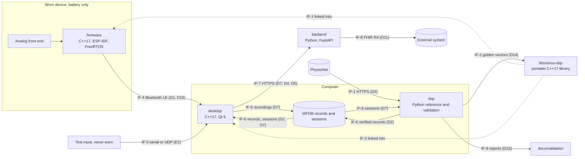

# Software architecture

_Inspired by IEC 62304 §5.3 (architectural design) and §5.4 (detailed design). Version 0.1, 2026-09-29. Status: draft (Milestone 0), for approval by the project owner._

This document describes **how** Sinus is built:
- the software items and what each is responsible for;
- how the functions of [`functional-analysis.md`](functional-analysis.md) are allocated to them;
- the interfaces and data flows between them;
- the constraints on the portable real-time library;
- the golden-vector format;
- the SOUP of each item and the segregation between items.

Significant decisions are recorded as architecture decision records in [`docs/adr/`](../adr/README.md), and this document cites them.

The detailed design of each requirement (module, interface, algorithm with references, parameters, edge cases) is added milestone by milestone. For Milestone 1 it is tracked by OP-008. This version already contains the part that SRS-015 requires: the equivalence principle and the golden-vector format (§7).

## Conventions

- `FB-xx` (functional blocks), `Dx` (data flows), `US-x` (use scenarios) and `Fx.y` (features) are those of `functional-analysis.md`. `SRS-xxx` are requirements in [`srs.md`](srs.md), `HAZ-xxx` and `RC-xxx` hazards and risk controls in [`risk-analysis.md`](risk-analysis.md), `OP-xxx` open points in [`open-points.md`](open-points.md).
- Interfaces between software items are identified as `IF-1`, `IF-2`, … These IDs are stable and never reused.
- Identifiers in code carry their unit when the type does not: suffixes `_mv`, `_hz`, `_s`, `_ms`, `_bpm`, `_samples` (e.g. `fs_hz`, `delay_samples`), in Python and in C++.
- Every placeholder cites its open point. The detailed design of the items introduced by later milestones is written at the start of their milestone (`sdp.md` §3, activity 3); this version fixes only what the architecture needs now.

## Revision history

| Version | Date | Changes |
|---|---|---|
| 0.1 | 2026-09-29 | First version, replacing the Milestone 0 stub: software items, allocation of the functional blocks, interfaces and data flows, constraints of the portable real-time library, outlines of the firmware, desktop application and backend, equivalence principle and golden-vector format (SRS-015), Milestone 1 module structure of `dsp`, SOUP per item, segregation |

## 1. System context



## 2. Software items

| Item | Location | Language and platform | Milestones | Responsibility |
|---|---|---|---|---|
| **dsp**: reference implementation and validation pipeline | `dsp/` | Python 3.11 (NumPy, SciPy, wfdb) | M1; M6 | Offline reference of signal conditioning and beat detection; download and verification of the reference databases; EC57 evaluation, noise stress and reports; golden-vector export; later HRV and beat classification |
| **libs/sinus-dsp**: portable real-time signal-processing library | `libs/sinus-dsp/` | C++17, CMake; builds for the computer (host) and for the ESP32-S3 | M2 | The single real-time implementation of signal conditioning, beat detection, heart-rate tracking and signal quality, linked into the firmware and the desktop application |
| **firmware** | `firmware/` | C++17 on ESP-IDF with FreeRTOS; ESP32-S3 | M4 | Acquisition at 360 Hz, electrode contact, device state supervision, streaming over Bluetooth LE |
| **desktop**: desktop application | `desktop/` | C++17, Qt 6 (user-interface technology: OP-033); Windows, macOS, Linux | M3; M4 | Live view, signal status, recording, replay, test input, connection to the device |
| **backend** | `backend/` | Python, FastAPI | M5 | Storage of sessions for their owner, review data, HL7 FHIR R4 export |

- **dsp** is not part of the runtime system: it runs offline on a developer's computer and in CI. It is still treated as Class B software (`safety-class.md`), because it produces the validation evidence of RC-001 and RC-004 and the reference of RC-012.
- **libs/sinus-dsp** has no knowledge of its host: no I/O, no operating system, no framework (§5). The firmware and the desktop application wrap it; neither re-implements any of its functions.
- The **firmware** and the **desktop application** each separate the code that depends on hardware or on Qt from a core that depends on neither, and that core is built and tested on the host (§6).
- The **backend** does no signal processing (§6.3, §10).

Decisions: [ADR 0001](../adr/0001-mcu-and-firmware-framework.md) (ESP32-S3, ESP-IDF, FreeRTOS, C++17), [ADR 0002](../adr/0002-portable-cpp-dsp-library.md) (one portable C++17 library, Python reference, golden vectors), [ADR 0003](../adr/0003-qt-desktop-application-with-replay.md) (Qt 6 desktop application with replay), [ADR 0005](../adr/0005-device-sampling-rate-360-hz.md) (360 Hz).

## 3. Allocation of functions to software items

| Block | Implemented by | Milestone |
|---|---|---|
| FB-01 Signal acquisition | firmware (with the hardware): ADC sampling, calibration to mV, decimation to 360 Hz (§6.1) | M4 |
| FB-02 Transmission | firmware (Bluetooth LE GATT server) and desktop (client), IF-4 | M4 |
| FB-03 Session recording | desktop (WFDB files, IF-6) | M3 (replayed and test data); M4 (device) |
| FB-04 Reference data access | dsp (download and checksum verification, IF-1). The desktop replays only the verified local copy | M1 |
| FB-05 Input validation and signal status | dsp: offline input checks (SRS-003). libs/sinus-dsp: configuration checks and signal quality (M2). desktop: signal status, combining signal quality, electrode contact, interruptions and device state (M3, OP-020). firmware: electrode contact (M4) | M1 to M4 |
| FB-06 Signal conditioning | dsp: offline reference (M1). libs/sinus-dsp: real time (M2), run by the desktop (displayed results) and by the firmware (device-side results, §3.1) | M1; M2 |
| FB-07 Beat detection | As FB-06 | M1; M2 |
| FB-08 Heart rate | libs/sinus-dsp: tracking from beat intervals (M2). desktop: display rules, withholding (M3, OP-021) | M2; M3 |
| FB-09 Heart-rate variability | dsp (offline) | M6 |
| FB-10 Beat classification | dsp (offline) | M6 |
| FB-11 Live display | desktop | M3 |
| FB-12 Session storage and review | backend (where the review takes place: OP-026) | M5 |
| FB-13 Export | backend | M5 |
| FB-14 Validation | dsp: EC57 and noise stress (M1), classification and HRV (M6). libs/sinus-dsp test suite: equivalence (M2). firmware and desktop: instrumentation for jitter, latency and lost samples, analysed offline (M4, OP-014) | M1; M2; M4; M6 |
| FB-15 Replay | desktop | M3 |
| FB-16 Signal quality index | libs/sinus-dsp, run wherever FB-06 runs. A Python reference exists if its equivalence is checked on golden vectors (OP-005, OP-032) | M2 |
| FB-17 Reference output export | dsp (SRS-015, §7) | M1 |
| FB-18 Device state supervision | firmware; the state is shown by the desktop | M4 |

### 3.1 Where the real-time functions run

**Decision.** The desktop application is the only item that produces real-time results for the user:
- it runs the libs/sinus-dsp chain (FB-06, FB-07, FB-08 tracking, FB-16) on the samples it receives, whatever their source: device, replay or test input;
- it derives the signal status (FB-05) and the display (FB-11) from those results.

The device sends the **acquired** samples, not processed ones.

The firmware also runs the same library chain on the same samples, in its processing task. It sends the resulting beat positions and signal quality with the stream as **device-side results**. The desktop never displays them. It uses them in two ways:
- it compares them with its own results on the same samples, as a continuous check that the device and host builds agree (F2.10);
- it uses them to measure the processing delay on the device (F3.5, OP-014).

A discrepancy is counted and recorded with the session. It is not shown as a result.

**Rationale.**
1. Live data, replay and test input follow exactly the same path from D1 onwards. Verification by replay (FB-15, OP-007) therefore exercises the live processing path.
2. The recording holds the acquired samples, so a session can be reprocessed by the offline reference (US-3) and replayed.
3. There is one source of displayed results, and no arbitration between device and desktop results.
4. Running the chain on the device in real time shows that the library meets its real-time budget on the microcontroller (OP-049). It also checks the device build against the host build on real signals, beyond the golden vectors.
5. A failure of the device-side chain cannot change what is displayed; it can only raise a discrepancy. If the budget on the device proves insufficient, the device-side chain can be removed without changing any displayed output.

**Alternatives considered.**
- *Processing on the device only, with the desktop as a display.* Replay would then bypass the processing path, or need a second one, and recordings would hold processed data. Rejected.
- *Acquisition only on the device, with the library run on the ESP32-S3 only in a test image fed with golden vectors.* The firmware would be simpler. This remains the fallback if the device-side chain does not fit the budget; the test image is needed anyway (OP-051).

## 4. Interfaces and data flows

### 4.1 Interfaces

| ID | From → to | Data | Transport and format | Milestone | Defined in |
|---|---|---|---|---|---|
| IF-1 | PhysioNet → dsp | D2: WFDB records and annotations, and the published SHA-256 checksum list | HTTPS download into `data/` (never committed) | M1 | SRS-001, SRS-013, SRS-016; §8 |
| IF-2 | dsp → libs/sinus-dsp tests | D14: golden vectors | Text files, format §7.3 | M1 (export); M2 (use) | SRS-015; §7 |
| IF-3 | libs/sinus-dsp → firmware, desktop | D3, D4, D5, D13 | In-process C++17 API | M2 | §5 |
| IF-4 | firmware → desktop | D1 (acquired samples, sample counter, packet sequence number, electrode contact, motion reference if present), D15 (device state), device-side results (§3.1) | Bluetooth LE GATT notifications; security in `cybersecurity.md` (OP-044) | M4 | §6.1 |
| IF-5 | test input → desktop | D1, in the frame format of IF-4 | Serial port or UDP (local host only by default); only for sources that are not worn (OP-038) | M3 | §6.2 |
| IF-6 | files on the computer | D2 (reference records), D7 (session recordings) | WFDB: header, signal and annotation files. Written by the desktop, read by the desktop (replay) and by dsp (offline analysis, US-3) | M3 | §6.2, OP-050 |
| IF-7 | desktop → backend | D7 with the derived D4 and D5; D9 on retrieval | HTTPS REST API | M5 | §6.3, `cybersecurity.md` |
| IF-8 | backend → external system | D11 | HL7 FHIR R4 JSON (content: OP-027) | M5 | §6.3 |
| IF-9 | dsp → `docs/validation/` | D10 | Markdown reports, regenerated by script, never edited by hand | M1 | SRS-009, SRS-012, SRS-014, SRS-016 |

The byte layout of IF-4 and IF-5 frames and the REST resources of IF-7 are designed at the start of Milestones 3 to 5. The architecture fixes their content (this table) and the rules of §4.2.

### 4.2 Common data conventions

- **Amplitude** in mV. Python uses float64. The C++ real-time path uses `float` (IEEE 754 binary32), because the ESP32-S3 floating-point unit is single precision. Values are converted to mV where they enter an item: by the ADC calibration on the device, by the stream scale in the desktop, by wfdb physical units in dsp.
- **Sampling frequency** in Hz: a parameter of every function and object that depends on it, never a global constant. The device samples at 360 Hz ([ADR 0005](../adr/0005-device-sampling-rate-360-hz.md)). Inputs are accepted from 125 Hz to 1000 Hz (SRS-003).
- **Time base**: sample index, where 0 is the first sample of the record or session; `numpy.int64` in Python, `std::uint64_t` in C++. Time in s is index / sampling frequency.
- **Beat position**: the sample index of the detected QRS complex in the source time base (D4). RR intervals in ms are computed only between beats of the same continuous segment.
- **Continuous segment**: the desktop splits a stream into segments at every gap (samples lost, device restart). It resets the processing chain at the start of each segment, and never computes beat intervals or heart rate across a gap (RC-014).
- **Heart rate** in bpm, always with a validity flag and, when withheld, the reason (D5). **Signal status**: usable or not usable, with the reason (D12).
- **Data source**: device, replay (with the record or session name) or test input. It travels with every frame, from the source to the display and into the recording (RC-015).

### 4.3 Data flow by operating mode

- **Offline validation (M1, US-1).**
  1. dsp downloads and verifies the records (IF-1).
  2. For each record: load, check the input, condition, detect.
  3. It matches the detections with the reference annotations, computes the statistics and writes the report (IF-9).
  4. The same chain exports the golden vectors (IF-2).
- **Replay (M3, US-9).** The desktop reads a verified reference record or a recorded session (IF-6). It emits D1 frames tagged "replay: <name>" at the original sampling rate, paced by a monotonic clock. From there, the frames follow the live path.
- **Live (M4, US-2, US-4).**
  1. On the device: acquisition task → processing task (device-side results) → transmission task → Bluetooth LE (IF-4).
  2. On the desktop, the stream decoder checks sequence numbers and the sample counter and marks gaps.
  3. The libs/sinus-dsp chain processes each continuous segment.
  4. The signal status is derived, the view is updated and the session is recorded (IF-6).
- **Upload and export (M5, US-6, US-7).** The desktop uploads a recorded session with its derived beats and heart rate (IF-7). The backend stores it for its owner and exports FHIR R4 `Observation` resources (IF-8).

## 5. Portable real-time library (`libs/sinus-dsp`)

### 5.1 Constraints

| Constraint | Checked by |
|---|---|
| C++17 and its standard library only. No ESP-IDF, FreeRTOS, Qt or operating-system headers | Host build with the standard library only; static analysis of includes |
| No dynamic memory anywhere in the library: no `new`, `delete` or `malloc`, and no allocating standard containers. All state lives inside objects of fixed size; capacities are compile-time constants sized for the highest supported sampling frequency (1000 Hz) | A host test that fails on any heap allocation during construction, configuration and processing |
| No exceptions and no RTTI: errors are returned as values. Built with `-fno-exceptions -fno-rtti` (GCC, Clang) on every target | Build flags on every target |
| Deterministic: no global mutable state, no clocks, no random numbers, no I/O. The same input sequence gives the same output on a given build | Review; equivalence tests |
| The real-time path computes in `float`; `double` is used only at configuration time (filter design). Implicit promotion to `double` is a compile error | `-Wdouble-promotion -Wfloat-conversion` treated as errors |
| Bounded work per sample, independent of the signal content. A bounded delay per stage, reported by the object | Worst-case timing on the ESP32-S3 against the budget (OP-049) |
| One object per signal, used from one thread; no internal locking; objects are independent of each other | Review |
| The same source code and the same results on every target: no target-specific code paths. A target-optimised kernel would need its own equivalence tests | Equivalence tests on the host and on the ESP32-S3 (§7, OP-051) |
| Coding standard, formatting and static analysis rules: OP-043 | CI |

### 5.2 Interface style

The interfaces themselves are designed with the Milestone 2 requirements; they follow these rules.

- Namespace `sinus::dsp`. Public headers are in `include/sinus/dsp/`. The CMake target is `sinus_dsp`, with the alias `sinus::dsp`.
- An object is **configured once** from a configuration value (sampling frequency in Hz, mains frequency and so on). Configuration validates the values, for example a sampling frequency within 125–1000 Hz and a mains frequency of 50 Hz or 60 Hz, and returns a status. An object that is not validly configured produces no output.
- An object then **processes one sample at a time**. Block functions only loop over the per-sample call and add no behaviour.
- **Events** (a detected beat, a completed signal-quality window) are reported with their sample index in the source time base. The delay between the sample being processed and the reported index never exceeds the documented maximum of the object.
- `reset()` returns an object to its initial state. The desktop calls it at the start of each continuous segment.
- Filters start in the initial state defined in §7.1, which the reference uses as well.

Planned content for Milestone 2 (functional-analysis.md §5.2):
- second-order-section filters (transposed direct form II) and their design;
- the conditioning chain: baseline wander, mains notch, low-pass;
- a polyphase decimator for the device's oversampled ADC;
- an LMS adaptive interference canceller, with a mains reference (sine and cosine at the mains frequency) or a motion reference (OP-041);
- streaming Pan–Tompkins detection;
- Kalman heart-rate tracking from RR intervals (OP-021);
- the per-window signal quality index (OP-032);
- a pipeline that composes them, used by both the firmware and the desktop application.

### 5.3 Build, integration and tests

- **Build.** CMake, with presets for the host (debug, release, coverage with sanitizers) and for the ESP32-S3.
- **Integration.**
  - The desktop build includes the library's CMake project.
  - The firmware includes it through an ESP-IDF component that registers the same sources (`firmware/components/sinus_dsp/`).
  - No source file is copied into another item.
- **Tests.** GoogleTest on the host: unit tests, requirement tests and the equivalence tests on the golden vectors (§7). Folders and tags follow [ADR 0004](../adr/0004-test-tagging-and-traceability-gates.md):
  - folders `libs/sinus-dsp/tests/{unit,requirements,system}/`;
  - a verifying test carries the comment `// Verifies: SRS-nnn` directly above its `TEST` macro, and only in `requirements/` or `system/`.
  - An equivalence test verifies a Milestone 2 equivalence requirement, and sits in the folder of that requirement's Verification level.
- **On-target tests.** On the ESP32-S3, a test image runs the same equivalence checks (OP-051).

## 6. Firmware, desktop application and backend (outline)

### 6.1 Firmware (Milestone 4)

**Structure.**
- **Adapters that depend on ESP-IDF:** ADC, electrode-contact inputs, battery measurement, the Bluetooth LE GATT server (NimBLE host, the ESP-IDF component for Bluetooth LE only), the task watchdog.
- **Core that does not depend on ESP-IDF:** packetizer, device state machine, ring buffers, stream counters. The core is built and unit-tested on the host with GoogleTest (`firmware/tests/`, ADR 0004).

**Tasks.** All tasks are created at start-up, with explicit priorities:

| Task | Priority (relative) | Function |
|---|---|---|
| Acquisition | Highest of the application tasks | Reads the ADC DMA frames: continuous mode, hardware-timed, at an integer multiple of 360 Hz ([ADR 0005](../adr/0005-device-sampling-rate-360-hz.md)). Converts to mV with the ADC calibration and decimates to 360 Hz with the library's anti-aliasing decimator. Reads electrode contact and numbers each sample with the sample counter |
| Processing | High | Runs the libs/sinus-dsp chain on each sample (device-side results, §3.1) |
| Transmission | Medium | Packs samples, device state and device-side results into frames with a sequence number and sends them as GATT notifications |
| Supervision | Low | Battery measurement; device state machine (normal, low battery, error; OP-035, OP-036) |

- **Cores.** Acquisition and processing run on one core; the Bluetooth LE host runs on the other.
- **Communication between tasks.** Single-producer single-consumer ring buffers of fixed capacity, allocated at start-up. Task notifications wake the consumer.
- **Buffer overflow.** A full buffer never blocks acquisition. The producer drops the new samples and counts them. The sample counter in the next frame shows the gap to the receiver (RC-014).
- **Memory.** Everything is allocated at start-up; nothing is allocated afterwards.
- **C++ build settings.** Exceptions and RTTI are disabled in the ESP-IDF configuration. The compiler warnings are those of the library.
- **Watchdog.** The acquisition, processing and transmission tasks are subscribed to the ESP-IDF task watchdog. Timeout and behaviour after a restart: OP-036.
- **Wired links.** No wired data or debug link is used in normal operation (OP-038). Firmware platform security (debug interfaces, secure boot, flash encryption, updates): OP-047.
- **Measurements.** Instrumentation for sampling-time jitter and latency is built in (OP-014).

### 6.2 Desktop application (Milestones 3 and 4)

**Layers.**

| Layer | Depends on | Content |
|---|---|---|
| `core` | C++17 and libs/sinus-dsp only (no Qt) | Stream frame model and the source interface; frame decoder with continuity check and gap marking; one processing chain per continuous segment; signal status (FB-05, OP-020); heart-rate display rules (FB-08, OP-021); cross-check of the device-side results; recording model |
| `io` | Qt | Sources: Bluetooth LE central (Qt Bluetooth, M4), serial port and UDP test inputs (Qt Serial Port, Qt Network, M3), replay (WFDB reader paced by a monotonic clock, M3). WFDB writer. WFDB implementation: OP-050 |
| `ui` | Qt Widgets or Qt Quick (OP-033) | Views and their presenters or view models. They render snapshots of the core state at the display rate and do no processing |

**Rules.**
- `core` is tested on the host with GoogleTest without Qt. Test folders: `desktop/tests/`, per ADR 0004.
- **Threading.** Sources and processing run outside the user-interface thread. The user interface reads snapshots at a fixed refresh rate. Queued Qt signal-slot connections cross the threads.
- **Sources.** All sources (device, replay, test input) implement the same interface and emit the same frames, tagged with the data source. Recordings of replayed or test data are marked as such (RC-015).
- **Replay** reads reference records only from the local copy verified by dsp (IF-1).
- **Test inputs** are off by default. UDP listens on the local host only unless the user changes it (`cybersecurity.md`).
- **Qt licensing.** Only Qt modules available under the LGPL-3.0 are used, linked dynamically, so that the application can be distributed with its Apache-2.0 code. Modules offered only under GPL or commercial terms (for example the chart modules) are not used. The waveform is drawn by the application. The licence of each module is checked when Qt is entered in the SOUP list.

### 6.3 Backend (Milestone 5)

- A FastAPI application in `backend/`, with its own uv project and the same Python tooling as `dsp` (`sdp.md` §5).
- **REST API over HTTPS (IF-7):**
  - upload a session (WFDB files, plus the beats and heart rate computed by the desktop);
  - list and retrieve one's own sessions;
  - export them as FHIR R4.
- **No signal processing.** The backend stores and serves the derived data computed by the desktop. It does not recompute them (§10).
- **Security.** Authentication, owner-only access, encryption at rest, storage technology and GDPR notes are in `cybersecurity.md` and OP-016.
- **Open design points.** FHIR content: OP-027. Where a session is reviewed: OP-026.

## 7. Equivalence between the reference and the real-time library (SRS-015)

### 7.1 Principle: a causal reference

The Python reference implements the **same causal algorithms** as the real-time library:
- Filters are applied forward only; zero-phase (forward-backward) filtering is not used.
- Beat detection uses only the current and past samples, with a bounded look-back, like the streaming detector.
- The reference reports beat positions compensated for the known delays of its filters. The streaming detector reports the same compensated indices, later in time.

Both implementations therefore evaluate the same difference equations on the same samples, and their outputs are compared **sample by sample**, with no delay allowance. The two sides also share:
- **Filter design.** Coefficients are computed at configuration time from the sampling frequency and the settings, in float64, with the same formulas.
- **Stage order.** Baseline wander removal (SRS-004), then mains interference removal (SRS-005), then beat detection (SRS-006) on the output of the mains stage. Removing the baseline first keeps the input of the notch small, which preserves precision in binary32.
- **Initial state.** Each second-order section starts in the steady state that a constant input equal to the first input sample would produce. For the baseline filter this gives zero output on a constant input, which avoids the start-up transient of an offset. The detector's initialisation is specified in the detailed design of SRS-006 (OP-008) and is the same in both.
- **Precision.** The real-time library computes in binary32, the reference in binary64. The differences come from rounding and must stay within the tolerances of OP-005: conditioning output in mV, beat positions in samples.

**Trade-off.** A causal high-pass filter distorts the phase of the lowest ECG components (ST segment, T wave), which a zero-phase reference would avoid. Sinus makes no claim on ST-segment or morphology measurements, and a causal reference makes the validation results (SRS-007) apply to the algorithm that actually runs in real time. The band criteria of SRS-004 and SRS-005 concern amplitude only and can be met by causal filters.

### 7.2 Input set

The command writes one file per input (SRS-015):

| Inputs | Parameters | Settings | Input identifier |
|---|---|---|---|
| 18 synthetic ECGs | Sampling frequency 250 Hz and 360 Hz × heart rate 40, 75 and 180 bpm × variant: `clean`, `bw-mains50`, `bw-mains60` | Mains 50 Hz for `clean` and `bw-mains50`; 60 Hz for `bw-mains60` | `syn-fs<fs>-hr<hr, 3 digits>-<variant>`, e.g. `syn-fs360-hr075-bw-mains60` |
| 6 record segments, only where the verified database is available (SRS-001) | First 60 s of records 100, 105, 108, 119, 203 and 207 of the MIT-BIH Arrhythmia Database 1.0.0, first stored signal | Mains 60 Hz (the settings of SRS-007) | `mitdb-<record>-first60s`, e.g. `mitdb-100-first60s` |

If the database is not available or not verified, the record segments are skipped with a message naming them, and the synthetic files are still written.

**Synthetic ECG** (`sinus_dsp.synthetic`, deterministic, float64):
- **Duration and sampling.** 30 s; sample instants t_n = n / fs, for n = 0 … 30·fs − 1.
- **R-wave centres.** RR = 60 / heart rate (s). The R wave of beat k is centred on the sample r_k = ⌊(0.5 + k·RR)·fs + 0.5⌋, for every k ≥ 0 with 0.5 + k·RR ≤ 29.5 s. These r_k are the true beat positions of the input.
- **Beat waveform.** Each beat is the sum of five Gaussian waves A·exp(−(t − t_c)² / (2σ²)), centred at t_c = r_k / fs + offset. To keep the waves in order at high heart rates, the P and T offsets and widths scale with s = √(RR / 1 s):

  | Wave | Offset from the R centre (ms) | Amplitude A (mV) | Width σ (ms) |
  |---|---|---|---|
  | P | −200·s | 0.15 | 25·s |
  | Q | −30 | −0.10 | 10 |
  | R | 0 | 1.00 | 10 |
  | S | +30 | −0.20 | 10 |
  | T | +280·s | 0.30 | 45·s |

- **Evaluation order.** The signal is evaluated on every sample, summing the beats in increasing k and the waves in the order P, Q, R, S, T.
- **Interference variants** (SRS-010), added to the signal:
  - `bw-mains50`: 1.0 mV · sin(2π · 0.3 Hz · t) + 0.2 mV · sin(2π · 50 Hz · t);
  - `bw-mains60`: the same with 60 Hz.

### 7.3 File format, version 1

One UTF-8 text file per input, named `<input identifier>.golden.txt`. Lines end with a line feed. There is no byte-order mark and no trailing space, and the file ends with one line feed after `[end]`. It contains a header followed by four sections, always in this order:

```
format=sinus-golden-vector
format_version=1
input_id=syn-fs360-hr075-bw-mains60
input_source=synthetic
input_parameters=duration_s=30;heart_rate_bpm=75;baseline_wander_hz=0.3;baseline_wander_mv=1.0;mains_hz=60;mains_mv=0.2
sampling_frequency_hz=360.0
mains_frequency_hz=60
software_version=0.1.0
stages=baseline,mains
n_samples=10800
n_beats=37
n_reference_beats=37
[coefficients]
stage,section,b0,b1,b2,a1,a2
baseline,0,…
mains,0,…
[signals]
input_mv,baseline_mv,mains_mv
…one row per sample…
[beats]
sample_index
…one row per detected QRS…
[reference_beats]
sample_index
…one row per true or annotated beat…
[end]
```

**Header.** One `key=value` line per key. The key is the text before the first `=`. The keys are always all present, in this order:

| Key | Content |
|---|---|
| `format`, `format_version` | Always `sinus-golden-vector` and `1` |
| `input_id` | Input identifier (§7.2) |
| `input_source` | `synthetic` or `mitdb` |
| `input_parameters` | `name=value` pairs separated by `;`, in a fixed order. Synthetic: the generator parameters. Records: `database=mitdb;database_version=1.0.0;record=<name>;signal=0;start_sample=0;duration_s=60` |
| `sampling_frequency_hz` | Sampling frequency, float |
| `mains_frequency_hz` | Mains setting, 50 or 60 |
| `software_version` | `sinus_dsp.__version__` |
| `stages` | Names of the conditioning stages in the order applied. Version 1 contains `baseline,mains`. A later milestone may add stages, which then get their own columns |
| `n_samples`, `n_beats`, `n_reference_beats` | Number of rows in `[signals]`, `[beats]` and `[reference_beats]` |

**Sections.**
- **`[coefficients]`.** One row per second-order section of each stage, in the order applied, normalised so that a0 = 1. It lets a C++ test check its own filter design separately from its filtering.
- **`[signals]`.** One row per input sample, in order:
  - the input in mV;
  - then the output of each stage in mV, in the order of `stages`, in columns named `<stage>_mv`.
- **`[beats]`.** The detected QRS sample indices of SRS-006, in increasing order.
- **`[reference_beats]`.** For synthetic inputs, the R-wave centres r_k (§7.2). For records, the reference beat annotations (SRS-002) within the segment. They are not needed for equivalence, but they let a test check detection on the same file.
- **`[end]`.** Marks a complete file.

**Numbers.**
- A float64 value is written as Python's `repr()` of it: the shortest decimal string that converts back to the same float64 under correct rounding (e.g. `0.1`, `-1.2345e-05`, `-0.0`).
- Integers are written in decimal, without sign or leading zeros.
- Non-finite values are never written. The export fails with an error naming the input if any output is not finite.

**Readers** (Python and C++) reject a file:
- whose format or version is unknown;
- whose header keys are missing, extra or out of order;
- whose sections are missing or out of order;
- whose column headers do not match `stages`;
- whose row counts differ from the header;
- that contains a value that does not parse or is not finite, or a sample index that is not increasing or lies outside `[0, n_samples)`;
- that lacks `[end]`.

### 7.4 Determinism and exact read-back

- **Determinism.** The content depends only on the input, the settings and the software version. The file contains no dates, times, host names, user names, paths or random numbers, and nothing depends on the iteration order of an unordered collection. Two runs on the same inputs and software version, on the same machine, therefore give byte-identical files (SRS-015).
- **Exact read-back.** Python's `float()` is correctly rounded, so reading back gives exactly the values computed (SRS-015). The C++ reader converts with `std::from_chars` (C++17), which the supported toolchains implement with correct rounding. Its unit tests check exact read-back of edge values: the smallest subnormal and the largest finite value, negative zero, and values that need 17 significant digits.
- **Across machines.** NumPy and SciPy results may differ in the last bits between machines or library builds. The tolerances of OP-005 absorb this, and CI always compares the C++ library with vectors generated in the same run from the same commit (§7.5).

### 7.5 Generation and use

- **Command.** From `dsp/`, run `uv run python scripts/export_golden.py`. The files go to `data/golden/` by default; an option sets another folder. The logic is in `sinus_dsp.golden` (§8).
- **Not stored in the repository.**
  - Synthetic vectors are regenerated deterministically on demand.
  - Vectors of record segments are derived from the database, which is never committed (SRS-015).
- **In CI (from Milestone 2).** The Python build generates the vectors and passes them to the C++ equivalence tests as a build artifact of the same commit. The C++ library is therefore always compared with the current reference, and any change to the reference that the C++ library does not follow fails CI.
- **On the ESP32-S3.** The on-target test image receives the same vectors (OP-051).

## 8. Milestone 1 module structure of `dsp`

The interfaces, algorithms and parameters of each module are specified in the detailed design of SRS-001 to SRS-016 (OP-008). The module structure is fixed now:

| Module (`dsp/sinus_dsp/`) | Responsibility | Requirements |
|---|---|---|
| `__init__.py` | Package version (`__version__`), written into reports and golden vectors | — |
| `errors.py` | Exception hierarchy: one base class for all Sinus errors, and one subclass per error behaviour in the SRS (rejected input, failed data verification, malformed file, subset report mismatch) | SRS-001, SRS-003, SRS-013, SRS-015, SRS-016 |
| `input_checks.py` | Input validation before filtering or detection | SRS-003 |
| `filters.py` | Design of the second-order sections and causal filtering: baseline wander and mains interference | SRS-004, SRS-005 |
| `qrs.py` | Pan–Tompkins QRS detection, causal, with delay compensation | SRS-006, SRS-010 |
| `pipeline.py` | The conditioning chain and detection in the order of §7.1, defined once and used by the evaluation and the golden-vector export | SRS-006, SRS-015 |
| `synthetic.py` | Deterministic synthetic ECG (§7.2) | SRS-015 |
| `golden.py` | Golden-vector writer and reader (§7.3) | SRS-015 |
| `data/physionet.py` | Download of a PhysioNet database version and verification against its SHA-256 checksum list. Network access goes through an injectable fetch function (the default uses the standard library), so that tests need no network | SRS-001, SRS-013, SRS-016 |
| `data/records.py` | Loading a record, a channel and its beat and non-beat annotations with wfdb | SRS-002 |
| `evaluation/matching.py` | EC57 beat-by-beat matching | SRS-008 |
| `evaluation/metrics.py` | TP, FN, FP, Se and +P, per record, gross and average | SRS-011 |
| `evaluation/run.py` | Runs detection and evaluation on a set of records with given settings | SRS-007, SRS-009, SRS-014, SRS-016 |
| `evaluation/noise_stress.py` | Noise stress record set, SNR per record, aggregation per SNR | SRS-014 |
| `evaluation/report.py` | Deterministic Markdown rendering of the full report and of the subset report | SRS-009, SRS-012, SRS-014, SRS-016 |
| `evaluation/subset.py` | Comparison of the regenerated subset report with the stored one, naming the differences | SRS-016 |

| Script (`dsp/scripts/`) | Runs |
|---|---|
| `download_data.py` | Download and verification of the MIT-BIH Arrhythmia and Noise Stress Test databases into `data/` |
| `validate.py` | The full validation report, `docs/validation/qrs-ec57-report.md` (SRS-009) |
| `subset_check.py` | The CI subset check: regenerates the subset report and compares it with `docs/validation/qrs-ec57-subset-report.md` (SRS-016) |
| `export_golden.py` | The golden-vector export (SRS-015) |
| `traceability.py` | The traceability matrix, its checks and the release gate (ADR 0004) |

**Rules for `dsp`.**
- Scripts are thin command-line wrappers: argument parsing, paths, messages, exit codes. The logic they run lives in `sinus_dsp`, where tests import it without running a command.
- Every function that depends on the sampling frequency takes it as an argument (`fs_hz`). Signals are `numpy.typing.NDArray[numpy.float64]` in mV; indices are `numpy.int64`.
- Signal-processing functions are pure: no global state, no I/O and no printing. Only scripts write files and messages.
- The algorithms are written so that they port to the C++ library: causal filtering with second-order sections (`scipy.signal.sosfilt`, same difference equations); detection decisions taken on candidate peaks in time order, with bounded look-back; no zero-phase filtering and no whole-signal statistics in the detection logic.
- Data folders: `data/mitdb/`, `data/nstdb/`, `data/golden/`, all ignored by git.

## 9. SOUP per software item

| Item | Runtime SOUP | Recorded |
|---|---|---|
| dsp | NumPy, SciPy, wfdb | [`soup.md`](soup.md) |
| libs/sinus-dsp | None beyond the C++ standard library of each toolchain | With the toolchain, at Milestone 2 |
| firmware | ESP-IDF (drivers, ADC calibration, NimBLE Bluetooth LE host, C and C++ runtime libraries), FreeRTOS as shipped with ESP-IDF | At Milestone 4 |
| desktop | Qt 6 (LGPL-3.0 modules only, §6.2); WFDB implementation (OP-050) | At Milestone 3 |
| backend | FastAPI and its runtime dependencies; database and FHIR libraries chosen at Milestone 5 | At Milestone 5 |

Planned SOUP is listed in `soup.md`. Development tools (compilers, CMake, GoogleTest, pytest, linters, formatters, SBOM generators) are not SOUP (`sdp.md` §7). The SBOM of each item is described in [`cybersecurity.md`](cybersecurity.md) §6.

## 10. Segregation for risk control

- **Separation between items.** The items run on separate hardware or in separate processes:
  - the firmware on the microcontroller;
  - the desktop application in its own process on the computer;
  - the backend on a server;
  - dsp offline.

  They exchange data only through the interfaces of §4.1, each with integrity checks: packet sequence numbers and sample counter (IF-4, IF-5), checksum verification (IF-1), format versions and strict readers (IF-2, IF-6), HTTPS (IF-7).
- **Items in the risk-control chain.** The functions that implement or support the software risk controls (RC-001 to RC-003, RC-007, RC-008, RC-012 to RC-015) are in libs/sinus-dsp, the core of the desktop application and the firmware, and their reference and evidence are in dsp.
- **Backend.** It computes nothing that is displayed live, and implements no risk control other than the statement of non-medical origin in exports (RC-011). It is therefore the candidate for a lower safety class. That decision, and the evidence it needs, is OP-018.
- **Device-side results** (§3.1) are never displayed. A failure of the device-side chain cannot change the displayed results.
- **Within an item.** In the desktop application, the separation of `core` and `ui` supports testability; it is not claimed as segregation. In the firmware, tasks share memory without hardware isolation, and no segregation between them is claimed.
- **Class.** No item is assigned a class lower than B for now (`safety-class.md`, OP-018).

## 11. Architecture decisions

| ADR | Decision |
|---|---|
| [0001](../adr/0001-mcu-and-firmware-framework.md) | ESP32-S3 with ESP-IDF and FreeRTOS, firmware in C++17 |
| [0002](../adr/0002-portable-cpp-dsp-library.md) | One portable C++17 real-time library; Python reference; equivalence on golden vectors |
| [0003](../adr/0003-qt-desktop-application-with-replay.md) | Qt 6 desktop application with replay; Widgets or Qt Quick deferred (OP-033) |
| [0004](../adr/0004-test-tagging-and-traceability-gates.md) | Test tagging and traceability gates |
| [0005](../adr/0005-device-sampling-rate-360-hz.md) | Device sampling rate 360 Hz |

## 12. Open points referenced

OP-005, OP-007, OP-008, OP-014, OP-016, OP-018, OP-020, OP-021, OP-026, OP-027, OP-032, OP-033, OP-035, OP-036, OP-038, OP-041, OP-043, OP-044, OP-047, OP-049, OP-050, OP-051. See [`open-points.md`](open-points.md).
