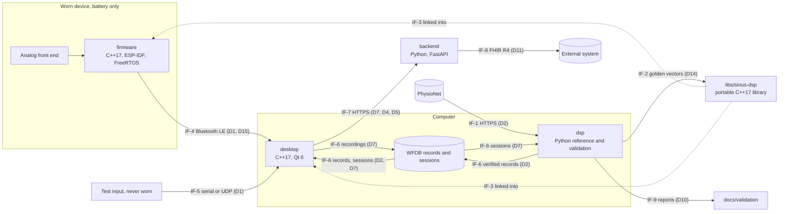

# Software architecture

_Inspired by IEC 62304 §5.3 (architectural design) and §5.4 (detailed design). Version 0.4.1, 2026-10-08. Status: approved by the project owner up to v0.4 (the dates are in the revision history); v0.4.1 is editorial._

This document describes **how** Sinus is built:
- the software items and what each is responsible for;
- how the functions of [`functional-analysis.md`](functional-analysis.md) are allocated to them;
- the interfaces and data flows between them;
- the constraints on the portable real-time library;
- the golden-vector format;
- the SOUP of each item and the segregation between items.

Significant decisions are recorded as architecture decision records in [`docs/adr/`](../adr/README.md), and this document cites them.

The detailed design of each requirement (module, interface, algorithm with references, parameters, edge cases) is added milestone by milestone, in one file per milestone that keeps the section numbers of the whole architecture: Milestone 1 in [`architecture-m1.md`](architecture-m1.md) (§8, which builds on the equivalence principle and the golden-vector format of §7); Milestone 2 in [`architecture-m2.md`](architecture-m2.md), the reference side (`dsp`) in §13 and the real-time library (`libs/sinus-dsp`) in §14. A reference to a section, such as "`architecture.md` §8.7", points to the file that holds that section.

## Conventions

- `FB-xx` (functional blocks), `Dx` (data flows), `US-x` (use scenarios) and `Fx.y` (features) are those of `functional-analysis.md`. `SRS-xxx` are requirements in [`srs.md`](srs.md), `HAZ-xxx` and `RC-xxx` hazards and risk controls in [`risk-analysis.md`](risk-analysis.md), `OP-xxx` open points in [`open-points.md`](open-points.md).
- Interfaces between software items are identified as `IF-1`, `IF-2`, … These IDs are stable and never reused.
- Identifiers in code carry their unit when the type does not: suffixes `_mv`, `_hz`, `_s`, `_ms`, `_bpm`, `_samples` (e.g. `fs_hz`, `delay_samples`), in Python and in C++.
- Every placeholder cites its open point. The detailed design of the items introduced by later milestones is written at the start of their milestone (`sdp.md` §3, activity 3); this version fixes only what the architecture needs now.
- The architecture is this file and one detailed-design file per milestone. Section numbers are shared: §1 to §7 and §9 to §12 are in this file, §8 in `architecture-m1.md`, §13 and §14 in `architecture-m2.md`.

## Revision history

The full text of each earlier entry is in the version history of the repository.

| Version | Date | Changes |
|---|---|---|
| 0.1 | 2026-09-29 | First version, replacing the Milestone 0 stub: software items, allocation of functions, interfaces and data flows, constraints of the real-time library, outlines of the firmware, desktop application and backend, equivalence principle and golden-vector format (SRS-015), Milestone 1 module structure of `dsp`, SOUP per item, segregation. Approved on 2026-09-29 |
| 0.2 | 2026-09-29 | Detailed design of SRS-001 to SRS-016 in §8 (closes OP-008 and OP-030) |
| 0.2.1 | 2026-09-29 | §8 approved by the project owner; EC57 scoring as `bxb` confirmed (OP-053) |
| 0.2.2 | 2026-09-30 | Corrections found while implementing §8.3 to §8.9: OP-058 (closed), design side of OP-059, OP-057 part (b) |
| 0.2.3 | 2026-09-30 | Corrections of v0.2.2 approved by the project owner; OP-059 closed by `srs.md` v0.5; OP-055 decided (SRS-006 range 30–200 bpm, §8.7) |
| 0.2.4 | 2026-10-01 | Corrections found while implementing §8.10: evaluation run, noise stress test, complete report text format, error table (§8.2, §8.4, §8.8, §8.10, §8.11, §8.13) |
| 0.2.5 | 2026-10-01 | Corrections of v0.2.4 approved by the project owner; OP-056 decided for Milestone 1 (no change of the detection rules) |
| 0.2.6 | 2026-10-02 | Software identity and versioning, new §8.14 (OP-061); §7.3 header key `source_sha256` |
| 0.2.7 | 2026-10-03 | v0.2.6 approved by the project owner; versioning of the C++ items tracked by OP-062 |
| 0.2.8 | 2026-10-03 | Editorial: §8.14 implemented (OP-061 closed) |
| 0.2.9 | 2026-10-03 | Readings of the implemented §8.14 and §8.10 recorded as design behaviour; approved on 2026-10-04 |
| 0.2.10 | 2026-10-04 | Formats of the subset check (§8.11); the private helper `write_atomically` (§8.2); golden vectors reviewed against SRS-015 (§7.2 to §7.5, §8.12); approved on 2026-10-05 |
| 0.2.11 | 2026-10-05 | Licences of the databases, new §8.15 (OP-064); readings of the golden-vector export (§8.12); reader corrections (§7.3); CI cache scope (§8.11); approved on 2026-10-05 |
| 0.2.12 | 2026-10-05 | Traceability checks, new §8.16 (OP-052 closed; OP-066); the Python interpreter is SOUP (§9); approved on 2026-10-06 |
| 0.2.13 | 2026-10-06 | Editorial: OP-064 closed; its Milestone 2 part continues as OP-067 |
| 0.3 | 2026-10-07 | Milestone 2 detailed design of `dsp`, new §13, for `srs.md` v0.8: the 1000 mV bound of SRS-003 (OP-063); detection trace with start-up marks and report sample (SRS-022); delays and the maximum of SRS-021 (OP-049); heart rate (SRS-024 to SRS-026); signal quality index and its threshold (SRS-027, SRS-028); evaluation and report sections (SRS-023, SRS-029, SRS-030); golden-vector format version 2 and event inputs (SRS-033); `docs/validation/README.md` wording (OP-069); §2, §3, §5.2, §7.2, §7.3, §8.2 aligned. Approved on 2026-10-07 |
| 0.4 | 2026-10-08 | Milestone 2 detailed design of `libs/sinus-dsp`, new §14, for `srs.md` v0.8.1: layout, build and tools; arithmetic (ADR 0008, OP-057); interfaces; configuration and invalid samples (SRS-017, SRS-018); conditioning (SRS-019); streaming detection (SRS-020 to SRS-022); heart rate (SRS-024 to SRS-026); signal quality (SRS-027, SRS-028); restart and fixed memory, limit 64 KiB (SRS-031, SRS-032, OP-049); equivalence tolerances (SRS-034, OP-005); equivalence check, results and CI jobs (SRS-035, SRS-037, OP-067); ESP32-S3 build in the emulator (SRS-036); C interface for the whole databases (SRS-038); identity (OP-062); SBOM (OP-046); tests; implementation order. New §13.12: traceability rules for Milestone 2 (ADR 0006, OP-066). §13.5, §13.8 and corrections in §4.2, §5, §7, §8.2, §8.14, §8.16, §9, §11, §13.1. Approved by the project owner on 2026-10-08, with ADRs 0006, 0007 and 0008 |
| 0.4.1 | 2026-10-08 | Editorial, no design change: the detailed designs moved to one file per milestone with unchanged section numbers, [`architecture-m1.md`](architecture-m1.md) (§8) and [`architecture-m2.md`](architecture-m2.md) (§13, §14); revision history shortened |

## 1. System context



## 2. Software items

| Item | Location | Language and platform | Milestones | Responsibility |
|---|---|---|---|---|
| **dsp**: reference implementation and validation pipeline | `dsp/` | Python 3.11 (NumPy, SciPy, wfdb) | M1; M2; M6 | Offline reference of signal conditioning and beat detection (M1), of the start-up marks, heart rate and signal quality index (M2); download and verification of the reference databases; EC57 evaluation, noise stress, start of real recordings, signal quality validation and reports; golden-vector export; later HRV and beat classification |
| **libs/sinus-dsp**: portable real-time signal-processing library | `libs/sinus-dsp/` | C++17, CMake; builds for the computer (host) and for the ESP32-S3 | M2 | The single real-time implementation of signal conditioning, beat detection, heart-rate tracking and signal quality, linked into the firmware and the desktop application |
| **firmware** | `firmware/` | C++17 on ESP-IDF with FreeRTOS; ESP32-S3 | M4 | Acquisition at 360 Hz, electrode contact, device state supervision, streaming over Bluetooth LE |
| **desktop**: desktop application | `desktop/` | C++17, Qt 6 (user-interface technology: OP-033); Windows, macOS, Linux | M3; M4 | Live view, signal status, recording, replay, test input, connection to the device |
| **backend** | `backend/` | Python, FastAPI | M5 | Storage of sessions for their owner, review data, HL7 FHIR R4 export |

- **dsp** is not part of the runtime system: it runs offline on a developer's computer and in CI. It is still treated as Class B software (`safety-class.md`), because it produces the validation evidence of RC-001 and RC-004 and the reference of RC-012.
- **libs/sinus-dsp** has no knowledge of its host: no I/O, no operating system, no framework (§5). The firmware and the desktop application wrap it; neither re-implements any of its functions.
- The **firmware** and the **desktop application** each separate the code that depends on hardware or on Qt from a core that depends on neither, and that core is built and tested on the host (§6).
- The **backend** does no signal processing (§6.3, §10).

Decisions: [ADR 0001](../adr/0001-mcu-and-firmware-framework.md) (ESP32-S3, ESP-IDF, FreeRTOS, C++17), [ADR 0002](../adr/0002-portable-cpp-dsp-library.md) (one portable C++17 library, Python reference, golden vectors), [ADR 0003](../adr/0003-qt-desktop-application-with-replay.md) (Qt 6 desktop application with replay), [ADR 0005](../adr/0005-device-sampling-rate-360-hz.md) (360 Hz).

## 3. Allocation of functions to software items

| Block | Implemented by | Milestone |
|---|---|---|
| FB-01 Signal acquisition | firmware (with the hardware): ADC sampling, calibration to mV, decimation to 360 Hz (§6.1) | M4 |
| FB-02 Transmission | firmware (Bluetooth LE GATT server) and desktop (client), IF-4 | M4 |
| FB-03 Session recording | desktop (WFDB files, IF-6) | M3 (replayed and test data); M4 (device) |
| FB-04 Reference data access | dsp (download and checksum verification, IF-1). The desktop replays only the verified local copy | M1 |
| FB-05 Input validation and signal status | dsp: offline input checks (SRS-003). libs/sinus-dsp: configuration checks and signal quality (M2). desktop: signal status, combining signal quality, electrode contact, interruptions and device state (M3, OP-020). firmware: electrode contact (M4) | M1 to M4 |
| FB-06 Signal conditioning | dsp: offline reference (M1). libs/sinus-dsp: real time (M2), run by the desktop (displayed results) and by the firmware (device-side results, §3.1) | M1; M2 |
| FB-07 Beat detection | As FB-06 | M1; M2 |
| FB-08 Heart rate | dsp: offline reference (M2, §13.5). libs/sinus-dsp: tracking from beat intervals (M2). desktop: display rules, withholding (M3, OP-071) | M2; M3 |
| FB-09 Heart-rate variability | dsp (offline) | M6 |
| FB-10 Beat classification | dsp (offline) | M6 |
| FB-11 Live display | desktop | M3 |
| FB-12 Session storage and review | backend (where the review takes place: OP-026) | M5 |
| FB-13 Export | backend | M5 |
| FB-14 Validation | dsp: EC57 and noise stress (M1), classification and HRV (M6). libs/sinus-dsp test suite: equivalence (M2). firmware and desktop: instrumentation for jitter, latency and lost samples, analysed offline (M4, OP-014) | M1; M2; M4; M6 |
| FB-15 Replay | desktop | M3 |
| FB-16 Signal quality index | dsp: offline reference and its validation on the noise stress records (M2, §13.6, §13.7). libs/sinus-dsp, run wherever FB-06 runs; its equivalence with the reference is checked on golden vectors (SRS-033, SRS-034). Display: OP-072 (M3) | M2 |
| FB-17 Reference output export | dsp (SRS-015, §7) | M1 |
| FB-18 Device state supervision | firmware; the state is shown by the desktop | M4 |

### 3.1 Where the real-time functions run

**Decision.** The desktop application is the only item that produces real-time results for the user:
- it runs the libs/sinus-dsp chain (FB-06, FB-07, FB-08 tracking, FB-16) on the samples it receives, whatever their source: device, replay or test input;
- it derives the signal status (FB-05) and the display (FB-11) from those results.

The device sends the **acquired** samples, not processed ones.

The firmware also runs the same library chain on the same samples, in its processing task. It sends the resulting beat positions and signal quality with the stream as **device-side results**. The desktop never displays them. It uses them in two ways:
- it compares them with its own results on the same samples, as a continuous check that the device and host builds agree (F2.10);
- it uses them to measure the processing delay on the device (F3.5, OP-014).

A discrepancy is counted and recorded with the session. It is not shown as a result.

**Rationale.**
1. Live data, replay and test input follow exactly the same path from D1 onwards. Verification by replay (FB-15, OP-007) therefore exercises the live processing path.
2. The recording holds the acquired samples, so a session can be reprocessed by the offline reference (US-3) and replayed.
3. There is one source of displayed results, and no arbitration between device and desktop results.
4. Running the chain on the device in real time shows that the library meets its real-time budget on the microcontroller (OP-049). It also checks the device build against the host build on real signals, beyond the golden vectors.
5. A failure of the device-side chain cannot change what is displayed; it can only raise a discrepancy. If the budget on the device proves insufficient, the device-side chain can be removed without changing any displayed output.

**Alternatives considered.**
- *Processing on the device only, with the desktop as a display.* Replay would then bypass the processing path, or need a second one, and recordings would hold processed data. Rejected.
- *Acquisition only on the device, with the library run on the ESP32-S3 only in a test image fed with golden vectors.* The firmware would be simpler. This remains the fallback if the device-side chain does not fit the budget; the test image is needed anyway (run in Espressif's QEMU emulator in CI, OP-051 closed).

## 4. Interfaces and data flows

### 4.1 Interfaces

| ID | From → to | Data | Transport and format | Milestone | Defined in |
|---|---|---|---|---|---|
| IF-1 | PhysioNet → dsp | D2: WFDB records and annotations, and the published SHA-256 checksum list | HTTPS download into `data/` (never committed) | M1 | SRS-001, SRS-013, SRS-016; §8 |
| IF-2 | dsp → libs/sinus-dsp tests | D14: golden vectors | Text files, format §7.3 (version 1, Milestone 1) and §13.8 (version 2, from Milestone 2) | M1 (export); M2 (use) | SRS-015, SRS-033; §7, §13.8 |
| IF-3 | libs/sinus-dsp → firmware, desktop | D3, D4, D5, D13 | In-process C++17 API | M2 | §5 |
| IF-4 | firmware → desktop | D1 (acquired samples, sample counter, packet sequence number, electrode contact, motion reference if present), D15 (device state), device-side results (§3.1) | Bluetooth LE GATT notifications; security in `cybersecurity.md` (OP-044) | M4 | §6.1 |
| IF-5 | test input → desktop | D1, in the frame format of IF-4 | Serial port or UDP (local host only by default); only for sources that are not worn (OP-038) | M3 | §6.2 |
| IF-6 | files on the computer | D2 (reference records), D7 (session recordings) | WFDB: header, signal and annotation files. Written by the desktop, read by the desktop (replay) and by dsp (offline analysis, US-3) | M3 | §6.2, OP-050 |
| IF-7 | desktop → backend | D7 with the derived D4 and D5; D9 on retrieval | HTTPS REST API | M5 | §6.3, `cybersecurity.md` |
| IF-8 | backend → external system | D11 | HL7 FHIR R4 JSON (content: OP-027) | M5 | §6.3 |
| IF-9 | dsp → `docs/validation/` | D10 | Markdown reports, regenerated by script, never edited by hand | M1 | SRS-009, SRS-012, SRS-014, SRS-016 |

The byte layout of IF-4 and IF-5 frames and the REST resources of IF-7 are designed at the start of Milestones 3 to 5. The architecture fixes their content (this table) and the rules of §4.2.

### 4.2 Common data conventions

- **Amplitude** in mV. Python uses float64. The C++ library takes and gives samples as `float` (IEEE 754 binary32), the precision of the ESP32-S3 floating-point unit; it computes signal conditioning in binary64 and detection, heart rate and signal quality in binary32 (§14.3, ADR 0008). Values are converted to mV where they enter an item: by the ADC calibration on the device, by the stream scale in the desktop, by wfdb physical units in dsp.
- **Sampling frequency** in Hz: a parameter of every function and object that depends on it, never a global constant. The device samples at 360 Hz ([ADR 0005](../adr/0005-device-sampling-rate-360-hz.md)). Inputs are accepted from 125 Hz to 1000 Hz (SRS-003).
- **Time base**: sample index, where 0 is the first sample of the record or session; `numpy.int64` in Python, `std::uint64_t` in C++. Time in s is index / sampling frequency.
- **Beat position**: the sample index of the detected QRS complex in the source time base (D4). RR intervals in ms are computed only between beats of the same continuous segment.
- **Continuous segment**: the desktop splits a stream into segments at every gap (samples lost, device restart). It resets the processing chain at the start of each segment, and never computes beat intervals or heart rate across a gap (RC-014).
- **Heart rate** in bpm, always with a validity flag and, when withheld, the reason (D5). **Signal status**: usable or not usable, with the reason (D12).
- **Data source**: device, replay (with the record or session name) or test input. It travels with every frame, from the source to the display and into the recording (RC-015).

### 4.3 Data flow by operating mode

- **Offline validation (M1, US-1).**
  1. dsp downloads and verifies the records (IF-1).
  2. For each record: load, check the input, condition, detect.
  3. It matches the detections with the reference annotations, computes the statistics and writes the report (IF-9).
  4. The same chain exports the golden vectors (IF-2).
- **Replay (M3, US-9).** The desktop reads a verified reference record or a recorded session (IF-6). It emits D1 frames tagged "replay: <name>" at the original sampling rate, paced by a monotonic clock. From there, the frames follow the live path.
- **Live (M4, US-2, US-4).**
  1. On the device: acquisition task → processing task (device-side results) → transmission task → Bluetooth LE (IF-4).
  2. On the desktop, the stream decoder checks sequence numbers and the sample counter and marks gaps.
  3. The libs/sinus-dsp chain processes each continuous segment.
  4. The signal status is derived, the view is updated and the session is recorded (IF-6).
- **Upload and export (M5, US-6, US-7).** The desktop uploads a recorded session with its derived beats and heart rate (IF-7). The backend stores it for its owner and exports FHIR R4 `Observation` resources (IF-8).

## 5. Portable real-time library (`libs/sinus-dsp`)

### 5.1 Constraints

| Constraint | Checked by |
|---|---|
| C++17 and its standard library only. No ESP-IDF, FreeRTOS, Qt or operating-system headers | Host build with the standard library only; static analysis of includes |
| No dynamic memory anywhere in the library: no `new`, `delete` or `malloc`, and no allocating standard containers. All state lives inside objects of fixed size; capacities are compile-time constants sized for the highest supported sampling frequency (1000 Hz) | A host test that fails on any heap allocation during construction, configuration and processing |
| No exceptions and no RTTI: errors are returned as values. Built with `-fno-exceptions -fno-rtti` (GCC, Clang) on every target | Build flags on every target |
| Deterministic: no global mutable state, no clocks, no random numbers, no I/O. The same input sequence gives the same output on a given build | Review; equivalence tests |
| The real-time path computes in `float`, except the two signal-conditioning stages, which compute in `double` (§14.3; ADR 0008); `double` is also used at configuration time (filter design, parameters in samples). Every use of `double` is explicit: implicit promotion is a compile error | `-Wdouble-promotion -Wfloat-conversion` treated as errors |
| Bounded work per sample: the worst case (a sample at which detection learns its levels) is bounded by the capacities, whatever the signal (§14.7). A bounded delay per stage, reported by the object | Worst-case timing on the ESP32-S3 against the budget (OP-014, OP-049) |
| One object per signal, used from one thread; no internal locking; objects are independent of each other | Review |
| The same source code and the same results on every target: no target-specific code paths. A target-optimised kernel would need its own equivalence tests | Equivalence tests on the host and on the ESP32-S3 in Espressif's QEMU emulator in CI (§7, OP-051 closed) |
| Coding standard, formatting and static analysis rules: [ADR 0007](../adr/0007-cpp-coding-standard-and-static-analysis.md) (proposed; OP-043) | CI (§14.2, §14.12) |

### 5.2 Interface style

The interfaces themselves are designed with the Milestone 2 requirements (§14.4); they follow these rules.

- Namespace `sinus::dsp`. Public headers are in `include/sinus/dsp/`. The CMake target is `sinus_dsp`, with the alias `sinus::dsp`.
- An object is **configured once** from a configuration value (sampling frequency in Hz, mains frequency and so on). Configuration validates the values, for example a sampling frequency within 125–1000 Hz and a mains frequency of 50 Hz or 60 Hz, and returns a status. An object that is not validly configured produces no output.
- An object then **processes one sample at a time**. Block functions only loop over the per-sample call and add no behaviour.
- **Events** (a detected beat, a completed signal-quality window) are reported with their sample index in the source time base. The delay between the sample being processed and the reported index never exceeds the documented maximum of the object.
- `reset()` returns an object to its initial state. The desktop calls it at the start of each continuous segment.
- Filters start in the initial state defined in §7.1, which the reference uses as well.

Content for Milestone 2 (functional-analysis.md v0.3 §5.2; `srs.md` v0.8), each reproducing a function of the Python reference:
- second-order-section filters (transposed direct form II) and their design;
- the conditioning chain of the reference: baseline wander, then mains notch (§7.1, §8.6). No low-pass stage: detection limits the band of its own input, and the removal of high-frequency noise is specified with the displayed waveform in Milestone 3 (functional-analysis.md F3.12, OP-070);
- streaming Pan–Tompkins detection with the rules of §8.7, the start-up mark and the report timing of §13.3;
- heart rate from beat intervals, as in §13.5;
- the per-window signal quality index of §13.6;
- a pipeline that composes them, used by both the firmware and the desktop application.

Not in Milestone 2: the polyphase decimator for the device's oversampled ADC, which serves acquisition and is specified with the device (Milestone 4); the adaptive interference canceller with a mains or motion reference (functional-analysis.md F2.6, Milestone 4, OP-041). A Kalman filter for the heart rate, planned in v0.1, is not used: §13.5 gives the reasons.

### 5.3 Build, integration and tests

- **Build.** CMake, with presets for the host (debug, release, sanitizers, coverage, static analysis); the ESP32-S3 build is an ESP-IDF project that uses a component of the library (§14.2, §14.13).
- **Integration.**
  - The desktop build includes the library's CMake project.
  - The firmware includes it through the ESP-IDF component `libs/sinus-dsp/esp-idf/sinus_dsp`, which registers the same sources (§14.13).
  - No source file is copied into another item.
- **Tests.** GoogleTest on the host: unit tests, requirement tests and the equivalence tests on the golden vectors (§7); pytest where a test needs Python (§14.17). Folders and tags follow [ADR 0004](../adr/0004-test-tagging-and-traceability-gates.md):
  - folders `libs/sinus-dsp/tests/{unit,requirements,system}/`;
  - a verifying test carries the comment `// Verifies: SRS-nnn` directly above its `TEST` macro, and only in `requirements/` or `system/`.
  - An equivalence test verifies a Milestone 2 equivalence requirement, and sits in the folder of that requirement's Verification level.
- **On-target tests.** On the ESP32-S3, a test image runs the same equivalence checks, in Espressif's QEMU emulator in CI (OP-051 closed).

## 6. Firmware, desktop application and backend (outline)

### 6.1 Firmware (Milestone 4)

**Structure.**
- **Adapters that depend on ESP-IDF:** ADC, electrode-contact inputs, battery measurement, the Bluetooth LE GATT server (NimBLE host, the ESP-IDF component for Bluetooth LE only), the task watchdog.
- **Core that does not depend on ESP-IDF:** packetizer, device state machine, ring buffers, stream counters. The core is built and unit-tested on the host with GoogleTest (`firmware/tests/`, ADR 0004).

**Tasks.** All tasks are created at start-up, with explicit priorities:

| Task | Priority (relative) | Function |
|---|---|---|
| Acquisition | Highest of the application tasks | Reads the ADC DMA frames: continuous mode, hardware-timed, at an integer multiple of 360 Hz ([ADR 0005](../adr/0005-device-sampling-rate-360-hz.md)). Converts to mV with the ADC calibration and decimates to 360 Hz with the library's anti-aliasing decimator. Reads electrode contact and numbers each sample with the sample counter |
| Processing | High | Runs the libs/sinus-dsp chain on each sample (device-side results, §3.1) |
| Transmission | Medium | Packs samples, device state and device-side results into frames with a sequence number and sends them as GATT notifications |
| Supervision | Low | Battery measurement; device state machine (normal, low battery, error; OP-035, OP-036) |

- **Cores.** Acquisition and processing run on one core; the Bluetooth LE host runs on the other.
- **Communication between tasks.** Single-producer single-consumer ring buffers of fixed capacity, allocated at start-up. Task notifications wake the consumer.
- **Buffer overflow.** A full buffer never blocks acquisition. The producer drops the new samples and counts them. The sample counter in the next frame shows the gap to the receiver (RC-014).
- **Memory.** Everything is allocated at start-up; nothing is allocated afterwards.
- **C++ build settings.** Exceptions and RTTI are disabled in the ESP-IDF configuration. The compiler warnings are those of the library.
- **Watchdog.** The acquisition, processing and transmission tasks are subscribed to the ESP-IDF task watchdog. Timeout and behaviour after a restart: OP-036.
- **Wired links.** No wired data or debug link is used in normal operation (OP-038). Firmware platform security (debug interfaces, secure boot, flash encryption, updates): OP-047.
- **Measurements.** Instrumentation for sampling-time jitter and latency is built in (OP-014).

### 6.2 Desktop application (Milestones 3 and 4)

**Layers.**

| Layer | Depends on | Content |
|---|---|---|
| `core` | C++17 and libs/sinus-dsp only (no Qt) | Stream frame model and the source interface; frame decoder with continuity check and gap marking; one processing chain per continuous segment; signal status (FB-05, OP-020); heart-rate display rules (FB-08, OP-021); cross-check of the device-side results; recording model |
| `io` | Qt | Sources: Bluetooth LE central (Qt Bluetooth, M4), serial port and UDP test inputs (Qt Serial Port, Qt Network, M3), replay (WFDB reader paced by a monotonic clock, M3). WFDB writer. WFDB implementation: OP-050 |
| `ui` | Qt Widgets or Qt Quick (OP-033) | Views and their presenters or view models. They render snapshots of the core state at the display rate and do no processing |

**Rules.**
- `core` is tested on the host with GoogleTest without Qt. Test folders: `desktop/tests/`, per ADR 0004.
- **Threading.** Sources and processing run outside the user-interface thread. The user interface reads snapshots at a fixed refresh rate. Queued Qt signal-slot connections cross the threads.
- **Sources.** All sources (device, replay, test input) implement the same interface and emit the same frames, tagged with the data source. Recordings of replayed or test data are marked as such (RC-015).
- **Replay** reads reference records only from the local copy verified by dsp (IF-1).
- **Test inputs** are off by default. UDP listens on the local host only unless the user changes it (`cybersecurity.md`).
- **Qt licensing.** Only Qt modules available under the LGPL-3.0 are used, linked dynamically, so that the application can be distributed with its Apache-2.0 code. Modules offered only under GPL or commercial terms (for example the chart modules) are not used. The waveform is drawn by the application. The licence of each module is checked when Qt is entered in the SOUP list.

### 6.3 Backend (Milestone 5)

- A FastAPI application in `backend/`, with its own uv project and the same Python tooling as `dsp` (`sdp.md` §5).
- **REST API over HTTPS (IF-7):**
  - upload a session (WFDB files, plus the beats and heart rate computed by the desktop);
  - list and retrieve one's own sessions;
  - export them as FHIR R4.
- **No signal processing.** The backend stores and serves the derived data computed by the desktop. It does not recompute them (§10).
- **Security.** Authentication, owner-only access, encryption at rest, storage technology and GDPR notes are in `cybersecurity.md` and OP-016.
- **Open design points.** FHIR content: OP-027. Where a session is reviewed: OP-026.

## 7. Equivalence between the reference and the real-time library (SRS-015)

### 7.1 Principle: a causal reference

The Python reference implements the **same causal algorithms** as the real-time library:
- Filters are applied forward only; zero-phase (forward-backward) filtering is not used.
- Beat detection uses only the current and past samples, with a bounded look-back, like the streaming detector.
- The reference reports beat positions compensated for the known delays of its filters. The streaming detector reports the same compensated indices, later in time.

Both implementations therefore evaluate the same difference equations on the same samples, and their outputs are compared **sample by sample**, with no delay allowance. The two sides also share:
- **Filter design.** Coefficients are computed at configuration time from the sampling frequency and the settings, in float64, with the same formulas.
- **Stage order.** Baseline wander removal (SRS-004), then mains interference removal (SRS-005), then beat detection (SRS-006) on the output of the mains stage. Removing the baseline first keeps the input of the notch small, which preserves precision in binary32.
- **Initial state.** Each second-order section starts in the steady state that a constant input equal to the first input sample would produce. For the baseline filter this gives zero output on a constant input, which avoids the start-up transient of an offset. The detector's initialisation is specified in §8.7.3 and is the same in both.
- **Precision.** The real-time library computes signal conditioning in binary64 and detection, heart rate and signal quality in binary32, with binary32 inputs and outputs (§14.3); the reference computes in binary64. The differences come from rounding and must stay within the tolerances of SRS-034 (§14.11).

**Trade-off.** A causal high-pass filter distorts the phase of the lowest ECG components (ST segment, T wave), which a zero-phase reference would avoid. Sinus makes no claim on ST-segment or morphology measurements, and a causal reference makes the validation results (SRS-007) apply to the algorithm that actually runs in real time. The band criteria of SRS-004 and SRS-005 concern amplitude only and can be met by causal filters.

### 7.2 Input set

The command writes one file per input (SRS-015):

| Inputs | Parameters | Settings | Input identifier |
|---|---|---|---|
| 18 synthetic ECGs | Sampling frequency 250 Hz and 360 Hz × heart rate 40, 75 and 180 bpm × variant: `clean`, `bw-mains50`, `bw-mains60` | Mains 50 Hz for `clean` and `bw-mains50`; 60 Hz for `bw-mains60` | `syn-fs<fs>-hr<hr>-<variant>`, with the sampling frequency as a decimal integer and the heart rate with three digits, e.g. `syn-fs360-hr075-bw-mains60`, `syn-fs250-hr040-clean` |
| 6 record segments, only where the files of these records are available and verified against the pinned checksum list of the database (§8.3), as for SRS-016 | First 60 s of records 100, 105, 108, 119, 203 and 207 of the MIT-BIH Arrhythmia Database 1.0.0, first stored signal | Mains 60 Hz (the settings of SRS-007) | `mitdb-<record>-first60s`, e.g. `mitdb-100-first60s` |

If the files of the six records are not available or not verified, the record segments are skipped with a message naming them and the reason, and the synthetic files are still written. The export never downloads: the records are those already in the data folder (§7.5).

From Milestone 2 the set also holds eight synthetic event inputs (SRS-033), defined in §13.9.

**Synthetic ECG** (`sinus_dsp.synthetic`, deterministic, float64):
- **Duration and sampling.** 30 s; sample instants t_n = n / fs, for n = 0 … 30·fs − 1.
- **R-wave centres.** RR = 60 / heart rate (s). The R wave of beat k is centred on the sample r_k = ⌊(0.5 + k·RR)·fs + 0.5⌋, for every k ≥ 0 with 0.5 + k·RR ≤ 29.5 s. These r_k are the true beat positions of the input.
  - Both are computed on integers, so that no rounding decides a beat at the limit (at 180 bpm, 0.5 + 87·RR is exactly 29.5 s): with hr the heart rate in bpm and fs the sampling frequency as an integer, beat k exists if 60·k ≤ 29·hr, and r_k = ⌊(hr·(fs + 1) + 120·k·fs) / (2·hr)⌋ (integer division). These are the expressions above, exactly.
  - Each input therefore has 20 beats at 40 bpm, 37 at 75 bpm and 88 at 180 bpm, at both sampling frequencies.
- **Beat waveform.** Each beat is the sum of five Gaussian waves A·exp(−(t − t_c)² / (2σ²)), centred at t_c = r_k / fs + offset. To keep the waves in order at high heart rates, the P and T offsets and widths scale with s = √(RR / 1 s):

  | Wave | Offset from the R centre (ms) | Amplitude A (mV) | Width σ (ms) |
  |---|---|---|---|
  | P | −200·s | 0.15 | 25·s |
  | Q | −30 | −0.10 | 10 |
  | R | 0 | 1.00 | 10 |
  | S | +30 | −0.20 | 10 |
  | T | +280·s | 0.30 | 45·s |

- **Evaluation order.** The signal is evaluated on every sample, summing the beats in increasing k and the waves in the order P, Q, R, S, T. The order of the floating-point operations within one wave is not specified: a test of the waveform compares it with the formulas above within 10⁻⁹ mV, and compares the beat count and the positions r_k exactly. The equivalence tests do not depend on it, because every file holds its input (§7.3).
- **Interference variants** (SRS-010), added to the signal after all the beats, in this order:
  - `bw-mains50`: first the baseline wander 1.0 mV · sin(2π · 0.3 Hz · t), then the mains interference 0.2 mV · sin(2π · 50 Hz · t);
  - `bw-mains60`: the same with 60 Hz;
  - `clean`: nothing is added.

### 7.3 File format, version 1

Version 1 is the format of Milestone 1. From Milestone 2 the files are written in version 2 (§13.8), which keeps every rule of this section and adds the outputs of SRS-033; the readers accept version 2 only.

One UTF-8 text file per input, named `<input identifier>.golden.txt`. Lines end with a line feed. There is no byte-order mark, no empty line, and no space, tab or carriage return anywhere, and the file ends with one line feed after `[end]`. The fields of a row are separated by a comma. It contains a header followed by four sections, always in this order:

```
format=sinus-golden-vector
format_version=1
input_id=syn-fs360-hr075-bw-mains60
input_source=synthetic
input_parameters=duration_s=30;heart_rate_bpm=75;baseline_wander_hz=0.3;baseline_wander_mv=1.0;mains_hz=60;mains_mv=0.2
sampling_frequency_hz=360.0
mains_frequency_hz=60
software_version=0.1.0
source_sha256=d7cc8c5224968a1bb510508d3d14f62bbe6d228927713144e02dc00a6d443e29
stages=baseline,mains
n_samples=10800
n_beats=37
n_reference_beats=37
[coefficients]
stage,section,b0,b1,b2,a1,a2
baseline,0,…
mains,0,…
[signals]
input_mv,baseline_mv,mains_mv
…one row per sample…
[beats]
sample_index
…one row per detected QRS…
[reference_beats]
sample_index
…one row per true or annotated beat…
[end]
```

**Header.** One `key=value` line per key. The key is the text before the first `=`. The keys are always all present, in this order:

| Key | Content |
|---|---|
| `format`, `format_version` | Always `sinus-golden-vector` and `1` |
| `input_id` | Input identifier (§7.2); it matches `[A-Za-z0-9_-]+` |
| `input_source` | `synthetic`, or the slug of the database of a record segment (`mitdb`) |
| `input_parameters` | `name=value` pairs separated by `;`, in a fixed order; not empty, and without spaces, like every value. Synthetic: the generator parameters (§8.12). Records: `database=<slug>;database_version=<version>;record=<name>;signal=<channel>;start_sample=0;duration_s=60`, e.g. `database=mitdb;database_version=1.0.0;record=100;signal=0;start_sample=0;duration_s=60` |
| `sampling_frequency_hz` | Sampling frequency, a float (e.g. `360.0`), finite and positive |
| `mains_frequency_hz` | Mains setting, `50` or `60` |
| `software_version` | `sinus_dsp.__version__`, which follows the version rule of §8.14; not empty |
| `source_sha256` | SHA-256 digest of the package source (§8.14), 64 lowercase hexadecimal digits. With `software_version` it identifies the code that wrote the file |
| `stages` | Names of the conditioning stages in the order applied, separated by `,`: at least one, each matching `[a-z][a-z0-9_]*`, none twice. Version 1 is written with `baseline,mains`. A later milestone may add stages, which then get their own columns |
| `n_samples`, `n_beats`, `n_reference_beats` | Number of rows in `[signals]` (at least 1), `[beats]` and `[reference_beats]` (0 or more) |

**Sections.** Each section is a line with its name in brackets, then a line with its column names, then its rows.
- **`[coefficients]`.** Columns `stage,section,b0,b1,b2,a1,a2`. One row per second-order section of each stage, normalised so that a0 = 1 (a0 is not written): the stages in the order of `stages`, each with at least one row, its sections numbered from 0 in the order applied. Version 1 has the rows `baseline,0,…` and `mains,0,…`. It lets a C++ test check its own filter design separately from its filtering.
- **`[signals]`.** Columns `input_mv`, then `<stage>_mv` for each stage in the order of `stages` (version 1: `input_mv,baseline_mv,mains_mv`). One row per input sample, in order: the input in mV, then the output of each stage in mV.
- **`[beats]`.** Column `sample_index`. The detected QRS sample indices of SRS-006, strictly increasing.
- **`[reference_beats]`.** Column `sample_index`. For synthetic inputs, the R-wave centres r_k (§7.2). For records, the reference beat annotations (SRS-002) whose sample lies in the segment, `0 ≤ sample < n_samples`. They are in non-decreasing order: an annotation file only guarantees that (§8.4), although no two beats of the six records share a sample (checked on their annotation files). They are not needed for equivalence, but they let a test check detection on the same file.
- **`[end]`.** Marks a complete file. Nothing follows its line feed.

**Numbers.**
- A float64 value is written as Python's `repr()` of it, as a Python `float`: the shortest decimal string that converts back to the same float64 under correct rounding (e.g. `0.1`, `-1.2345e-05`, `-0.0`, `1e+16`, `5e-324`). It matches `-?[0-9]+(\.[0-9]+)?(e[+-][0-9]+)?`.
- Integers are written in decimal, without sign or leading zeros: `0|[1-9][0-9]*`.
- Non-finite values are never written. The export fails with an error naming the input if any output is not finite.

**Readers** (Python and C++) split the text at line feeds and reject a file, naming the first offending line:
- that is not UTF-8 text, holds a space, a tab or a carriage return, has an empty line, does not end with a line feed after `[end]`, or has anything after it;
- whose format or version is unknown;
- whose header lines are not `key=value` lines with the keys of the table above, all present, in that order, each once (the key is the text before the first `=`);
- whose header values break the rules of the table: `input_id`, `stages`, `mains_frequency_hz`, `source_sha256` (64 lowercase hexadecimal digits), `sampling_frequency_hz` (a float, finite and positive), the counts (integers; `n_samples` at least 1), or an empty `input_source`, `input_parameters` or `software_version`;
- whose sections are missing or out of order, or whose column lines differ from those given above for its `stages`;
- whose `[coefficients]` rows do not follow `stages` and the section numbering, or do not have seven fields;
- whose row counts differ from the header, or whose rows have the wrong number of fields;
- that contains a float that does not match the float syntax above (e.g. `1e16`, whose exponent has no sign, `1E+16`, `+1.0`, `.5`, `5.`, `inf`, `nan`), that is not finite once converted (e.g. `1e+999`), or that converts to zero although a digit of its significand (the part before `e`, or the whole text if it has no `e`) is not zero (e.g. `1e-400`; `0.0e-400` and `-0.0` are zero and accepted);
- that contains an integer that does not match the integer syntax, or that is greater than 2⁶³ − 1 (`9223372036854775807`);
- with a detected beat not greater than the one before it, a reference beat smaller than the one before it, or a beat of either section outside `[0, n_samples)`.

Floats are converted with Python's `float()` and C++'s `std::from_chars`, after the syntax check (each accepts forms that the other does not, such as `1_0` in Python). The two rules on the converted value (finite; not zero unless every digit of the significand is zero) give the same outcome whether a library returns infinity or zero, or reports the value as out of range (`std::errc::result_out_of_range`), so both readers reject the same texts. An integer is converted only after its syntax and its bound are checked, so that it fits `std::int64_t` in C++ and needs no further limit in Python. The writer never writes a text that these rules reject: `repr` of a finite float64 converts back to it, and every integer it writes is a count or an index of an array.

**The line named.** A reader reads the lines in file order and names the first line at which the text breaks a rule; a text that ends too early is named at its last line. A row count that differs from the header is named where the rows and the count disagree, not at the header line:
- with fewer rows than the count, at the line found where the next row is expected (the line of the next section, e.g. `[beats]` after `[signals]`, or `[end]` after `[reference_beats]`);
- with more rows than the count, at the first row after the count, where the line of the next section is expected.

The reason given with the line is free text that names the rule. It is not part of the format: the Python and C++ readers name the same line, but need not word the reason alike, and tests compare the line, the error class and the file, not the wording. Only the reason of a file that is not UTF-8 text is fixed (`not UTF-8 text`, with no line, §8.12).

### 7.4 Determinism and exact read-back

- **Determinism.** The content depends only on the input, the settings, the software identity (version and source digest, §8.14) and the computations of NumPy and SciPy on the computer that runs them. The file contains no dates, times, host names, user names, paths or random numbers, and nothing depends on the iteration order of an unordered collection. Two runs on the same computer and the same inputs, with the same software version and source code and the same versions of the third-party software used, therefore give byte-identical files: the condition of SRS-015. The same version and source digest mean the same source code (§8.14). A file does not state the versions of Python and of the runtime SOUP, which the reports state (§8.10): SRS-015 asks for the software version and the identifier of the source code, byte identity is required on one computer only, and CI compares the C++ library only with files written in the same run (§7.5).
- **Exact read-back.** Python's `float()` is correctly rounded, so reading back gives exactly the values computed (SRS-015). The C++ reader converts with `std::from_chars` (C++17), which the supported toolchains implement with correct rounding (libstdc++ from GCC 11, libc++ from LLVM 20; the ESP32-S3 test app reads a binary pack instead, §14.13). Its unit tests check exact read-back of edge values: the smallest subnormal and the largest finite value, negative zero, and values that need 17 significant digits.
- **Across machines.** NumPy and SciPy results may differ in the last bits between machines or library builds. The tolerances of OP-005 absorb this, and CI always compares the C++ library with vectors generated in the same run from the same commit (§7.5).

### 7.5 Generation and use

- **Command.** From `dsp/`, run `uv run python scripts/export_golden.py`. The files go to `data/golden/` by default; an option sets another folder. The records are read from `data/` (option `--data-dir`); the export never downloads them, so the record segments are written only after the six records have been obtained, by `scripts/download_data.py --database mitdb --records 100 105 108 119 203 207` or by the subset check (§8.11). The logic is in `sinus_dsp.golden` (§8.12).
- **Size** (measured on a prototype of §8.12 on 2026-10-04). About 16 MB for the 24 files: 0.45 MB to 0.68 MB per synthetic file (7500 or 10800 rows), about 10 MB for the 18; about 1.0 MB per record segment (21600 rows), about 6 MB for the six. Header, coefficients and beats add a few kilobytes. The export takes a few seconds.
- **Not stored in the repository.** `data/` is ignored by git.
  - The files are regenerated deterministically on demand, and in CI from the commit under test (below).
  - Every file states the source digest (§8.14). Stored files would therefore change with every change of the package, like the stored subset report (§8.11): about 16 MB of text in every such change, for no information that the commit does not already hold.
  - Vectors of record segments are derived from the database, which the repository never holds (SRS-015). The licence of both PhysioNet databases used (MIT-BIH Arrhythmia Database 1.0.0 and MIT-BIH Noise Stress Test Database 1.0.0) is the Open Data Commons Attribution License v1.0 (checked on their PhysioNet pages on 2026-10-04 and 2026-10-05, §8.15). It allows copies, extracts and works produced from the data, with notices when they are made public: the licence and its address with a database extract that is conveyed publicly, and a notice that the content comes from the database, available under that licence, with a work produced from it that is used publicly. Storing the vectors would therefore be allowed with those notices; it is not done for the reasons above. The notices for what Sinus publishes are in §8.15: the validation reports, which are produced from both databases, state the licence of each, and README §Data sources and `docs/validation/README.md` carry the notice and the citations. In Milestone 1 the golden vectors are written only to the local data folder and are not published, so they need no notice. Whether a golden vector of a record segment is made public from Milestone 2 (for example as a CI artifact of the public repository), and with which notices, is decided with the CI design of Milestone 2 (OP-067).
- **In CI (from Milestone 2).** The Python build generates the vectors and passes them to the C++ equivalence tests as a build artifact of the same commit. The C++ library is therefore always compared with the current reference, and any change to the reference that the C++ library does not follow fails CI. The export exits successfully when it skips the record segments (§8.12), so the CI step designed at Milestone 2 must also make sure that none was skipped; the CI cache already holds the six records (§8.11). Design from v0.4: the job `dsp` exports the set after its subset check and uploads it as the artifact `golden-vectors` with a notice file; the job `libs` checks it, and a missing file fails that job and is named (§14.12).
- **On the ESP32-S3.** The on-target test image receives the same vectors, in Espressif's QEMU emulator in CI (OP-051 closed), converted into a binary pack on the host (§14.13).

## 8. Milestone 1 detailed design of `dsp`

In [`architecture-m1.md`](architecture-m1.md), with the same section numbers (§8.1 to §8.16).

## 9. SOUP per software item

| Item | Runtime SOUP | Recorded |
|---|---|---|
| dsp | Python 3.11 (interpreter and standard library), NumPy, SciPy, wfdb | [`soup.md`](soup.md) |
| libs/sinus-dsp | None beyond the C++ standard library and the C library of each toolchain: on the computer those of the compiler (GCC 14 with libstdc++ and glibc in CI), on the ESP32-S3 libstdc++ and newlib of the ESP-IDF v6.1 toolchain (§14.13). Used: `<cmath>` (`std::tan`, `std::cos`, `std::sqrt`, `std::floor`, `std::ceil` at configuration; `std::isfinite`, `std::fabs` per sample), no allocation | Planned in [`soup.md`](soup.md); a row with its review when the library code lands (group C2) |
| firmware | ESP-IDF (drivers, ADC calibration, NimBLE Bluetooth LE host, C and C++ runtime libraries), FreeRTOS as shipped with ESP-IDF | At Milestone 4 |
| desktop | Qt 6 (LGPL-3.0 modules only, §6.2); WFDB implementation (OP-050) | At Milestone 3 |
| backend | FastAPI and its runtime dependencies; database and FHIR libraries chosen at Milestone 5 | At Milestone 5 |

Planned SOUP is listed in `soup.md`. Development tools (compilers, CMake, GoogleTest, pytest, linters, formatters, SBOM generators, vulnerability scanners) are not SOUP (`sdp.md` §7). The SBOM of each item is described in [`cybersecurity.md`](cybersecurity.md) §6.

## 10. Segregation for risk control

- **Separation between items.** The items run on separate hardware or in separate processes:
  - the firmware on the microcontroller;
  - the desktop application in its own process on the computer;
  - the backend on a server;
  - dsp offline.

  They exchange data only through the interfaces of §4.1, each with integrity checks: packet sequence numbers and sample counter (IF-4, IF-5), checksum verification (IF-1), format versions and strict readers (IF-2, IF-6), HTTPS (IF-7).
- **Items in the risk-control chain.** The functions that implement or support the software risk controls (RC-001 to RC-003, RC-007, RC-008, RC-012 to RC-015) are in libs/sinus-dsp, the core of the desktop application and the firmware, and their reference and evidence are in dsp.
- **Backend.** It computes nothing that is displayed live, and implements no risk control other than the statement of non-medical origin in exports (RC-011). It is therefore the candidate for a lower safety class. That decision, and the evidence it needs, is OP-018.
- **Device-side results** (§3.1) are never displayed. A failure of the device-side chain cannot change the displayed results.
- **Within an item.** In the desktop application, the separation of `core` and `ui` supports testability; it is not claimed as segregation. In the firmware, tasks share memory without hardware isolation, and no segregation between them is claimed.
- **Class.** No item is assigned a class lower than B for now (`safety-class.md`, OP-018).

## 11. Architecture decisions

| ADR | Decision |
|---|---|
| [0001](../adr/0001-mcu-and-firmware-framework.md) | ESP32-S3 with ESP-IDF and FreeRTOS, firmware in C++17 |
| [0002](../adr/0002-portable-cpp-dsp-library.md) | One portable C++17 real-time library; Python reference; equivalence on golden vectors |
| [0003](../adr/0003-qt-desktop-application-with-replay.md) | Qt 6 desktop application with replay; Widgets or Qt Quick deferred (OP-033) |
| [0004](../adr/0004-test-tagging-and-traceability-gates.md) | Test tagging and traceability gates |
| [0005](../adr/0005-device-sampling-rate-360-hz.md) | Device sampling rate 360 Hz |
| [0006](../adr/0006-verification-per-software-item.md) | Verification per software item: a requirement implemented by several items has a verifying test in each (proposed; amends ADR 0004) |
| [0007](../adr/0007-cpp-coding-standard-and-static-analysis.md) | C++ coding standard, formatting and static analysis (proposed; OP-043) |
| [0008](../adr/0008-arithmetic-of-the-real-time-library.md) | Arithmetic of the real-time library: binary64 signal conditioning, binary32 elsewhere (proposed; amends ADR 0002) |

## 12. Open points referenced

OP-005, OP-007, OP-014, OP-016, OP-018, OP-020, OP-021, OP-022, OP-026, OP-027, OP-031, OP-032, OP-033, OP-035, OP-036, OP-038, OP-041, OP-043, OP-044, OP-046, OP-047, OP-049, OP-050, OP-051, OP-052, OP-056, OP-057, OP-061, OP-062, OP-063, OP-064, OP-066, OP-067, OP-069, OP-070, OP-071, OP-072. See [`open-points.md`](open-points.md). Closed open points stay listed. Since v0.3: OP-021 and OP-032 are closed (their Milestone 2 parts specified by `srs.md` v0.8 and designed in §13.5 and §13.6); OP-049 and OP-063 are designed in §13.4 and §13.2; OP-069 in §13.10. Since v0.4: the tolerances of OP-005 in §14.11, the memory limit of OP-049 in §14.10, OP-043 in ADR 0007 and §14.2, OP-046 for the library in §14.16, OP-057 in §14.3, OP-062 for the library in §14.15, OP-066 in §13.12, OP-067 in §14.12; OP-051 (closed) is cited for the emulator (§14.13), OP-014 for the processing time on the ESP32-S3.

## 13. Milestone 2 detailed design of `dsp`

In [`architecture-m2.md`](architecture-m2.md), with the same section numbers (§13.1 to §13.12).

## 14. Milestone 2 detailed design of `libs/sinus-dsp`

In [`architecture-m2.md`](architecture-m2.md), with the same section numbers (§14.1 to §14.18).
