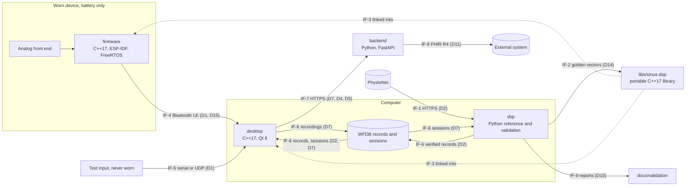
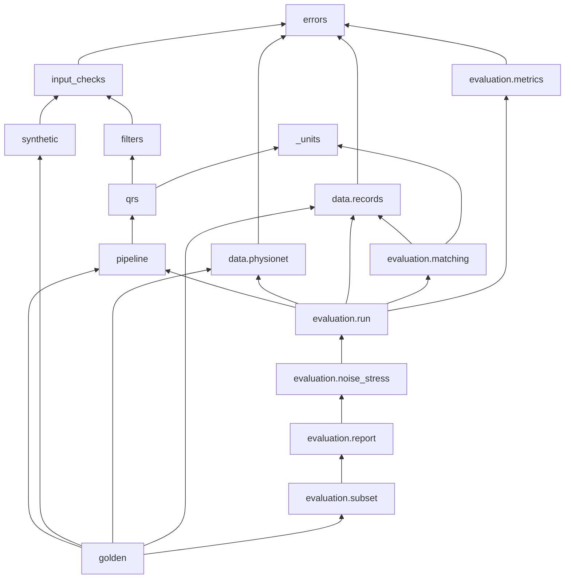

# Software architecture

_Inspired by IEC 62304 §5.3 (architectural design) and §5.4 (detailed design). Version 0.2, 2026-09-29. Status: draft v0.2, detailed design pending owner approval (sections 1 to 7 and 9 to 12 approved in v0.1 on 2026-09-29)._

This document describes **how** Sinus is built:
- the software items and what each is responsible for;
- how the functions of [`functional-analysis.md`](functional-analysis.md) are allocated to them;
- the interfaces and data flows between them;
- the constraints on the portable real-time library;
- the golden-vector format;
- the SOUP of each item and the segregation between items.

Significant decisions are recorded as architecture decision records in [`docs/adr/`](../adr/README.md), and this document cites them.

The detailed design of each requirement (module, interface, algorithm with references, parameters, edge cases) is added milestone by milestone. For Milestone 1 it is in §8, which builds on the equivalence principle and the golden-vector format of §7.

## Conventions

- `FB-xx` (functional blocks), `Dx` (data flows), `US-x` (use scenarios) and `Fx.y` (features) are those of `functional-analysis.md`. `SRS-xxx` are requirements in [`srs.md`](srs.md), `HAZ-xxx` and `RC-xxx` hazards and risk controls in [`risk-analysis.md`](risk-analysis.md), `OP-xxx` open points in [`open-points.md`](open-points.md).
- Interfaces between software items are identified as `IF-1`, `IF-2`, … These IDs are stable and never reused.
- Identifiers in code carry their unit when the type does not: suffixes `_mv`, `_hz`, `_s`, `_ms`, `_bpm`, `_samples` (e.g. `fs_hz`, `delay_samples`), in Python and in C++.
- Every placeholder cites its open point. The detailed design of the items introduced by later milestones is written at the start of their milestone (`sdp.md` §3, activity 3); this version fixes only what the architecture needs now.

## Revision history

| Version | Date | Changes |
|---|---|---|
| 0.1 | 2026-09-29 | First version, replacing the Milestone 0 stub: software items, allocation of the functional blocks, interfaces and data flows, constraints of the portable real-time library, outlines of the firmware, desktop application and backend, equivalence principle and golden-vector format (SRS-015), Milestone 1 module structure of `dsp`, SOUP per item, segregation |
| 0.2 | 2026-09-29 | Detailed design of the Milestone 1 requirements SRS-001 to SRS-016 in §8 (closes OP-008): common conventions and error classes; download and verification against pinned checksum lists; record loading; input validation; filter designs with computed gains and the settling rule for verification; causal Pan–Tompkins detection with delay compensation; EC57 matching as in the WFDB comparator `bxb` (closes OP-030); statistics; evaluation run and report formats; CI subset check and its stability across machines; golden-vector interfaces; implementation order. §7.1 points to the detector initialisation in §8.7.3 |

## 1. System context



## 2. Software items

| Item | Location | Language and platform | Milestones | Responsibility |
|---|---|---|---|---|
| **dsp**: reference implementation and validation pipeline | `dsp/` | Python 3.11 (NumPy, SciPy, wfdb) | M1; M6 | Offline reference of signal conditioning and beat detection; download and verification of the reference databases; EC57 evaluation, noise stress and reports; golden-vector export; later HRV and beat classification |
| **libs/sinus-dsp**: portable real-time signal-processing library | `libs/sinus-dsp/` | C++17, CMake; builds for the computer (host) and for the ESP32-S3 | M2 | The single real-time implementation of signal conditioning, beat detection, heart-rate tracking and signal quality, linked into the firmware and the desktop application |
| **firmware** | `firmware/` | C++17 on ESP-IDF with FreeRTOS; ESP32-S3 | M4 | Acquisition at 360 Hz, electrode contact, device state supervision, streaming over Bluetooth LE |
| **desktop**: desktop application | `desktop/` | C++17, Qt 6 (user-interface technology: OP-033); Windows, macOS, Linux | M3; M4 | Live view, signal status, recording, replay, test input, connection to the device |
| **backend** | `backend/` | Python, FastAPI | M5 | Storage of sessions for their owner, review data, HL7 FHIR R4 export |

- **dsp** is not part of the runtime system: it runs offline on a developer's computer and in CI. It is still treated as Class B software (`safety-class.md`), because it produces the validation evidence of RC-001 and RC-004 and the reference of RC-012.
- **libs/sinus-dsp** has no knowledge of its host: no I/O, no operating system, no framework (§5). The firmware and the desktop application wrap it; neither re-implements any of its functions.
- The **firmware** and the **desktop application** each separate the code that depends on hardware or on Qt from a core that depends on neither, and that core is built and tested on the host (§6).
- The **backend** does no signal processing (§6.3, §10).

Decisions: [ADR 0001](../adr/0001-mcu-and-firmware-framework.md) (ESP32-S3, ESP-IDF, FreeRTOS, C++17), [ADR 0002](../adr/0002-portable-cpp-dsp-library.md) (one portable C++17 library, Python reference, golden vectors), [ADR 0003](../adr/0003-qt-desktop-application-with-replay.md) (Qt 6 desktop application with replay), [ADR 0005](../adr/0005-device-sampling-rate-360-hz.md) (360 Hz).

## 3. Allocation of functions to software items

| Block | Implemented by | Milestone |
|---|---|---|
| FB-01 Signal acquisition | firmware (with the hardware): ADC sampling, calibration to mV, decimation to 360 Hz (§6.1) | M4 |
| FB-02 Transmission | firmware (Bluetooth LE GATT server) and desktop (client), IF-4 | M4 |
| FB-03 Session recording | desktop (WFDB files, IF-6) | M3 (replayed and test data); M4 (device) |
| FB-04 Reference data access | dsp (download and checksum verification, IF-1). The desktop replays only the verified local copy | M1 |
| FB-05 Input validation and signal status | dsp: offline input checks (SRS-003). libs/sinus-dsp: configuration checks and signal quality (M2). desktop: signal status, combining signal quality, electrode contact, interruptions and device state (M3, OP-020). firmware: electrode contact (M4) | M1 to M4 |
| FB-06 Signal conditioning | dsp: offline reference (M1). libs/sinus-dsp: real time (M2), run by the desktop (displayed results) and by the firmware (device-side results, §3.1) | M1; M2 |
| FB-07 Beat detection | As FB-06 | M1; M2 |
| FB-08 Heart rate | libs/sinus-dsp: tracking from beat intervals (M2). desktop: display rules, withholding (M3, OP-021) | M2; M3 |
| FB-09 Heart-rate variability | dsp (offline) | M6 |
| FB-10 Beat classification | dsp (offline) | M6 |
| FB-11 Live display | desktop | M3 |
| FB-12 Session storage and review | backend (where the review takes place: OP-026) | M5 |
| FB-13 Export | backend | M5 |
| FB-14 Validation | dsp: EC57 and noise stress (M1), classification and HRV (M6). libs/sinus-dsp test suite: equivalence (M2). firmware and desktop: instrumentation for jitter, latency and lost samples, analysed offline (M4, OP-014) | M1; M2; M4; M6 |
| FB-15 Replay | desktop | M3 |
| FB-16 Signal quality index | libs/sinus-dsp, run wherever FB-06 runs. A Python reference exists if its equivalence is checked on golden vectors (OP-005, OP-032) | M2 |
| FB-17 Reference output export | dsp (SRS-015, §7) | M1 |
| FB-18 Device state supervision | firmware; the state is shown by the desktop | M4 |

### 3.1 Where the real-time functions run

**Decision.** The desktop application is the only item that produces real-time results for the user:
- it runs the libs/sinus-dsp chain (FB-06, FB-07, FB-08 tracking, FB-16) on the samples it receives, whatever their source: device, replay or test input;
- it derives the signal status (FB-05) and the display (FB-11) from those results.

The device sends the **acquired** samples, not processed ones.

The firmware also runs the same library chain on the same samples, in its processing task. It sends the resulting beat positions and signal quality with the stream as **device-side results**. The desktop never displays them. It uses them in two ways:
- it compares them with its own results on the same samples, as a continuous check that the device and host builds agree (F2.10);
- it uses them to measure the processing delay on the device (F3.5, OP-014).

A discrepancy is counted and recorded with the session. It is not shown as a result.

**Rationale.**
1. Live data, replay and test input follow exactly the same path from D1 onwards. Verification by replay (FB-15, OP-007) therefore exercises the live processing path.
2. The recording holds the acquired samples, so a session can be reprocessed by the offline reference (US-3) and replayed.
3. There is one source of displayed results, and no arbitration between device and desktop results.
4. Running the chain on the device in real time shows that the library meets its real-time budget on the microcontroller (OP-049). It also checks the device build against the host build on real signals, beyond the golden vectors.
5. A failure of the device-side chain cannot change what is displayed; it can only raise a discrepancy. If the budget on the device proves insufficient, the device-side chain can be removed without changing any displayed output.

**Alternatives considered.**
- *Processing on the device only, with the desktop as a display.* Replay would then bypass the processing path, or need a second one, and recordings would hold processed data. Rejected.
- *Acquisition only on the device, with the library run on the ESP32-S3 only in a test image fed with golden vectors.* The firmware would be simpler. This remains the fallback if the device-side chain does not fit the budget; the test image is needed anyway (run in Espressif's QEMU emulator in CI, OP-051 closed).

## 4. Interfaces and data flows

### 4.1 Interfaces

| ID | From → to | Data | Transport and format | Milestone | Defined in |
|---|---|---|---|---|---|
| IF-1 | PhysioNet → dsp | D2: WFDB records and annotations, and the published SHA-256 checksum list | HTTPS download into `data/` (never committed) | M1 | SRS-001, SRS-013, SRS-016; §8 |
| IF-2 | dsp → libs/sinus-dsp tests | D14: golden vectors | Text files, format §7.3 | M1 (export); M2 (use) | SRS-015; §7 |
| IF-3 | libs/sinus-dsp → firmware, desktop | D3, D4, D5, D13 | In-process C++17 API | M2 | §5 |
| IF-4 | firmware → desktop | D1 (acquired samples, sample counter, packet sequence number, electrode contact, motion reference if present), D15 (device state), device-side results (§3.1) | Bluetooth LE GATT notifications; security in `cybersecurity.md` (OP-044) | M4 | §6.1 |
| IF-5 | test input → desktop | D1, in the frame format of IF-4 | Serial port or UDP (local host only by default); only for sources that are not worn (OP-038) | M3 | §6.2 |
| IF-6 | files on the computer | D2 (reference records), D7 (session recordings) | WFDB: header, signal and annotation files. Written by the desktop, read by the desktop (replay) and by dsp (offline analysis, US-3) | M3 | §6.2, OP-050 |
| IF-7 | desktop → backend | D7 with the derived D4 and D5; D9 on retrieval | HTTPS REST API | M5 | §6.3, `cybersecurity.md` |
| IF-8 | backend → external system | D11 | HL7 FHIR R4 JSON (content: OP-027) | M5 | §6.3 |
| IF-9 | dsp → `docs/validation/` | D10 | Markdown reports, regenerated by script, never edited by hand | M1 | SRS-009, SRS-012, SRS-014, SRS-016 |

The byte layout of IF-4 and IF-5 frames and the REST resources of IF-7 are designed at the start of Milestones 3 to 5. The architecture fixes their content (this table) and the rules of §4.2.

### 4.2 Common data conventions

- **Amplitude** in mV. Python uses float64. The C++ real-time path uses `float` (IEEE 754 binary32), because the ESP32-S3 floating-point unit is single precision. Values are converted to mV where they enter an item: by the ADC calibration on the device, by the stream scale in the desktop, by wfdb physical units in dsp.
- **Sampling frequency** in Hz: a parameter of every function and object that depends on it, never a global constant. The device samples at 360 Hz ([ADR 0005](../adr/0005-device-sampling-rate-360-hz.md)). Inputs are accepted from 125 Hz to 1000 Hz (SRS-003).
- **Time base**: sample index, where 0 is the first sample of the record or session; `numpy.int64` in Python, `std::uint64_t` in C++. Time in s is index / sampling frequency.
- **Beat position**: the sample index of the detected QRS complex in the source time base (D4). RR intervals in ms are computed only between beats of the same continuous segment.
- **Continuous segment**: the desktop splits a stream into segments at every gap (samples lost, device restart). It resets the processing chain at the start of each segment, and never computes beat intervals or heart rate across a gap (RC-014).
- **Heart rate** in bpm, always with a validity flag and, when withheld, the reason (D5). **Signal status**: usable or not usable, with the reason (D12).
- **Data source**: device, replay (with the record or session name) or test input. It travels with every frame, from the source to the display and into the recording (RC-015).

### 4.3 Data flow by operating mode

- **Offline validation (M1, US-1).**
  1. dsp downloads and verifies the records (IF-1).
  2. For each record: load, check the input, condition, detect.
  3. It matches the detections with the reference annotations, computes the statistics and writes the report (IF-9).
  4. The same chain exports the golden vectors (IF-2).
- **Replay (M3, US-9).** The desktop reads a verified reference record or a recorded session (IF-6). It emits D1 frames tagged "replay: <name>" at the original sampling rate, paced by a monotonic clock. From there, the frames follow the live path.
- **Live (M4, US-2, US-4).**
  1. On the device: acquisition task → processing task (device-side results) → transmission task → Bluetooth LE (IF-4).
  2. On the desktop, the stream decoder checks sequence numbers and the sample counter and marks gaps.
  3. The libs/sinus-dsp chain processes each continuous segment.
  4. The signal status is derived, the view is updated and the session is recorded (IF-6).
- **Upload and export (M5, US-6, US-7).** The desktop uploads a recorded session with its derived beats and heart rate (IF-7). The backend stores it for its owner and exports FHIR R4 `Observation` resources (IF-8).

## 5. Portable real-time library (`libs/sinus-dsp`)

### 5.1 Constraints

| Constraint | Checked by |
|---|---|
| C++17 and its standard library only. No ESP-IDF, FreeRTOS, Qt or operating-system headers | Host build with the standard library only; static analysis of includes |
| No dynamic memory anywhere in the library: no `new`, `delete` or `malloc`, and no allocating standard containers. All state lives inside objects of fixed size; capacities are compile-time constants sized for the highest supported sampling frequency (1000 Hz) | A host test that fails on any heap allocation during construction, configuration and processing |
| No exceptions and no RTTI: errors are returned as values. Built with `-fno-exceptions -fno-rtti` (GCC, Clang) on every target | Build flags on every target |
| Deterministic: no global mutable state, no clocks, no random numbers, no I/O. The same input sequence gives the same output on a given build | Review; equivalence tests |
| The real-time path computes in `float`; `double` is used only at configuration time (filter design). Implicit promotion to `double` is a compile error | `-Wdouble-promotion -Wfloat-conversion` treated as errors |
| Bounded work per sample, independent of the signal content. A bounded delay per stage, reported by the object | Worst-case timing on the ESP32-S3 against the budget (OP-049) |
| One object per signal, used from one thread; no internal locking; objects are independent of each other | Review |
| The same source code and the same results on every target: no target-specific code paths. A target-optimised kernel would need its own equivalence tests | Equivalence tests on the host and on the ESP32-S3 in Espressif's QEMU emulator in CI (§7, OP-051 closed) |
| Coding standard, formatting and static analysis rules: OP-043 | CI |

### 5.2 Interface style

The interfaces themselves are designed with the Milestone 2 requirements; they follow these rules.

- Namespace `sinus::dsp`. Public headers are in `include/sinus/dsp/`. The CMake target is `sinus_dsp`, with the alias `sinus::dsp`.
- An object is **configured once** from a configuration value (sampling frequency in Hz, mains frequency and so on). Configuration validates the values, for example a sampling frequency within 125–1000 Hz and a mains frequency of 50 Hz or 60 Hz, and returns a status. An object that is not validly configured produces no output.
- An object then **processes one sample at a time**. Block functions only loop over the per-sample call and add no behaviour.
- **Events** (a detected beat, a completed signal-quality window) are reported with their sample index in the source time base. The delay between the sample being processed and the reported index never exceeds the documented maximum of the object.
- `reset()` returns an object to its initial state. The desktop calls it at the start of each continuous segment.
- Filters start in the initial state defined in §7.1, which the reference uses as well.

Planned content for Milestone 2 (functional-analysis.md §5.2):
- second-order-section filters (transposed direct form II) and their design;
- the conditioning chain: baseline wander, mains notch, low-pass;
- a polyphase decimator for the device's oversampled ADC;
- an LMS adaptive interference canceller, with a mains reference (sine and cosine at the mains frequency) or a motion reference (OP-041);
- streaming Pan–Tompkins detection;
- Kalman heart-rate tracking from RR intervals (OP-021);
- the per-window signal quality index (OP-032);
- a pipeline that composes them, used by both the firmware and the desktop application.

### 5.3 Build, integration and tests

- **Build.** CMake, with presets for the host (debug, release, coverage with sanitizers) and for the ESP32-S3.
- **Integration.**
  - The desktop build includes the library's CMake project.
  - The firmware includes it through an ESP-IDF component that registers the same sources (`firmware/components/sinus_dsp/`).
  - No source file is copied into another item.
- **Tests.** GoogleTest on the host: unit tests, requirement tests and the equivalence tests on the golden vectors (§7). Folders and tags follow [ADR 0004](../adr/0004-test-tagging-and-traceability-gates.md):
  - folders `libs/sinus-dsp/tests/{unit,requirements,system}/`;
  - a verifying test carries the comment `// Verifies: SRS-nnn` directly above its `TEST` macro, and only in `requirements/` or `system/`.
  - An equivalence test verifies a Milestone 2 equivalence requirement, and sits in the folder of that requirement's Verification level.
- **On-target tests.** On the ESP32-S3, a test image runs the same equivalence checks, in Espressif's QEMU emulator in CI (OP-051 closed).

## 6. Firmware, desktop application and backend (outline)

### 6.1 Firmware (Milestone 4)

**Structure.**
- **Adapters that depend on ESP-IDF:** ADC, electrode-contact inputs, battery measurement, the Bluetooth LE GATT server (NimBLE host, the ESP-IDF component for Bluetooth LE only), the task watchdog.
- **Core that does not depend on ESP-IDF:** packetizer, device state machine, ring buffers, stream counters. The core is built and unit-tested on the host with GoogleTest (`firmware/tests/`, ADR 0004).

**Tasks.** All tasks are created at start-up, with explicit priorities:

| Task | Priority (relative) | Function |
|---|---|---|
| Acquisition | Highest of the application tasks | Reads the ADC DMA frames: continuous mode, hardware-timed, at an integer multiple of 360 Hz ([ADR 0005](../adr/0005-device-sampling-rate-360-hz.md)). Converts to mV with the ADC calibration and decimates to 360 Hz with the library's anti-aliasing decimator. Reads electrode contact and numbers each sample with the sample counter |
| Processing | High | Runs the libs/sinus-dsp chain on each sample (device-side results, §3.1) |
| Transmission | Medium | Packs samples, device state and device-side results into frames with a sequence number and sends them as GATT notifications |
| Supervision | Low | Battery measurement; device state machine (normal, low battery, error; OP-035, OP-036) |

- **Cores.** Acquisition and processing run on one core; the Bluetooth LE host runs on the other.
- **Communication between tasks.** Single-producer single-consumer ring buffers of fixed capacity, allocated at start-up. Task notifications wake the consumer.
- **Buffer overflow.** A full buffer never blocks acquisition. The producer drops the new samples and counts them. The sample counter in the next frame shows the gap to the receiver (RC-014).
- **Memory.** Everything is allocated at start-up; nothing is allocated afterwards.
- **C++ build settings.** Exceptions and RTTI are disabled in the ESP-IDF configuration. The compiler warnings are those of the library.
- **Watchdog.** The acquisition, processing and transmission tasks are subscribed to the ESP-IDF task watchdog. Timeout and behaviour after a restart: OP-036.
- **Wired links.** No wired data or debug link is used in normal operation (OP-038). Firmware platform security (debug interfaces, secure boot, flash encryption, updates): OP-047.
- **Measurements.** Instrumentation for sampling-time jitter and latency is built in (OP-014).

### 6.2 Desktop application (Milestones 3 and 4)

**Layers.**

| Layer | Depends on | Content |
|---|---|---|
| `core` | C++17 and libs/sinus-dsp only (no Qt) | Stream frame model and the source interface; frame decoder with continuity check and gap marking; one processing chain per continuous segment; signal status (FB-05, OP-020); heart-rate display rules (FB-08, OP-021); cross-check of the device-side results; recording model |
| `io` | Qt | Sources: Bluetooth LE central (Qt Bluetooth, M4), serial port and UDP test inputs (Qt Serial Port, Qt Network, M3), replay (WFDB reader paced by a monotonic clock, M3). WFDB writer. WFDB implementation: OP-050 |
| `ui` | Qt Widgets or Qt Quick (OP-033) | Views and their presenters or view models. They render snapshots of the core state at the display rate and do no processing |

**Rules.**
- `core` is tested on the host with GoogleTest without Qt. Test folders: `desktop/tests/`, per ADR 0004.
- **Threading.** Sources and processing run outside the user-interface thread. The user interface reads snapshots at a fixed refresh rate. Queued Qt signal-slot connections cross the threads.
- **Sources.** All sources (device, replay, test input) implement the same interface and emit the same frames, tagged with the data source. Recordings of replayed or test data are marked as such (RC-015).
- **Replay** reads reference records only from the local copy verified by dsp (IF-1).
- **Test inputs** are off by default. UDP listens on the local host only unless the user changes it (`cybersecurity.md`).
- **Qt licensing.** Only Qt modules available under the LGPL-3.0 are used, linked dynamically, so that the application can be distributed with its Apache-2.0 code. Modules offered only under GPL or commercial terms (for example the chart modules) are not used. The waveform is drawn by the application. The licence of each module is checked when Qt is entered in the SOUP list.

### 6.3 Backend (Milestone 5)

- A FastAPI application in `backend/`, with its own uv project and the same Python tooling as `dsp` (`sdp.md` §5).
- **REST API over HTTPS (IF-7):**
  - upload a session (WFDB files, plus the beats and heart rate computed by the desktop);
  - list and retrieve one's own sessions;
  - export them as FHIR R4.
- **No signal processing.** The backend stores and serves the derived data computed by the desktop. It does not recompute them (§10).
- **Security.** Authentication, owner-only access, encryption at rest, storage technology and GDPR notes are in `cybersecurity.md` and OP-016.
- **Open design points.** FHIR content: OP-027. Where a session is reviewed: OP-026.

## 7. Equivalence between the reference and the real-time library (SRS-015)

### 7.1 Principle: a causal reference

The Python reference implements the **same causal algorithms** as the real-time library:
- Filters are applied forward only; zero-phase (forward-backward) filtering is not used.
- Beat detection uses only the current and past samples, with a bounded look-back, like the streaming detector.
- The reference reports beat positions compensated for the known delays of its filters. The streaming detector reports the same compensated indices, later in time.

Both implementations therefore evaluate the same difference equations on the same samples, and their outputs are compared **sample by sample**, with no delay allowance. The two sides also share:
- **Filter design.** Coefficients are computed at configuration time from the sampling frequency and the settings, in float64, with the same formulas.
- **Stage order.** Baseline wander removal (SRS-004), then mains interference removal (SRS-005), then beat detection (SRS-006) on the output of the mains stage. Removing the baseline first keeps the input of the notch small, which preserves precision in binary32.
- **Initial state.** Each second-order section starts in the steady state that a constant input equal to the first input sample would produce. For the baseline filter this gives zero output on a constant input, which avoids the start-up transient of an offset. The detector's initialisation is specified in §8.7.3 and is the same in both.
- **Precision.** The real-time library computes in binary32, the reference in binary64. The differences come from rounding and must stay within the tolerances of OP-005: conditioning output in mV, beat positions in samples.

**Trade-off.** A causal high-pass filter distorts the phase of the lowest ECG components (ST segment, T wave), which a zero-phase reference would avoid. Sinus makes no claim on ST-segment or morphology measurements, and a causal reference makes the validation results (SRS-007) apply to the algorithm that actually runs in real time. The band criteria of SRS-004 and SRS-005 concern amplitude only and can be met by causal filters.

### 7.2 Input set

The command writes one file per input (SRS-015):

| Inputs | Parameters | Settings | Input identifier |
|---|---|---|---|
| 18 synthetic ECGs | Sampling frequency 250 Hz and 360 Hz × heart rate 40, 75 and 180 bpm × variant: `clean`, `bw-mains50`, `bw-mains60` | Mains 50 Hz for `clean` and `bw-mains50`; 60 Hz for `bw-mains60` | `syn-fs<fs>-hr<hr, 3 digits>-<variant>`, e.g. `syn-fs360-hr075-bw-mains60` |
| 6 record segments, only where the verified database is available (SRS-001) | First 60 s of records 100, 105, 108, 119, 203 and 207 of the MIT-BIH Arrhythmia Database 1.0.0, first stored signal | Mains 60 Hz (the settings of SRS-007) | `mitdb-<record>-first60s`, e.g. `mitdb-100-first60s` |

If the database is not available or not verified, the record segments are skipped with a message naming them, and the synthetic files are still written.

**Synthetic ECG** (`sinus_dsp.synthetic`, deterministic, float64):
- **Duration and sampling.** 30 s; sample instants t_n = n / fs, for n = 0 … 30·fs − 1.
- **R-wave centres.** RR = 60 / heart rate (s). The R wave of beat k is centred on the sample r_k = ⌊(0.5 + k·RR)·fs + 0.5⌋, for every k ≥ 0 with 0.5 + k·RR ≤ 29.5 s. These r_k are the true beat positions of the input.
- **Beat waveform.** Each beat is the sum of five Gaussian waves A·exp(−(t − t_c)² / (2σ²)), centred at t_c = r_k / fs + offset. To keep the waves in order at high heart rates, the P and T offsets and widths scale with s = √(RR / 1 s):

  | Wave | Offset from the R centre (ms) | Amplitude A (mV) | Width σ (ms) |
  |---|---|---|---|
  | P | −200·s | 0.15 | 25·s |
  | Q | −30 | −0.10 | 10 |
  | R | 0 | 1.00 | 10 |
  | S | +30 | −0.20 | 10 |
  | T | +280·s | 0.30 | 45·s |

- **Evaluation order.** The signal is evaluated on every sample, summing the beats in increasing k and the waves in the order P, Q, R, S, T.
- **Interference variants** (SRS-010), added to the signal:
  - `bw-mains50`: 1.0 mV · sin(2π · 0.3 Hz · t) + 0.2 mV · sin(2π · 50 Hz · t);
  - `bw-mains60`: the same with 60 Hz.

### 7.3 File format, version 1

One UTF-8 text file per input, named `<input identifier>.golden.txt`. Lines end with a line feed. There is no byte-order mark and no trailing space, and the file ends with one line feed after `[end]`. It contains a header followed by four sections, always in this order:

```
format=sinus-golden-vector
format_version=1
input_id=syn-fs360-hr075-bw-mains60
input_source=synthetic
input_parameters=duration_s=30;heart_rate_bpm=75;baseline_wander_hz=0.3;baseline_wander_mv=1.0;mains_hz=60;mains_mv=0.2
sampling_frequency_hz=360.0
mains_frequency_hz=60
software_version=0.1.0
stages=baseline,mains
n_samples=10800
n_beats=37
n_reference_beats=37
[coefficients]
stage,section,b0,b1,b2,a1,a2
baseline,0,…
mains,0,…
[signals]
input_mv,baseline_mv,mains_mv
…one row per sample…
[beats]
sample_index
…one row per detected QRS…
[reference_beats]
sample_index
…one row per true or annotated beat…
[end]
```

**Header.** One `key=value` line per key. The key is the text before the first `=`. The keys are always all present, in this order:

| Key | Content |
|---|---|
| `format`, `format_version` | Always `sinus-golden-vector` and `1` |
| `input_id` | Input identifier (§7.2) |
| `input_source` | `synthetic` or `mitdb` |
| `input_parameters` | `name=value` pairs separated by `;`, in a fixed order. Synthetic: the generator parameters. Records: `database=mitdb;database_version=1.0.0;record=<name>;signal=0;start_sample=0;duration_s=60` |
| `sampling_frequency_hz` | Sampling frequency, float |
| `mains_frequency_hz` | Mains setting, 50 or 60 |
| `software_version` | `sinus_dsp.__version__` |
| `stages` | Names of the conditioning stages in the order applied. Version 1 contains `baseline,mains`. A later milestone may add stages, which then get their own columns |
| `n_samples`, `n_beats`, `n_reference_beats` | Number of rows in `[signals]`, `[beats]` and `[reference_beats]` |

**Sections.**
- **`[coefficients]`.** One row per second-order section of each stage, in the order applied, normalised so that a0 = 1. It lets a C++ test check its own filter design separately from its filtering.
- **`[signals]`.** One row per input sample, in order:
  - the input in mV;
  - then the output of each stage in mV, in the order of `stages`, in columns named `<stage>_mv`.
- **`[beats]`.** The detected QRS sample indices of SRS-006, in increasing order.
- **`[reference_beats]`.** For synthetic inputs, the R-wave centres r_k (§7.2). For records, the reference beat annotations (SRS-002) within the segment. They are not needed for equivalence, but they let a test check detection on the same file.
- **`[end]`.** Marks a complete file.

**Numbers.**
- A float64 value is written as Python's `repr()` of it: the shortest decimal string that converts back to the same float64 under correct rounding (e.g. `0.1`, `-1.2345e-05`, `-0.0`).
- Integers are written in decimal, without sign or leading zeros.
- Non-finite values are never written. The export fails with an error naming the input if any output is not finite.

**Readers** (Python and C++) reject a file:
- whose format or version is unknown;
- whose header keys are missing, extra or out of order;
- whose sections are missing or out of order;
- whose column headers do not match `stages`;
- whose row counts differ from the header;
- that contains a value that does not parse or is not finite, or a sample index that is not increasing or lies outside `[0, n_samples)`;
- that lacks `[end]`.

### 7.4 Determinism and exact read-back

- **Determinism.** The content depends only on the input, the settings and the software version. The file contains no dates, times, host names, user names, paths or random numbers, and nothing depends on the iteration order of an unordered collection. Two runs on the same inputs and software version, on the same machine, therefore give byte-identical files (SRS-015).
- **Exact read-back.** Python's `float()` is correctly rounded, so reading back gives exactly the values computed (SRS-015). The C++ reader converts with `std::from_chars` (C++17), which the supported toolchains implement with correct rounding. Its unit tests check exact read-back of edge values: the smallest subnormal and the largest finite value, negative zero, and values that need 17 significant digits.
- **Across machines.** NumPy and SciPy results may differ in the last bits between machines or library builds. The tolerances of OP-005 absorb this, and CI always compares the C++ library with vectors generated in the same run from the same commit (§7.5).

### 7.5 Generation and use

- **Command.** From `dsp/`, run `uv run python scripts/export_golden.py`. The files go to `data/golden/` by default; an option sets another folder. The logic is in `sinus_dsp.golden` (§8).
- **Not stored in the repository.**
  - Synthetic vectors are regenerated deterministically on demand.
  - Vectors of record segments are derived from the database, which is never committed (SRS-015).
- **In CI (from Milestone 2).** The Python build generates the vectors and passes them to the C++ equivalence tests as a build artifact of the same commit. The C++ library is therefore always compared with the current reference, and any change to the reference that the C++ library does not follow fails CI.
- **On the ESP32-S3.** The on-target test image receives the same vectors, in Espressif's QEMU emulator in CI (OP-051 closed).

## 8. Milestone 1 detailed design of `dsp`

This section is the detailed design (IEC 62304 §5.4) of every Milestone 1 requirement, SRS-001 to SRS-016. §8.1 fixes the modules; §8.2 the conventions and errors shared by all of them; §8.3 to §8.12 give, per requirement, the module, the public interface, the errors, the algorithm with its references and parameter values, the edge cases, and what verification can rely on; §8.13 gives the implementation order.

### 8.1 Module structure

| Module (`dsp/sinus_dsp/`) | Responsibility | Requirements |
|---|---|---|
| `__init__.py` | Package version (`__version__`), written into reports and golden vectors | — |
| `errors.py` | Exception hierarchy: one base class for all Sinus errors, and one subclass per error behaviour in the SRS (rejected input, failed data verification, malformed file, subset report mismatch) and in §7.3 (non-finite output), §8.2 | SRS-001, SRS-003, SRS-013, SRS-015, SRS-016 |
| `input_checks.py` | Input validation before filtering or detection | SRS-003 |
| `filters.py` | Design of the second-order sections and causal filtering: baseline wander and mains interference | SRS-004, SRS-005 |
| `qrs.py` | Pan–Tompkins QRS detection, causal, with delay compensation | SRS-006, SRS-010 |
| `pipeline.py` | The conditioning chain and detection in the order of §7.1, defined once and used by the evaluation and the golden-vector export | SRS-006, SRS-010, SRS-015 |
| `synthetic.py` | Deterministic synthetic ECG (§7.2) | SRS-015 |
| `golden.py` | Golden-vector writer and reader (§7.3) | SRS-015 |
| `data/physionet.py` | Download of a PhysioNet database version and verification against its SHA-256 checksum list. Network access goes through an injectable fetch function (the default uses the standard library), so that tests need no network | SRS-001, SRS-013, SRS-016 |
| `data/records.py` | Loading a record, a channel and its beat and non-beat annotations with wfdb | SRS-002 |
| `evaluation/matching.py` | EC57 beat-by-beat matching | SRS-008 |
| `evaluation/metrics.py` | TP, FN, FP, Se and +P, per record, gross and average | SRS-011 |
| `evaluation/run.py` | Runs detection and evaluation on a set of records with given settings | SRS-007, SRS-009, SRS-014, SRS-016 |
| `evaluation/noise_stress.py` | Noise stress record set, SNR per record, aggregation per SNR | SRS-014 |
| `evaluation/report.py` | Deterministic Markdown rendering of the full report and of the subset report | SRS-009, SRS-012, SRS-014, SRS-016 |
| `evaluation/subset.py` | Comparison of the regenerated subset report with the stored one, naming the differences | SRS-016 |

| Script (`dsp/scripts/`) | Runs |
|---|---|
| `download_data.py` | Download and verification of the MIT-BIH Arrhythmia and Noise Stress Test databases into `data/` |
| `validate.py` | The full validation report, `docs/validation/qrs-ec57-report.md` (SRS-009) |
| `subset_check.py` | The CI subset check: regenerates the subset report and compares it with `docs/validation/qrs-ec57-subset-report.md` (SRS-016) |
| `export_golden.py` | The golden-vector export (SRS-015) |
| `traceability.py` | The traceability matrix, its checks and the release gate (ADR 0004) |

**Rules for `dsp`.**
- Scripts are thin command-line wrappers: argument parsing, paths, messages, exit codes. The logic they run lives in `sinus_dsp`, where tests import it without running a command.
- Every function that depends on the sampling frequency takes it as an argument (`fs_hz`). Signals are `numpy.typing.NDArray[numpy.float64]` in mV; indices are `numpy.int64`.
- Signal-processing functions are pure: no global state, no I/O and no printing. Only scripts write files and messages.
- The algorithms are written so that they port to the C++ library: causal filtering with second-order sections (`scipy.signal.sosfilt`, same difference equations); detection decisions taken on candidate peaks in time order, with bounded look-back; no zero-phase filtering and no whole-signal statistics in the detection logic.
- Data folders: `data/mitdb/`, `data/nstdb/`, `data/golden/`, all ignored by git.
- Private helpers shared by several modules (e.g. the time-to-samples conversions of §8.2) may go in private modules whose names start with `_` (e.g. `sinus_dsp/_units.py`). Their content is fixed by this section; they add no public interface.

### 8.2 Common conventions and errors

**Types.** `FloatArray = numpy.typing.NDArray[numpy.float64]` (signals in mV, one dimension) and `IndexArray = numpy.typing.NDArray[numpy.int64]` (sample indices, strictly increasing unless stated). Public functions accept signals as `numpy.typing.ArrayLike` and convert them once, in the input check (§8.5). They never modify an array they receive, and return new arrays.

**Times in samples.** Parameters are stated in seconds or Hz and converted to samples at configuration, from the sampling frequency `fs_hz`:
- `round_samples(t_s, fs_hz) = floor(t_s · fs_hz + 0.5)`: round half up, the rule of the WFDB function `strtim`. Used unless stated otherwise.
- Where a requirement states a bound ("at most 150 ms", "at least 200 ms"), the conversion keeps the bound exact: `floor(t_s · fs_hz)` for "at most", `ceil(t_s · fs_hz)` for "at least". Each use is named in its section.
- The products are computed as `t_ms · fs_hz / 1000` with `t_ms` an integer number of milliseconds (e.g. `150 · fs_hz / 1000`), which is exact in binary64 for every integer `fs_hz` up to 1000 Hz. At 360 Hz and 250 Hz every value in this section is therefore exact.

**Determinism.** Everything that feeds a detection decision, a report or a golden vector is computed in a fixed order:
- recursive and FIR filters with `scipy.signal.sosfilt` and `scipy.signal.lfilter`, which evaluate their difference equations sample by sample;
- sums and means of floating-point values with `math.fsum` (correctly rounded, so independent of the machine), never with `numpy.sum` or `numpy.mean`, whose pairwise and SIMD summation order may differ between NumPy builds;
- maxima with `numpy.max` and `numpy.argmax` (exact; `argmax` returns the first index of the maximum, which is the tie rule everywhere in this section);
- no iteration over unordered collections (`set`, `dict` built from them) where the order reaches an output; record and file lists are sorted.

**Requirement citations.** Each public function cites in its docstring the requirement IDs it implements, and only those. Citing an ID claims the requirement as implemented, so CI fails until the verifying test tagged with that ID exists on the same branch (ADR 0004 §6). Developer and QA changes for a requirement therefore land together (§8.13).

**Errors** (`sinus_dsp.errors`). Every error that the software raises on purpose derives from `SinusError`. There is one class per error behaviour:

| Class | Bases | Raised when | Attributes | Requirements |
|---|---|---|---|---|
| `SinusError` | `Exception` | Never raised directly; lets a caller catch every Sinus error | — | — |
| `InvalidInputError` | `SinusError`, `ValueError` | An input or argument is rejected: the checks of §8.5, a mains frequency other than 50 or 60 Hz, a channel that the record does not have, signal units other than mV, an invalid record name | — | SRS-003; also SRS-002, SRS-005 |
| `DataVerificationError` | `SinusError` | A database, or the requested records of it, is not verified: a listed file is missing or its SHA-256 differs, or the checksum list itself is missing or differs from its pinned digest (§8.3). Also raised, before anything is written, by every command that needs verified data (§8.10 to §8.12) | `database: str` (e.g. `mitdb 1.0.0`); `missing: tuple[str, ...]` and `mismatched: tuple[str, ...]`, relative paths sorted in code-point order | SRS-001, SRS-012, SRS-013, SRS-014, SRS-016 |
| `MalformedFileError` | `SinusError`, `ValueError` | A file does not follow its format: a golden-vector file that a reader rejects (§7.3), a checksum list (§8.3), an annotation file whose sample indices decrease (§8.4), a stored subset report that is not UTF-8 text (§8.11) | `path: str`; `line: int | None` (1-based); `reason: str` | SRS-015; also SRS-001, SRS-002, SRS-016 |
| `SubsetReportMismatchError` | `SinusError` | The regenerated subset report differs from the stored one (§8.11) | `differences: tuple[str, ...]`, one entry per differing line | SRS-016 |
| `NonFiniteOutputError` | `SinusError` | The golden-vector export finds a value that is not finite (§7.3). With finite input and the stable filters of §8.6 this cannot happen; the check guards the file format | `input_id: str` | SRS-015 |

The message of every error is deterministic and names what failed. `DataVerificationError` formats as `<database> not verified: missing: <a>, <b>; checksum mismatch: <c>` (a part is omitted when empty). Errors raised by the standard library or by SOUP for conditions that the software does not check itself (for example `OSError` when a file cannot be read, or an error of `wfdb` on a corrupted header) propagate unchanged.

### 8.3 Download and verification of a database (SRS-001, SRS-013; used by SRS-016)

**Module.** `sinus_dsp.data.physionet`. Script: `scripts/download_data.py`.

**Source.** PhysioNet publishes each database version under `https://physionet.org/files/<slug>/<version>/`, together with `SHA256SUMS.txt`: one line per file of the version, `<64 hexadecimal digits> <relative path>`, paths separated by `/`. The MIT-BIH Arrhythmia Database 1.0.0 lists 704 files (the 48 records, the documentation folder `mitdbdir/` and the folder `x_mitdb/`); the Noise Stress Test Database 1.0.0 lists 97 files (with the folder `old/`). SRS-001 and SRS-013 require every listed file.

**Pinned checksum lists.** The digest of each list is pinned in the code. Versions on PhysioNet are immutable, so the list of a version never changes; the pin protects against a list altered in transit or on the server, and makes verification independent of the network. The digests below were computed on 2026-09-29 from the lists served by PhysioNet:

| Constant | `slug` | `version` | `title` | SHA-256 of `SHA256SUMS.txt` |
|---|---|---|---|---|
| `MITDB` | `mitdb` | `1.0.0` | MIT-BIH Arrhythmia Database | `b61158a96d5f2ca80edfb354a9a66a6324836c390a84e1966dcee2b907d6be43` |
| `NSTDB` | `nstdb` | `1.0.0` | MIT-BIH Noise Stress Test Database | `b76bd98c5111439fcfff2f410afd70d64e79f072049c45b5a9916a3044fdb84f` |

If PhysioNet ever serves a different list for these versions, download and verification fail with an error naming `SHA256SUMS.txt`, and the pin is updated only after the change has been reviewed.

**Interface.**

```python
PHYSIONET_FILES_URL: Final = "https://physionet.org/files"
CHECKSUM_LIST_NAME: Final = "SHA256SUMS.txt"

@dataclass(frozen=True)
class Database:
    slug: str                    # folder name on PhysioNet and under data/, e.g. "mitdb"
    version: str                 # e.g. "1.0.0"
    title: str                   # e.g. "MIT-BIH Arrhythmia Database"
    checksum_list_sha256: str    # pinned digest of SHA256SUMS.txt, 64 lowercase hex digits

MITDB: Final[Database]
NSTDB: Final[Database]

FetchFunction = Callable[[str], bytes]   # URL -> file content; raises OSError on failure

@dataclass(frozen=True)
class VerificationResult:
    database: Database
    records: tuple[str, ...] | None      # None: the whole database was verified
    files: tuple[str, ...]               # relative paths verified, sorted

def fetch_https(url: str) -> bytes: ...
def database_url(database: Database) -> str: ...          # ".../files/<slug>/<version>/"
def parse_checksum_list(text: str, source: str) -> dict[str, str]: ...
def select_files(checksums: Mapping[str, str], records: Sequence[str] | None) -> tuple[str, ...]: ...
def verify_database(database: Database, data_root: Path, *,
                    records: Sequence[str] | None = None) -> VerificationResult: ...
def download_database(database: Database, data_root: Path, *,
                      records: Sequence[str] | None = None,
                      fetch: FetchFunction = fetch_https) -> VerificationResult: ...
def describe_verification(result: VerificationResult) -> str: ...
```

`data_root` is the data folder (default for scripts: `data/` at the repository root); the database lives in `data_root / database.slug`, e.g. `data/mitdb/`.

**Behaviour.**
- `fetch_https` accepts only URLs that start with `https://` (otherwise `ValueError`), opens them with `urllib.request.urlopen` and a timeout of 60 s, and returns the whole body. It raises `OSError` (including `urllib.error.URLError` and `HTTPError`) for any failure or a status other than 200. No retries: re-running the command resumes, because verified files are skipped.
- `parse_checksum_list` reads one entry per non-empty line, matching `^([0-9a-fA-F]{64}) [ *]?(\S+)$` (the `sha256sum` formats); digests are stored in lowercase. Each path must be relative, with `/` separators, and each component must match `[A-Za-z0-9._+-]+` and differ from `.` and `..`. A line that does not match, an unsafe path, a duplicate path or an empty list raise `MalformedFileError` naming `source` and the line. This keeps a listed name from writing outside the database folder.
- `select_files` returns every listed path when `records` is `None`. Otherwise it returns, for each record name (which must match `[A-Za-z0-9_]+`, else `InvalidInputError`), the listed top-level files named `<record>.<extension>` (e.g. `100.atr`, `100.dat`, `100.hea`, `100.xws`); a record with no such file is reported as missing under the name `<record>.*`.
- `verify_database` never uses the network:
  1. It reads `data_root/<slug>/SHA256SUMS.txt`. If it is absent, `DataVerificationError` with `missing=("SHA256SUMS.txt",)`. If its SHA-256 differs from `checksum_list_sha256`, `DataVerificationError` with `mismatched=("SHA256SUMS.txt",)`.
  2. It parses the list and selects the files.
  3. For each selected file, it computes the SHA-256 of the file's bytes (read in blocks of 1 MiB with `hashlib.sha256`). A path that is not a regular file is missing; a digest that differs is a mismatch.
  4. If anything is missing or mismatched, it raises `DataVerificationError` naming every such file (both lists complete and sorted). Otherwise it returns the `VerificationResult`.
- `download_database` creates the database folder, then:
  1. Uses the local `SHA256SUMS.txt` if its digest equals the pin; otherwise fetches it from `database_url(...)`. A failed fetch raises `DataVerificationError` naming the list as missing; a fetched list whose digest differs from the pin raises it naming the list as mismatched, and the fetched list is not written.
  2. For each selected file, skips it if the local copy already has the listed digest; otherwise fetches it and writes it atomically (write to `<name>.part` in the same folder, then `os.replace`), creating subfolders as needed. A failed fetch (`OSError`) is not raised here: the file stays absent or outdated, and the final verification names it.
  3. Returns `verify_database(database, data_root, records=records)`, which raises if any file is still missing or mismatched. The outcome is therefore always decided by the local verification, never by the download.
  - A `<record>.*` placeholder from `select_files` is never fetched; the verification reports it as missing.
- `describe_verification` returns the text written in reports: `verified: <n> files match the published SHA-256 checksum list (SHA256SUMS.txt, SHA-256 <digest>)`, followed for a subset by `; records <r1>, <r2>, …`.
- `scripts/download_data.py [--data-dir PATH] [--database mitdb|nstdb|all] [--records NAME ...]` calls `download_database` for each database (default: both, whole). It prints the outcome of each and exits with status 0 if all are verified, 1 on `DataVerificationError` or `MalformedFileError` (message on standard error), 2 on a usage error.

**Edge cases.** Stale `.part` files from an interrupted run are overwritten. A file present on disk but not listed is ignored (neither verified nor reported). Names are compared exactly; a case-insensitive file system cannot create a mismatch because PhysioNet names differ by more than case.

**Verification notes.** QA's tests need no network (SRS-001, SRS-013): they write a fixture folder with a few files and their `SHA256SUMS.txt`, build a `Database` whose `checksum_list_sha256` is the digest of that fixture list, and call `verify_database`; `download_database` can be exercised with a fake `FetchFunction` that serves the fixture bytes from a dictionary and raises `OSError` for anything else. The error names both the altered and the missing file in its message and in `mismatched` and `missing`.

### 8.4 Loading a reference record (SRS-002)

**Module.** `sinus_dsp.data.records`.

**Interface.**

```python
BEAT_SYMBOLS: Final[frozenset[str]] = frozenset(
    {"N", "L", "R", "B", "A", "a", "J", "S", "V", "r", "F", "e", "j", "n", "E", "/", "f", "Q", "?"})

@dataclass(frozen=True)
class Annotation:
    sample: int          # index in the record's time base
    symbol: str          # WFDB annotation mnemonic, e.g. "+", "~", "[", "]", "!"
    subtype: int         # WFDB subtyp field (e.g. the signal-quality bits of "~")
    aux_note: str        # auxiliary text (e.g. "(AFIB"), trailing NUL characters removed

@dataclass(frozen=True)
class Record:
    name: str
    channel: int
    signal_name: str             # e.g. "MLII", "V5"
    fs_hz: float
    signal_mv: FloatArray        # the channel, physical units, mV
    beat_samples: IndexArray     # non-decreasing
    beat_symbols: tuple[str, ...]
    other_annotations: tuple[Annotation, ...]   # every non-beat annotation, in file order

    @property
    def n_samples(self) -> int: ...

def load_record(record_path: Path, channel: int = 0, annotator: str = "atr") -> Record: ...
```

**Behaviour.**
- `record_path` is the record path without extension, e.g. `data/mitdb/100`. The signal is read with `wfdb.rdrecord(str(record_path), channels=[channel], physical=True, return_res=64)`. A channel outside `0 … n_sig − 1` (from the header) raises `InvalidInputError`. Units other than `mV` raise `InvalidInputError` naming them. The signal is copied into a contiguous float64 array.
- Annotations are read with `wfdb.rdann(str(record_path), annotator)` (attributes `sample`, `symbol`, `subtype`, `aux_note`). If the sample indices decrease anywhere, `MalformedFileError`. An annotation whose symbol is in `BEAT_SYMBOLS` goes to `beat_samples` and `beat_symbols`; every other annotation goes to `other_annotations`, in file order. The two lists together hold every annotation exactly once.
- `BEAT_SYMBOLS` are the 19 beat codes of SRS-002. They are the codes for which the WFDB library function `isqrs()` is true, except `!` (ventricular flutter wave), which `isqrs()` also counts; `!` stays a non-beat annotation, and §8.8 explains why the scoring result is the same.

**Edge cases.** An annotation file with no beat annotation gives empty beat arrays (`numpy.int64`, length 0). An annotation beyond the end of the signal is kept as it is. The channel number is not the signal name: the first stored signal is channel 0 (MLII in 46 records of the MIT-BIH Arrhythmia Database, a modified V5 in records 102 and 104).

**Verification notes.** QA writes a synthetic record with `wfdb.wrsamp` (units `mV`, format 16 or 212) and an annotation file with `wfdb.wrann` (several beat codes, plus a `+` rhythm change with an aux note and a `~` signal-quality mark with a subtype). The loaded signal equals the written one within one quantization step (`1 / adc_gain` mV); beat and non-beat lists are as described above.

### 8.5 Input validation (SRS-003)

**Module.** `sinus_dsp.input_checks`.

**Interface.**

```python
MIN_FS_HZ: Final = 125.0
MAX_FS_HZ: Final = 1000.0
MIN_DURATION_S: Final = 10.0
MAINS_FREQUENCIES_HZ: Final = (50, 60)

def validate_input(signal_mv: npt.ArrayLike, fs_hz: float) -> FloatArray: ...
def validate_mains(mains_hz: int) -> int: ...
```

**Behaviour.** `validate_input` checks, in this order, and raises `InvalidInputError` at the first failure, with a message naming the check and the offending value:
1. `fs_hz` is a real number (not `bool`) and finite;
2. `125.0 ≤ fs_hz ≤ 1000.0` (bounds included);
3. the signal converts to a one-dimensional array of integer or floating-point kind (`numpy.asarray(...).dtype.kind` in `iuf`), else rejected;
4. the signal is not empty;
5. every sample is finite (`numpy.isfinite`); the message gives the number of non-finite samples and the index of the first;
6. the duration is at least 10 s: rejected if `n_samples < 10.0 · fs_hz` (exact for the values of SRS-003: 1250 samples at 125 Hz, 10000 at 1000 Hz).

It returns a new contiguous float64 copy of the signal. `validate_mains` accepts 50 and 60 (as `int`, or a `float` equal to them) and returns the `int`; anything else raises `InvalidInputError`.

**Where it is called.** At the start of every public function of SRS-004, SRS-005 and SRS-006: `remove_baseline_wander`, `remove_mains_interference`, `detect_qrs`, `run_pipeline` and `detect_beats` (§8.6, §8.7), before any other computation. These functions therefore return nothing for a rejected input. Internal stages called after the check do not check again.

**Verification notes.** The cases of SRS-003 map to exact sample counts: 9.99 s is `floor(9.99 · fs_hz)` samples (e.g. 3596 at 360 Hz), always rejected; 10 s at 125 Hz (1250 samples) and at 1000 Hz (10000 samples) are accepted. 124.9 Hz, 1000.1 Hz, NaN and ±infinity as the sampling frequency are rejected.

### 8.6 Baseline wander and mains interference filters (SRS-004, SRS-005)

**Module.** `sinus_dsp.filters`. The filters are causal second-order sections (§7.1, ADR 0002), designed in float64 with closed-form expressions that the C++ library reproduces.

**Interface.**

```python
BASELINE_CUTOFF_HZ: Final = 0.5
NOTCH_Q: Final = 30.0

def butterworth2_highpass_sos(cutoff_hz: float, fs_hz: float) -> FloatArray: ...   # shape (1, 6)
def butterworth2_lowpass_sos(cutoff_hz: float, fs_hz: float) -> FloatArray: ...    # shape (1, 6)
def notch_sos(notch_hz: float, q: float, fs_hz: float) -> FloatArray: ...          # shape (1, 6)
def baseline_sos(fs_hz: float) -> FloatArray: ...                 # butterworth2_highpass_sos(0.5, fs_hz)
def mains_sos(fs_hz: float, mains_hz: int) -> FloatArray: ...     # notch_sos(mains_hz, 30.0, fs_hz)
def initial_state(sos: FloatArray, first_sample: float) -> FloatArray: ...   # shape (n_sections, 2)
def apply_sos(sos: FloatArray, x: FloatArray) -> FloatArray: ...
def remove_baseline_wander(signal_mv: npt.ArrayLike, fs_hz: float) -> FloatArray: ...                 # SRS-004
def remove_mains_interference(signal_mv: npt.ArrayLike, fs_hz: float, mains_hz: int) -> FloatArray: ...  # SRS-005
```

SOS rows are `[b0, b1, b2, 1.0, a1, a2]` (a0 = 1), the layout of `scipy.signal.sosfilt` and of the golden-vector `[coefficients]` section. A design argument outside its range (`0 < cutoff_hz < fs_hz / 2`, `0 < notch_hz < fs_hz / 2`, `q > 0`) raises `InvalidInputError`.

**Design formulas** (float64, in this order of operations):
- **Second-order Butterworth** (bilinear transform with frequency prewarping, as `scipy.signal.butter`): `K = tan(π · cutoff_hz / fs_hz)`, `norm = 1 / (1 + √2 · K + K · K)`, `a1 = 2 · (K · K − 1) · norm`, `a2 = (1 − √2 · K + K · K) · norm`.
  - High-pass: `b0 = norm`, `b1 = −2 · norm`, `b2 = norm`.
  - Low-pass: `b0 = K · K · norm`, `b1 = 2 · K · K · norm`, `b2 = K · K · norm`.
  - These agree with `scipy.signal.butter(2, cutoff_hz, btype, fs=fs_hz, output="sos")` within 1e-15 at 125, 250, 360 and 1000 Hz (a unit test of the developer checks this within 1e-12).
- **Notch** (`scipy.signal.iirnotch`; S. J. Orfanidis, *Introduction to Signal Processing*, 1996, eqs. 11.3.4 to 11.3.7): `w = 2 · notch_hz / fs_hz`, `bw = (w / q) · π`, `w0 = w · π`, `beta = tan(bw / 2)`, `g = 1 / (1 + beta)`; `b = [g, −2 · cos(w0) · g, g]`, `a1 = −2 · g · cos(w0)`, `a2 = 2 · g − 1`. With this order of operations the coefficients equal those of `scipy.signal.iirnotch` bit for bit.

**Filtering and initial state.** `apply_sos` runs `scipy.signal.sosfilt(sos, x, zi=initial_state(sos, x[0]))`: transposed direct form II per section, forward only. `initial_state` is the steady state for a constant input equal to the first sample (§7.1), in closed form: for section `i`, with input level `u_0 = first_sample` and `G_i = (b0 + b1 + b2) / (1 + a1 + a2)`, `z1 = (b1 + b2 − (a1 + a2) · G_i) · u_i`, `z2 = (b2 − a2 · G_i) · u_i`, and `u_{i+1} = G_i · u_i`. `scipy.signal.sosfilt_zi` is not used: it solves a linear system, which rounds differently from this formula. For the high-pass, `G = 0` exactly, so a constant input gives an output of exactly 0.0 from the first sample (checked at 125, 360 and 1000 Hz).

**Parameters and their justification.**
- **Baseline wander** (SRS-004): second-order Butterworth high-pass at 0.5 Hz, one section. A first-order filter cannot give both −20 dB at 0.1 Hz and −0.5 dB at 1 Hz. A second-order Butterworth meets both for cut-offs between 0.32 Hz and 0.59 Hz. 0.5 Hz is the usual cut-off of monitoring ECG front ends, with margins of 0.24 dB at 1 Hz and 8 dB at 0.1 Hz. The lowest order also keeps the phase distortion of the causal filter (§7.1) as small as possible.
- **Mains interference** (SRS-005): notch at 50 Hz or 60 Hz (`validate_mains`), quality factor Q = 30, i.e. a −3 dB width of f0 / 30 (1.7 Hz at 50 Hz, 2 Hz at 60 Hz). A narrow notch keeps the loss at 40 Hz below 0.03 dB. Its cost is a small tolerance to deviations of the mains frequency (about −6 dB at 0.5 Hz from f0), which is the subject of OP-022 for live use.
- **Stage order**: baseline, then mains (§7.1). `remove_baseline_wander` and `remove_mains_interference` each validate their input (§8.5) and apply one stage; `run_pipeline` (§8.7) chains them.

**Computed gains** (steady state, from the designed coefficients; dB):

| Frequency | Baseline, 360 Hz | Baseline, 250 Hz | Notch 50 Hz, 360 Hz | Notch 50 Hz, 250 Hz | Notch 60 Hz, 360 Hz | Notch 60 Hz, 250 Hz | SRS criterion |
|---|---|---|---|---|---|---|---|
| Constant offset | output exactly 0 | output exactly 0 | — | — | — | — | SRS-004: ≤ −20 |
| 0.05 Hz | −40.00 | −40.00 | — | — | — | — | SRS-004: ≤ −20 |
| 0.1 Hz | −27.97 | −27.97 | — | — | — | — | SRS-004: ≤ −20 |
| 1 Hz | −0.263 | −0.263 | −0.0000 | −0.0000 | −0.0000 | −0.0000 | ±0.5 |
| 5 Hz | −0.0004 | −0.0004 | −0.0001 | −0.0001 | −0.0000 | −0.0000 | ±0.5 |
| 10 Hz | −0.0000 | −0.0000 | −0.0002 | −0.0003 | −0.0002 | −0.0002 | ±0.5 |
| 20 Hz | −0.0000 | −0.0000 | −0.0012 | −0.0014 | −0.0008 | −0.0010 | ±0.5 |
| 40 Hz | −0.0000 | −0.0000 | −0.025 | −0.026 | −0.008 | −0.009 | ±0.5 |
| Mains frequency | — | — | below −260 | below −260 | below −260 | below −260 | SRS-005: ≤ −30 |

(−0.0000 means a loss below 0.00005 dB.)

**Settling time and the verification rule.** The SRS measures each gain on the second half of an input that lasts at least ten periods, with the filter starting in the initial state of §7.1. The transients decay with time constants of 0.450 s for the baseline filter (at every sampling frequency) and 0.191 s (50 Hz) or 0.159 s (60 Hz) for the notch. Measured that way (RMS of the second half of the output over RMS of the second half of the input, sinusoids starting at phase 0), at 360 Hz and 250 Hz:
- Baseline filter: offset over 60 s, output exactly 0; 0.05 Hz over 200 s, −40.00 dB; 0.1 Hz over 100 s, −27.97 dB; 1 Hz over 10 s, −0.263 dB; 5, 10, 20 and 40 Hz over ten periods, within ±0.01 dB. Ten periods are enough everywhere.
- Notch at the mains frequency: −6.6 dB (50 Hz) and −7.9 dB (60 Hz) over ten periods (0.2 s), because the notch has not settled; −30.0 and −35.3 dB over 1 s; −55.7 and −65.6 dB over 2 s; −104 and −123 dB over 4 s. Band frequencies stay within ±0.07 dB at any duration of ten periods or more.
- A notch that settles within ten periods of 50 Hz would need Q ≤ 4.5, which fails the 40 Hz criterion. The design therefore keeps Q = 30, and **the verification inputs of SRS-004 and SRS-005 last at least ten periods and at least 2 s**. This is within the SRS wording ("at least ten periods").

**Edge cases.** A constant input gives exactly 0.0 from the baseline filter and an unchanged value from the notch (whose gain at DC is 1). The functions are linear and time-invariant from the defined initial state, so the output for a given input never depends on earlier calls.

**Verification notes.** QA measures as above, with inputs of at least 2 s and ten periods. The test of the baseline filter at the offset may see an output of exactly zero; the attenuation is then infinite, and the test should compare the RMS against 1 mV × 10^(−20/20) rather than compute a logarithm of zero.

### 8.7 QRS detection and the processing pipeline (SRS-006, SRS-010)

**Modules.** `sinus_dsp.qrs` (the detector), `sinus_dsp.pipeline` (conditioning and detection chained in the order of §7.1).

**Reference algorithm.** J. Pan and W. J. Tompkins, "A real-time QRS detection algorithm", *IEEE Trans. Biomed. Eng.* 32(3):230–236, 1985 (P&T): band-pass filtering, derivative, squaring, moving-window integration, and adaptive dual thresholds on the integrated and the filtered signals, with search-back, a 200 ms refractory period and T-wave discrimination. Where the paper leaves a choice open, this design fixes it, and the table at the end of this section lists each deviation with its reason. The peak rule follows P. S. Hamilton and W. J. Tompkins, "Quantitative investigation of QRS detection rules using the MIT/BIH arrhythmia database", *IEEE Trans. Biomed. Eng.* 33(12):1157–1165, 1986, as implemented in P. S. Hamilton, "Open source ECG analysis", *Computers in Cardiology* 29:101–104, 2002. No parameter was tuned on the evaluation databases.

**Interface.**

```python
# qrs.py
BAND_LOW_HZ: Final = 5.0
BAND_HIGH_HZ: Final = 15.0
BAND_DELAY_MS: Final = 36
INTEGRATION_WINDOW_MS: Final = 150
PEAK_TIMEOUT_MS: Final = 95
REFRACTORY_MS: Final = 200
T_WAVE_WINDOW_MS: Final = 360
LEARNING_S: Final = 2
RELEARN_AFTER_S: Final = 8
SEARCH_BACK_FACTOR: Final = 1.66
RR_AVERAGE_COUNT: Final = 8
MIN_INTEGRATED: Final = 1e-4          # (mV/s)^2

@dataclass(frozen=True)
class DetectorSamples:                 # the parameters above in samples, at one fs_hz
    band_delay: int
    window: int
    peak_timeout: int
    refractory: int
    t_wave_window: int
    learning: int
    relearn_after: int

@dataclass(frozen=True)
class QrsSignals:                      # the intermediate signals, for unit tests and diagnostics
    bandpassed_mv: FloatArray
    derivative_mv_per_s: FloatArray
    integrated: FloatArray             # (mV/s)^2

def detector_samples(fs_hz: float) -> DetectorSamples: ...
def detection_band_sos(fs_hz: float) -> FloatArray: ...                     # shape (2, 6)
def qrs_signals(conditioned_mv: npt.ArrayLike, fs_hz: float) -> QrsSignals: ...
def detect_qrs(conditioned_mv: npt.ArrayLike, fs_hz: float) -> IndexArray: ...   # SRS-006

# pipeline.py
STAGES: Final = ("baseline", "mains")

@dataclass(frozen=True)
class PipelineResult:
    fs_hz: float
    mains_hz: int
    coefficients: tuple[FloatArray, FloatArray]    # baseline_sos, mains_sos
    input_mv: FloatArray
    baseline_mv: FloatArray
    mains_mv: FloatArray
    beats: IndexArray

def run_pipeline(signal_mv: npt.ArrayLike, fs_hz: float, mains_hz: int) -> PipelineResult: ...  # SRS-006, SRS-010
def detect_beats(signal_mv: npt.ArrayLike, fs_hz: float, mains_hz: int) -> IndexArray: ...      # run_pipeline(...).beats
```

`run_pipeline` validates the input and the mains setting (§8.5) once, then applies the baseline filter, the mains filter and `detect_qrs` on the mains output, without validating again. `detect_beats` is the detector used by the evaluation (§8.10) and by QA's tests of SRS-006 and SRS-010 on raw synthetic ECGs. `detect_qrs` validates its own input and expects a conditioned signal. Both return a new `int64` array, strictly increasing, possibly empty.

**Parameters in samples** (`detector_samples`, conversions of §8.2):

| Parameter | Value | Conversion | 360 Hz | 250 Hz |
|---|---|---|---|---|
| `band_delay` D | 36 ms | round | 13 | 9 |
| `window` N | 150 ms | round | 54 | 38 |
| `peak_timeout` P | 95 ms | round | 34 | 24 |
| `refractory` R | 200 ms | ceil (spacing of at least 200 ms, SRS-006) | 72 | 50 |
| `t_wave_window` TW | 360 ms | round | 130 | 90 |
| `learning` L | 2 s | round | 720 | 500 |
| `relearn_after` G | 8 s | round | 2880 | 2000 |

#### 8.7.1 Linear stages

All causal, computed on the whole array in the Python reference (the recursions are the same sample by sample, so the result equals a sample-by-sample evaluation):
1. **Band-pass** `b` (mV): `detection_band_sos` = `[butterworth2_highpass_sos(5, fs_hz), butterworth2_lowpass_sos(15, fs_hz)]` (§8.6), applied with `apply_sos`. This is the pass band of P&T. Two closed-form sections port directly to C++. Gains at 360 Hz: −3.06 dB at 5 and 15 Hz, −0.9 dB at 8.66 Hz and −1.0 dB at 10 Hz (maximum near 8.7 Hz), −22 dB at 50 Hz and −26 dB at 60 Hz. Since the high-pass section has zero gain at DC, `b[0] = 0` exactly for any input.
2. **Derivative** `d` (mV/s): the five-point derivative of P&T, made causal: `d[n] = (fs_hz / 8) · (b[n] + 2 · b[n−1] − 2 · b[n−3] − b[n−4])`, with `b[k] = 0` for `k < 0` (consistent with `b[0] = 0`). Computed as `scipy.signal.lfilter((fs_hz / 8) · [1, 2, 0, −2, −1], [1.0], b)`. Its gain is 1 at low frequencies (`d ≈ db/dt`) and its delay is 2 samples.
3. **Squaring** `s[n] = d[n]²` ((mV/s)²).
4. **Moving-window integration** `y` ((mV/s)²): `y[n] = (1/N) · Σ_{k=0}^{N−1} s[n−k]`, with `s[k] = 0` for `k < 0`, computed as `scipy.signal.lfilter(numpy.full(N, 1.0 / N), [1.0], s)`. N = 150 ms, the window of P&T (30 samples at 200 Hz).

#### 8.7.2 Peaks

A **peak** is one maximum of `y` per rise, found causally (Hamilton and Tompkins 1986; Hamilton 2002):
- The tracker holds a value `v` (initially 0) and an index `m` (initially none).
- At each sample `n ≥ 1`: if `y[n] > y[n−1]` and `y[n] > v` and `y[n] ≥ MIN_INTEGRATED`, then `v = y[n]`, `m = n`. Otherwise, if `m` is set and (`y[n] < v / 2` or `n − m > P`), the peak at `m` is **confirmed at sample `n`**, and the tracker is reset (`v = 0`, `m` none).
- Each ripple of `y` on the rise of a QRS therefore raises the tracked maximum instead of creating a peak of its own. An earlier design that took every local maximum of `y` produced early peaks on the rise of the QRS, with fiducial errors of 36 ms and extra detections on the synthetic ECGs of §7.2.
- `MIN_INTEGRATED` = 10⁻⁴ (mV/s)², about the integrated level of a 10 Hz sinusoid of 0.2 µV at the band-pass output, keeps a flat input and rounding residues from producing peaks. It is far below any ECG, whose QRS complexes give integrated levels of the order of 10² (mV/s)² at 1 mV.

When a peak at `m` is confirmed, its **features** are computed from the last `N + P + 3` samples of `b` and `d` (bounded look-back):
- `peak_i = y[m]`;
- the filtered peak: `k* = argmax |b[k]|` for `k` in `[max(0, m − N − 1), max(0, m − 2)]` (the band-pass samples whose derivative enters the window of `y[m]`), and `peak_f = |b[k*]|`;
- the **fiducial point** `f = max(0, k* − D)`: the index of the QRS in the input time base (§8.7.4);
- `slope = max |d[k]|` for `k` in `[max(0, m − N + 1), m]`: the maximal slope of the waveform, for T-wave discrimination.

#### 8.7.3 Decisions

**State.** Signal and noise levels of the integrated signal (`SPKI`, `NPKI`) and of the filtered signal (`SPKF`, `NPKF`); the last detected QRS (its peak record, or none); the up to 8 most recent RR intervals in samples, between the `m` of consecutive QRS; a flag stating whether the next QRS may add an RR interval; the search-back candidate (a peak record, or none); the sample `init_n` of the last initialisation; and the peak records whose `m` lies within the last L samples.

**Thresholds** (P&T), recomputed whenever a level changes:
- `TH_I1 = NPKI + 0.25 · (SPKI − NPKI)`, `TH_I2 = 0.5 · TH_I1`;
- `TH_F1 = NPKF + 0.25 · (SPKF − NPKF)`, `TH_F2 = 0.5 · TH_F1`.

**Level updates.**
- QRS found by the normal thresholds: `SPKI = 0.125 · peak_i + 0.875 · SPKI` and `SPKF = 0.125 · peak_f + 0.875 · SPKF`.
- QRS found by search-back: the same with weights 0.25 and 0.75.
- Noise peak: `NPKI = 0.125 · peak_i + 0.875 · NPKI` and `NPKF = 0.125 · peak_f + 0.875 · NPKF`.

**Classification of a peak p** (in this order):
1. **Refractory period.** If a last QRS exists and (`p.m − last.m < R` or `p.f − last.f < R`), p is ignored: no level changes, and it is not a candidate. The condition on `f` guarantees the output spacing of SRS-006 (at least 200 ms between reported indices), whatever the position of the fiducial in its window.
2. **Above the first thresholds** (`p.peak_i > TH_I1` and `p.peak_f > TH_F1`):
   - **T-wave discrimination.** If a last QRS exists, `p.m − last.m < TW` and `p.slope < 0.5 · last.slope`, p is a T wave: noise update, not a candidate.
   - Otherwise p is a **QRS**: signal update. If a last QRS exists and the RR flag is set, `p.m − last.m` is added to the RR intervals, and the oldest is dropped beyond 8. p becomes the last QRS, the RR flag is set, the candidate is cleared, and `p.f` is appended to the output.
3. **Otherwise** p is a noise peak: noise update. It becomes the search-back candidate if there is none or if `p.peak_i` exceeds the candidate's.

**Per-sample procedure** (normative; `n` from 0 to the last sample):
1. If a peak is confirmed at `n`, its record is stored. If the detector is initialised, the peak is classified.
2. At `n = L − 1`: **initialisation** (below), then go to the next sample.
3. For `n ≥ L`, in this order:
   - **Search-back.** If a last QRS exists, at least one RR interval exists and a candidate c exists: `RR = math.fsum(intervals) / count` and `M = floor(1.66 · RR + 0.5)`. If `n − last.m ≥ M`, `c.peak_i > TH_I2` and `c.peak_f > TH_F2`, then c is a QRS (search-back update; RR interval, last QRS, flag, candidate and output as in step 2 of the classification).
   - **Re-learning.** With `ref = max(last.m, init_n)` (`init_n` if there is no last QRS), if `n − ref ≥ G`: initialisation at `n`.

**Initialisation at sample `n`** (P&T learning phase):
- Over the window `w = [max(0, n − L + 1), n]`: `SPKI = max(y_w) / 3`, `NPKI = mean(y_w) / 2`, `SPKF = max(|b_w|) / 3`, `NPKF = mean(|b_w|) / 2`. Means use `math.fsum` (§8.2).
- The RR intervals and the candidate are cleared, the RR flag is cleared, and `init_n = n`. The last QRS is kept, for the refractory period and the output spacing.
- Every stored peak with `m` in `w` is then classified again, in order of `m`. At the first initialisation (`n = L − 1`), these are all the peaks of the first 2 s, which have not been classified yet: the beats inside the learning period are therefore detected like any other (SRS-006 requires exactly one detection per QRS from the start of the input).

**Output.** The fiducial indices in the order appended. They are strictly increasing, and consecutive indices differ by at least R samples, because every appended index passed the refractory condition against the previous one.

#### 8.7.4 Delay compensation

The detector reports QRS positions in the time base of the input (SRS-006, §7.1):

| Stage | Delay of the QRS | Compensated by |
|---|---|---|
| Baseline filter | 1.1 ms at 10 Hz (4.5 ms at 5 Hz) | Not compensated (below one sample at 360 Hz) |
| Mains filter | 0.1 ms at 10 Hz | Not compensated |
| Detection band-pass | 36 ms: group delay at the geometric centre of the pass band, √(5 · 15) = 8.66 Hz (36.0 ms at 360 Hz and 250 Hz, 36.3 ms at 125 Hz); 31 ms at 10 Hz, 61 ms at 5 Hz | `f = k* − D`, D = 36 ms in samples |
| Derivative | 2 samples | The fiducial search window `[m − N − 1, m − 2]` is expressed in band-pass samples |
| Squaring | 0 | — |
| Moving-window integration | The peak `m` lies after the energy of the QRS, by up to N − 1 samples | The fiducial is searched in the whole window of `y[m]`, not placed at `m` |
| Peak confirmation | Up to P samples after `m` | The features use `m`, not the confirmation sample |

A single delay constant cannot be exact for every QRS shape, because the band-pass output of a QRS has several lobes of similar size. On the synthetic ECGs of §7.2 the reported index lies 8 ms after the R-wave centre (3 samples at 360 Hz, 2 at 250 Hz), at every heart rate, with and without interference, far inside the 150 ms of SRS-006. A streaming implementation (M2) can report an index found by the normal thresholds at most `N + P + D + 2` samples after the index itself (the peak is confirmed at most `P + 1` samples after `m`, and `m` lies at most `N + 1 + D` samples after the fiducial), and later when it is found by search-back or re-learning. These latencies are inputs to OP-049.

#### 8.7.5 Choices where P&T leaves the design open, and deviations

| Topic | P&T 1985 | This design | Reason |
|---|---|---|---|
| Band-pass | Integer filters for 200 Hz (≈ 5–11 Hz) | Second-order Butterworth high-pass 5 Hz and low-pass 15 Hz, designed per sampling frequency | Any rate from 125 to 1000 Hz (SRS-003); closed forms shared with C++ |
| Derivative | Non-causal five-point | Same coefficients, causal (2-sample delay) | Causal reference (§7.1) |
| Peak definition | "Change of direction" | One maximum per rise: confirmed when `y` falls below half of it or 95 ms after it | Ripples of `y` caused early peaks (§8.7.2) |
| Fiducial | Peak of the filtered signal | Largest `|b|` in the window of the peak, minus the band-pass delay | Stable against residual baseline; searching the conditioned signal picked the S wave under baseline wander (+32 ms) |
| Learning phase | 2 s, initial values not fully specified | SPK = max / 3 and NPK = mean / 2 over 2 s, then the peaks of those 2 s are classified | A common reading of P&T; beats in the first 2 s are detected |
| RR average for search-back | RR AVERAGE2 (intervals within 92–116% of it) | Mean of the 8 most recent intervals (RR AVERAGE1) | With alternating intervals (ventricular bigeminy, record 119), RR AVERAGE2 follows the short intervals and would start search-back inside every long interval, where the candidate may be a T wave |
| Irregular rhythm | Thresholds halved | Not used | Loosely specified in the paper; search-back already restores sensitivity |
| Recovery | None | Re-learning after 8 s without a QRS | A single large artefact can raise the signal levels so far that no QRS passes the thresholds again, and search-back needs RR intervals |
| Flat signal | Not addressed | `MIN_INTEGRATED` | A flat input gives no detection and no error (SRS-006) |

**Edge cases.**
- A flat input (constant, any value) gives exact zeros after the baseline filter, hence no peak and an empty output, without error (SRS-006).
- An input shorter than L cannot occur (SRS-003 requires 10 s).
- A QRS within the first N + 1 samples gets its fiducial from a clipped window; `f` is never negative.
- The per-sample loop costs a few operations per sample in Python (under a second per 30-minute record). A faster implementation, for example one that jumps between samples where nothing can happen, is allowed only with a unit test showing identical output to the per-sample procedure on the synthetic set and on noise.

**Verification notes.** SRS-006 and SRS-010 (QA): call `detect_beats` on synthetic ECGs, with the mains setting of the added interference (any setting for clean signals). Within 150 ms means `|index − r_k| ≤ floor(0.150 · fs_hz)` samples (54 at 360 Hz, 37 at 250 Hz). Each true QRS must have exactly one index within that distance, and there must be no other index. The indices must be strictly increasing, with a spacing of at least `ceil(0.200 · fs_hz)` samples. A flat 10 s input returns an empty array. QA may use its own generator of synthetic ECGs; the generator of §7.2 (`sinus_dsp.synthetic`) is verified under SRS-015.

### 8.8 EC57 beat-by-beat matching (SRS-008)

**Module.** `sinus_dsp.evaluation.matching`.

**Reference algorithm.** ANSI/AAMI EC57 (and EC38) scoring is defined in practice by `bxb`, the beat-by-beat comparator of the WFDB software package (G. B. Moody, PhysioNet; `app/bxb.c`, revision of 27 April 2020, and its manual page), which the published EC57 results use. Sinus reproduces the part of `bxb` that determines the QRS counts, from its source:
- **Match window** 0.15 s (`match_dt = strtim(".15")`), inclusive: a pair is possible when the distance is `<= match_dt`.
- **Learning period** 5 min (`start = strtim("5:0")`): reference beats before it are not scored.
- **Pairing** is sequential and closest-first, with a one-step look-ahead (§8.8.2). It is not a maximum matching: in rare configurations it pairs fewer beats than the largest possible number.
- **Ventricular flutter and fibrillation.** `bxb` discards every reference annotation from a `[` (VFON) annotation to the next `]` (VFOFF) annotation, and a test annotation that falls in such an episode and is not paired gets the pseudo-label `*`, which is not counted.
- **Shutdown.** A `~` (NOISE) annotation whose subtype has bits `0x30` set marks the start of a reference shutdown (no signal readable). A detection in it that is not paired is labelled `X` instead of `O`, but the QRS statistics of `bxb` count both as false positives (`QFP = On + … + Oq + Xn + … + Xq`). Reference beats missed during a shutdown of the *test* annotator count as false negatives (`QFN` includes the `x` column); the Sinus detector never declares a shutdown. Shutdown therefore changes no QRS count, and Sinus does not need to process it, although such annotations occur in the database (records 105 and 203, for example).
- **Beat codes.** `bxb` reads as beats the codes for which `isqrs()` is true: the 19 codes of `BEAT_SYMBOLS` (§8.4) and `!` (ventricular flutter wave). It maps `!` to the non-beat label `O`: a detection paired with a `!` counts as a false positive and an unpaired `!` counts nothing. In record 207 of the MIT-BIH Arrhythmia Database (six VF episodes), every flutter wave lies within a VF episode (checked on the record), where both `bxb` and Sinus discard it. Sinus leaves `!` out of the reference beats; the counts differ from `bxb` only if a `!` outside a VF episode competes with a real beat for the same detection. The evaluation counts such `!` annotations and the report shows the count (§8.10), so that any case is visible.
- **Statistics.** QRS sensitivity and positive predictivity count every paired beat as a true positive, whatever its class (`QTP` sums the N, S, V, F and Q rows and columns).
- **Wfdb-python.** `wfdb.processing.compare_annotations` (class `Comparitor`) does not reproduce `bxb`: it pairs from the reference side with a strict `<` window, and has no learning period and no VF exclusion. It is not used.

**Interface.**

```python
MATCH_WINDOW_MS: Final = 150
LEARNING_PERIOD_S: Final = 300

@dataclass(frozen=True)
class Episode:
    start_sample: int      # sample of the "[" annotation
    end_sample: int        # sample of the matching "]", inclusive

@dataclass(frozen=True)
class MatchResult:
    tp: int
    fn: int
    fp: int
    matched: tuple[tuple[int, int], ...]     # (reference sample, detection sample), in time order
    false_negatives: tuple[int, ...]         # reference samples
    false_positives: tuple[int, ...]         # detection samples
    reference_excluded: int                  # reference beats inside VF episodes, never scored
    detections_excluded: int                 # unpaired detections inside VF episodes, not counted

def match_window_samples(fs_hz: float) -> int: ...      # floor(150 · fs_hz / 1000)
def learning_period_samples(fs_hz: float) -> int: ...   # ceil(300 · fs_hz)
def vf_episodes(annotations: Sequence[Annotation], n_samples: int) -> tuple[Episode, ...]: ...
def match_beats(reference_samples: npt.ArrayLike, detection_samples: npt.ArrayLike, *,
                window_samples: int, start_sample: int,
                vf: Sequence[Episode] = ()) -> MatchResult: ...
```

#### 8.8.1 Parameters and episodes

- `window_samples = floor(150 · fs_hz / 1000)`: 54 at 360 Hz. "At most 150 ms" (SRS-008) is inclusive, as `bxb`'s `<=`: a detection 54 samples from a reference beat can match, one 55 samples away cannot. `bxb` rounds half up (`strtim`), which gives the same 54 at 360 Hz, the rate of both databases; at rates where `0.15 · fs_hz` has a fraction of one half or more (e.g. 38 samples at 250 Hz, 152 ms), `bxb` would exceed 150 ms, and Sinus keeps the SRS bound.
- `start_sample = ceil(300 · fs_hz)`: 108000 at 360 Hz. A reference beat at `start_sample` (5:00) is scored; one at `start_sample − 1` is not.
- `vf_episodes` scans the non-beat annotations in file order. A `[` opens an episode; the next `]` closes it, and the episode covers both samples, inclusive. A `[` while an episode is open and a `]` while none is open are ignored (as `bxb`, which reads and ignores everything up to the next `]`). An episode still open at the end ends at `n_samples − 1`.

#### 8.8.2 Pairing

Inputs: the reference beat samples (non-decreasing) and the detection samples (strictly increasing); either order violation raises `InvalidInputError`, as do a negative `window_samples` or `start_sample`.

1. **Scored reference sequence.** Remove the reference beats that lie inside any VF episode (`start_sample ≤ s ≤ end_sample`) and count them in `reference_excluded`. Append the sentinel `HUGE = 2**62` to the remaining list R and to the detection list D.
2. **Cursors.** `T` is the current and `T2` the next element of R; `t` the current and `t2` the next element of D. Advancing the reference moves `T ← T2` and `T2` to the following element (`HUGE` when exhausted); likewise for detections.
3. **Start.** Set `T` to the first element of R with `T ≥ start_sample`. Set `t2` to the first element of D with `t2 ≥ start_sample`, and `t` to the element before it (if D has no element before `start_sample`, `t` does not exist).
   - If `t` exists, `T − t ≤ window_samples` and `T − t < |T − t2|`: pair `(T, t)`, then advance both. The last detection of the learning period is paired with the first scored beat only under this original `bxb` criterion, without the look-ahead alternative of step 4.
   - Otherwise advance the detections (the pre-start `t`, if any, is dropped, not scored). Then, if `t − start_sample ≤ window_samples` and `|T − t2| < |T − t|`, advance the detections once more: the first detection after the start is dropped, not scored, because the next one is the better partner of `T` (it may belong to an unscored beat just before 5:00).
4. **Loop**, while `T ≠ HUGE` or `t ≠ HUGE`:
   - If `t < T` (the detection comes first):
     - if `T − t ≤ window_samples` and (`T − t < |T − t2|` or `|T2 − t2| < |T − t2|`): pair `(T, t)`; advance both;
     - else: if `t` lies inside a VF episode, count it in `detections_excluded`; otherwise it is a false positive. Advance the detections.
   - Else (`T ≤ t`, the reference beat comes first, ties included):
     - if `t − T ≤ window_samples` and (`t − T < |t − T2|` or `|t2 − T2| < |t − T2|`): pair `(T, t)`; advance both;
     - else: `T` is a false negative; advance the reference.
5. `tp` is the number of pairs; `fn` and `fp` are the lengths of `false_negatives` and `false_positives`.

The second condition of each pairing test is the look-ahead that `bxb` added in 2002: the current annotations are paired unless the next annotation of the other list is closer, and that next annotation is not better matched by the next annotation of this list. All arithmetic is on Python integers (or `int64`), so the rules hold exactly.

**Differences from `bxb`, all outside the Sinus data.**
- `bxb` stops at the end of the record; Sinus stops when both lists are exhausted. They agree because annotations and detections lie within the record.
- `bxb` remembers only the two most recent VF episodes of each file when labelling a detection. Sinus checks every episode. They differ only if three VF episodes fall between two consecutive scored reference beats.
- With no detection before the start, `bxb` compares the first scored beat with a placeholder at time 0; Sinus skips that comparison. They agree whenever `start_sample > window_samples`, which the 5-minute learning period guarantees.
- `!` annotations outside VF episodes, and the match window at rates where `0.15 · fs_hz` has a fraction of one half or more: see §8.8 and §8.8.1.

**Verification notes** (the SRS-008 cases, at 360 Hz with `window_samples = 54` and `start_sample = 108000`; each case assumes no other detection or reference beat within 108 samples, otherwise the look-ahead of step 4 also applies):
- A detection 54 samples before or after a scored reference beat is paired; at 55 samples it is a false positive and the beat a false negative.
- Two detections near one reference beat: the closer one is paired, the other is a false positive. At equal distances before and after the beat, the later detection is paired.
- One detection between two reference beats both within 54 samples: it is paired with the closer beat, and the other beat is a false negative. At equal distances, it is paired with the later beat.
- A reference beat at 107999 is not scored and one at 108000 is scored. The last detection before 108000 is paired with the first scored beat only under the criterion of step 3.
- An empty detection list gives every scored reference beat as a false negative. An empty reference list gives every detection at or after 108000 as a false positive, except that the first detection within 54 samples after 108000 is dropped by step 3 (as `bxb` does).
- Reference beats inside a VF episode are neither true positives nor false negatives. An unpaired detection inside it is not a false positive, but a detection inside it can still be paired with a scored beat outside it within the window.

### 8.9 Detection statistics (SRS-011)

**Module.** `sinus_dsp.evaluation.metrics`.

**Interface.**

```python
@dataclass(frozen=True)
class RecordCounts:
    record: str
    tp: int
    fn: int
    fp: int

@dataclass(frozen=True)
class RecordStatistics:
    record: str
    tp: int
    fn: int
    fp: int
    se_percent: float | None       # None: not defined (tp + fn == 0)
    ppv_percent: float | None      # None: not defined (tp + fp == 0)

@dataclass(frozen=True)
class AggregateStatistics:
    n_records: int
    tp: int
    fn: int
    fp: int
    gross_se_percent: float | None
    gross_ppv_percent: float | None
    average_se_percent: float | None
    average_ppv_percent: float | None
    n_se_defined: int               # records included in the Se average
    n_ppv_defined: int              # records included in the +P average

def sensitivity_percent(tp: int, fn: int) -> float | None: ...
def positive_predictivity_percent(tp: int, fp: int) -> float | None: ...
def record_statistics(counts: RecordCounts) -> RecordStatistics: ...
def aggregate_statistics(counts: Sequence[RecordCounts]) -> AggregateStatistics: ...
```

**Computation.**
- `Se = 100 · TP / (TP + FN)` and `+P = 100 · TP / (TP + FP)`, computed as `(100 * tp) / (tp + fn)` on Python integers. Python's integer true division is correctly rounded, so every value is the float64 nearest to the exact quotient, on every machine. A zero denominator gives `None`, never 0 or 100 (SRS-011).
- Gross values: the same formulas on the summed counts. Averages: the mean of the defined per-record values, `math.fsum(values) / len(values)`; `None` if no record has a defined value. `math.fsum` is exact before its final rounding, so the average does not depend on the order of the records.
- Negative counts and duplicate record names raise `InvalidInputError`. An empty sequence gives zero counts and `None` everywhere.
- Values are not rounded to decimal places here; reports do that when they format (§8.10).

**Verification notes.** QA's expected values follow from the formulas above; the 0.01 percentage-point tolerance of SRS-011 is far above the float64 error. A record with `TP + FN = 0` has `se_percent is None`, is left out of `average_se_percent`, and lowers `n_se_defined`.

### 8.10 Evaluation run and validation report (SRS-007, SRS-009, SRS-012, SRS-014)

**Modules.** `sinus_dsp.evaluation.run` (the run), `sinus_dsp.evaluation.noise_stress` (noise stress records and aggregation), `sinus_dsp.evaluation.report` (rendering). Script: `scripts/validate.py`.

**Interface.**

```python
# evaluation/run.py
Detector = Callable[[FloatArray, float, int], IndexArray]   # (signal_mv, fs_hz, mains_hz) -> beat samples
RecordLoader = Callable[[Path, int], Record]                 # (record path, channel) -> Record

TARGET_HUNDREDTHS_OF_PERCENT: Final = 9950   # 99.50 %, for gross Se and gross +P (SRS-007)

@dataclass(frozen=True)
class EvaluationSettings:
    channel: int = 0             # first stored signal (SRS-007)
    mains_hz: int = 60           # MIT-BIH was recorded on 60 Hz mains (SRS-007)

@dataclass(frozen=True)
class RecordEvaluation:
    record: str
    signal_name: str
    fs_hz: float
    counts: RecordCounts
    vf_episodes: int
    vf_samples: int                  # total length of the VF episodes, samples
    reference_excluded: int
    detections_excluded: int
    flutter_waves_outside_vf: int    # "!" annotations outside every VF episode (§8.8)

@dataclass(frozen=True)
class ValidationResults:
    software_version: str
    settings: EvaluationSettings
    mitdb: VerificationResult
    records: tuple[RecordEvaluation, ...]       # sorted by record name
    noise_stress: NoiseStressResults | None     # None in the subset report
    subset: bool

def read_record_list(database_dir: Path) -> tuple[str, ...]: ...
def evaluate_record(record: Record, settings: EvaluationSettings,
                    detector: Detector = detect_beats) -> RecordEvaluation: ...
def evaluate_records(database_dir: Path, records: Sequence[str], settings: EvaluationSettings, *,
                     detector: Detector = detect_beats,
                     loader: RecordLoader = load_record) -> tuple[RecordEvaluation, ...]: ...
def meets_target(tp: int, other: int,
                 target_hundredths: int = TARGET_HUNDREDTHS_OF_PERCENT) -> bool: ...
def run_validation(data_root: Path, *, mitdb: Database = MITDB, nstdb: Database = NSTDB,
                   settings: EvaluationSettings = EvaluationSettings(),
                   detector: Detector = detect_beats, loader: RecordLoader = load_record,
                   fetch: FetchFunction | None = fetch_https) -> ValidationResults: ...
def write_validation_report(output_path: Path, data_root: Path, *, mitdb: Database = MITDB,
                            nstdb: Database = NSTDB,
                            settings: EvaluationSettings = EvaluationSettings(),
                            detector: Detector = detect_beats, loader: RecordLoader = load_record,
                            fetch: FetchFunction | None = fetch_https) -> None: ...

# evaluation/noise_stress.py
NOISE_STRESS_RECORDS: Final = ("118e24", "118e18", "118e12", "118e06", "118e00", "118e_6",
                               "119e24", "119e18", "119e12", "119e06", "119e00", "119e_6")
CLEAN_RECORDS: Final = ("118", "119")

@dataclass(frozen=True)
class SnrStatistics:
    snr_db: int
    statistics: AggregateStatistics             # gross over the two records at this SNR

@dataclass(frozen=True)
class NoiseStressResults:
    nstdb: VerificationResult
    records: tuple[RecordEvaluation, ...]       # in NOISE_STRESS_RECORDS order
    by_snr: tuple[SnrStatistics, ...]           # 24, 18, 12, 6, 0, -6 dB
    clean: AggregateStatistics                  # MIT-BIH Arrhythmia records 118 and 119, no added noise

def snr_db(record: str) -> int: ...             # "118e24" -> 24, "119e_6" -> -6
def evaluate_noise_stress(nstdb_dir: Path, mitdb_records: Sequence[RecordEvaluation],
                          settings: EvaluationSettings, *, detector: Detector,
                          loader: RecordLoader) -> NoiseStressResults: ...

# evaluation/report.py
def render_full_report(results: ValidationResults) -> str: ...
def render_subset_report(results: ValidationResults) -> str: ...
```

**Run.**
1. `run_validation` verifies both databases first: with `fetch` given, `download_database` (which downloads what is missing and then verifies); with `fetch=None`, `verify_database` only (no network). Either raises `DataVerificationError` before any evaluation, so nothing is written when a verification fails (SRS-012, SRS-014).
2. It reads the record list from the `RECORDS` file of the database (one name per line, blank lines ignored; 48 names for MIT-BIH) and evaluates each record: `load_record(path, settings.channel)`; `detector(record.signal_mv, record.fs_hz, settings.mains_hz)`; `vf_episodes(...)`; `match_beats(...)` with the parameters of §8.8.1 at the record's sampling frequency; the counts and the exclusion figures.
3. It evaluates the 12 noise stress records the same way, with the reference annotations of each (`atr`), and aggregates per SNR from the summed counts of the two records at that SNR. The comparison values are the gross statistics of MIT-BIH Arrhythmia records 118 and 119 from step 2. `snr_db` reads the suffix after `e`: digits give a positive value, `_` followed by digits a negative one; any other name raises `InvalidInputError`.
4. `write_validation_report` calls `run_validation` and `render_full_report`, then writes the text atomically (temporary file in the same folder, then `os.replace`), UTF-8 with line feeds. The report is written only after everything has succeeded.
- The detector and loader are injectable: QA's tests of SRS-009, SRS-012 and SRS-014 use fixture databases and a fake detector whose output, and so whose counts, are known.
- `meets_target` compares exactly on integers: `10000 · tp ≥ target_hundredths · (tp + other)`, i.e. `10000 · tp ≥ 9950 · (tp + other)` for the 99.50% targets, where `other` is FN for Se and FP for +P. A value that is not defined (`tp + other = 0`) fails.

**Report content and format** (`render_full_report`). Deterministic text, UTF-8, line feeds, no trailing spaces, one line feed at the end, no date, time, host, user or path. Values: counts as decimal integers; percentages with two decimals (`f"{value:.2f}"`, correctly rounded from the float64 value); `not defined` for a `None`; durations in s with one decimal; sampling frequencies with `f"{fs_hz:g}"`. Sections, in this order:
1. Title `# QRS detection: EC57 beat-by-beat evaluation`, then the statement of SRS-012, verbatim, in its own paragraph: `Technical evaluation only. Sinus is not a medical device; these results are not a clinical validation.`, then `Generated by dsp/scripts/validate.py; do not edit by hand.`
2. **Software, data and settings**, a two-column table: software (`sinus-dsp <__version__>`); database title and version; verification outcome (`describe_verification`); number of records; signal (`first stored signal of each record (channel 0)`); mains interference filter (`60 Hz`); matching (`EC57 beat by beat, pairing rules of the WFDB comparator bxb; match window 150 ms; first 5 min of each record not scored; ventricular flutter and fibrillation episodes not scored`).
3. **Performance targets**: gross Se and gross +P, each with its value, the target `≥ 99.50` and `pass` or `fail` (`meets_target`).
4. **Results per record**: record, signal name, TP, FN, FP, Se (%), +P (%), sorted by record name; then a `Gross` row (summed counts and gross values) and an `Average` row (average Se and +P), followed by a sentence giving `n_se_defined` and `n_ppv_defined` out of the number of records.
5. **Lowest sensitivity** and **Lowest positive predictivity**: rank, record, value, for the five records with the lowest defined value, ties ordered by record name (sort key `(value, record)`). Records whose value is not defined are not ranked.
6. **Segments not scored**: for each record with at least one VF episode, the number of episodes, their total duration in s (`vf_samples / fs_hz`), the reference beats and detections not scored; otherwise a sentence stating that no episode is annotated. Then the number of flutter-wave annotations outside VF episodes over all records.
7. **Noise stress test** (full report only): database title and version and the verification outcome; a table per record in `NOISE_STRESS_RECORDS` order (record, SNR in dB, TP, FN, FP, Se, +P); a table per SNR in decreasing order (SNR, summed TP, FN, FP, gross Se, gross +P) with a last row for records 118 and 119 without added noise; and the sentence `No pass threshold is set for these results (OP-031).`

The rendered text contains no requirement ID, so the report module does not need to cite SRS-007 for its text; the modules cite the requirements they implement.

**Script.** `scripts/validate.py [--data-dir PATH] [--output PATH] [--offline]`: default data folder `data/`, default output `docs/validation/qrs-ec57-report.md`. Without `--offline` it downloads what is missing (SRS-001, SRS-013); with it, it only verifies. Exit status 0 on success; 1 on `DataVerificationError` or `MalformedFileError`, with the message on standard error and no report written.

**Determinism** (SRS-009). The report depends only on the verified data, the software version and the settings: records are sorted, every number comes from integer counts through the correctly rounded operations of §8.9, and nothing depends on time or environment. Two runs on the same inputs therefore give byte-identical reports.

**Verification notes.**
- SRS-009, SRS-012 and SRS-014 (QA): fixture databases under a temporary `data_root` (records written with `wfdb`, `RECORDS` files, checksum lists, and `Database` values pinned to the fixture lists), a fake detector with known output, `fetch=None`. The noise stress fixture uses the 12 names of `NOISE_STRESS_RECORDS`, and the MIT-BIH fixture includes records 118 and 119. Records must be longer than 5 min for beats to be scored.
- SRS-007 (test engineer): a `needs_data` system test calls `run_validation(data_root, fetch=None)` on the full local databases and checks `meets_target` for gross Se and +P; the test engineer runs `validate.py` for the milestone report.

### 8.11 Subset report in continuous integration (SRS-016)

**Module.** `sinus_dsp.evaluation.subset`. Script: `scripts/subset_check.py`. CI: a step of the `dsp` job.

**Interface.**

```python
SUBSET_RECORDS: Final = ("100", "105", "108", "119", "203", "207")

def run_subset(data_root: Path, *, database: Database = MITDB,
               settings: EvaluationSettings = EvaluationSettings(),
               detector: Detector = detect_beats, loader: RecordLoader = load_record,
               fetch: FetchFunction | None = fetch_https) -> ValidationResults: ...
def compare_reports(stored: bytes, regenerated: str, stored_name: str) -> None: ...
def check_subset_report(stored_path: Path, data_root: Path, *,
                        regenerated_path: Path | None = None, database: Database = MITDB,
                        settings: EvaluationSettings = EvaluationSettings(),
                        detector: Detector = detect_beats, loader: RecordLoader = load_record,
                        fetch: FetchFunction | None = fetch_https) -> None: ...
```

**Behaviour.**
- `run_subset` obtains the six records as in §8.3 with `records=SUBSET_RECORDS` (their `.atr`, `.dat`, `.hea` and `.xws` files, 24 in all, plus the checksum list), verifies them, and evaluates them with the settings of SRS-007. The result has `subset=True` and no noise stress.
- `render_subset_report` produces the full report's sections 1, 2, 4, 5 and 6 with the title `# QRS detection: EC57 subset report for regression checking` and, after the SRS-012 statement, the paragraph `This report covers records 100, 105, 108, 119, 203 and 207 of the MIT-BIH Arrhythmia Database. It is a regression check run on every change, not the performance evaluation against the targets, which uses all 48 records (qrs-ec57-report.md).` There is no targets section and no noise stress section (SRS-016).
- `compare_reports` compares the bytes of the stored report with the UTF-8 encoding of the regenerated one. If they differ, it raises `SubsetReportMismatchError`, whose `differences` name each differing line as `line <n>: stored <text>, regenerated <text>` (lines only in one of the two are named too), at most 20 entries and then `… and <k> more`. If the lines are equal but the bytes differ (line endings, final line feed), the difference says so. A stored report that is absent is one difference; a stored report that is not UTF-8 raises `MalformedFileError`.
- `check_subset_report` runs `run_subset` (a `DataVerificationError` stops it before any report is rendered or written), renders the report, writes it to `regenerated_path` if given, and calls `compare_reports`.
- `scripts/subset_check.py [--data-dir PATH] [--stored PATH] [--write-regenerated PATH] [--update] [--offline]`: default stored report `docs/validation/qrs-ec57-subset-report.md`. `--update` replaces the stored report with the regenerated one (after a successful verification) and exits 0. Exit status 1 on a mismatch, with the differences on standard error, or on a verification failure.

**CI** (`.github/workflows/ci.yml`, job `dsp`, after the traceability check):
1. `actions/cache` (pinned to an exact version, like the other actions) with path `data/mitdb` and a fixed key, e.g. `mitdb-1.0.0-subset-v1`. The cache is only a copy: every run verifies it against the pinned checksum list, and a corrupted file is downloaded again.
2. `uv run python scripts/subset_check.py --write-regenerated "${{ runner.temp }}/qrs-ec57-subset-report.md"`.
3. `actions/upload-artifact` with `if: always()`, artifact name `subset-report`, so that the report regenerated in CI is always available.

The step runs on every push and pull request, like the rest of the job, and fails the job on a mismatch or a verification failure (SRS-016).

Two supporting changes:
- `.gitattributes` gets `docs/validation/*.md text eol=lf`, so that a checkout on Windows keeps the stored reports byte-identical.
- The `needs_data` marker (`dsp/tests/conftest.py`) must not be satisfied by the CI subset. The check becomes: `data/mitdb/RECORDS` exists and every record it lists has its `.hea`, `.dat` and `.atr` files (the subset download does not fetch `RECORDS`). Tests that also need the noise stress database use a second marker, `needs_nstdb`, checked the same way on `data/nstdb/` for the 12 records of `NOISE_STRESS_RECORDS`.

**Stability across machines.** The stored subset report must equal the one regenerated in CI, byte for byte, although it may be produced on another machine:
- The report contains only text, integer counts, and values computed from those counts by correctly rounded operations (§8.9) and formatted by Python's correctly rounded formatting. These are identical on every machine for the same counts. No signal value appears in it.
- The counts depend on detection decisions made in float64. The operations of §8.2 remove the known sources of machine dependence in NumPy (summation order). Two remain outside the software's control: the platform's mathematical library (`tan` and `cos` in the filter design, §8.6) and floating-point contraction in the SciPy build. They change results by a few units in the last place, which changes a count only if a peak lies within that distance of a threshold: possible, but rare.
- **Decision.** The CI environment is the authority: `ubuntu-latest`, Python from `dsp/.python-version`, dependencies from `uv.lock`. The stored report is the one CI regenerates. A developer normally updates it locally with `subset_check.py --update`; if CI then still reports a difference, the stored report is replaced with the `subset-report` artifact of that CI run, and the pull request shows the change for review.
- Rejected alternatives: comparing parsed values within a tolerance (it could hide a changed count, and SRS-016 requires any difference to fail); leaving the counts out of the report (it would no longer be a regression check).

**Verification notes.** QA's SRS-016 tests call `check_subset_report` (or `compare_reports`) with fixture records named as the subset, a fixture checksum list and a fake detector; `fetch=None`. Inspection of `ci.yml` covers "on every push".

### 8.12 Golden-vector export (SRS-015)

**Modules.** `sinus_dsp.synthetic` (§7.2), `sinus_dsp.golden` (§7.3, §7.4). Script: `scripts/export_golden.py`. The file format and the input set are those of §7; this section adds the interfaces.

```python
# synthetic.py
SYNTHETIC_DURATION_S: Final = 30.0
SYNTHETIC_FS_HZ: Final = (250.0, 360.0)
SYNTHETIC_HEART_RATES_BPM: Final = (40, 75, 180)
SYNTHETIC_VARIANTS: Final = ("clean", "bw-mains50", "bw-mains60")

@dataclass(frozen=True)
class SyntheticEcg:
    input_id: str                 # e.g. "syn-fs360-hr075-bw-mains60"
    fs_hz: float
    heart_rate_bpm: int
    variant: str
    mains_hz: int                 # 50 for "clean" and "bw-mains50", 60 for "bw-mains60"
    parameters: str               # value of the input_parameters header key
    signal_mv: FloatArray
    r_peaks: IndexArray           # the true beat positions r_k

def synthetic_ecg(fs_hz: float, heart_rate_bpm: int, variant: str,
                  duration_s: float = SYNTHETIC_DURATION_S) -> SyntheticEcg: ...
def synthetic_set() -> tuple[SyntheticEcg, ...]: ...   # 18 inputs: fs, then heart rate, then variant, in the orders above

# golden.py
FORMAT_NAME: Final = "sinus-golden-vector"
FORMAT_VERSION: Final = 1
GOLDEN_SEGMENT_S: Final = 60

@dataclass(frozen=True)
class GoldenVector:
    input_id: str
    input_source: str                      # "synthetic" or "mitdb"
    input_parameters: str
    fs_hz: float
    mains_hz: int
    software_version: str
    stages: tuple[str, ...]                # ("baseline", "mains")
    coefficients: tuple[FloatArray, ...]   # SOS matrix of each stage, shape (n_sections, 6), a0 = 1
    input_mv: FloatArray
    stage_outputs_mv: tuple[FloatArray, ...]
    beats: IndexArray
    reference_beats: IndexArray

@dataclass(frozen=True)
class ExportSummary:
    written: tuple[str, ...]              # file names, in the order written
    skipped: tuple[str, ...]              # input identifiers not exported
    skip_reason: str | None

def golden_vector(input_id: str, input_source: str, input_parameters: str, signal_mv: FloatArray,
                  fs_hz: float, mains_hz: int, reference_beats: IndexArray) -> GoldenVector: ...
def render_golden_vector(vector: GoldenVector) -> str: ...
def parse_golden_vector(text: str, source: str) -> GoldenVector: ...
def read_golden_vector(path: Path) -> GoldenVector: ...
def export_golden_vectors(output_dir: Path, *, data_root: Path | None,
                          database: Database = MITDB,
                          records: Sequence[str] = SUBSET_RECORDS,     # from evaluation.subset
                          loader: RecordLoader = load_record) -> ExportSummary: ...
```

**Behaviour.**
- `synthetic_ecg` follows §7.2 exactly: sample instants `n / fs_hz`; beats `k` with `0.5 + k · RR ≤ 29.5 s`; each Gaussian evaluated with NumPy on the whole time axis, added in increasing `k` and in the order P, Q, R, S, T; the interference added last. `parameters` is `duration_s=30;heart_rate_bpm=<hr>;baseline_wander_hz=0.3;baseline_wander_mv=<a>;mains_hz=<mains>;mains_mv=<m>` with `<a>`, `<m>` = `1.0`, `0.2` for the interference variants and `0.0`, `0.0` for `clean` (floats with `repr`, integers in decimal). Arguments outside the listed values raise `InvalidInputError`.
- `golden_vector` runs `run_pipeline` (§8.7) once and takes the conditioning outputs, the beats and the SOS matrices from its result, so a file holds exactly what the public functions compute (SRS-015 verification). Record segments have the identifier `<slug>-<record>-first60s` and carry `input_parameters = database=<slug>;database_version=<version>;record=<name>;signal=0;start_sample=0;duration_s=60`, from the `Database` given (for the real data: `mitdb-100-first60s`, `database=mitdb;database_version=1.0.0;…`).
- `render_golden_vector` writes §7.3 exactly (floats with `repr`, integers in decimal) and raises `NonFiniteOutputError` if any value is not finite. `parse_golden_vector` applies every reader rule of §7.3 and raises `MalformedFileError` with the line number.
- `export_golden_vectors` writes the 18 synthetic files, then the record segments (by default the six records of SRS-016): it calls `verify_database(database, data_root, records=records)`; if `data_root` is `None` or the verification fails, the record segments are skipped with the reason (the error message) and the synthetic files are still written. Otherwise each record is loaded (channel 0), cut to its first `round_samples(60, fs_hz)` samples (21600 at 360 Hz), with the reference beats inside the segment, and processed with mains 60 Hz. Files are written atomically; files already in `output_dir` with other names are left untouched.
- `scripts/export_golden.py [--output DIR] [--data-dir PATH]`: default output `data/golden/`. It prints the written and skipped inputs and exits 0, or 1 on an error.

**Verification notes.** QA runs the export twice into two temporary folders and compares the files byte for byte; checks that the file names are the 18 synthetic identifiers plus the record segments of a fixture record set; parses each file with `read_golden_vector`; and compares its content with `run_pipeline` called directly on the same input (exact equality, since both run the same code on the same machine).

### 8.13 Implementation order and module dependencies



(An arrow points from a module to a module it imports. `evaluation.noise_stress` imports the types of `evaluation.run`; `evaluation.run` imports `NoiseStressResults` only for type checking, to avoid an import cycle.)

Suggested order for the developer, one pull request into `develop` per group, each together with QA's tests of its requirements (§8.2, ADR 0004 §6):

| # | Group | Modules and scripts | Requirements | Design |
|---|---|---|---|---|
| 1 | Errors and input checks | `errors`, `_units`, `input_checks` | SRS-003 | §8.2, §8.5 |
| 2 | Filters | `filters` | SRS-004, SRS-005 | §8.6 |
| 3 | Detection and pipeline | `qrs`, `pipeline` | SRS-006, SRS-010 | §8.7 |
| 4 | Data download and verification | `data.physionet`, `scripts/download_data.py` | SRS-001, SRS-013 | §8.3 |
| 5 | Record loading | `data.records` | SRS-002 | §8.4 |
| 6 | Matching and statistics | `evaluation.matching`, `evaluation.metrics` | SRS-008, SRS-011 | §8.8, §8.9 |
| 7 | Evaluation and report | `evaluation.run`, `evaluation.noise_stress`, `evaluation.report`, `scripts/validate.py` | SRS-009, SRS-012, SRS-014; SRS-007 (test engineer) | §8.10 |
| 8 | CI subset check | `evaluation.subset`, `scripts/subset_check.py`, CI step, `.gitattributes`, `needs_data` and `needs_nstdb` markers, first stored subset report | SRS-016 | §8.11 |
| 9 | Golden vectors | `synthetic`, `golden`, `scripts/export_golden.py` | SRS-015 | §8.12, §7 |

Groups 1 to 3 go into one pull request, because the verification of SRS-003 calls the functions of SRS-004 to SRS-006. Groups 4 to 6 do not depend on groups 1 to 3 and can proceed in parallel. Group 7 needs all earlier groups; group 8 needs group 7; group 9 needs groups 1 to 5 and the constant `SUBSET_RECORDS` of group 8.

## 9. SOUP per software item

| Item | Runtime SOUP | Recorded |
|---|---|---|
| dsp | NumPy, SciPy, wfdb | [`soup.md`](soup.md) |
| libs/sinus-dsp | None beyond the C++ standard library of each toolchain | With the toolchain, at Milestone 2 |
| firmware | ESP-IDF (drivers, ADC calibration, NimBLE Bluetooth LE host, C and C++ runtime libraries), FreeRTOS as shipped with ESP-IDF | At Milestone 4 |
| desktop | Qt 6 (LGPL-3.0 modules only, §6.2); WFDB implementation (OP-050) | At Milestone 3 |
| backend | FastAPI and its runtime dependencies; database and FHIR libraries chosen at Milestone 5 | At Milestone 5 |

Planned SOUP is listed in `soup.md`. Development tools (compilers, CMake, GoogleTest, pytest, linters, formatters, SBOM generators) are not SOUP (`sdp.md` §7). The SBOM of each item is described in [`cybersecurity.md`](cybersecurity.md) §6.

## 10. Segregation for risk control

- **Separation between items.** The items run on separate hardware or in separate processes:
  - the firmware on the microcontroller;
  - the desktop application in its own process on the computer;
  - the backend on a server;
  - dsp offline.

  They exchange data only through the interfaces of §4.1, each with integrity checks: packet sequence numbers and sample counter (IF-4, IF-5), checksum verification (IF-1), format versions and strict readers (IF-2, IF-6), HTTPS (IF-7).
- **Items in the risk-control chain.** The functions that implement or support the software risk controls (RC-001 to RC-003, RC-007, RC-008, RC-012 to RC-015) are in libs/sinus-dsp, the core of the desktop application and the firmware, and their reference and evidence are in dsp.
- **Backend.** It computes nothing that is displayed live, and implements no risk control other than the statement of non-medical origin in exports (RC-011). It is therefore the candidate for a lower safety class. That decision, and the evidence it needs, is OP-018.
- **Device-side results** (§3.1) are never displayed. A failure of the device-side chain cannot change the displayed results.
- **Within an item.** In the desktop application, the separation of `core` and `ui` supports testability; it is not claimed as segregation. In the firmware, tasks share memory without hardware isolation, and no segregation between them is claimed.
- **Class.** No item is assigned a class lower than B for now (`safety-class.md`, OP-018).

## 11. Architecture decisions

| ADR | Decision |
|---|---|
| [0001](../adr/0001-mcu-and-firmware-framework.md) | ESP32-S3 with ESP-IDF and FreeRTOS, firmware in C++17 |
| [0002](../adr/0002-portable-cpp-dsp-library.md) | One portable C++17 real-time library; Python reference; equivalence on golden vectors |
| [0003](../adr/0003-qt-desktop-application-with-replay.md) | Qt 6 desktop application with replay; Widgets or Qt Quick deferred (OP-033) |
| [0004](../adr/0004-test-tagging-and-traceability-gates.md) | Test tagging and traceability gates |
| [0005](../adr/0005-device-sampling-rate-360-hz.md) | Device sampling rate 360 Hz |

## 12. Open points referenced

OP-005, OP-007, OP-014, OP-016, OP-018, OP-020, OP-021, OP-022, OP-026, OP-027, OP-031, OP-032, OP-033, OP-035, OP-036, OP-038, OP-041, OP-043, OP-044, OP-047, OP-049, OP-050. See [`open-points.md`](open-points.md).
