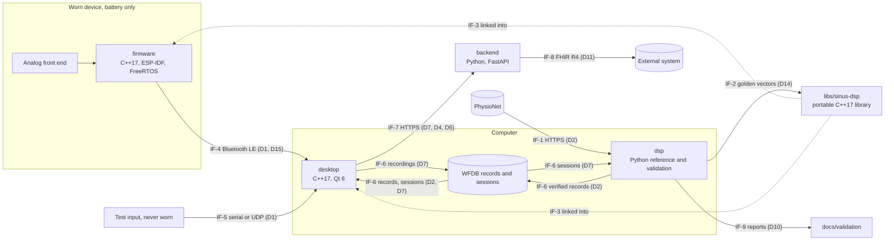
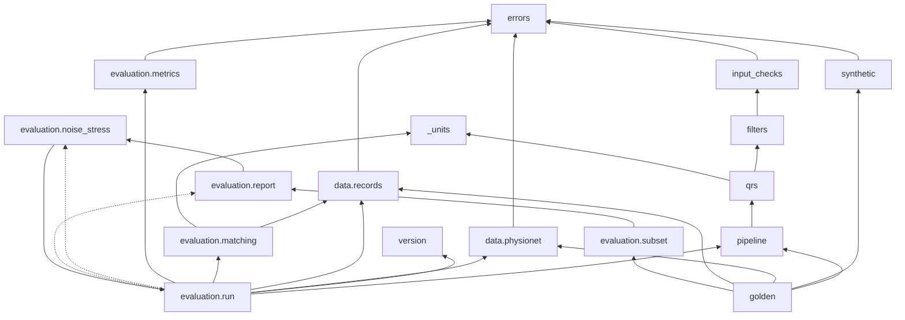
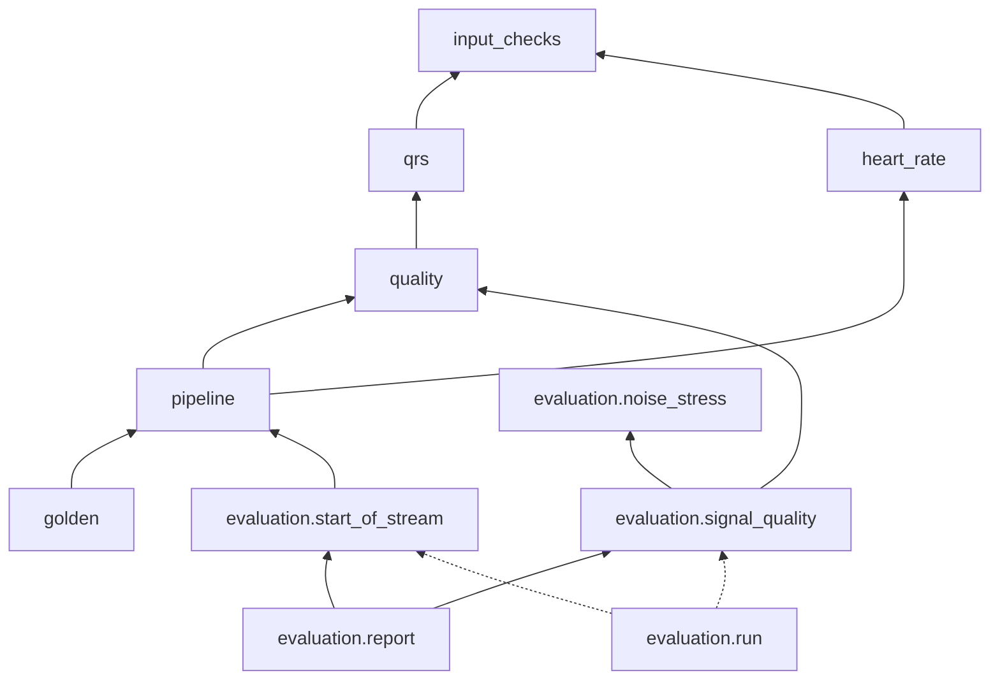

# Software architecture

_Inspired by IEC 62304 §5.3 (architectural design) and §5.4 (detailed design). Version 0.3, 2026-10-07. Status: approved by the project owner up to v0.2.12 (sections 1 to 7 and 9 to 12 in v0.1 and the detailed design of §8 in v0.2 on 2026-09-29; the corrections of v0.2.2 on 2026-09-30; the corrections of v0.2.4 on 2026-10-01; the software identity and versioning rule of v0.2.6 on 2026-10-03; v0.2.8 is editorial; the readings of §8.10 and §8.14 of v0.2.9 on 2026-10-04; the changes of v0.2.10 and of v0.2.11 on 2026-10-05; the changes of v0.2.12 on 2026-10-06); v0.2.13 is editorial; **v0.3 (Milestone 2 detailed design of `dsp`, §13) is pending approval by the project owner**._

This document describes **how** Sinus is built:
- the software items and what each is responsible for;
- how the functions of [`functional-analysis.md`](functional-analysis.md) are allocated to them;
- the interfaces and data flows between them;
- the constraints on the portable real-time library;
- the golden-vector format;
- the SOUP of each item and the segregation between items.

Significant decisions are recorded as architecture decision records in [`docs/adr/`](../adr/README.md), and this document cites them.

The detailed design of each requirement (module, interface, algorithm with references, parameters, edge cases) is added milestone by milestone. For Milestone 1 it is in §8, which builds on the equivalence principle and the golden-vector format of §7. For Milestone 2, the reference side (`dsp`: the amplitude bound of SRS-003, detection marks and report timing, heart rate, signal quality, the new validation and report sections, golden-vector format version 2) is in §13; the design of the real-time library (`libs/sinus-dsp`) follows in a later version of this document.

## Conventions

- `FB-xx` (functional blocks), `Dx` (data flows), `US-x` (use scenarios) and `Fx.y` (features) are those of `functional-analysis.md`. `SRS-xxx` are requirements in [`srs.md`](srs.md), `HAZ-xxx` and `RC-xxx` hazards and risk controls in [`risk-analysis.md`](risk-analysis.md), `OP-xxx` open points in [`open-points.md`](open-points.md).
- Interfaces between software items are identified as `IF-1`, `IF-2`, … These IDs are stable and never reused.
- Identifiers in code carry their unit when the type does not: suffixes `_mv`, `_hz`, `_s`, `_ms`, `_bpm`, `_samples` (e.g. `fs_hz`, `delay_samples`), in Python and in C++.
- Every placeholder cites its open point. The detailed design of the items introduced by later milestones is written at the start of their milestone (`sdp.md` §3, activity 3); this version fixes only what the architecture needs now.

## Revision history

| Version | Date | Changes |
|---|---|---|
| 0.1 | 2026-09-29 | First version, replacing the Milestone 0 stub: software items, allocation of the functional blocks, interfaces and data flows, constraints of the portable real-time library, outlines of the firmware, desktop application and backend, equivalence principle and golden-vector format (SRS-015), Milestone 1 module structure of `dsp`, SOUP per item, segregation |
| 0.2 | 2026-09-29 | Detailed design of the Milestone 1 requirements SRS-001 to SRS-016 in §8 (closes OP-008): common conventions and error classes; download and verification against pinned checksum lists; record loading; input validation; filter designs with computed gains and the settling rule for verification; causal Pan–Tompkins detection with delay compensation; EC57 matching as in the WFDB comparator `bxb` (closes OP-030); statistics; evaluation run and report formats; CI subset check and its stability across machines; golden-vector interfaces; implementation order. §7.1 points to the detector initialisation in §8.7.3 |
| 0.2.1 | 2026-09-29 | Detailed design (§8) approved by the project owner; EC57 scoring as `bxb` confirmed (decision recorded with OP-053) |
| 0.2.2 | 2026-09-30 | Corrections found while implementing §8.3 to §8.9 (pending approval by the project owner). **OP-058** (closed): §8.2, error table: an empty record selection is an `InvalidInputError`. §8.3: interface comments of `VerificationResult`; `fetch_https` and the new paragraph "Transport and redirects"; `select_files` (selection rule stated for any extension, empty selection rejected, `str` rejected, result sorted); new rule "The record selection is validated first"; `download_database` step 2 (temporary file `<name>.part~`, fetched content written whatever its digest); `describe_verification`; script arguments; edge cases; verification notes. §8.11: the six subset records have 28 listed files, not 24, and the list is given; size of the CI cache. **OP-059** (design side; the requirement wording stays open): §8.8, interface comments of `Episode` and `MatchResult`; §8.8.1: `vf_episodes` rejects annotations out of order, an episode without `]` ends at `max(start_sample, n_samples − 1)`, and the scored part of a record is defined; §8.8.2: step 1 (`reference_excluded` counts only beats at or after the start) and one more difference from `bxb` (episode without `]`); new §8.8.3 (what is not scored and how it is counted, accounting equalities, verification notes); §8.10: `RecordEvaluation` (`vf_episodes_scored` and `vf_samples_scored` replace `vf_samples`), new function `episode_coverage`, the paragraph "Figures on what is not scored", section 6 of the report and the verification notes. **OP-057** (part (b); part (a) stays open): §8.6, edge cases: the mains filter returns a constant input within rounding, not unchanged. §8.13: when the corrections to the modules already implemented are made. §12: OP-057 and OP-059 added |
| 0.2.3 | 2026-09-30 | Corrections of v0.2.2 approved by the project owner, including following redirects with integrity resting on the pinned checksum lists (OP-058 (e)). OP-059 closed by the SRS-012 wording of `srs.md` v0.5: §8.8.3 and §8.10 cite SRS-012 instead of the open point; §12 updated. OP-055 decided by the project owner (the heart-rate range of SRS-006 is bounded to 30–200 bpm; the detection design is unchanged): §8.7 edge cases state the limitation at short RR intervals and its cause, and the verification notes give the range. §8.2, error table: the `InvalidInputError` row also lists the argument errors of §8.8 and §8.9 |
| 0.2.4 | 2026-10-01 | Corrections found while implementing §8.10 (pending approval by the project owner). (1) §8.10: `evaluate_noise_stress` takes the verification outcome of the noise stress database as the keyword argument `nstdb`, which the results carry into the report; the database is still verified only by `run_validation`, before anything is evaluated. (2) §8.13: the dependency graph shows the two imports made inside a function (`evaluation.run` calls `evaluation.noise_stress` and `evaluation.report`, which import it), and states which imports it draws. (3) §8.2: new paragraph "Argument defaults" (no call in an argument default; a frozen default instance is a module-level constant); §8.10, §8.11: the public constant `DEFAULT_SETTINGS` is the default of every `settings` argument. (4) §8.11: the subset report names `subset_check.py` as its origin, and its paragraph is built from the evaluated record names and the database title. (5) §8.10: the format of sampling frequencies is removed (no section shows one). (6) §8.10, §8.8: the count of flutter-wave annotations outside the episodes covers the scored part of each record, like the other figures of the section on what is not scored; the introduction sentence of that section states that the episodes in the record are counted over the whole record. (7) §8.2: the error table lists the checks of the evaluation run, the noise stress test and the report rendering, which are design behaviours; §8.10 gives each check with its function, and the subset renderer also rejects results that hold a noise stress test. (8) §8.10: the complete text format of the report (headings, sentences, table columns, row labels, alignment and table syntax), so that the stored subset report of §8.11 is fully specified. (9) §8.4, edge cases: wfdb reads a header as ASCII text and drops other characters, and a header without units gives mV; the first stored signal is MLII in 45 records of the MIT-BIH Arrhythmia Database and V5 in records 102, 104 and 114 (v0.2.3 stated 46 records and 102 and 104). §8.2 Types: the type aliases are in the private module `_types`. §8.13: when the corrections of v0.2.4 are made |
| 0.2.5 | 2026-10-01 | Corrections of v0.2.4 approved by the project owner, including the count of flutter waves limited to the scored part of each record and the reworded introduction of report section 6. OP-056 decided by the project owner: no change of the detection rules in Milestone 1, so the Milestone 1 results stay untuned (`sdp.md` §6); a refractory test on the fiducial point only is not adopted; the age of the search-back candidate and the two-lobe fiducial are assessed in Milestone 2, with a listing of every false negative and false positive of the evaluation as input |
| 0.2.6 | 2026-10-02 | Software identity and versioning (OP-061; pending approval by the project owner). New §8.14: every report and golden vector states the package version and the SHA-256 digest of the package source, computed when it is produced, and the reports also state the versions of Python and of the runtime SOUP; the version follows the milestones (`0.N.0.dev0` while milestone N is in progress, `0.N.0` at its release, `0.N.P` for a later correction); checks in `traceability.py`, in the new release check `scripts/software_check.py` and, through the stored subset report, on every push. §7.3: header key `source_sha256`. §7.4: determinism stated with the software identity. §8.1: module `version` and script `software_check.py`. §8.10: `ValidationResults.software` replaces `software_version`; report section 2 gains the source digest in the row `Software` and a new row `Runtime`; determinism and verification notes. §8.11: `run_subset` states the software identity; when the stored subset report must be updated; stability across machines. §8.12: `GoldenVector.source_sha256`, `golden_vector` takes the software identity. §8.13: module `version` in the graph; when the changes of v0.2.6 are made. §12: OP-061 |
| 0.2.7 | 2026-10-03 | Software identity and versioning rule of v0.2.6 approved by the project owner, including the `Runtime` row of the reports (OP-061, implementation pending). The versioning of the C++ items is tracked by OP-062 |
| 0.2.8 | 2026-10-03 | Editorial, no design change. §8.14 is implemented (OP-061 closed), so the status line no longer says it is pending. §8.10 "Determinism" quotes the condition of SRS-009 as worded in `srs.md` v0.7. |
| 0.2.9 | 2026-10-03 | Readings of the implemented §8.14 where the design was silent, recorded as design behaviour (approved by the project owner on 2026-10-04; no behaviour or code change). §8.14: a folder of the package that cannot be listed, `package_dir` included, raises `OSError`; the shell command needs no `__pycache__` exclusion and gives the digest of the implemented package; `stale_software_rows` splits the text at line feeds and ignores a carriage return at the end of a line; the `Runtime` row when there is no runtime package; `software_check.py`: the files it reads and how, the path it prints, a `--folder` that is not a folder (exit status 2), a file that is not UTF-8, the count k; `traceability.py`: how `__version__` is read, the messages of the version rule, a version that cannot be read listed by both `--check` and `--release-gate`; the unit tests of the version rule are not left to OP-052. §8.10: the wording of the `Runtime` row; the public constant `RECORD_LIST_NAME`. §12: OP-052 added |
| 0.2.10 | 2026-10-04 | Approved by the project owner on 2026-10-05. (1) §8.11: the implemented formats of the subset check recorded as design behaviour: the difference entries (lines compared by position, `(no line)`, `(empty line)`, line endings, at most 20 entries then `… and <k> more`), an absent stored report handled by `check_subset_report` (`compare_reports` takes bytes), the options, messages and exit statuses of `subset_check.py` (1 also on a stored report that is not UTF-8 text, 2 on a usage error), the CI cache saved only when the job succeeds, the existing `.gitattributes` rule in place of a new line, the record list in the `needs_data` check; one code change: `--update` with `--write-regenerated` may name the stored report itself. §8.2: the attribute `differences` and the row `MalformedFileError` worded accordingly. (2) §8.2: new paragraph "Writing files": one private helper `write_atomically` in the new private module `_files` replaces the two copies in `data.physionet` and `evaluation.run` (which `evaluation.subset` imported as a private name), and is also used by the golden-vector export; §8.3 and §8.10 refer to it. (3) Golden vectors, reviewed before implementation against SRS-015 as worded in `srs.md` v0.7: §7.2: the record segments need the verified files of the six records (as in SRS-016), the beats and their positions computed on integers, the order in which the interference is added, the format of the input identifier, a tolerance for tests of the waveform; §7.3: fields, header values, `[coefficients]` rows, reference beats non-decreasing, the number syntax and every reader rule stated completely; §7.4: the determinism condition of SRS-015; §7.5: location, size, why the files are not stored, and the licence of the database (OP-064); §8.12: `synthetic_ecg` without a duration argument, `golden_vector` takes array-likes, `export_golden_vectors` takes a data folder (not `None`), verifies before writing anything, and each step, check and error is stated; the messages and exit statuses of `export_golden.py`; §8.2: `DataVerificationError` is not raised by the export, which skips the record segments instead, and the new `InvalidInputError` cases; `NonFiniteOutputError` can occur with a finite input of extreme amplitude (OP-063). (4) §8.1: files are written by the package functions whose design says so, not only by scripts; no module imports a private name of another, except `qrs._detect` in `pipeline`. §8.13: `synthetic` imports `errors`, not `input_checks`; `_files` is not drawn; group 9 and the changes of v0.2.10. §12: OP-063, OP-064 |
| 0.2.11 | 2026-10-05 | Approved by the project owner on 2026-10-05. (1) Licences of the databases (OP-064, resolution (c) decided by the project owner on 2026-10-05; the licence item of SRS-012 and SRS-014 in `srs.md` v0.7.2, which SRS-016 inherits). New §8.15: the licence of each database version, checked on its PhysioNet page, is a constant of the code next to its pinned checksum list (`DatabaseLicence`, `ODC_BY_1_0`, `Database.licence`, §8.3); the reports state it in a row `Database licence`, after the row `Database`, in report section 2 (MIT-BIH Arrhythmia Database, full and subset report) and in the table of the noise stress section (Noise Stress Test Database) (§8.10, §8.11); the notice and the citations that PhysioNet asks for, in README §Data sources and in `docs/validation/README.md`, are given literally. §7.5 refers to §8.15. (2) Readings of the implemented golden-vector export (§8.12) recorded as design behaviour: `records=None` rejected; the types that `render_golden_vector` accepts; header values encodable as UTF-8; the reasons of the reader errors are not part of the format, the line numbers are; argument types of `synthetic_ecg`; the order of the checks of `golden_vector`; `skipped` computed from `records`; the script prints its `written:` lines after the export has completed; scripts may import the private module `_files` (§8.1). (3) §7.3: the line that a reader names when a row count differs from the header; two code changes to the readers, so that the Python and C++ readers reject the same texts: an integer above 2⁶³ − 1 is rejected at its line, and so is a float that is not zero in its digits but converts to zero. (4) §8.11: an empty stored subset report has no line; the CI cache is visible only to runs of the branch that saved it, of the base branch of a pull request and of the default branch, so a push on a new branch can download the 28 files again. (5) §8.12 step 1 no longer quotes the SRS-015 wording of `srs.md` v0.7 ("where the verified database is available"); it states the condition as worded since v0.7.1, and that the record segments are written all or none, as the design already did (the wording that `srs.md` v0.7.2 proposes for SRS-015). §8.13: the changes of v0.2.11 |
| 0.2.12 | 2026-10-05 | Traceability checks (approved by the project owner on 2026-10-06; no change to `sinus_dsp`). New §8.16: corrections and clarifications of `scripts/traceability.py` found by its unit tests (OP-052, closed): the matrix states the outcome of the release gate, per milestone and in a new section `Release gate`; a test in the folder of the other verification level no longer counts as verifying (ADR 0004 §6); folders named `tests`, `test` or `test_apps` are not scanned as production code under the Python code roots either (ADR 0004 §1); a requirement mark in a file under `dsp/tests` that is not a test file fails `--check` (ADR 0004 §2); the Target of an open point must be `Mn` or `After Mn`; deleted requirements are not listed as requirements without tests; disabled and skipped tests: rule now, check with the first C++ tests (OP-066); the order of the items is kept. §8.14: the development-version item is what rejects a milestone still in progress, and the unit tests of the script are those of OP-052. §8.1: `traceability.py` cites §8.16. §8.13: the changes of v0.2.12. §9: the Python interpreter is SOUP of `dsp` (`soup.md`). §12: OP-066 |
| 0.2.13 | 2026-10-06 | Editorial, no design change. OP-064 closed on 2026-10-06; its Milestone 2 part, notices for golden vectors of record segments made public, continues as OP-067. §7.5 and §8.15 "Golden vectors" cite OP-067 instead of the Milestone 2 part of OP-064; §8.15 "Consequences of the change" records the closure. §12: OP-067 added; OP-064 stays listed, as closed open points do |
| 0.3 | 2026-10-07 | Milestone 2 detailed design of `dsp` (pending approval by the project owner), for `srs.md` v0.8. New §13: the 1000 mV bound of SRS-003 (OP-063); the detection trace with the start-up mark of SRS-022, the sample at which each detection is reported and the path that found it; the delays of the detection rules and the documented maximum of SRS-021 (OP-049); the heart-rate reference (SRS-024 to SRS-026); the signal quality index reference with its measures and threshold, fixed before any run on the reference databases (SRS-027, SRS-028); the evaluation of the start of real recordings, the signal quality index on the noise stress records and the new report sections (SRS-023, SRS-029, SRS-030), including the stretches of the noise stress records that carry added noise and reading records without annotation files; golden-vector format version 2 and eight synthetic event inputs (SRS-033); the wording of `docs/validation/README.md` (OP-069); implementation order. §2, §3: `dsp` also delivers in Milestone 2 (references of heart rate and signal quality). §5.2: no low-pass stage (OP-070), no adaptive canceller (F2.6, Milestone 4) and no decimator in Milestone 2. §7.2, §7.3: pointers to version 2. §8.2: `NonFiniteOutputError` cannot occur for an accepted input any more. §12 updated |

## 1. System context



## 2. Software items

| Item | Location | Language and platform | Milestones | Responsibility |
|---|---|---|---|---|
| **dsp**: reference implementation and validation pipeline | `dsp/` | Python 3.11 (NumPy, SciPy, wfdb) | M1; M2; M6 | Offline reference of signal conditioning and beat detection (M1), of the start-up marks, heart rate and signal quality index (M2); download and verification of the reference databases; EC57 evaluation, noise stress, start of real recordings, signal quality validation and reports; golden-vector export; later HRV and beat classification |
| **libs/sinus-dsp**: portable real-time signal-processing library | `libs/sinus-dsp/` | C++17, CMake; builds for the computer (host) and for the ESP32-S3 | M2 | The single real-time implementation of signal conditioning, beat detection, heart-rate tracking and signal quality, linked into the firmware and the desktop application |
| **firmware** | `firmware/` | C++17 on ESP-IDF with FreeRTOS; ESP32-S3 | M4 | Acquisition at 360 Hz, electrode contact, device state supervision, streaming over Bluetooth LE |
| **desktop**: desktop application | `desktop/` | C++17, Qt 6 (user-interface technology: OP-033); Windows, macOS, Linux | M3; M4 | Live view, signal status, recording, replay, test input, connection to the device |
| **backend** | `backend/` | Python, FastAPI | M5 | Storage of sessions for their owner, review data, HL7 FHIR R4 export |

- **dsp** is not part of the runtime system: it runs offline on a developer's computer and in CI. It is still treated as Class B software (`safety-class.md`), because it produces the validation evidence of RC-001 and RC-004 and the reference of RC-012.
- **libs/sinus-dsp** has no knowledge of its host: no I/O, no operating system, no framework (§5). The firmware and the desktop application wrap it; neither re-implements any of its functions.
- The **firmware** and the **desktop application** each separate the code that depends on hardware or on Qt from a core that depends on neither, and that core is built and tested on the host (§6).
- The **backend** does no signal processing (§6.3, §10).

Decisions: [ADR 0001](../adr/0001-mcu-and-firmware-framework.md) (ESP32-S3, ESP-IDF, FreeRTOS, C++17), [ADR 0002](../adr/0002-portable-cpp-dsp-library.md) (one portable C++17 library, Python reference, golden vectors), [ADR 0003](../adr/0003-qt-desktop-application-with-replay.md) (Qt 6 desktop application with replay), [ADR 0005](../adr/0005-device-sampling-rate-360-hz.md) (360 Hz).

## 3. Allocation of functions to software items

| Block | Implemented by | Milestone |
|---|---|---|
| FB-01 Signal acquisition | firmware (with the hardware): ADC sampling, calibration to mV, decimation to 360 Hz (§6.1) | M4 |
| FB-02 Transmission | firmware (Bluetooth LE GATT server) and desktop (client), IF-4 | M4 |
| FB-03 Session recording | desktop (WFDB files, IF-6) | M3 (replayed and test data); M4 (device) |
| FB-04 Reference data access | dsp (download and checksum verification, IF-1). The desktop replays only the verified local copy | M1 |
| FB-05 Input validation and signal status | dsp: offline input checks (SRS-003). libs/sinus-dsp: configuration checks and signal quality (M2). desktop: signal status, combining signal quality, electrode contact, interruptions and device state (M3, OP-020). firmware: electrode contact (M4) | M1 to M4 |
| FB-06 Signal conditioning | dsp: offline reference (M1). libs/sinus-dsp: real time (M2), run by the desktop (displayed results) and by the firmware (device-side results, §3.1) | M1; M2 |
| FB-07 Beat detection | As FB-06 | M1; M2 |
| FB-08 Heart rate | dsp: offline reference (M2, §13.5). libs/sinus-dsp: tracking from beat intervals (M2). desktop: display rules, withholding (M3, OP-071) | M2; M3 |
| FB-09 Heart-rate variability | dsp (offline) | M6 |
| FB-10 Beat classification | dsp (offline) | M6 |
| FB-11 Live display | desktop | M3 |
| FB-12 Session storage and review | backend (where the review takes place: OP-026) | M5 |
| FB-13 Export | backend | M5 |
| FB-14 Validation | dsp: EC57 and noise stress (M1), classification and HRV (M6). libs/sinus-dsp test suite: equivalence (M2). firmware and desktop: instrumentation for jitter, latency and lost samples, analysed offline (M4, OP-014) | M1; M2; M4; M6 |
| FB-15 Replay | desktop | M3 |
| FB-16 Signal quality index | dsp: offline reference and its validation on the noise stress records (M2, §13.6, §13.7). libs/sinus-dsp, run wherever FB-06 runs; its equivalence with the reference is checked on golden vectors (SRS-033, SRS-034). Display: OP-072 (M3) | M2 |
| FB-17 Reference output export | dsp (SRS-015, §7) | M1 |
| FB-18 Device state supervision | firmware; the state is shown by the desktop | M4 |

### 3.1 Where the real-time functions run

**Decision.** The desktop application is the only item that produces real-time results for the user:
- it runs the libs/sinus-dsp chain (FB-06, FB-07, FB-08 tracking, FB-16) on the samples it receives, whatever their source: device, replay or test input;
- it derives the signal status (FB-05) and the display (FB-11) from those results.

The device sends the **acquired** samples, not processed ones.

The firmware also runs the same library chain on the same samples, in its processing task. It sends the resulting beat positions and signal quality with the stream as **device-side results**. The desktop never displays them. It uses them in two ways:
- it compares them with its own results on the same samples, as a continuous check that the device and host builds agree (F2.10);
- it uses them to measure the processing delay on the device (F3.5, OP-014).

A discrepancy is counted and recorded with the session. It is not shown as a result.

**Rationale.**
1. Live data, replay and test input follow exactly the same path from D1 onwards. Verification by replay (FB-15, OP-007) therefore exercises the live processing path.
2. The recording holds the acquired samples, so a session can be reprocessed by the offline reference (US-3) and replayed.
3. There is one source of displayed results, and no arbitration between device and desktop results.
4. Running the chain on the device in real time shows that the library meets its real-time budget on the microcontroller (OP-049). It also checks the device build against the host build on real signals, beyond the golden vectors.
5. A failure of the device-side chain cannot change what is displayed; it can only raise a discrepancy. If the budget on the device proves insufficient, the device-side chain can be removed without changing any displayed output.

**Alternatives considered.**
- *Processing on the device only, with the desktop as a display.* Replay would then bypass the processing path, or need a second one, and recordings would hold processed data. Rejected.
- *Acquisition only on the device, with the library run on the ESP32-S3 only in a test image fed with golden vectors.* The firmware would be simpler. This remains the fallback if the device-side chain does not fit the budget; the test image is needed anyway (run in Espressif's QEMU emulator in CI, OP-051 closed).

## 4. Interfaces and data flows

### 4.1 Interfaces

| ID | From → to | Data | Transport and format | Milestone | Defined in |
|---|---|---|---|---|---|
| IF-1 | PhysioNet → dsp | D2: WFDB records and annotations, and the published SHA-256 checksum list | HTTPS download into `data/` (never committed) | M1 | SRS-001, SRS-013, SRS-016; §8 |
| IF-2 | dsp → libs/sinus-dsp tests | D14: golden vectors | Text files, format §7.3 (version 1, Milestone 1) and §13.8 (version 2, from Milestone 2) | M1 (export); M2 (use) | SRS-015, SRS-033; §7, §13.8 |
| IF-3 | libs/sinus-dsp → firmware, desktop | D3, D4, D5, D13 | In-process C++17 API | M2 | §5 |
| IF-4 | firmware → desktop | D1 (acquired samples, sample counter, packet sequence number, electrode contact, motion reference if present), D15 (device state), device-side results (§3.1) | Bluetooth LE GATT notifications; security in `cybersecurity.md` (OP-044) | M4 | §6.1 |
| IF-5 | test input → desktop | D1, in the frame format of IF-4 | Serial port or UDP (local host only by default); only for sources that are not worn (OP-038) | M3 | §6.2 |
| IF-6 | files on the computer | D2 (reference records), D7 (session recordings) | WFDB: header, signal and annotation files. Written by the desktop, read by the desktop (replay) and by dsp (offline analysis, US-3) | M3 | §6.2, OP-050 |
| IF-7 | desktop → backend | D7 with the derived D4 and D5; D9 on retrieval | HTTPS REST API | M5 | §6.3, `cybersecurity.md` |
| IF-8 | backend → external system | D11 | HL7 FHIR R4 JSON (content: OP-027) | M5 | §6.3 |
| IF-9 | dsp → `docs/validation/` | D10 | Markdown reports, regenerated by script, never edited by hand | M1 | SRS-009, SRS-012, SRS-014, SRS-016 |

The byte layout of IF-4 and IF-5 frames and the REST resources of IF-7 are designed at the start of Milestones 3 to 5. The architecture fixes their content (this table) and the rules of §4.2.

### 4.2 Common data conventions

- **Amplitude** in mV. Python uses float64. The C++ real-time path uses `float` (IEEE 754 binary32), because the ESP32-S3 floating-point unit is single precision. Values are converted to mV where they enter an item: by the ADC calibration on the device, by the stream scale in the desktop, by wfdb physical units in dsp.
- **Sampling frequency** in Hz: a parameter of every function and object that depends on it, never a global constant. The device samples at 360 Hz ([ADR 0005](../adr/0005-device-sampling-rate-360-hz.md)). Inputs are accepted from 125 Hz to 1000 Hz (SRS-003).
- **Time base**: sample index, where 0 is the first sample of the record or session; `numpy.int64` in Python, `std::uint64_t` in C++. Time in s is index / sampling frequency.
- **Beat position**: the sample index of the detected QRS complex in the source time base (D4). RR intervals in ms are computed only between beats of the same continuous segment.
- **Continuous segment**: the desktop splits a stream into segments at every gap (samples lost, device restart). It resets the processing chain at the start of each segment, and never computes beat intervals or heart rate across a gap (RC-014).
- **Heart rate** in bpm, always with a validity flag and, when withheld, the reason (D5). **Signal status**: usable or not usable, with the reason (D12).
- **Data source**: device, replay (with the record or session name) or test input. It travels with every frame, from the source to the display and into the recording (RC-015).

### 4.3 Data flow by operating mode

- **Offline validation (M1, US-1).**
  1. dsp downloads and verifies the records (IF-1).
  2. For each record: load, check the input, condition, detect.
  3. It matches the detections with the reference annotations, computes the statistics and writes the report (IF-9).
  4. The same chain exports the golden vectors (IF-2).
- **Replay (M3, US-9).** The desktop reads a verified reference record or a recorded session (IF-6). It emits D1 frames tagged "replay: <name>" at the original sampling rate, paced by a monotonic clock. From there, the frames follow the live path.
- **Live (M4, US-2, US-4).**
  1. On the device: acquisition task → processing task (device-side results) → transmission task → Bluetooth LE (IF-4).
  2. On the desktop, the stream decoder checks sequence numbers and the sample counter and marks gaps.
  3. The libs/sinus-dsp chain processes each continuous segment.
  4. The signal status is derived, the view is updated and the session is recorded (IF-6).
- **Upload and export (M5, US-6, US-7).** The desktop uploads a recorded session with its derived beats and heart rate (IF-7). The backend stores it for its owner and exports FHIR R4 `Observation` resources (IF-8).

## 5. Portable real-time library (`libs/sinus-dsp`)

### 5.1 Constraints

| Constraint | Checked by |
|---|---|
| C++17 and its standard library only. No ESP-IDF, FreeRTOS, Qt or operating-system headers | Host build with the standard library only; static analysis of includes |
| No dynamic memory anywhere in the library: no `new`, `delete` or `malloc`, and no allocating standard containers. All state lives inside objects of fixed size; capacities are compile-time constants sized for the highest supported sampling frequency (1000 Hz) | A host test that fails on any heap allocation during construction, configuration and processing |
| No exceptions and no RTTI: errors are returned as values. Built with `-fno-exceptions -fno-rtti` (GCC, Clang) on every target | Build flags on every target |
| Deterministic: no global mutable state, no clocks, no random numbers, no I/O. The same input sequence gives the same output on a given build | Review; equivalence tests |
| The real-time path computes in `float`; `double` is used only at configuration time (filter design). Implicit promotion to `double` is a compile error | `-Wdouble-promotion -Wfloat-conversion` treated as errors |
| Bounded work per sample, independent of the signal content. A bounded delay per stage, reported by the object | Worst-case timing on the ESP32-S3 against the budget (OP-049) |
| One object per signal, used from one thread; no internal locking; objects are independent of each other | Review |
| The same source code and the same results on every target: no target-specific code paths. A target-optimised kernel would need its own equivalence tests | Equivalence tests on the host and on the ESP32-S3 in Espressif's QEMU emulator in CI (§7, OP-051 closed) |
| Coding standard, formatting and static analysis rules: OP-043 | CI |

### 5.2 Interface style

The interfaces themselves are designed with the Milestone 2 requirements; they follow these rules.

- Namespace `sinus::dsp`. Public headers are in `include/sinus/dsp/`. The CMake target is `sinus_dsp`, with the alias `sinus::dsp`.
- An object is **configured once** from a configuration value (sampling frequency in Hz, mains frequency and so on). Configuration validates the values, for example a sampling frequency within 125–1000 Hz and a mains frequency of 50 Hz or 60 Hz, and returns a status. An object that is not validly configured produces no output.
- An object then **processes one sample at a time**. Block functions only loop over the per-sample call and add no behaviour.
- **Events** (a detected beat, a completed signal-quality window) are reported with their sample index in the source time base. The delay between the sample being processed and the reported index never exceeds the documented maximum of the object.
- `reset()` returns an object to its initial state. The desktop calls it at the start of each continuous segment.
- Filters start in the initial state defined in §7.1, which the reference uses as well.

Content for Milestone 2 (functional-analysis.md v0.3 §5.2; `srs.md` v0.8), each reproducing a function of the Python reference:
- second-order-section filters (transposed direct form II) and their design;
- the conditioning chain of the reference: baseline wander, then mains notch (§7.1, §8.6). No low-pass stage: detection limits the band of its own input, and the removal of high-frequency noise is specified with the displayed waveform in Milestone 3 (functional-analysis.md F3.12, OP-070);
- streaming Pan–Tompkins detection with the rules of §8.7, the start-up mark and the report timing of §13.3;
- heart rate from beat intervals, as in §13.5;
- the per-window signal quality index of §13.6;
- a pipeline that composes them, used by both the firmware and the desktop application.

Not in Milestone 2: the polyphase decimator for the device's oversampled ADC, which serves acquisition and is specified with the device (Milestone 4); the adaptive interference canceller with a mains or motion reference (functional-analysis.md F2.6, Milestone 4, OP-041). A Kalman filter for the heart rate, planned in v0.1, is not used: §13.5 gives the reasons.

### 5.3 Build, integration and tests

- **Build.** CMake, with presets for the host (debug, release, coverage with sanitizers) and for the ESP32-S3.
- **Integration.**
  - The desktop build includes the library's CMake project.
  - The firmware includes it through an ESP-IDF component that registers the same sources (`firmware/components/sinus_dsp/`).
  - No source file is copied into another item.
- **Tests.** GoogleTest on the host: unit tests, requirement tests and the equivalence tests on the golden vectors (§7). Folders and tags follow [ADR 0004](../adr/0004-test-tagging-and-traceability-gates.md):
  - folders `libs/sinus-dsp/tests/{unit,requirements,system}/`;
  - a verifying test carries the comment `// Verifies: SRS-nnn` directly above its `TEST` macro, and only in `requirements/` or `system/`.
  - An equivalence test verifies a Milestone 2 equivalence requirement, and sits in the folder of that requirement's Verification level.
- **On-target tests.** On the ESP32-S3, a test image runs the same equivalence checks, in Espressif's QEMU emulator in CI (OP-051 closed).

## 6. Firmware, desktop application and backend (outline)

### 6.1 Firmware (Milestone 4)

**Structure.**
- **Adapters that depend on ESP-IDF:** ADC, electrode-contact inputs, battery measurement, the Bluetooth LE GATT server (NimBLE host, the ESP-IDF component for Bluetooth LE only), the task watchdog.
- **Core that does not depend on ESP-IDF:** packetizer, device state machine, ring buffers, stream counters. The core is built and unit-tested on the host with GoogleTest (`firmware/tests/`, ADR 0004).

**Tasks.** All tasks are created at start-up, with explicit priorities:

| Task | Priority (relative) | Function |
|---|---|---|
| Acquisition | Highest of the application tasks | Reads the ADC DMA frames: continuous mode, hardware-timed, at an integer multiple of 360 Hz ([ADR 0005](../adr/0005-device-sampling-rate-360-hz.md)). Converts to mV with the ADC calibration and decimates to 360 Hz with the library's anti-aliasing decimator. Reads electrode contact and numbers each sample with the sample counter |
| Processing | High | Runs the libs/sinus-dsp chain on each sample (device-side results, §3.1) |
| Transmission | Medium | Packs samples, device state and device-side results into frames with a sequence number and sends them as GATT notifications |
| Supervision | Low | Battery measurement; device state machine (normal, low battery, error; OP-035, OP-036) |

- **Cores.** Acquisition and processing run on one core; the Bluetooth LE host runs on the other.
- **Communication between tasks.** Single-producer single-consumer ring buffers of fixed capacity, allocated at start-up. Task notifications wake the consumer.
- **Buffer overflow.** A full buffer never blocks acquisition. The producer drops the new samples and counts them. The sample counter in the next frame shows the gap to the receiver (RC-014).
- **Memory.** Everything is allocated at start-up; nothing is allocated afterwards.
- **C++ build settings.** Exceptions and RTTI are disabled in the ESP-IDF configuration. The compiler warnings are those of the library.
- **Watchdog.** The acquisition, processing and transmission tasks are subscribed to the ESP-IDF task watchdog. Timeout and behaviour after a restart: OP-036.
- **Wired links.** No wired data or debug link is used in normal operation (OP-038). Firmware platform security (debug interfaces, secure boot, flash encryption, updates): OP-047.
- **Measurements.** Instrumentation for sampling-time jitter and latency is built in (OP-014).

### 6.2 Desktop application (Milestones 3 and 4)

**Layers.**

| Layer | Depends on | Content |
|---|---|---|
| `core` | C++17 and libs/sinus-dsp only (no Qt) | Stream frame model and the source interface; frame decoder with continuity check and gap marking; one processing chain per continuous segment; signal status (FB-05, OP-020); heart-rate display rules (FB-08, OP-021); cross-check of the device-side results; recording model |
| `io` | Qt | Sources: Bluetooth LE central (Qt Bluetooth, M4), serial port and UDP test inputs (Qt Serial Port, Qt Network, M3), replay (WFDB reader paced by a monotonic clock, M3). WFDB writer. WFDB implementation: OP-050 |
| `ui` | Qt Widgets or Qt Quick (OP-033) | Views and their presenters or view models. They render snapshots of the core state at the display rate and do no processing |

**Rules.**
- `core` is tested on the host with GoogleTest without Qt. Test folders: `desktop/tests/`, per ADR 0004.
- **Threading.** Sources and processing run outside the user-interface thread. The user interface reads snapshots at a fixed refresh rate. Queued Qt signal-slot connections cross the threads.
- **Sources.** All sources (device, replay, test input) implement the same interface and emit the same frames, tagged with the data source. Recordings of replayed or test data are marked as such (RC-015).
- **Replay** reads reference records only from the local copy verified by dsp (IF-1).
- **Test inputs** are off by default. UDP listens on the local host only unless the user changes it (`cybersecurity.md`).
- **Qt licensing.** Only Qt modules available under the LGPL-3.0 are used, linked dynamically, so that the application can be distributed with its Apache-2.0 code. Modules offered only under GPL or commercial terms (for example the chart modules) are not used. The waveform is drawn by the application. The licence of each module is checked when Qt is entered in the SOUP list.

### 6.3 Backend (Milestone 5)

- A FastAPI application in `backend/`, with its own uv project and the same Python tooling as `dsp` (`sdp.md` §5).
- **REST API over HTTPS (IF-7):**
  - upload a session (WFDB files, plus the beats and heart rate computed by the desktop);
  - list and retrieve one's own sessions;
  - export them as FHIR R4.
- **No signal processing.** The backend stores and serves the derived data computed by the desktop. It does not recompute them (§10).
- **Security.** Authentication, owner-only access, encryption at rest, storage technology and GDPR notes are in `cybersecurity.md` and OP-016.
- **Open design points.** FHIR content: OP-027. Where a session is reviewed: OP-026.

## 7. Equivalence between the reference and the real-time library (SRS-015)

### 7.1 Principle: a causal reference

The Python reference implements the **same causal algorithms** as the real-time library:
- Filters are applied forward only; zero-phase (forward-backward) filtering is not used.
- Beat detection uses only the current and past samples, with a bounded look-back, like the streaming detector.
- The reference reports beat positions compensated for the known delays of its filters. The streaming detector reports the same compensated indices, later in time.

Both implementations therefore evaluate the same difference equations on the same samples, and their outputs are compared **sample by sample**, with no delay allowance. The two sides also share:
- **Filter design.** Coefficients are computed at configuration time from the sampling frequency and the settings, in float64, with the same formulas.
- **Stage order.** Baseline wander removal (SRS-004), then mains interference removal (SRS-005), then beat detection (SRS-006) on the output of the mains stage. Removing the baseline first keeps the input of the notch small, which preserves precision in binary32.
- **Initial state.** Each second-order section starts in the steady state that a constant input equal to the first input sample would produce. For the baseline filter this gives zero output on a constant input, which avoids the start-up transient of an offset. The detector's initialisation is specified in §8.7.3 and is the same in both.
- **Precision.** The real-time library computes in binary32, the reference in binary64. The differences come from rounding and must stay within the tolerances of OP-005: conditioning output in mV, beat positions in samples.

**Trade-off.** A causal high-pass filter distorts the phase of the lowest ECG components (ST segment, T wave), which a zero-phase reference would avoid. Sinus makes no claim on ST-segment or morphology measurements, and a causal reference makes the validation results (SRS-007) apply to the algorithm that actually runs in real time. The band criteria of SRS-004 and SRS-005 concern amplitude only and can be met by causal filters.

### 7.2 Input set

The command writes one file per input (SRS-015):

| Inputs | Parameters | Settings | Input identifier |
|---|---|---|---|
| 18 synthetic ECGs | Sampling frequency 250 Hz and 360 Hz × heart rate 40, 75 and 180 bpm × variant: `clean`, `bw-mains50`, `bw-mains60` | Mains 50 Hz for `clean` and `bw-mains50`; 60 Hz for `bw-mains60` | `syn-fs<fs>-hr<hr>-<variant>`, with the sampling frequency as a decimal integer and the heart rate with three digits, e.g. `syn-fs360-hr075-bw-mains60`, `syn-fs250-hr040-clean` |
| 6 record segments, only where the files of these records are available and verified against the pinned checksum list of the database (§8.3), as for SRS-016 | First 60 s of records 100, 105, 108, 119, 203 and 207 of the MIT-BIH Arrhythmia Database 1.0.0, first stored signal | Mains 60 Hz (the settings of SRS-007) | `mitdb-<record>-first60s`, e.g. `mitdb-100-first60s` |

If the files of the six records are not available or not verified, the record segments are skipped with a message naming them and the reason, and the synthetic files are still written. The export never downloads: the records are those already in the data folder (§7.5).

From Milestone 2 the set also holds eight synthetic event inputs (SRS-033), defined in §13.9.

**Synthetic ECG** (`sinus_dsp.synthetic`, deterministic, float64):
- **Duration and sampling.** 30 s; sample instants t_n = n / fs, for n = 0 … 30·fs − 1.
- **R-wave centres.** RR = 60 / heart rate (s). The R wave of beat k is centred on the sample r_k = ⌊(0.5 + k·RR)·fs + 0.5⌋, for every k ≥ 0 with 0.5 + k·RR ≤ 29.5 s. These r_k are the true beat positions of the input.
  - Both are computed on integers, so that no rounding decides a beat at the limit (at 180 bpm, 0.5 + 87·RR is exactly 29.5 s): with hr the heart rate in bpm and fs the sampling frequency as an integer, beat k exists if 60·k ≤ 29·hr, and r_k = ⌊(hr·(fs + 1) + 120·k·fs) / (2·hr)⌋ (integer division). These are the expressions above, exactly.
  - Each input therefore has 20 beats at 40 bpm, 37 at 75 bpm and 88 at 180 bpm, at both sampling frequencies.
- **Beat waveform.** Each beat is the sum of five Gaussian waves A·exp(−(t − t_c)² / (2σ²)), centred at t_c = r_k / fs + offset. To keep the waves in order at high heart rates, the P and T offsets and widths scale with s = √(RR / 1 s):

  | Wave | Offset from the R centre (ms) | Amplitude A (mV) | Width σ (ms) |
  |---|---|---|---|
  | P | −200·s | 0.15 | 25·s |
  | Q | −30 | −0.10 | 10 |
  | R | 0 | 1.00 | 10 |
  | S | +30 | −0.20 | 10 |
  | T | +280·s | 0.30 | 45·s |

- **Evaluation order.** The signal is evaluated on every sample, summing the beats in increasing k and the waves in the order P, Q, R, S, T. The order of the floating-point operations within one wave is not specified: a test of the waveform compares it with the formulas above within 10⁻⁹ mV, and compares the beat count and the positions r_k exactly. The equivalence tests do not depend on it, because every file holds its input (§7.3).
- **Interference variants** (SRS-010), added to the signal after all the beats, in this order:
  - `bw-mains50`: first the baseline wander 1.0 mV · sin(2π · 0.3 Hz · t), then the mains interference 0.2 mV · sin(2π · 50 Hz · t);
  - `bw-mains60`: the same with 60 Hz;
  - `clean`: nothing is added.

### 7.3 File format, version 1

Version 1 is the format of Milestone 1. From Milestone 2 the files are written in version 2 (§13.8), which keeps every rule of this section and adds the outputs of SRS-033; the readers accept version 2 only.

One UTF-8 text file per input, named `<input identifier>.golden.txt`. Lines end with a line feed. There is no byte-order mark, no empty line, and no space, tab or carriage return anywhere, and the file ends with one line feed after `[end]`. The fields of a row are separated by a comma. It contains a header followed by four sections, always in this order:

```
format=sinus-golden-vector
format_version=1
input_id=syn-fs360-hr075-bw-mains60
input_source=synthetic
input_parameters=duration_s=30;heart_rate_bpm=75;baseline_wander_hz=0.3;baseline_wander_mv=1.0;mains_hz=60;mains_mv=0.2
sampling_frequency_hz=360.0
mains_frequency_hz=60
software_version=0.1.0
source_sha256=d7cc8c5224968a1bb510508d3d14f62bbe6d228927713144e02dc00a6d443e29
stages=baseline,mains
n_samples=10800
n_beats=37
n_reference_beats=37
[coefficients]
stage,section,b0,b1,b2,a1,a2
baseline,0,…
mains,0,…
[signals]
input_mv,baseline_mv,mains_mv
…one row per sample…
[beats]
sample_index
…one row per detected QRS…
[reference_beats]
sample_index
…one row per true or annotated beat…
[end]
```

**Header.** One `key=value` line per key. The key is the text before the first `=`. The keys are always all present, in this order:

| Key | Content |
|---|---|
| `format`, `format_version` | Always `sinus-golden-vector` and `1` |
| `input_id` | Input identifier (§7.2); it matches `[A-Za-z0-9_-]+` |
| `input_source` | `synthetic`, or the slug of the database of a record segment (`mitdb`) |
| `input_parameters` | `name=value` pairs separated by `;`, in a fixed order; not empty, and without spaces, like every value. Synthetic: the generator parameters (§8.12). Records: `database=<slug>;database_version=<version>;record=<name>;signal=<channel>;start_sample=0;duration_s=60`, e.g. `database=mitdb;database_version=1.0.0;record=100;signal=0;start_sample=0;duration_s=60` |
| `sampling_frequency_hz` | Sampling frequency, a float (e.g. `360.0`), finite and positive |
| `mains_frequency_hz` | Mains setting, `50` or `60` |
| `software_version` | `sinus_dsp.__version__`, which follows the version rule of §8.14; not empty |
| `source_sha256` | SHA-256 digest of the package source (§8.14), 64 lowercase hexadecimal digits. With `software_version` it identifies the code that wrote the file |
| `stages` | Names of the conditioning stages in the order applied, separated by `,`: at least one, each matching `[a-z][a-z0-9_]*`, none twice. Version 1 is written with `baseline,mains`. A later milestone may add stages, which then get their own columns |
| `n_samples`, `n_beats`, `n_reference_beats` | Number of rows in `[signals]` (at least 1), `[beats]` and `[reference_beats]` (0 or more) |

**Sections.** Each section is a line with its name in brackets, then a line with its column names, then its rows.
- **`[coefficients]`.** Columns `stage,section,b0,b1,b2,a1,a2`. One row per second-order section of each stage, normalised so that a0 = 1 (a0 is not written): the stages in the order of `stages`, each with at least one row, its sections numbered from 0 in the order applied. Version 1 has the rows `baseline,0,…` and `mains,0,…`. It lets a C++ test check its own filter design separately from its filtering.
- **`[signals]`.** Columns `input_mv`, then `<stage>_mv` for each stage in the order of `stages` (version 1: `input_mv,baseline_mv,mains_mv`). One row per input sample, in order: the input in mV, then the output of each stage in mV.
- **`[beats]`.** Column `sample_index`. The detected QRS sample indices of SRS-006, strictly increasing.
- **`[reference_beats]`.** Column `sample_index`. For synthetic inputs, the R-wave centres r_k (§7.2). For records, the reference beat annotations (SRS-002) whose sample lies in the segment, `0 ≤ sample < n_samples`. They are in non-decreasing order: an annotation file only guarantees that (§8.4), although no two beats of the six records share a sample (checked on their annotation files). They are not needed for equivalence, but they let a test check detection on the same file.
- **`[end]`.** Marks a complete file. Nothing follows its line feed.

**Numbers.**
- A float64 value is written as Python's `repr()` of it, as a Python `float`: the shortest decimal string that converts back to the same float64 under correct rounding (e.g. `0.1`, `-1.2345e-05`, `-0.0`, `1e+16`, `5e-324`). It matches `-?[0-9]+(\.[0-9]+)?(e[+-][0-9]+)?`.
- Integers are written in decimal, without sign or leading zeros: `0|[1-9][0-9]*`.
- Non-finite values are never written. The export fails with an error naming the input if any output is not finite.

**Readers** (Python and C++) split the text at line feeds and reject a file, naming the first offending line:
- that is not UTF-8 text, holds a space, a tab or a carriage return, has an empty line, does not end with a line feed after `[end]`, or has anything after it;
- whose format or version is unknown;
- whose header lines are not `key=value` lines with the keys of the table above, all present, in that order, each once (the key is the text before the first `=`);
- whose header values break the rules of the table: `input_id`, `stages`, `mains_frequency_hz`, `source_sha256` (64 lowercase hexadecimal digits), `sampling_frequency_hz` (a float, finite and positive), the counts (integers; `n_samples` at least 1), or an empty `input_source`, `input_parameters` or `software_version`;
- whose sections are missing or out of order, or whose column lines differ from those given above for its `stages`;
- whose `[coefficients]` rows do not follow `stages` and the section numbering, or do not have seven fields;
- whose row counts differ from the header, or whose rows have the wrong number of fields;
- that contains a float that does not match the float syntax above (e.g. `1e16`, whose exponent has no sign, `1E+16`, `+1.0`, `.5`, `5.`, `inf`, `nan`), that is not finite once converted (e.g. `1e+999`), or that converts to zero although a digit of its significand (the part before `e`, or the whole text if it has no `e`) is not zero (e.g. `1e-400`; `0.0e-400` and `-0.0` are zero and accepted);
- that contains an integer that does not match the integer syntax, or that is greater than 2⁶³ − 1 (`9223372036854775807`);
- with a detected beat not greater than the one before it, a reference beat smaller than the one before it, or a beat of either section outside `[0, n_samples)`.

Floats are converted with Python's `float()` and C++'s `std::from_chars`, after the syntax check (each accepts forms that the other does not, such as `1_0` in Python). The two rules on the converted value (finite; not zero unless every digit of the significand is zero) give the same outcome whether a library returns infinity or zero, or reports the value as out of range (`std::errc::result_out_of_range`), so both readers reject the same texts. An integer is converted only after its syntax and its bound are checked, so that it fits `std::int64_t` in C++ and needs no further limit in Python. The writer never writes a text that these rules reject: `repr` of a finite float64 converts back to it, and every integer it writes is a count or an index of an array.

**The line named.** A reader reads the lines in file order and names the first line at which the text breaks a rule; a text that ends too early is named at its last line. A row count that differs from the header is named where the rows and the count disagree, not at the header line:
- with fewer rows than the count, at the line found where the next row is expected (the line of the next section, e.g. `[beats]` after `[signals]`, or `[end]` after `[reference_beats]`);
- with more rows than the count, at the first row after the count, where the line of the next section is expected.

The reason given with the line is free text that names the rule. It is not part of the format: the Python and C++ readers name the same line, but need not word the reason alike, and tests compare the line, the error class and the file, not the wording. Only the reason of a file that is not UTF-8 text is fixed (`not UTF-8 text`, with no line, §8.12).

### 7.4 Determinism and exact read-back

- **Determinism.** The content depends only on the input, the settings, the software identity (version and source digest, §8.14) and the computations of NumPy and SciPy on the computer that runs them. The file contains no dates, times, host names, user names, paths or random numbers, and nothing depends on the iteration order of an unordered collection. Two runs on the same computer and the same inputs, with the same software version and source code and the same versions of the third-party software used, therefore give byte-identical files: the condition of SRS-015. The same version and source digest mean the same source code (§8.14). A file does not state the versions of Python and of the runtime SOUP, which the reports state (§8.10): SRS-015 asks for the software version and the identifier of the source code, byte identity is required on one computer only, and CI compares the C++ library only with files written in the same run (§7.5).
- **Exact read-back.** Python's `float()` is correctly rounded, so reading back gives exactly the values computed (SRS-015). The C++ reader converts with `std::from_chars` (C++17), which the supported toolchains implement with correct rounding. Its unit tests check exact read-back of edge values: the smallest subnormal and the largest finite value, negative zero, and values that need 17 significant digits.
- **Across machines.** NumPy and SciPy results may differ in the last bits between machines or library builds. The tolerances of OP-005 absorb this, and CI always compares the C++ library with vectors generated in the same run from the same commit (§7.5).

### 7.5 Generation and use

- **Command.** From `dsp/`, run `uv run python scripts/export_golden.py`. The files go to `data/golden/` by default; an option sets another folder. The records are read from `data/` (option `--data-dir`); the export never downloads them, so the record segments are written only after the six records have been obtained, by `scripts/download_data.py --database mitdb --records 100 105 108 119 203 207` or by the subset check (§8.11). The logic is in `sinus_dsp.golden` (§8.12).
- **Size** (measured on a prototype of §8.12 on 2026-10-04). About 16 MB for the 24 files: 0.45 MB to 0.68 MB per synthetic file (7500 or 10800 rows), about 10 MB for the 18; about 1.0 MB per record segment (21600 rows), about 6 MB for the six. Header, coefficients and beats add a few kilobytes. The export takes a few seconds.
- **Not stored in the repository.** `data/` is ignored by git.
  - The files are regenerated deterministically on demand, and in CI from the commit under test (below).
  - Every file states the source digest (§8.14). Stored files would therefore change with every change of the package, like the stored subset report (§8.11): about 16 MB of text in every such change, for no information that the commit does not already hold.
  - Vectors of record segments are derived from the database, which the repository never holds (SRS-015). The licence of both PhysioNet databases used (MIT-BIH Arrhythmia Database 1.0.0 and MIT-BIH Noise Stress Test Database 1.0.0) is the Open Data Commons Attribution License v1.0 (checked on their PhysioNet pages on 2026-10-04 and 2026-10-05, §8.15). It allows copies, extracts and works produced from the data, with notices when they are made public: the licence and its address with a database extract that is conveyed publicly, and a notice that the content comes from the database, available under that licence, with a work produced from it that is used publicly. Storing the vectors would therefore be allowed with those notices; it is not done for the reasons above. The notices for what Sinus publishes are in §8.15: the validation reports, which are produced from both databases, state the licence of each, and README §Data sources and `docs/validation/README.md` carry the notice and the citations. In Milestone 1 the golden vectors are written only to the local data folder and are not published, so they need no notice. Whether a golden vector of a record segment is made public from Milestone 2 (for example as a CI artifact of the public repository), and with which notices, is decided with the CI design of Milestone 2 (OP-067).
- **In CI (from Milestone 2).** The Python build generates the vectors and passes them to the C++ equivalence tests as a build artifact of the same commit. The C++ library is therefore always compared with the current reference, and any change to the reference that the C++ library does not follow fails CI. The export exits successfully when it skips the record segments (§8.12), so the CI step designed at Milestone 2 must also make sure that none was skipped; the CI cache already holds the six records (§8.11).
- **On the ESP32-S3.** The on-target test image receives the same vectors, in Espressif's QEMU emulator in CI (OP-051 closed).

## 8. Milestone 1 detailed design of `dsp`

This section is the detailed design (IEC 62304 §5.4) of every Milestone 1 requirement, SRS-001 to SRS-016. §8.1 fixes the modules; §8.2 the conventions and errors shared by all of them; §8.3 to §8.12 give, per requirement, the module, the public interface, the errors, the algorithm with its references and parameter values, the edge cases, and what verification can rely on; §8.13 gives the implementation order; §8.14 the software identity that the reports and golden vectors state, and the versioning rule; §8.15 the licences of the reference databases and the notices that Sinus publishes with what it produces from them.

### 8.1 Module structure

| Module (`dsp/sinus_dsp/`) | Responsibility | Requirements |
|---|---|---|
| `__init__.py` | Package version (`__version__`, rule of §8.14) | — |
| `version.py` | Software identity written into reports and golden vectors: package version, SHA-256 digest of the package source, versions of Python and of the runtime SOUP (§8.14) | SRS-009, SRS-012; used for SRS-015, SRS-016 |
| `errors.py` | Exception hierarchy: one base class for all Sinus errors, and one subclass per error behaviour in the SRS (rejected input, failed data verification, malformed file, subset report mismatch) and in §7.3 (non-finite output), §8.2 | SRS-001, SRS-003, SRS-013, SRS-015, SRS-016 |
| `input_checks.py` | Input validation before filtering or detection | SRS-003 |
| `filters.py` | Design of the second-order sections and causal filtering: baseline wander and mains interference | SRS-004, SRS-005 |
| `qrs.py` | Pan–Tompkins QRS detection, causal, with delay compensation | SRS-006, SRS-010 |
| `pipeline.py` | The conditioning chain and detection in the order of §7.1, defined once and used by the evaluation and the golden-vector export | SRS-006, SRS-010, SRS-015 |
| `synthetic.py` | Deterministic synthetic ECG (§7.2) | SRS-015 |
| `golden.py` | Golden-vector writer and reader (§7.3) | SRS-015 |
| `data/physionet.py` | Download of a PhysioNet database version and verification against its SHA-256 checksum list. Network access goes through an injectable fetch function (the default uses the standard library), so that tests need no network. The licence under which each database version is published (§8.15) | SRS-001, SRS-013, SRS-016; the licence: SRS-012, SRS-014 |
| `data/records.py` | Loading a record, a channel and its beat and non-beat annotations with wfdb | SRS-002 |
| `evaluation/matching.py` | EC57 beat-by-beat matching | SRS-008 |
| `evaluation/metrics.py` | TP, FN, FP, Se and +P, per record, gross and average | SRS-011 |
| `evaluation/run.py` | Runs detection and evaluation on a set of records with given settings | SRS-007, SRS-009, SRS-014, SRS-016 |
| `evaluation/noise_stress.py` | Noise stress record set, SNR per record, aggregation per SNR | SRS-014 |
| `evaluation/report.py` | Deterministic Markdown rendering of the full report and of the subset report | SRS-009, SRS-012, SRS-014, SRS-016 |
| `evaluation/subset.py` | Comparison of the regenerated subset report with the stored one, naming the differences | SRS-016 |

| Script (`dsp/scripts/`) | Runs |
|---|---|
| `download_data.py` | Download and verification of the MIT-BIH Arrhythmia and Noise Stress Test databases into `data/` |
| `validate.py` | The full validation report, `docs/validation/qrs-ec57-report.md` (SRS-009) |
| `subset_check.py` | The CI subset check: regenerates the subset report and compares it with `docs/validation/qrs-ec57-subset-report.md` (SRS-016) |
| `export_golden.py` | The golden-vector export (SRS-015) |
| `software_check.py` | The release check that every report in `docs/validation/` states the current software (§8.14) |
| `traceability.py` | The traceability matrix, its checks (including the version rule of §8.14) and the release gate (ADR 0004; corrections and clarifications in §8.16) |

**Rules for `dsp`.**
- Scripts are thin command-line wrappers: argument parsing, paths, messages, exit codes. The logic they run lives in `sinus_dsp`, where tests import it without running a command.
- Every function that depends on the sampling frequency takes it as an argument (`fs_hz`). Signals are `numpy.typing.NDArray[numpy.float64]` in mV; indices are `numpy.int64`.
- Signal-processing functions are pure: no global state, no I/O and no printing. Only scripts print messages. Files are written only by the functions whose design says so (downloads, §8.3; reports, §8.10 and §8.11; golden vectors, §8.12), always with `write_atomically` (§8.2).
- The algorithms are written so that they port to the C++ library: causal filtering with second-order sections (`scipy.signal.sosfilt`, same difference equations); detection decisions taken on candidate peaks in time order, with bounded look-back; no zero-phase filtering and no whole-signal statistics in the detection logic.
- Data folders: `data/mitdb/`, `data/nstdb/`, `data/golden/`, all ignored by git.
- Private helpers shared by several modules (e.g. the time-to-samples conversions of §8.2) may go in private modules whose names start with `_` (e.g. `sinus_dsp/_units.py`). Their content is fixed by this section; they add no public interface. A module does not import a private name (`_name`) of another module that is not such a private module; the one exception is `qrs._detect`, the detection without input check, which `pipeline` calls after checking the input once (§8.7); from v0.3 it is `qrs._trace`, which also returns the trace (§13.3). The private modules are `_types` (type aliases), `_units` (conversions of times to samples) and `_files` (writing files), all in §8.2. The scripts of `dsp/scripts/` follow the same rule: they may import the names of a private module, and no private name of another module. One does: `subset_check.py` writes the copy of the updated stored report with `_files.write_atomically` (§8.11).

### 8.2 Common conventions and errors

**Types.** `FloatArray = numpy.typing.NDArray[numpy.float64]` (signals in mV, one dimension) and `IndexArray = numpy.typing.NDArray[numpy.int64]` (sample indices, strictly increasing unless stated), both defined in the private module `sinus_dsp._types`. Public functions accept signals as `numpy.typing.ArrayLike` and convert them once, in the input check (§8.5). They never modify an array they receive, and return new arrays.

**Argument defaults.** An argument default is never a call (the linter rule B008 rejects it, because the call is evaluated once, when the function is defined). A default that is an instance of a frozen dataclass is a module-level `Final` constant, named in the interface and shared by every function that uses it; sharing it is safe because the instance cannot change. The default evaluation settings are `DEFAULT_SETTINGS` of `evaluation.run` (§8.10), also used by `evaluation.subset` (§8.11). Defaults that are constants (`MITDB`, `SUBSET_RECORDS`) or functions (`detect_beats`, `load_record`, `fetch_https`) follow the same rule.

**Times in samples.** Parameters are stated in seconds or Hz and converted to samples at configuration, from the sampling frequency `fs_hz`:
- `round_samples(t_s, fs_hz) = floor(t_s · fs_hz + 0.5)`: round half up, the rule of the WFDB function `strtim`. Used unless stated otherwise.
- Where a requirement states a bound ("at most 150 ms", "at least 200 ms"), the conversion keeps the bound exact: `floor(t_s · fs_hz)` for "at most", `ceil(t_s · fs_hz)` for "at least". Each use is named in its section.
- The products are computed as `t_ms · fs_hz / 1000` with `t_ms` an integer number of milliseconds (e.g. `150 · fs_hz / 1000`), which is exact in binary64 for every integer `fs_hz` up to 1000 Hz. At 360 Hz and 250 Hz every value in this section is therefore exact.

**Determinism.** Everything that feeds a detection decision, a report or a golden vector is computed in a fixed order:
- recursive and FIR filters with `scipy.signal.sosfilt` and `scipy.signal.lfilter`, which evaluate their difference equations sample by sample;
- sums and means of floating-point values with `math.fsum` (correctly rounded, so independent of the machine), never with `numpy.sum` or `numpy.mean`, whose pairwise and SIMD summation order may differ between NumPy builds;
- maxima with `numpy.max` and `numpy.argmax` (exact; `argmax` returns the first index of the maximum, which is the tie rule everywhere in this section);
- no iteration over unordered collections (`set`, `dict` built from them) where the order reaches an output; record and file lists are sorted.

**Writing files.** Every file that the package writes (downloaded files and checksum lists, §8.3; reports, §8.10 and §8.11; golden vectors, §8.12) is written by `write_atomically(path: Path, content: bytes) -> None` of the private module `sinus_dsp._files`. It creates the folder of `path` and its parents if needed, writes `content` to `<name>.part~` in that folder (`PART_SUFFIX: Final = ".part~"`, in the same module), then replaces `<name>` with it (`os.replace`). A file under its final name is therefore always complete; a `.part~` file left by an interrupted run is overwritten by the next write of that file. Errors of the file system propagate (`OSError`). This one helper replaces the identical private copies of `data.physionet` and `evaluation.run`, the second of which `evaluation.subset` imported (v0.2.10).

**Requirement citations.** Each public function cites in its docstring the requirement IDs it implements, and only those. Citing an ID claims the requirement as implemented, so CI fails until the verifying test tagged with that ID exists on the same branch (ADR 0004 §6). Developer and QA changes for a requirement therefore land together (§8.13).

**Errors** (`sinus_dsp.errors`). Every error that the software raises on purpose derives from `SinusError`. There is one class per error behaviour:

| Class | Bases | Raised when | Attributes | Requirements |
|---|---|---|---|---|
| `SinusError` | `Exception` | Never raised directly; lets a caller catch every Sinus error | — | — |
| `InvalidInputError` | `SinusError`, `ValueError` | An input or argument is rejected: the checks of §8.5, a mains frequency other than 50 or 60 Hz, a channel that the record does not have, signal units other than mV, an invalid record name or an empty record selection (§8.3), annotation, reference or detection samples out of order and a negative match window or start sample (§8.8), invalid counts or duplicate record names (§8.9); in the evaluation (§8.10): record names to evaluate given as a `str`, invalid or given twice, a record loaded with a channel other than that of the settings, a negative or non-integer count or a target outside 0 to 10000 in `meets_target`, evaluations of the MIT-BIH Arrhythmia Database that do not hold records 118 and 119 exactly once for the noise stress comparison, a name that is not a noise stress record name, results of the wrong kind given to a report renderer; in the golden-vector export (§8.12): no record selection (`records=None`), a sampling frequency, heart rate or variant that the synthetic generator does not list, an input identifier, source or parameters or reference beats that `golden_vector` rejects, a golden vector that `render_golden_vector` cannot write as a valid file, a record shorter than its 60 s segment | — | SRS-003; also SRS-002, SRS-005 |
| `DataVerificationError` | `SinusError` | A database, or the requested records of it, is not verified: a listed file is missing or its SHA-256 differs, or the checksum list itself is missing or differs from its pinned digest (§8.3). Also raised, before anything is written, by the commands that need verified data (§8.10, §8.11). The golden-vector export does not raise it: it skips the record segments and states the reason (§8.12) | `database: str` (e.g. `mitdb 1.0.0`); `missing: tuple[str, ...]` and `mismatched: tuple[str, ...]`, relative paths sorted in code-point order | SRS-001, SRS-012, SRS-013, SRS-014, SRS-016 |
| `MalformedFileError` | `SinusError`, `ValueError` | A file does not follow its format: a golden-vector file that a reader rejects, including one that is not UTF-8 text (§7.3, §8.12), a checksum list (§8.3), an annotation file whose sample indices decrease (§8.4), a record list `RECORDS` that is not UTF-8 text, names an invalid record or a record twice, or names none (§8.10), a stored subset report that differs from the regenerated one and is not UTF-8 text (§8.11) | `path: str`; `line: int | None` (1-based); `reason: str` | SRS-015; also SRS-001, SRS-002, SRS-016 |
| `SubsetReportMismatchError` | `SinusError` | The regenerated subset report differs from the stored one (§8.11) | `differences: tuple[str, ...]`: one entry per differing line, at most 20, then the entry `… and <k> more`; or the single entry `no stored report: <path>` (formats in §8.11) | SRS-016 |
| `NonFiniteOutputError` | `SinusError` | The golden-vector export finds a value that is not finite (§7.3). With the inputs of §7.2 this cannot happen; with a finite input of extreme amplitude the filters could overflow (OP-063). From v0.3 the input check rejects every sample beyond 1000 mV (§13.2), so no accepted input can produce such a value; the check stays as a guard of the file format | `input_id: str` | SRS-015 |

The checks of §8.8, §8.9, §8.10 and §8.12 named in the table that no requirement states are design behaviours: they guard the preconditions of internal functions, whose inputs come from verified functions, and the developer's unit tests verify them.

The message of every error is deterministic and names what failed. `DataVerificationError` formats as `<database> not verified: missing: <a>, <b>; checksum mismatch: <c>` (a part is omitted when empty). Errors raised by the standard library or by SOUP for conditions that the software does not check itself (for example `OSError` when a file cannot be read, or an error of `wfdb` on a corrupted header) propagate unchanged.

### 8.3 Download and verification of a database (SRS-001, SRS-013; used by SRS-016)

**Module.** `sinus_dsp.data.physionet`. Script: `scripts/download_data.py`.

**Source.** PhysioNet publishes each database version under `https://physionet.org/files/<slug>/<version>/`, together with `SHA256SUMS.txt`: one line per file of the version, `<64 hexadecimal digits> <relative path>`, paths separated by `/`. The MIT-BIH Arrhythmia Database 1.0.0 lists 704 files (the 48 records, the documentation folder `mitdbdir/` and the folder `x_mitdb/`); the Noise Stress Test Database 1.0.0 lists 97 files (with the folder `old/`). SRS-001 and SRS-013 require every listed file.

**Pinned checksum lists.** The digest of each list is pinned in the code. Versions on PhysioNet are immutable, so the list of a version never changes; the pin protects against a list altered in transit or on the server, and makes verification independent of the network. The digests below were computed on 2026-09-29 from the lists served by PhysioNet:

| Constant | `slug` | `version` | `title` | SHA-256 of `SHA256SUMS.txt` |
|---|---|---|---|---|
| `MITDB` | `mitdb` | `1.0.0` | MIT-BIH Arrhythmia Database | `b61158a96d5f2ca80edfb354a9a66a6324836c390a84e1966dcee2b907d6be43` |
| `NSTDB` | `nstdb` | `1.0.0` | MIT-BIH Noise Stress Test Database | `b76bd98c5111439fcfff2f410afd70d64e79f072049c45b5a9916a3044fdb84f` |

If PhysioNet ever serves a different list for these versions, download and verification fail with an error naming `SHA256SUMS.txt`, and the pin is updated only after the change has been reviewed.

**Licence.** Each `Database` also carries the licence under which PhysioNet publishes that version, which the reports state (SRS-012, SRS-014; §8.15). Both versions are published under the same licence, the constant `ODC_BY_1_0`: name `Open Data Commons Attribution License v1.0`, address `https://opendatacommons.org/licenses/by/1-0/` (checked on 2026-10-05, §8.15). The licence is part of the definition of the database version, like its pinned checksum list, and is reviewed in the same way if PhysioNet ever states another one.

**Interface.**

```python
PHYSIONET_FILES_URL: Final = "https://physionet.org/files"
CHECKSUM_LIST_NAME: Final = "SHA256SUMS.txt"

@dataclass(frozen=True)
class DatabaseLicence:
    name: str                    # e.g. "Open Data Commons Attribution License v1.0"
    url: str                     # address of the text of the licence

ODC_BY_1_0: Final = DatabaseLicence(
    name="Open Data Commons Attribution License v1.0",
    url="https://opendatacommons.org/licenses/by/1-0/",
)

@dataclass(frozen=True)
class Database:
    slug: str                    # folder name on PhysioNet and under data/, e.g. "mitdb"
    version: str                 # e.g. "1.0.0"
    title: str                   # e.g. "MIT-BIH Arrhythmia Database"
    checksum_list_sha256: str    # pinned digest of SHA256SUMS.txt, 64 lowercase hex digits
    licence: DatabaseLicence     # licence under which PhysioNet publishes this version (§8.15)

MITDB: Final[Database]           # licence=ODC_BY_1_0
NSTDB: Final[Database]           # licence=ODC_BY_1_0

FetchFunction = Callable[[str], bytes]   # URL -> file content; raises OSError on failure

@dataclass(frozen=True)
class VerificationResult:
    database: Database
    records: tuple[str, ...] | None      # None: the whole database was verified; otherwise the
                                         # record names, sorted in code-point order, each once
    files: tuple[str, ...]               # relative paths verified, sorted in code-point order,
                                         # each once; never empty

def fetch_https(url: str) -> bytes: ...
def database_url(database: Database) -> str: ...          # ".../files/<slug>/<version>/"
def parse_checksum_list(text: str, source: str) -> dict[str, str]: ...
def select_files(checksums: Mapping[str, str], records: Sequence[str] | None) -> tuple[str, ...]: ...
def verify_database(database: Database, data_root: Path, *,
                    records: Sequence[str] | None = None) -> VerificationResult: ...
def download_database(database: Database, data_root: Path, *,
                      records: Sequence[str] | None = None,
                      fetch: FetchFunction = fetch_https) -> VerificationResult: ...
def describe_verification(result: VerificationResult) -> str: ...
```

`data_root` is the data folder (default for scripts: `data/` at the repository root); the database lives in `data_root / database.slug`, e.g. `data/mitdb/`.

**Behaviour.**
- `fetch_https` accepts only URLs that start with `https://` (otherwise `ValueError`), opens them with `urllib.request.urlopen` and a timeout of 60 s, and returns the whole body. It raises `OSError` (including `urllib.error.URLError` and `HTTPError`) for any failure or a status other than 200. No retries: re-running the command resumes, because verified files are skipped. Redirects are followed, as `urlopen` does; what the design guarantees in that case is stated under "Transport and redirects" below.
- `parse_checksum_list` reads one entry per non-empty line, matching `^([0-9a-fA-F]{64}) [ *]?(\S+)$` (the `sha256sum` formats); digests are stored in lowercase. Each path must be relative, with `/` separators, and each component must match `[A-Za-z0-9._+-]+` and differ from `.` and `..`. A line that does not match, an unsafe path, a duplicate path or an empty list raise `MalformedFileError` naming `source` and the line. This keeps a listed name from writing outside the database folder.
- `select_files` returns every listed path when `records` is `None`. Otherwise:
  - `records` is a sequence of at least one record name, each a `str` that matches `[A-Za-z0-9_]+` in full. A `str` given in place of the sequence, an empty sequence and an invalid name each raise `InvalidInputError`. A name given several times counts once.
  - For each record, the selection holds every listed top-level path (one without `/`) that starts with `<record>.` and continues with at least one more character, whatever that extension is: `100.atr`, `100.dat`, `100.hea` and `100.xws` for record 100, and also `108.at_` for record 108. The rule selects every file that the database publishes under the name of the record, which is what SRS-016 asks to verify ("each of their files"); it does not list extensions, so it holds for any database.
  - A record with no such file is reported as missing under the name `<record>.*`, which no listed path can equal (`*` is not allowed in a listed path).
  - The result is sorted in code-point order and holds each path once. It is never empty: the list has at least one entry, and every record contributes at least one path or its placeholder.
- **The record selection is validated first.** `verify_database` and `download_database` apply the rules above to `records` before anything else: before the database folder is created, and before the checksum list is read or fetched. An invalid selection therefore raises `InvalidInputError` whatever the state of the data folder and of the network, and neither creates nor changes any file. An empty selection is rejected rather than verified, because "verified: 0 files" would report as verified a database of which nothing was checked.
- `verify_database` never uses the network:
  1. It reads `data_root/<slug>/SHA256SUMS.txt`. If it is absent, `DataVerificationError` with `missing=("SHA256SUMS.txt",)`. If its SHA-256 differs from `checksum_list_sha256`, `DataVerificationError` with `mismatched=("SHA256SUMS.txt",)`.
  2. It parses the list and selects the files.
  3. For each selected file, it computes the SHA-256 of the file's bytes (read in blocks of 1 MiB with `hashlib.sha256`). A path that is not a regular file is missing; a digest that differs is a mismatch.
  4. If anything is missing or mismatched, it raises `DataVerificationError` naming every such file (both lists complete and sorted). Otherwise it returns the `VerificationResult`.
- `download_database` creates the database folder, then:
  1. Uses the local `SHA256SUMS.txt` if its digest equals the pin; otherwise fetches it from `database_url(...)`. A failed fetch raises `DataVerificationError` naming the list as missing; a fetched list whose digest differs from the pin raises it naming the list as mismatched, and the fetched list is not written.
  2. For each selected file, skips it if the local copy already has the listed digest; otherwise fetches it and writes it atomically (`write_atomically`, §8.2: write to `<name>.part~` in the same folder, then `os.replace`), creating subfolders as needed. The checksum list of step 1 is written the same way. The suffix contains `~`, which no listed path can contain (`parse_checksum_list`), so a temporary file never has the name of a listed file, and two listed files never share a temporary file. A failed fetch (`OSError`) is not raised here: the file stays absent or outdated, and the final verification names it. The fetched content is written whatever its SHA-256: if it differs from the listed one, the final verification names the file as mismatched, and the next run fetches it again.
  3. Returns `verify_database(database, data_root, records=records)`, which raises if any file is still missing or mismatched. The outcome is therefore always decided by the local verification, never by the download.
  - A `<record>.*` placeholder from `select_files` is never fetched; the verification reports it as missing.
- `describe_verification` returns the text written in reports: `verified: <n> files match the published SHA-256 checksum list (SHA256SUMS.txt, SHA-256 <digest>)`, followed for a subset by `; records <r1>, <r2>, …` (the names of `VerificationResult.records`, in their sorted order). `<n>` is the number of files verified, at least 1; it comes from the checksum list and is not a constant of the code.
- `scripts/download_data.py [--data-dir PATH] [--database mitdb|nstdb|all] [--records NAME ...]` calls `download_database` for each database (default: both, whole). `--records` takes at least one name and needs a single database; an invalid name, or the option without a name, is a usage error. The script prints the outcome of each database and exits with status 0 if all are verified, 1 on `DataVerificationError` or `MalformedFileError` (message on standard error), 2 on a usage error.

**Transport and redirects.** The integrity of the data does not depend on how it was transported:
- `fetch_https` requests an `https://` URL under `https://physionet.org/files/`. `urllib` follows the redirects that the server answers with (at most 10, to `http`, `https` or `ftp` URLs), so the body may come from another URL, another host, or a connection that is not HTTPS. The design gives no guarantee on the transport beyond that first request, and needs none.
- The checksum list is accepted only if its SHA-256 equals the digest pinned in the code. A fetched list with another digest is not written.
- A database, or a selection of its records, is reported as verified only by `verify_database`, which reads the local files and compares each with the SHA-256 that the accepted list gives for it. Every command that uses the data verifies it first (§8.10 to §8.12).
- A body that differs from the published file, whatever its origin (an altered response, a redirect to another server, a damaged cache), therefore ends as a checksum mismatch naming the file, never as verified data. It is written only under the listed path of that file, inside the database folder.
- Refusing redirects, or restricting them to `https://` URLs, was considered and not adopted: it would add no integrity, because no content is accepted without its digest, and it would make the download depend on how PhysioNet serves its files.

The corresponding security control is SC-5 of `cybersecurity.md`.

**Edge cases.** Stale `.part~` files from an interrupted run are overwritten. A file present on disk but not listed is ignored (neither verified nor reported); this includes a file named `<name>.part` left by a version of the software that used that suffix. Names are compared exactly; a case-insensitive file system cannot create a mismatch because PhysioNet names differ by more than case.

**Verification notes.** QA's tests need no network (SRS-001, SRS-013): they write a fixture folder with a few files and their `SHA256SUMS.txt`, build a `Database` whose `checksum_list_sha256` is the digest of that fixture list, and call `verify_database`; `download_database` can be exercised with a fake `FetchFunction` that serves the fixture bytes from a dictionary and raises `OSError` for anything else. The error names both the altered and the missing file in its message and in `mismatched` and `missing`. The rejection of an invalid or empty record selection is a design behaviour, checked by the developer's unit tests: with a data folder that does not exist and a fetch function that fails the test when called, `download_database` raises `InvalidInputError` and the data folder still does not exist.

### 8.4 Loading a reference record (SRS-002)

**Module.** `sinus_dsp.data.records`.

**Interface.**

```python
BEAT_SYMBOLS: Final[frozenset[str]] = frozenset(
    {"N", "L", "R", "B", "A", "a", "J", "S", "V", "r", "F", "e", "j", "n", "E", "/", "f", "Q", "?"})

@dataclass(frozen=True)
class Annotation:
    sample: int          # index in the record's time base
    symbol: str          # WFDB annotation mnemonic, e.g. "+", "~", "[", "]", "!"
    subtype: int         # WFDB subtyp field (e.g. the signal-quality bits of "~")
    aux_note: str        # auxiliary text (e.g. "(AFIB"), trailing NUL characters removed

@dataclass(frozen=True)
class Record:
    name: str
    channel: int
    signal_name: str             # e.g. "MLII", "V5"
    fs_hz: float
    signal_mv: FloatArray        # the channel, physical units, mV
    beat_samples: IndexArray     # non-decreasing
    beat_symbols: tuple[str, ...]
    other_annotations: tuple[Annotation, ...]   # every non-beat annotation, in file order

    @property
    def n_samples(self) -> int: ...

def load_record(record_path: Path, channel: int = 0, annotator: str = "atr") -> Record: ...
```

**Behaviour.**
- `record_path` is the record path without extension, e.g. `data/mitdb/100`. The signal is read with `wfdb.rdrecord(str(record_path), channels=[channel], physical=True, return_res=64)`. A channel outside `0 … n_sig − 1` (from the header) raises `InvalidInputError`. Units other than `mV` raise `InvalidInputError` naming them. The signal is copied into a contiguous float64 array.
- Annotations are read with `wfdb.rdann(str(record_path), annotator)` (attributes `sample`, `symbol`, `subtype`, `aux_note`). If the sample indices decrease anywhere, `MalformedFileError`. An annotation whose symbol is in `BEAT_SYMBOLS` goes to `beat_samples` and `beat_symbols`; every other annotation goes to `other_annotations`, in file order. The two lists together hold every annotation exactly once.
- `BEAT_SYMBOLS` are the 19 beat codes of SRS-002. They are the codes for which the WFDB library function `isqrs()` is true, except `!` (ventricular flutter wave), which `isqrs()` also counts; `!` stays a non-beat annotation, and §8.8 explains why the scoring result is the same.

**Edge cases.**
- An annotation file with no beat annotation gives empty beat arrays (`numpy.int64`, length 0). An annotation beyond the end of the signal is kept as it is.
- The channel number is not the signal name: the first stored signal is channel 0. In the MIT-BIH Arrhythmia Database it is MLII in 45 records and a modified V5 in records 102, 104 and 114 (in record 114 the two signals are stored in the reverse of the usual order; checked on the headers).
- **Units as wfdb reads them.** The units check compares the units that wfdb returns for the channel with `mV`, exactly.
  - A header that gives no units reads as `mV`, the default of the WFDB header format; the headers of the MIT-BIH Arrhythmia and Noise Stress Test databases give none, so their records load.
  - wfdb (4.3.1) reads a local header as ASCII text and drops every other character (`rdheader` opens it with `encoding="ascii", errors="ignore"`): units written `µV` read as `V`. Such a record is still rejected, but the error names `V`. Units that would read as `mV` only after the drop would be accepted. WFDB headers are ASCII text, and no header of the two databases contains a byte outside ASCII (checked on the 63 headers).
  - Input to OP-050: a C++ reader of WFDB headers keeps the units as written, so that its error names `µV` as such.

**Verification notes.** QA writes a synthetic record with `wfdb.wrsamp` (units `mV`, format 16 or 212) and an annotation file with `wfdb.wrann` (several beat codes, plus a `+` rhythm change with an aux note and a `~` signal-quality mark with a subtype). The loaded signal equals the written one within one quantization step (`1 / adc_gain` mV); beat and non-beat lists are as described above.

### 8.5 Input validation (SRS-003)

**Module.** `sinus_dsp.input_checks`.

**Interface.**

```python
MIN_FS_HZ: Final = 125.0
MAX_FS_HZ: Final = 1000.0
MIN_DURATION_S: Final = 10.0
MAINS_FREQUENCIES_HZ: Final = (50, 60)

def validate_input(signal_mv: npt.ArrayLike, fs_hz: float) -> FloatArray: ...
def validate_mains(mains_hz: int) -> int: ...
```

**Behaviour.** `validate_input` checks, in this order, and raises `InvalidInputError` at the first failure, with a message naming the check and the offending value:
1. `fs_hz` is a real number (not `bool`) and finite;
2. `125.0 ≤ fs_hz ≤ 1000.0` (bounds included);
3. the signal converts to a one-dimensional array of integer or floating-point kind (`numpy.asarray(...).dtype.kind` in `iuf`), else rejected;
4. the signal is not empty;
5. every sample is finite (`numpy.isfinite`); the message gives the number of non-finite samples and the index of the first;
6. the duration is at least 10 s: rejected if `n_samples < 10.0 · fs_hz` (exact for the values of SRS-003: 1250 samples at 125 Hz, 10000 at 1000 Hz).

It returns a new contiguous float64 copy of the signal. `validate_mains` accepts 50 and 60 (as `int`, or a `float` equal to them) and returns the `int`; anything else raises `InvalidInputError`.

**Where it is called.** At the start of every public function of SRS-004, SRS-005 and SRS-006: `remove_baseline_wander`, `remove_mains_interference`, `detect_qrs`, `run_pipeline` and `detect_beats` (§8.6, §8.7), before any other computation. These functions therefore return nothing for a rejected input. Internal stages called after the check do not check again.

**Verification notes.** The cases of SRS-003 map to exact sample counts: 9.99 s is `floor(9.99 · fs_hz)` samples (e.g. 3596 at 360 Hz), always rejected; 10 s at 125 Hz (1250 samples) and at 1000 Hz (10000 samples) are accepted. 124.9 Hz, 1000.1 Hz, NaN and ±infinity as the sampling frequency are rejected.

### 8.6 Baseline wander and mains interference filters (SRS-004, SRS-005)

**Module.** `sinus_dsp.filters`. The filters are causal second-order sections (§7.1, ADR 0002), designed in float64 with closed-form expressions that the C++ library reproduces.

**Interface.**

```python
BASELINE_CUTOFF_HZ: Final = 0.5
NOTCH_Q: Final = 30.0

def butterworth2_highpass_sos(cutoff_hz: float, fs_hz: float) -> FloatArray: ...   # shape (1, 6)
def butterworth2_lowpass_sos(cutoff_hz: float, fs_hz: float) -> FloatArray: ...    # shape (1, 6)
def notch_sos(notch_hz: float, q: float, fs_hz: float) -> FloatArray: ...          # shape (1, 6)
def baseline_sos(fs_hz: float) -> FloatArray: ...                 # butterworth2_highpass_sos(0.5, fs_hz)
def mains_sos(fs_hz: float, mains_hz: int) -> FloatArray: ...     # notch_sos(mains_hz, 30.0, fs_hz)
def initial_state(sos: FloatArray, first_sample: float) -> FloatArray: ...   # shape (n_sections, 2)
def apply_sos(sos: FloatArray, x: FloatArray) -> FloatArray: ...
def remove_baseline_wander(signal_mv: npt.ArrayLike, fs_hz: float) -> FloatArray: ...                 # SRS-004
def remove_mains_interference(signal_mv: npt.ArrayLike, fs_hz: float, mains_hz: int) -> FloatArray: ...  # SRS-005
```

SOS rows are `[b0, b1, b2, 1.0, a1, a2]` (a0 = 1), the layout of `scipy.signal.sosfilt` and of the golden-vector `[coefficients]` section. A design argument outside its range (`0 < cutoff_hz < fs_hz / 2`, `0 < notch_hz < fs_hz / 2`, `q > 0`) raises `InvalidInputError`.

**Design formulas** (float64, in this order of operations):
- **Second-order Butterworth** (bilinear transform with frequency prewarping, as `scipy.signal.butter`): `K = tan(π · cutoff_hz / fs_hz)`, `norm = 1 / (1 + √2 · K + K · K)`, `a1 = 2 · (K · K − 1) · norm`, `a2 = (1 − √2 · K + K · K) · norm`.
  - High-pass: `b0 = norm`, `b1 = −2 · norm`, `b2 = norm`.
  - Low-pass: `b0 = K · K · norm`, `b1 = 2 · K · K · norm`, `b2 = K · K · norm`.
  - These agree with `scipy.signal.butter(2, cutoff_hz, btype, fs=fs_hz, output="sos")` within 1e-15 at 125, 250, 360 and 1000 Hz (a unit test of the developer checks this within 1e-12).
- **Notch** (`scipy.signal.iirnotch`; S. J. Orfanidis, *Introduction to Signal Processing*, 1996, eqs. 11.3.4 to 11.3.7): `w = 2 · notch_hz / fs_hz`, `bw = (w / q) · π`, `w0 = w · π`, `beta = tan(bw / 2)`, `g = 1 / (1 + beta)`; `b = [g, −2 · cos(w0) · g, g]`, `a1 = −2 · g · cos(w0)`, `a2 = 2 · g − 1`. With this order of operations the coefficients equal those of `scipy.signal.iirnotch` bit for bit.

**Filtering and initial state.** `apply_sos` runs `scipy.signal.sosfilt(sos, x, zi=initial_state(sos, x[0]))`: transposed direct form II per section, forward only. `initial_state` is the steady state for a constant input equal to the first sample (§7.1), in closed form: for section `i`, with input level `u_0 = first_sample` and `G_i = (b0 + b1 + b2) / (1 + a1 + a2)`, `z1 = (b1 + b2 − (a1 + a2) · G_i) · u_i`, `z2 = (b2 − a2 · G_i) · u_i`, and `u_{i+1} = G_i · u_i`. `scipy.signal.sosfilt_zi` is not used: it solves a linear system, which rounds differently from this formula. For the high-pass, `G = 0` exactly, so a constant input gives an output of exactly 0.0 from the first sample (checked at 125, 360 and 1000 Hz).

**Parameters and their justification.**
- **Baseline wander** (SRS-004): second-order Butterworth high-pass at 0.5 Hz, one section. A first-order filter cannot give both −20 dB at 0.1 Hz and −0.5 dB at 1 Hz. A second-order Butterworth meets both for cut-offs between 0.32 Hz and 0.59 Hz. 0.5 Hz is the usual cut-off of monitoring ECG front ends, with margins of 0.24 dB at 1 Hz and 8 dB at 0.1 Hz. The lowest order also keeps the phase distortion of the causal filter (§7.1) as small as possible.
- **Mains interference** (SRS-005): notch at 50 Hz or 60 Hz (`validate_mains`), quality factor Q = 30, i.e. a −3 dB width of f0 / 30 (1.7 Hz at 50 Hz, 2 Hz at 60 Hz). A narrow notch keeps the loss at 40 Hz below 0.03 dB. Its cost is a small tolerance to deviations of the mains frequency (about −6 dB at 0.5 Hz from f0), which is the subject of OP-022 for live use.
- **Stage order**: baseline, then mains (§7.1). `remove_baseline_wander` and `remove_mains_interference` each validate their input (§8.5) and apply one stage; `run_pipeline` (§8.7) chains them.

**Computed gains** (steady state, from the designed coefficients; dB):

| Frequency | Baseline, 360 Hz | Baseline, 250 Hz | Notch 50 Hz, 360 Hz | Notch 50 Hz, 250 Hz | Notch 60 Hz, 360 Hz | Notch 60 Hz, 250 Hz | SRS criterion |
|---|---|---|---|---|---|---|---|
| Constant offset | output exactly 0 | output exactly 0 | — | — | — | — | SRS-004: ≤ −20 |
| 0.05 Hz | −40.00 | −40.00 | — | — | — | — | SRS-004: ≤ −20 |
| 0.1 Hz | −27.97 | −27.97 | — | — | — | — | SRS-004: ≤ −20 |
| 1 Hz | −0.263 | −0.263 | −0.0000 | −0.0000 | −0.0000 | −0.0000 | ±0.5 |
| 5 Hz | −0.0004 | −0.0004 | −0.0001 | −0.0001 | −0.0000 | −0.0000 | ±0.5 |
| 10 Hz | −0.0000 | −0.0000 | −0.0002 | −0.0003 | −0.0002 | −0.0002 | ±0.5 |
| 20 Hz | −0.0000 | −0.0000 | −0.0012 | −0.0014 | −0.0008 | −0.0010 | ±0.5 |
| 40 Hz | −0.0000 | −0.0000 | −0.025 | −0.026 | −0.008 | −0.009 | ±0.5 |
| Mains frequency | — | — | below −260 | below −260 | below −260 | below −260 | SRS-005: ≤ −30 |

(−0.0000 means a loss below 0.00005 dB.)

**Settling time and the verification rule.** The SRS measures each gain on the second half of an input that lasts at least ten periods, with the filter starting in the initial state of §7.1. The transients decay with time constants of 0.450 s for the baseline filter (at every sampling frequency) and 0.191 s (50 Hz) or 0.159 s (60 Hz) for the notch. Measured that way (RMS of the second half of the output over RMS of the second half of the input, sinusoids starting at phase 0), at 360 Hz and 250 Hz:
- Baseline filter: offset over 60 s, output exactly 0; 0.05 Hz over 200 s, −40.00 dB; 0.1 Hz over 100 s, −27.97 dB; 1 Hz over 10 s, −0.263 dB; 5, 10, 20 and 40 Hz over ten periods, within ±0.01 dB. Ten periods are enough everywhere.
- Notch at the mains frequency: −6.6 dB (50 Hz) and −7.9 dB (60 Hz) over ten periods (0.2 s), because the notch has not settled; −30.0 and −35.3 dB over 1 s; −55.7 and −65.6 dB over 2 s; −104 and −123 dB over 4 s. Band frequencies stay within ±0.07 dB at any duration of ten periods or more.
- A notch that settles within ten periods of 50 Hz would need Q ≤ 4.5, which fails the 40 Hz criterion. The design therefore keeps Q = 30, and **the verification inputs of SRS-004 and SRS-005 last at least ten periods and at least 2 s**. This is within the SRS wording ("at least ten periods").

**Edge cases.** A constant input gives exactly 0.0 from the baseline filter. The notch, whose gain at DC is 1, returns a constant input within rounding, not bit for bit: the designed DC gain `(b0 + b1 + b2) / (1 + a1 + a2)` and the recursion each round, so the output may differ from the input by a relative amount of the order of 10⁻¹⁵ (at most 7 · 10⁻¹⁵ over 60 s in the cases computed: 125, 250, 360, 500 and 1000 Hz, both mains settings, constants from 0.001 mV to 123 mV; exactly equal in most of them). A test of this property compares with a tolerance (a relative 10⁻¹², for example), never with equality (OP-057). The functions are linear and time-invariant from the defined initial state, so the output for a given input never depends on earlier calls.

**Verification notes.** QA measures as above, with inputs of at least 2 s and ten periods. The test of the baseline filter at the offset may see an output of exactly zero; the attenuation is then infinite, and the test should compare the RMS against 1 mV × 10^(−20/20) rather than compute a logarithm of zero.

### 8.7 QRS detection and the processing pipeline (SRS-006, SRS-010)

**Modules.** `sinus_dsp.qrs` (the detector), `sinus_dsp.pipeline` (conditioning and detection chained in the order of §7.1).

**Reference algorithm.** J. Pan and W. J. Tompkins, "A real-time QRS detection algorithm", *IEEE Trans. Biomed. Eng.* 32(3):230–236, 1985 (P&T): band-pass filtering, derivative, squaring, moving-window integration, and adaptive dual thresholds on the integrated and the filtered signals, with search-back, a 200 ms refractory period and T-wave discrimination. Where the paper leaves a choice open, this design fixes it, and the table at the end of this section lists each deviation with its reason. The peak rule follows P. S. Hamilton and W. J. Tompkins, "Quantitative investigation of QRS detection rules using the MIT/BIH arrhythmia database", *IEEE Trans. Biomed. Eng.* 33(12):1157–1165, 1986, as implemented in P. S. Hamilton, "Open source ECG analysis", *Computers in Cardiology* 29:101–104, 2002. No parameter was tuned on the evaluation databases.

**Interface.**

```python
# qrs.py
BAND_LOW_HZ: Final = 5.0
BAND_HIGH_HZ: Final = 15.0
BAND_DELAY_MS: Final = 36
INTEGRATION_WINDOW_MS: Final = 150
PEAK_TIMEOUT_MS: Final = 95
REFRACTORY_MS: Final = 200
T_WAVE_WINDOW_MS: Final = 360
LEARNING_S: Final = 2
RELEARN_AFTER_S: Final = 8
SEARCH_BACK_FACTOR: Final = 1.66
RR_AVERAGE_COUNT: Final = 8
MIN_INTEGRATED: Final = 1e-4          # (mV/s)^2

@dataclass(frozen=True)
class DetectorSamples:                 # the parameters above in samples, at one fs_hz
    band_delay: int
    window: int
    peak_timeout: int
    refractory: int
    t_wave_window: int
    learning: int
    relearn_after: int

@dataclass(frozen=True)
class QrsSignals:                      # the intermediate signals, for unit tests and diagnostics
    bandpassed_mv: FloatArray
    derivative_mv_per_s: FloatArray
    integrated: FloatArray             # (mV/s)^2

def detector_samples(fs_hz: float) -> DetectorSamples: ...
def detection_band_sos(fs_hz: float) -> FloatArray: ...                     # shape (2, 6)
def qrs_signals(conditioned_mv: npt.ArrayLike, fs_hz: float) -> QrsSignals: ...
def detect_qrs(conditioned_mv: npt.ArrayLike, fs_hz: float) -> IndexArray: ...   # SRS-006

# pipeline.py
STAGES: Final = ("baseline", "mains")

@dataclass(frozen=True)
class PipelineResult:
    fs_hz: float
    mains_hz: int
    coefficients: tuple[FloatArray, FloatArray]    # baseline_sos, mains_sos
    input_mv: FloatArray
    baseline_mv: FloatArray
    mains_mv: FloatArray
    beats: IndexArray

def run_pipeline(signal_mv: npt.ArrayLike, fs_hz: float, mains_hz: int) -> PipelineResult: ...  # SRS-006, SRS-010
def detect_beats(signal_mv: npt.ArrayLike, fs_hz: float, mains_hz: int) -> IndexArray: ...      # run_pipeline(...).beats
```

`run_pipeline` validates the input and the mains setting (§8.5) once, then applies the baseline filter, the mains filter and `detect_qrs` on the mains output, without validating again. `detect_beats` is the detector used by the evaluation (§8.10) and by QA's tests of SRS-006 and SRS-010 on raw synthetic ECGs. `detect_qrs` validates its own input and expects a conditioned signal. Both return a new `int64` array, strictly increasing, possibly empty.

**Parameters in samples** (`detector_samples`, conversions of §8.2):

| Parameter | Value | Conversion | 360 Hz | 250 Hz |
|---|---|---|---|---|
| `band_delay` D | 36 ms | round | 13 | 9 |
| `window` N | 150 ms | round | 54 | 38 |
| `peak_timeout` P | 95 ms | round | 34 | 24 |
| `refractory` R | 200 ms | ceil (spacing of at least 200 ms, SRS-006) | 72 | 50 |
| `t_wave_window` TW | 360 ms | round | 130 | 90 |
| `learning` L | 2 s | round | 720 | 500 |
| `relearn_after` G | 8 s | round | 2880 | 2000 |

#### 8.7.1 Linear stages

All causal, computed on the whole array in the Python reference (the recursions are the same sample by sample, so the result equals a sample-by-sample evaluation):
1. **Band-pass** `b` (mV): `detection_band_sos` = `[butterworth2_highpass_sos(5, fs_hz), butterworth2_lowpass_sos(15, fs_hz)]` (§8.6), applied with `apply_sos`. This is the pass band of P&T. Two closed-form sections port directly to C++. Gains at 360 Hz: −3.06 dB at 5 and 15 Hz, −0.9 dB at 8.66 Hz and −1.0 dB at 10 Hz (maximum near 8.7 Hz), −22 dB at 50 Hz and −26 dB at 60 Hz. Since the high-pass section has zero gain at DC, `b[0] = 0` exactly for any input.
2. **Derivative** `d` (mV/s): the five-point derivative of P&T, made causal: `d[n] = (fs_hz / 8) · (b[n] + 2 · b[n−1] − 2 · b[n−3] − b[n−4])`, with `b[k] = 0` for `k < 0` (consistent with `b[0] = 0`). Computed as `scipy.signal.lfilter((fs_hz / 8) · [1, 2, 0, −2, −1], [1.0], b)`. Its gain is 1 at low frequencies (`d ≈ db/dt`) and its delay is 2 samples.
3. **Squaring** `s[n] = d[n]²` ((mV/s)²).
4. **Moving-window integration** `y` ((mV/s)²): `y[n] = (1/N) · Σ_{k=0}^{N−1} s[n−k]`, with `s[k] = 0` for `k < 0`, computed as `scipy.signal.lfilter(numpy.full(N, 1.0 / N), [1.0], s)`. N = 150 ms, the window of P&T (30 samples at 200 Hz).

#### 8.7.2 Peaks

A **peak** is one maximum of `y` per rise, found causally (Hamilton and Tompkins 1986; Hamilton 2002):
- The tracker holds a value `v` (initially 0) and an index `m` (initially none).
- At each sample `n ≥ 1`: if `y[n] > y[n−1]` and `y[n] > v` and `y[n] ≥ MIN_INTEGRATED`, then `v = y[n]`, `m = n`. Otherwise, if `m` is set and (`y[n] < v / 2` or `n − m > P`), the peak at `m` is **confirmed at sample `n`**, and the tracker is reset (`v = 0`, `m` none).
- Each ripple of `y` on the rise of a QRS therefore raises the tracked maximum instead of creating a peak of its own. An earlier design that took every local maximum of `y` produced early peaks on the rise of the QRS, with fiducial errors of 36 ms and extra detections on the synthetic ECGs of §7.2.
- `MIN_INTEGRATED` = 10⁻⁴ (mV/s)², about the integrated level of a 10 Hz sinusoid of 0.2 µV at the band-pass output, keeps a flat input and rounding residues from producing peaks. It is far below any ECG, whose QRS complexes give integrated levels of the order of 10² (mV/s)² at 1 mV.

When a peak at `m` is confirmed, its **features** are computed from the last `N + P + 3` samples of `b` and `d` (bounded look-back):
- `peak_i = y[m]`;
- the filtered peak: `k* = argmax |b[k]|` for `k` in `[max(0, m − N − 1), max(0, m − 2)]` (the band-pass samples whose derivative enters the window of `y[m]`), and `peak_f = |b[k*]|`;
- the **fiducial point** `f = max(0, k* − D)`: the index of the QRS in the input time base (§8.7.4);
- `slope = max |d[k]|` for `k` in `[max(0, m − N + 1), m]`: the maximal slope of the waveform, for T-wave discrimination.

#### 8.7.3 Decisions

**State.** Signal and noise levels of the integrated signal (`SPKI`, `NPKI`) and of the filtered signal (`SPKF`, `NPKF`); the last detected QRS (its peak record, or none); the up to 8 most recent RR intervals in samples, between the `m` of consecutive QRS; a flag stating whether the next QRS may add an RR interval; the search-back candidate (a peak record, or none); the sample `init_n` of the last initialisation; and the peak records whose `m` lies within the last L samples.

**Thresholds** (P&T), recomputed whenever a level changes:
- `TH_I1 = NPKI + 0.25 · (SPKI − NPKI)`, `TH_I2 = 0.5 · TH_I1`;
- `TH_F1 = NPKF + 0.25 · (SPKF − NPKF)`, `TH_F2 = 0.5 · TH_F1`.

**Level updates.**
- QRS found by the normal thresholds: `SPKI = 0.125 · peak_i + 0.875 · SPKI` and `SPKF = 0.125 · peak_f + 0.875 · SPKF`.
- QRS found by search-back: the same with weights 0.25 and 0.75.
- Noise peak: `NPKI = 0.125 · peak_i + 0.875 · NPKI` and `NPKF = 0.125 · peak_f + 0.875 · NPKF`.

**Classification of a peak p** (in this order):
1. **Refractory period.** If a last QRS exists and (`p.m − last.m < R` or `p.f − last.f < R`), p is ignored: no level changes, and it is not a candidate. The condition on `f` guarantees the output spacing of SRS-006 (at least 200 ms between reported indices), whatever the position of the fiducial in its window.
2. **Above the first thresholds** (`p.peak_i > TH_I1` and `p.peak_f > TH_F1`):
   - **T-wave discrimination.** If a last QRS exists, `p.m − last.m < TW` and `p.slope < 0.5 · last.slope`, p is a T wave: noise update, not a candidate.
   - Otherwise p is a **QRS**: signal update. If a last QRS exists and the RR flag is set, `p.m − last.m` is added to the RR intervals, and the oldest is dropped beyond 8. p becomes the last QRS, the RR flag is set, the candidate is cleared, and `p.f` is appended to the output.
3. **Otherwise** p is a noise peak: noise update. It becomes the search-back candidate if there is none or if `p.peak_i` exceeds the candidate's.

**Per-sample procedure** (normative; `n` from 0 to the last sample):
1. If a peak is confirmed at `n`, its record is stored. If the detector is initialised, the peak is classified.
2. At `n = L − 1`: **initialisation** (below), then go to the next sample.
3. For `n ≥ L`, in this order:
   - **Search-back.** If a last QRS exists, at least one RR interval exists and a candidate c exists: `RR = math.fsum(intervals) / count` and `M = floor(1.66 · RR + 0.5)`. If `n − last.m ≥ M`, `c.peak_i > TH_I2` and `c.peak_f > TH_F2`, then c is a QRS (search-back update; RR interval, last QRS, flag, candidate and output as in step 2 of the classification).
   - **Re-learning.** With `ref = max(last.m, init_n)` (`init_n` if there is no last QRS), if `n − ref ≥ G`: initialisation at `n`.

**Initialisation at sample `n`** (P&T learning phase):
- Over the window `w = [max(0, n − L + 1), n]`: `SPKI = max(y_w) / 3`, `NPKI = mean(y_w) / 2`, `SPKF = max(|b_w|) / 3`, `NPKF = mean(|b_w|) / 2`. Means use `math.fsum` (§8.2).
- The RR intervals and the candidate are cleared, the RR flag is cleared, and `init_n = n`. The last QRS is kept, for the refractory period and the output spacing.
- Every stored peak with `m` in `w` is then classified again, in order of `m`. At the first initialisation (`n = L − 1`), these are all the peaks of the first 2 s, which have not been classified yet: the beats inside the learning period are therefore detected like any other (SRS-006 requires exactly one detection per QRS from the start of the input).

**Output.** The fiducial indices in the order appended. They are strictly increasing, and consecutive indices differ by at least R samples, because every appended index passed the refractory condition against the previous one.

#### 8.7.4 Delay compensation

The detector reports QRS positions in the time base of the input (SRS-006, §7.1):

| Stage | Delay of the QRS | Compensated by |
|---|---|---|
| Baseline filter | 1.1 ms at 10 Hz (4.5 ms at 5 Hz) | Not compensated (below one sample at 360 Hz) |
| Mains filter | 0.1 ms at 10 Hz | Not compensated |
| Detection band-pass | 36 ms: group delay at the geometric centre of the pass band, √(5 · 15) = 8.66 Hz (36.0 ms at 360 Hz and 250 Hz, 36.3 ms at 125 Hz); 31 ms at 10 Hz, 61 ms at 5 Hz | `f = k* − D`, D = 36 ms in samples |
| Derivative | 2 samples | The fiducial search window `[m − N − 1, m − 2]` is expressed in band-pass samples |
| Squaring | 0 | — |
| Moving-window integration | The peak `m` lies after the energy of the QRS, by up to N − 1 samples | The fiducial is searched in the whole window of `y[m]`, not placed at `m` |
| Peak confirmation | Up to P samples after `m` | The features use `m`, not the confirmation sample |

A single delay constant cannot be exact for every QRS shape, because the band-pass output of a QRS has several lobes of similar size. On the synthetic ECGs of §7.2 the reported index lies 8 ms after the R-wave centre (3 samples at 360 Hz, 2 at 250 Hz), at every heart rate, with and without interference, far inside the 150 ms of SRS-006. A streaming implementation (M2) can report an index found by the normal thresholds at most `N + P + D + 2` samples after the index itself (the peak is confirmed at most `P + 1` samples after `m`, and `m` lies at most `N + 1 + D` samples after the fiducial), and later when it is found by search-back or re-learning. These latencies are inputs to OP-049.

#### 8.7.5 Choices where P&T leaves the design open, and deviations

| Topic | P&T 1985 | This design | Reason |
|---|---|---|---|
| Band-pass | Integer filters for 200 Hz (≈ 5–11 Hz) | Second-order Butterworth high-pass 5 Hz and low-pass 15 Hz, designed per sampling frequency | Any rate from 125 to 1000 Hz (SRS-003); closed forms shared with C++ |
| Derivative | Non-causal five-point | Same coefficients, causal (2-sample delay) | Causal reference (§7.1) |
| Peak definition | "Change of direction" | One maximum per rise: confirmed when `y` falls below half of it or 95 ms after it | Ripples of `y` caused early peaks (§8.7.2) |
| Fiducial | Peak of the filtered signal | Largest `|b|` in the window of the peak, minus the band-pass delay | Stable against residual baseline; searching the conditioned signal picked the S wave under baseline wander (+32 ms) |
| Learning phase | 2 s, initial values not fully specified | SPK = max / 3 and NPK = mean / 2 over 2 s, then the peaks of those 2 s are classified | A common reading of P&T; beats in the first 2 s are detected |
| RR average for search-back | RR AVERAGE2 (intervals within 92–116% of it) | Mean of the 8 most recent intervals (RR AVERAGE1) | With alternating intervals (ventricular bigeminy, record 119), RR AVERAGE2 follows the short intervals and would start search-back inside every long interval, where the candidate may be a T wave |
| Irregular rhythm | Thresholds halved | Not used | Loosely specified in the paper; search-back already restores sensitivity |
| Recovery | None | Re-learning after 8 s without a QRS | A single large artefact can raise the signal levels so far that no QRS passes the thresholds again, and search-back needs RR intervals |
| Flat signal | Not addressed | `MIN_INTEGRATED` | A flat input gives no detection and no error (SRS-006) |

**Edge cases.**
- A flat input (constant, any value) gives exact zeros after the baseline filter, hence no peak and an empty output, without error (SRS-006).
- An input shorter than L cannot occur (SRS-003 requires 10 s).
- A QRS within the first N + 1 samples gets its fiducial from a clipped window; `f` is never negative.
- The per-sample loop costs a few operations per sample in Python (under a second per 30-minute record). A faster implementation, for example one that jumps between samples where nothing can happen, is allowed only with a unit test showing identical output to the per-sample procedure on the synthetic set and on noise.
- **Short RR intervals (known limitation).** The refractory period is measured between the integrated peaks `m` and between the fiducial points `f` of consecutive peaks. Neither marks the QRS position exactly: the integrated peak can sit anywhere on the flat top of the integrated pulse, and the fiducial point can move by D samples between two band-pass lobes of similar size. A QRS that follows the previous one by less than about 250 ms can therefore be ignored by step 1 of the classification, and an ignored peak is lost (no level change, no search-back candidate). On the synthetic ECG of §7.2, every QRS is detected exactly once from 20 bpm to 238 bpm at 360 Hz and to 240 bpm at 250 Hz, without and with the interference of SRS-010; above, beats are missed (the second beat of the input from 239 bpm at 360 Hz and 241 bpm at 250 Hz, and more between about 256 and 284 bpm). SRS-006 is bounded to 30–200 bpm accordingly (OP-055, closed). A refractory test on the fiducial point only was assessed with the Milestone 1 validation results and is not adopted; the two-lobe fiducial and the age of the search-back candidate are assessed in Milestone 2 (OP-056).

**Verification notes.** SRS-006 and SRS-010 (QA): call `detect_beats` on synthetic ECGs with heart rates within 30–200 bpm, with the mains setting of the added interference (any setting for clean signals). Within 150 ms means `|index − r_k| ≤ floor(0.150 · fs_hz)` samples (54 at 360 Hz, 37 at 250 Hz). Each true QRS must have exactly one index within that distance, and there must be no other index. The indices must be strictly increasing, with a spacing of at least `ceil(0.200 · fs_hz)` samples. A flat 10 s input returns an empty array. QA may use its own generator of synthetic ECGs; the generator of §7.2 (`sinus_dsp.synthetic`) is verified under SRS-015.

### 8.8 EC57 beat-by-beat matching (SRS-008)

**Module.** `sinus_dsp.evaluation.matching`.

**Reference algorithm.** ANSI/AAMI EC57 (and EC38) scoring is defined in practice by `bxb`, the beat-by-beat comparator of the WFDB software package (G. B. Moody, PhysioNet; `app/bxb.c`, revision of 27 April 2020, and its manual page), which the published EC57 results use. Sinus reproduces the part of `bxb` that determines the QRS counts, from its source:
- **Match window** 0.15 s (`match_dt = strtim(".15")`), inclusive: a pair is possible when the distance is `<= match_dt`.
- **Learning period** 5 min (`start = strtim("5:0")`): reference beats before it are not scored.
- **Pairing** is sequential and closest-first, with a one-step look-ahead (§8.8.2). It is not a maximum matching: in rare configurations it pairs fewer beats than the largest possible number.
- **Ventricular flutter and fibrillation.** `bxb` discards every reference annotation from a `[` (VFON) annotation to the next `]` (VFOFF) annotation, and a test annotation that falls in such an episode and is not paired gets the pseudo-label `*`, which is not counted.
- **Shutdown.** A `~` (NOISE) annotation whose subtype has bits `0x30` set marks the start of a reference shutdown (no signal readable). A detection in it that is not paired is labelled `X` instead of `O`, but the QRS statistics of `bxb` count both as false positives (`QFP = On + … + Oq + Xn + … + Xq`). Reference beats missed during a shutdown of the *test* annotator count as false negatives (`QFN` includes the `x` column); the Sinus detector never declares a shutdown. Shutdown therefore changes no QRS count, and Sinus does not need to process it, although such annotations occur in the database (records 105 and 203, for example).
- **Beat codes.** `bxb` reads as beats the codes for which `isqrs()` is true: the 19 codes of `BEAT_SYMBOLS` (§8.4) and `!` (ventricular flutter wave). It maps `!` to the non-beat label `O`: a detection paired with a `!` counts as a false positive and an unpaired `!` counts nothing. In record 207 of the MIT-BIH Arrhythmia Database (six VF episodes), every flutter wave lies within a VF episode (checked on the record), where both `bxb` and Sinus discard it. Sinus leaves `!` out of the reference beats; the counts differ from `bxb` only if a `!` outside a VF episode, in the scored part of the record (§8.8.1), competes with a real beat for the same detection. `bxb` skips the reference annotations before the start and stops at the end of the record, so a `!` elsewhere changes nothing. The evaluation counts the `!` annotations in the scored part outside every VF episode, and the report shows the count (§8.10), so that any case is visible.
- **Statistics.** QRS sensitivity and positive predictivity count every paired beat as a true positive, whatever its class (`QTP` sums the N, S, V, F and Q rows and columns).
- **Wfdb-python.** `wfdb.processing.compare_annotations` (class `Comparitor`) does not reproduce `bxb`: it pairs from the reference side with a strict `<` window, and has no learning period and no VF exclusion. It is not used.

**Interface.**

```python
MATCH_WINDOW_MS: Final = 150
LEARNING_PERIOD_S: Final = 300

@dataclass(frozen=True)
class Episode:
    start_sample: int      # sample of the "[" annotation
    end_sample: int        # sample of the matching "]", inclusive; never before start_sample

@dataclass(frozen=True)
class MatchResult:
    tp: int
    fn: int
    fp: int
    matched: tuple[tuple[int, int], ...]     # (reference sample, detection sample), in time order
    false_negatives: tuple[int, ...]         # reference samples
    false_positives: tuple[int, ...]         # detection samples
    reference_excluded: int                  # reference beats at or after start_sample inside VF
                                             # episodes (§8.8.3)
    detections_excluded: int                 # detections at or after start_sample inside VF
                                             # episodes, not paired (§8.8.3)

def match_window_samples(fs_hz: float) -> int: ...      # floor(150 · fs_hz / 1000)
def learning_period_samples(fs_hz: float) -> int: ...   # ceil(300 · fs_hz)
def vf_episodes(annotations: Sequence[Annotation], n_samples: int) -> tuple[Episode, ...]: ...
def match_beats(reference_samples: npt.ArrayLike, detection_samples: npt.ArrayLike, *,
                window_samples: int, start_sample: int,
                vf: Sequence[Episode] = ()) -> MatchResult: ...
```

#### 8.8.1 Parameters and episodes

- `window_samples = floor(150 · fs_hz / 1000)`: 54 at 360 Hz. "At most 150 ms" (SRS-008) is inclusive, as `bxb`'s `<=`: a detection 54 samples from a reference beat can match, one 55 samples away cannot. `bxb` rounds half up (`strtim`), which gives the same 54 at 360 Hz, the rate of both databases; at rates where `0.15 · fs_hz` has a fraction of one half or more (e.g. 38 samples at 250 Hz, 152 ms), `bxb` would exceed 150 ms, and Sinus keeps the SRS bound.
- `start_sample = ceil(300 · fs_hz)`: 108000 at 360 Hz. A reference beat at `start_sample` (5:00) is scored; one at `start_sample − 1` is not.
- `vf_episodes` scans the non-beat annotations in file order. Their samples must not decrease (`load_record` guarantees it, §8.4); a sample lower than the previous one raises `InvalidInputError`.
  - A `[` opens an episode; the next `]` closes it, and the episode covers both samples, inclusive. A `[` while an episode is open and a `]` while none is open are ignored (as `bxb`, which reads and ignores everything up to the next `]`).
  - An episode still open at the end ends at the last sample of the record: `end_sample = max(start_sample, n_samples − 1)`. The maximum covers a `[` annotated at or beyond `n_samples` (an annotation beyond the end of the signal is kept as it is, §8.4): that episode is the single sample of its `[`, outside the record, and excludes nothing inside the record.
  - Every episode returned therefore has `start_sample ≤ end_sample`. The episodes are in the order of their onsets, and each starts at or after the end of the previous one (at the same sample only if a `[` follows a `]` at that sample).
- **Scored part of a record.** The samples from `start_sample` to `n_samples − 1`. It is empty for a record of 5 min or less. The figures on what is not scored (§8.8.3, §8.10) refer to it.

#### 8.8.2 Pairing

Inputs: the reference beat samples (non-decreasing) and the detection samples (strictly increasing); either order violation raises `InvalidInputError`, as do a negative `window_samples` or `start_sample`.

1. **Scored reference sequence.** Remove the reference beats that lie inside any VF episode (`start_sample ≤ s ≤ end_sample` of the episode). `reference_excluded` is the number of removed beats that lie at or after the `start_sample` of the matching; the removed beats before it are in no count (§8.8.3). Append the sentinel `HUGE = 2**62` to the remaining list R and to the detection list D.
2. **Cursors.** `T` is the current and `T2` the next element of R; `t` the current and `t2` the next element of D. Advancing the reference moves `T ← T2` and `T2` to the following element (`HUGE` when exhausted); likewise for detections.
3. **Start.** Set `T` to the first element of R with `T ≥ start_sample`. Set `t2` to the first element of D with `t2 ≥ start_sample`, and `t` to the element before it (if D has no element before `start_sample`, `t` does not exist).
   - If `t` exists, `T − t ≤ window_samples` and `T − t < |T − t2|`: pair `(T, t)`, then advance both. The last detection of the learning period is paired with the first scored beat only under this original `bxb` criterion, without the look-ahead alternative of step 4.
   - Otherwise advance the detections (the pre-start `t`, if any, is dropped, not scored). Then, if `t − start_sample ≤ window_samples` and `|T − t2| < |T − t|`, advance the detections once more: the first detection after the start is dropped, not scored, because the next one is the better partner of `T` (it may belong to an unscored beat just before 5:00).
4. **Loop**, while `T ≠ HUGE` or `t ≠ HUGE`:
   - If `t < T` (the detection comes first):
     - if `T − t ≤ window_samples` and (`T − t < |T − t2|` or `|T2 − t2| < |T − t2|`): pair `(T, t)`; advance both;
     - else: if `t` lies inside a VF episode, count it in `detections_excluded`; otherwise it is a false positive. Advance the detections.
   - Else (`T ≤ t`, the reference beat comes first, ties included):
     - if `t − T ≤ window_samples` and (`t − T < |t − T2|` or `|t2 − T2| < |t − T2|`): pair `(T, t)`; advance both;
     - else: `T` is a false negative; advance the reference.
5. `tp` is the number of pairs; `fn` and `fp` are the lengths of `false_negatives` and `false_positives`.

The second condition of each pairing test is the look-ahead that `bxb` added in 2002: the current annotations are paired unless the next annotation of the other list is closer, and that next annotation is not better matched by the next annotation of this list. All arithmetic is on Python integers (or `int64`), so the rules hold exactly.

**Differences from `bxb`, all outside the Sinus data.**
- `bxb` stops at the end of the record; Sinus stops when both lists are exhausted. They agree because annotations and detections lie within the record.
- `bxb` remembers only the two most recent VF episodes of each file when labelling a detection. Sinus checks every episode. They differ only if three VF episodes fall between two consecutive scored reference beats.
- With no detection before the start, `bxb` compares the first scored beat with a placeholder at time 0; Sinus skips that comparison. They agree whenever `start_sample > window_samples`, which the 5-minute learning period guarantees.
- An episode without a `]`: `bxb` discards every later reference annotation, as Sinus does. It leaves the later unpaired detections uncounted only when the record has no earlier episode; after an earlier, closed episode it still holds the end of that one, and counts them as false positives. Sinus does not count them in either case, as SRS-008 states (the episode lasts until the end of the record). In the MIT-BIH Arrhythmia Database only record 207 has `[` annotations, and each has its `]`; the 12 noise stress records have none (checked on the annotation files).
- `!` annotations outside VF episodes, and the match window at rates where `0.15 · fs_hz` has a fraction of one half or more: see §8.8 and §8.8.1.

**Verification notes** (the SRS-008 cases, at 360 Hz with `window_samples = 54` and `start_sample = 108000`; each case assumes no other detection or reference beat within 108 samples, otherwise the look-ahead of step 4 also applies):
- A detection 54 samples before or after a scored reference beat is paired; at 55 samples it is a false positive and the beat a false negative.
- Two detections near one reference beat: the closer one is paired, the other is a false positive. At equal distances before and after the beat, the later detection is paired.
- One detection between two reference beats both within 54 samples: it is paired with the closer beat, and the other beat is a false negative. At equal distances, it is paired with the later beat.
- A reference beat at 107999 is not scored and one at 108000 is scored. The last detection before 108000 is paired with the first scored beat only under the criterion of step 3.
- An empty detection list gives every scored reference beat as a false negative. An empty reference list gives every detection at or after 108000 as a false positive, except that the first detection within 54 samples after 108000 is dropped by step 3 (as `bxb` does).
- Reference beats inside a VF episode are neither true positives nor false negatives. An unpaired detection inside it is not a false positive, but a detection inside it can still be paired with a scored beat outside it within the window.

#### 8.8.3 What is not scored, and how it is counted

`bxb` reports no count of what it leaves out: it discards the reference annotations of an episode while reading them, reads the annotations of the learning period without counting them, and gives an unpaired detection inside an episode a label that its tables do not count. The pairs, the false negatives and the false positives of §8.8.2 are those of `bxb`. The two counts below are defined by Sinus for the report (SRS-012, §8.10), so that they state exactly what the episode rule removes from the scored part of the record (§8.8.1). SRS-012 states them as requirements.

An item is left out of the scoring for one of two reasons, and the learning period comes first:

1. **Learning period.** None of the following is in a list or in a count of `MatchResult`, whether or not it lies inside a VF episode:
   - every reference beat before `start_sample`;
   - every detection before `start_sample`, except the one that step 3 pairs with the first scored reference beat, which is a match;
   - the first detection at or after `start_sample`, when step 3 drops it (at most one per record, at most `window_samples` after `start_sample`).
2. **VF episodes**, for the items that the learning period does not already leave out:
   - `reference_excluded` is the number of reference beats at or after `start_sample` that lie inside an episode;
   - `detections_excluded` is the number of detections at or after `start_sample` that lie inside an episode and are not paired, the detection dropped by step 3 not included. These are the detections for which step 4 finds no pair while they lie inside an episode.

   A detection inside an episode that is paired with a scored reference beat outside it is a match, and is in neither count. A sample equal to the `start_sample` or to the `end_sample` of an episode is inside it, for reference beats and for detections.

**Accounting.** Every reference beat and every detection is in exactly one class, so for any input:
- `number of reference beats = (reference beats before start_sample) + reference_excluded + tp + fn`;
- `number of detections = (detections left out by the learning period) + detections_excluded + tp + fp`, where the detections left out by the learning period are those before `start_sample`, minus one if step 3 makes its pair, plus one if step 3 drops the first detection at or after `start_sample`.

**Verification notes** (at 360 Hz, `start_sample = 108000`):
- An episode that ends before 108000, with reference beats and detections inside it: `reference_excluded = 0` and `detections_excluded = 0`.
- An episode from 107000 to 109000, reference beats at 107500 and 108500, detections at 107500 and 108500, and nothing else: no pair, `reference_excluded = 1` and `detections_excluded = 1`.
- An episode from 107000 to 109000, a first scored reference beat at 110000 and detections at 108020 and 110000: the detection at 108020 is dropped by step 3 and `detections_excluded = 0`.
- The two accounting equalities hold in every case of §8.8.2.

### 8.9 Detection statistics (SRS-011)

**Module.** `sinus_dsp.evaluation.metrics`.

**Interface.**

```python
@dataclass(frozen=True)
class RecordCounts:
    record: str
    tp: int
    fn: int
    fp: int

@dataclass(frozen=True)
class RecordStatistics:
    record: str
    tp: int
    fn: int
    fp: int
    se_percent: float | None       # None: not defined (tp + fn == 0)
    ppv_percent: float | None      # None: not defined (tp + fp == 0)

@dataclass(frozen=True)
class AggregateStatistics:
    n_records: int
    tp: int
    fn: int
    fp: int
    gross_se_percent: float | None
    gross_ppv_percent: float | None
    average_se_percent: float | None
    average_ppv_percent: float | None
    n_se_defined: int               # records included in the Se average
    n_ppv_defined: int              # records included in the +P average

def sensitivity_percent(tp: int, fn: int) -> float | None: ...
def positive_predictivity_percent(tp: int, fp: int) -> float | None: ...
def record_statistics(counts: RecordCounts) -> RecordStatistics: ...
def aggregate_statistics(counts: Sequence[RecordCounts]) -> AggregateStatistics: ...
```

**Computation.**
- `Se = 100 · TP / (TP + FN)` and `+P = 100 · TP / (TP + FP)`, computed as `(100 * tp) / (tp + fn)` on Python integers. Python's integer true division is correctly rounded, so every value is the float64 nearest to the exact quotient, on every machine. A zero denominator gives `None`, never 0 or 100 (SRS-011).
- Gross values: the same formulas on the summed counts. Averages: the mean of the defined per-record values, `math.fsum(values) / len(values)`; `None` if no record has a defined value. `math.fsum` is exact before its final rounding, so the average does not depend on the order of the records.
- Negative counts and duplicate record names raise `InvalidInputError`. An empty sequence gives zero counts and `None` everywhere.
- Values are not rounded to decimal places here; reports do that when they format (§8.10).

**Verification notes.** QA's expected values follow from the formulas above; the 0.01 percentage-point tolerance of SRS-011 is far above the float64 error. A record with `TP + FN = 0` has `se_percent is None`, is left out of `average_se_percent`, and lowers `n_se_defined`.

### 8.10 Evaluation run and validation report (SRS-007, SRS-009, SRS-012, SRS-014)

**Modules.** `sinus_dsp.evaluation.run` (the run), `sinus_dsp.evaluation.noise_stress` (noise stress records and aggregation), `sinus_dsp.evaluation.report` (rendering). Script: `scripts/validate.py`.

**Interface.**

```python
# evaluation/run.py
Detector = Callable[[FloatArray, float, int], IndexArray]   # (signal_mv, fs_hz, mains_hz) -> beat samples
RecordLoader = Callable[[Path, int], Record]                 # (record path, channel) -> Record

TARGET_HUNDREDTHS_OF_PERCENT: Final = 9950   # 99.50 %, for gross Se and gross +P (SRS-007)

@dataclass(frozen=True)
class EvaluationSettings:
    channel: int = 0             # first stored signal (SRS-007)
    mains_hz: int = 60           # MIT-BIH was recorded on 60 Hz mains (SRS-007)

DEFAULT_SETTINGS: Final = EvaluationSettings()   # the settings of SRS-007 (§8.2, argument defaults)

@dataclass(frozen=True)
class RecordEvaluation:
    record: str
    signal_name: str
    fs_hz: float
    counts: RecordCounts
    vf_episodes: int                 # VF episodes annotated in the record (§8.8.1)
    vf_episodes_scored: int          # of which with at least one sample in the scored part
    vf_samples_scored: int           # samples of the scored part inside a VF episode
    reference_excluded: int          # MatchResult.reference_excluded (§8.8.3)
    detections_excluded: int         # MatchResult.detections_excluded (§8.8.3)
    flutter_waves_outside_vf: int    # "!" annotations in the scored part outside every VF
                                     # episode (§8.8)

@dataclass(frozen=True)
class ValidationResults:
    software: SoftwareIdentity                  # §8.14
    settings: EvaluationSettings
    mitdb: VerificationResult
    records: tuple[RecordEvaluation, ...]       # sorted by record name
    noise_stress: NoiseStressResults | None     # None in the subset report
    subset: bool

RECORD_LIST_NAME: Final = "RECORDS"            # the record list of a PhysioNet database

def read_record_list(database_dir: Path) -> tuple[str, ...]: ...
def episode_coverage(episodes: Sequence[Episode], first_sample: int,
                     last_sample: int) -> tuple[int, int]: ...   # (episodes, samples) in the range
def evaluate_record(record: Record, settings: EvaluationSettings,
                    detector: Detector = detect_beats) -> RecordEvaluation: ...
def evaluate_records(database_dir: Path, records: Sequence[str], settings: EvaluationSettings, *,
                     detector: Detector = detect_beats,
                     loader: RecordLoader = load_record) -> tuple[RecordEvaluation, ...]: ...
def meets_target(tp: int, other: int,
                 target_hundredths: int = TARGET_HUNDREDTHS_OF_PERCENT) -> bool: ...
def run_validation(data_root: Path, *, mitdb: Database = MITDB, nstdb: Database = NSTDB,
                   settings: EvaluationSettings = DEFAULT_SETTINGS,
                   detector: Detector = detect_beats, loader: RecordLoader = load_record,
                   fetch: FetchFunction | None = fetch_https) -> ValidationResults: ...
def write_validation_report(output_path: Path, data_root: Path, *, mitdb: Database = MITDB,
                            nstdb: Database = NSTDB,
                            settings: EvaluationSettings = DEFAULT_SETTINGS,
                            detector: Detector = detect_beats, loader: RecordLoader = load_record,
                            fetch: FetchFunction | None = fetch_https) -> None: ...

# evaluation/noise_stress.py
NOISE_STRESS_RECORDS: Final = ("118e24", "118e18", "118e12", "118e06", "118e00", "118e_6",
                               "119e24", "119e18", "119e12", "119e06", "119e00", "119e_6")
CLEAN_RECORDS: Final = ("118", "119")

@dataclass(frozen=True)
class SnrStatistics:
    snr_db: int
    statistics: AggregateStatistics             # gross over the two records at this SNR

@dataclass(frozen=True)
class NoiseStressResults:
    nstdb: VerificationResult
    records: tuple[RecordEvaluation, ...]       # in NOISE_STRESS_RECORDS order
    by_snr: tuple[SnrStatistics, ...]           # 24, 18, 12, 6, 0, -6 dB
    clean: AggregateStatistics                  # MIT-BIH Arrhythmia records 118 and 119, no added noise

def snr_db(record: str) -> int: ...             # "118e24" -> 24, "119e_6" -> -6
def evaluate_noise_stress(nstdb_dir: Path, mitdb_records: Sequence[RecordEvaluation],
                          settings: EvaluationSettings, *, nstdb: VerificationResult,
                          detector: Detector, loader: RecordLoader) -> NoiseStressResults: ...

# evaluation/report.py
def render_full_report(results: ValidationResults) -> str: ...
def render_subset_report(results: ValidationResults) -> str: ...
def software_rows(software: SoftwareIdentity) -> tuple[str, str]: ...   # the table lines
                                                # "| Software | … |" and "| Runtime | … |"
def stale_software_rows(text: str, software: SoftwareIdentity) -> tuple[str, ...]: ...
```

**Run.**
1. `run_validation` verifies both databases first: with `fetch` given, `download_database` (which downloads what is missing and then verifies); with `fetch=None`, `verify_database` only (no network). Either raises `DataVerificationError` before any evaluation, so nothing is written when a verification fails (SRS-012, SRS-014).
2. It reads the record list with `read_record_list(data_root / mitdb.slug)` (48 names for MIT-BIH) and evaluates the records with `evaluate_records`, in the sorted order of their names. Each record goes through `load_record(path, settings.channel)`; `detector(record.signal_mv, record.fs_hz, settings.mains_hz)`; `vf_episodes(...)`; `match_beats(...)` with the parameters of §8.8.1 at the record's sampling frequency; the counts and the exclusion figures.
3. It calls `evaluate_noise_stress(data_root / nstdb.slug, <evaluations of step 2>, settings, nstdb=<verification result of nstdb from step 1>, detector=detector, loader=loader)`.
   - `evaluate_noise_stress` first takes the counts of records 118 and 119 from the evaluations it is given, before it loads any record. Each must be there exactly once, otherwise it raises `InvalidInputError`.
   - It then evaluates the 12 noise stress records with `evaluate_records`, in the order of `NOISE_STRESS_RECORDS`, with the reference annotations of each (`atr`). It aggregates per SNR from the summed counts of the two records at that SNR, in decreasing order of SNR.
   - The comparison values (`clean`) are the gross statistics of MIT-BIH Arrhythmia records 118 and 119.
   - It neither verifies nor downloads anything. The verification outcome that the results carry, and the report states, is the one `run_validation` obtained in step 1, before anything was evaluated.
4. `run_validation` calls `software_identity()` (§8.14) once and puts the result in `ValidationResults.software`.
5. `write_validation_report` calls `run_validation` and `render_full_report`, then writes the text atomically (`write_atomically`, §8.2): the UTF-8 bytes, with line feeds, go to `<name>.part~` in the folder of the report, which is replaced into `<name>` with `os.replace`. The folder is created if it does not exist. The report is written only after everything has succeeded.

`evaluation.run` imports `evaluation.noise_stress` and `evaluation.report` inside `run_validation` and `write_validation_report`, because both modules import `evaluation.run` (§8.13).

**Functions and their checks.**
- `read_record_list(database_dir)` reads `database_dir / RECORD_LIST_NAME` (`RECORDS`) as UTF-8. It splits the text at line feeds, removes a carriage return at the end of a line and the white space around the name (`str.strip`), and ignores empty lines. It returns the names sorted in code-point order. `MalformedFileError` (naming the file, and the 1-based line where there is one): the file is not UTF-8; a name does not match `[A-Za-z0-9_]+` (the record-name rule of §8.3); a name is listed twice; no name is listed. An absent file raises `OSError`. In practice it cannot be absent: `RECORDS` is listed in the checksum list, and step 1 has verified it.
- `evaluate_records(database_dir, records, settings, …)` checks the names first, before it loads any record. Each name must be a `str` matching `[A-Za-z0-9_]+`, given once, and `records` must not be a `str` itself; otherwise `InvalidInputError`. It returns the evaluations in the order of `records`; it does not sort, because the noise stress order relies on it.
- `evaluate_record(record, settings, detector)` raises `InvalidInputError` if `record.channel` differs from `settings.channel`, so that the settings stated in the report are those of every evaluated record.
- `meets_target(tp, other, target_hundredths)` raises `InvalidInputError` if `tp` or `other` is negative or not an integer (`bool` is not accepted), or if `target_hundredths` is not an integer from 0 to 10000.
- `snr_db(record)` accepts names that match `[0-9]+e(_?)([0-9]+)` in full. The digits after `e` give the SNR in dB, negative if `_` precedes them (`118e24` → 24, `118e00` → 0, `119e_6` → −6). Any other value raises `InvalidInputError`.
- `render_full_report(results)` raises `InvalidInputError` if `results.subset` is true or `results.noise_stress` is `None`. `render_subset_report(results)` raises it if `results.subset` is false or `results.noise_stress` is not `None`.

These checks are design behaviours (§8.2).
- **Figures on what is not scored** (`evaluate_record`; definitions of §8.8.1 and §8.8.3; requirement SRS-012). With `S = learning_period_samples(fs_hz)`, `n = record.n_samples` and `episodes = vf_episodes(record.other_annotations, n)`:
  - `vf_episodes = len(episodes)`: every episode annotated in the record, wherever it lies.
  - `vf_episodes_scored, vf_samples_scored = episode_coverage(episodes, S, n − 1)`: the number of episodes with at least one sample in the scored part `S … n − 1`, and the number of samples of the scored part that lie inside at least one episode. An episode that contains `S` counts from `S`; an episode that ends before `S` counts in neither figure.
  - `reference_excluded` and `detections_excluded` are those of `match_beats`, which count only items at or after `S` (§8.8.3).
  - `flutter_waves_outside_vf` is the number of `!` annotations with `S ≤ sample ≤ n − 1` that lie outside every episode; a `!` at the `start_sample` or the `end_sample` of an episode is inside it. Like the figures above, it covers the scored part, the only part where a `!` can change a count (§8.8). Of the figures of a record, only `vf_episodes` covers the whole record.
  - All these figures are integers. The duration shown in the report is `vf_samples_scored / fs_hz` seconds: an episode from `[` at sample `a` to `]` at sample `b`, both in the scored part, lasts `(b − a + 1) / fs_hz`.
  - Record 207 of the MIT-BIH Arrhythmia Database (checked on its annotation file) has six episodes. Five end before 5:00 (the last one at 280.9 s). One lies in the scored part, from sample 554682 to sample 589926: 35245 samples, 97.9 s. No beat annotation lies inside any of the six, so `reference_excluded` is 0 for this record.
- `episode_coverage(episodes, first_sample, last_sample)` takes episodes in the order returned by `vf_episodes` and works on integers. With `covered_to = first_sample − 1`, for each episode in order: `hi = min(episode.end_sample, last_sample)`; the episode is counted if `max(episode.start_sample, first_sample) ≤ hi`; then, with `lo = max(episode.start_sample, covered_to + 1)`, if `hi ≥ lo`, `hi − lo + 1` is added to the samples and `covered_to = hi`. A sample shared by two consecutive episodes is therefore counted once. An empty range (`last_sample < first_sample`) gives `(0, 0)`.
- The detector and loader are injectable: QA's tests of SRS-009, SRS-012 and SRS-014 use fixture databases and a fake detector whose output, and so whose counts, are known.
- `meets_target` compares exactly on integers: `10000 · tp ≥ target_hundredths · (tp + other)`, i.e. `10000 · tp ≥ 9950 · (tp + other)` for the 99.50% targets, where `other` is FN for Se and FP for +P. A value that is not defined (`tp + other = 0`) fails.

**Report format** (`render_full_report`; `render_subset_report` uses the same sections, §8.11). The format is normative. The stored subset report is compared byte for byte (§8.11), so every heading, sentence, column, label and separator below is part of the design.

*Text.* UTF-8, line feeds, no trailing spaces, one line feed at the end, no date, time, host, user or path. The report is a sequence of blocks: headings, paragraphs and tables. Consecutive blocks are separated by exactly one empty line. Headings are `# ` (title), `## ` (sections) and `### ` (subsections of section 7).

*Tables.* A header line, an alignment line, then one line per row.
- Each line is `| `, then its cells separated by ` | `, then ` |`. An empty cell is therefore two spaces between bars.
- The alignment line holds `---` for a left-aligned and `---:` for a right-aligned column, separated by `|`, with a `|` at both ends and no spaces.
- A `|` inside a cell is written `\|`.
- Below, a column is left-aligned unless it is marked as right-aligned.

For example (values invented):

```text
| Record | Signal | TP | FN | FP | Se (%) | +P (%) |
|---|---|---:|---:|---:|---:|---:|
| 100 | MLII | 2000 | 1 | 0 | 99.95 | 100.00 |
| Gross |  | 2000 | 1 | 0 | 99.95 | 100.00 |
| Average |  |  |  |  | 99.95 | 100.00 |
```

*Values.*
- Counts are decimal integers.
- Percentages have two decimals (`f"{value:.2f}"`, correctly rounded from the float64 value); a `None` is written `not defined`.
- Durations are in s with one decimal (`f"{value:.1f}"` of `vf_samples_scored / fs_hz`).
- SNR values are in dB, as decimal integers, with the hyphen-minus `-` (U+002D) for negative values.

Sections of the full report, in this order:
1. **Title and statement.** Three blocks:
   - `# QRS detection: EC57 beat-by-beat evaluation`;
   - the statement of SRS-012, verbatim: `Technical evaluation only. Sinus is not a medical device; these results are not a clinical validation.`;
   - `Generated by dsp/scripts/validate.py; do not edit by hand.`
2. **Software, data and settings.** The heading `## Software, data and settings`, then a table with the columns `Item` and `Value` and these rows:
   - `Software`: `sinus-dsp <version>, source SHA-256 <source_sha256>`, with the version and the 64-digit source digest of `results.software` (§8.14), e.g. `sinus-dsp 0.1.0.dev0, source SHA-256 d7cc8c52…6d443e29` (shortened here; the report gives all 64 digits);
   - `Runtime`: `Python <python>`, then `, <distribution> <version>` for each runtime SOUP package of `results.software.runtime`, in the order of `RUNTIME_DISTRIBUTIONS`; e.g. `Python 3.11, numpy 2.4.6, scipy 1.17.1, wfdb 4.3.1`;
   - `Database`: `<title>, version <version>` of `results.mitdb.database`;
   - `Database licence`: `<name>, <url>` of `results.mitdb.database.licence` (§8.3, §8.15), e.g. `Open Data Commons Attribution License v1.0, https://opendatacommons.org/licenses/by/1-0/`;
   - `Verification`: `describe_verification(results.mitdb)`;
   - `Records`: the number of evaluated records;
   - `Signal`: `first stored signal of each record (channel 0)` for channel 0, otherwise `channel <c> of each record`;
   - `Mains interference filter`: `<mains_hz> Hz`;
   - `Matching`: `EC57 beat by beat, pairing rules of the WFDB comparator bxb; match window 150 ms; first 5 min of each record not scored; ventricular flutter and fibrillation episodes not scored`, where 150 is `MATCH_WINDOW_MS` and 5 is `LEARNING_PERIOD_S / 60`.
3. **Performance targets** (full report only). The heading `## Performance targets`, then a table with the columns `Statistic`, `Value (%)` (right-aligned), `Target (%)` and `Result`. Its two rows are `Gross Se` and `Gross +P`, each with:
   - the gross value;
   - the target `≥ 99.50`: `≥ ` followed by `TARGET_HUNDREDTHS_OF_PERCENT` written with two decimals;
   - `pass` or `fail`, from `meets_target` with FN for Se and FP for +P.
4. **Results per record.** The heading `## Results per record`, then a table with the columns `Record`, `Signal`, `TP`, `FN`, `FP`, `Se (%)` and `+P (%)`, the last five right-aligned:
   - one row per record, sorted by record name;
   - the row `Gross`: an empty signal cell, the summed counts and the gross values;
   - the row `Average`: empty signal, TP, FN and FP cells, and the average values.

   Then the paragraph `The averages are the means of the defined per-record values: Se is defined for <n_se_defined> of <n_records> records, +P for <n_ppv_defined> of <n_records> records.`
5. **Lowest values.** The heading `## Lowest sensitivity`, then:
   - if at least one record has a defined Se, the paragraph `The records with the lowest defined Se, at most 5, lowest first; ties are ordered by record name.` and a table with the columns `Rank` (right-aligned), `Record` and `Se (%)` (right-aligned). It lists the at most five records with the lowest defined values, ranked from 1, with the sort key `(value, record)`;
   - otherwise, the paragraph `No record has a defined Se.`

   Then the heading `## Lowest positive predictivity`, with the same content for `+P` in place of `Se`. Records whose value is not defined are not ranked.
6. **Segments not scored** (content and definitions: §8.8.3 and "Figures on what is not scored" above; requirement SRS-012). The heading `## Segments not scored`, then, in this order:
   - the paragraph `The first 5 min of each record are not scored. Ventricular flutter and fibrillation episodes are not scored either. The durations and counts below cover the part of each record from 5:00 to its end, except the episodes in the record, which are counted over the whole record.`;
   - if at least one record has `vf_episodes ≥ 1`, a table with one row per such record, sorted by record name. Its columns, all but the first right-aligned, are `Record`, `Episodes in the record` (`vf_episodes`), `Episodes from 5:00` (`vf_episodes_scored`), `Duration from 5:00 (s)` (the duration of `vf_samples_scored`), `Reference beats not scored` (`reference_excluded`) and `Detections not scored` (`detections_excluded`). A record whose episodes all end before 5:00 has its row, with 0 episodes from 5:00, a duration of `0.0` and counts of 0;
   - otherwise, the paragraph `No ventricular flutter or fibrillation episode is annotated in these records.`;
   - the paragraph `Flutter-wave annotations outside ventricular flutter and fibrillation episodes, in all records: <n>.`, with the sum of `flutter_waves_outside_vf`. That figure covers the part from 5:00, as the first paragraph states.
7. **Noise stress test** (full report only). The heading `## Noise stress test`, then:
   - a table with the columns `Item` and `Value`, and the rows `Database` (`<title>, version <version>` of `noise_stress.nstdb.database`), `Database licence` (`<name>, <url>` of `noise_stress.nstdb.database.licence`, as in section 2) and `Verification` (`describe_verification(noise_stress.nstdb)`), in this order;
   - the heading `### Results per record`, then a table with the columns `Record`, `SNR (dB)`, `TP`, `FN`, `FP`, `Se (%)` and `+P (%)`, all but the first right-aligned. It has one row per record, in the order of `NOISE_STRESS_RECORDS`, with the SNR from `snr_db`;
   - the heading `### Results per SNR`, then a table with the columns `SNR (dB)`, `TP`, `FN`, `FP`, `Gross Se (%)` and `Gross +P (%)`, all but the first right-aligned. It has one row per SNR, in decreasing order, with the summed counts and the gross values, then the row `no added noise (<title of results.mitdb.database>, records 118 and 119)` with the values of `clean`;
   - the paragraph `No pass threshold is set for these results (OP-031).`

The rendered text contains no requirement ID, so the report module does not need to cite SRS-007 for its text; the modules cite the requirements they implement. The licence rows take their text from the `Database` of the verification result, never from a literal of the renderer, so a fixture database states its own licence (§8.15). The values pass through the cell rule above, like every other cell.

**Script.** `scripts/validate.py [--data-dir PATH] [--output PATH] [--offline]`: default data folder `data/`, default output `docs/validation/qrs-ec57-report.md`. Without `--offline` it downloads what is missing (SRS-001, SRS-013); with it, it only verifies. Exit status 0 on success; 1 on `DataVerificationError` or `MalformedFileError`, with the message on standard error and no report written; 2 on a usage error.

**Determinism** (SRS-009). The report depends only on the verified data, the software identity (version, source digest and runtime versions, §8.14) and the settings: records are sorted, every number comes from integer counts through the correctly rounded operations of §8.9, and nothing depends on time or environment. Two runs on the same inputs therefore give byte-identical reports. The condition of SRS-009, "the same software version and source code and the same versions of the third-party software used", is the same software identity: the same version and source digest, which means the same source code of the package, and the same runtime versions (§8.14).

**Verification notes.**
- SRS-009, SRS-012 and SRS-014 (QA): fixture databases under a temporary `data_root` (records written with `wfdb`, `RECORDS` files, checksum lists, and `Database` values pinned to the fixture lists), a fake detector with known output, `fetch=None`. The noise stress fixture uses the 12 names of `NOISE_STRESS_RECORDS`, and the MIT-BIH fixture includes records 118 and 119. Records must be longer than 5 min for beats to be scored. For the section on what is not scored, a fixture record with one episode that ends before 5:00 and one after it, each with reference beats and detections inside, shows that only the second one enters the figures from 5:00, while both count in the episodes of the record. A `!` before 5:00 and one after 5:00, both outside the episodes, show that only the second one is counted (a design behaviour, §8.8). The sentences and table columns of §8.10 are the documented format, and tests may compare them literally. For the software version of SRS-012, the test computes the source digest itself from the package files with the steps of §8.14 (not by calling `source_digest`) and compares the row `Software` with it; the row `Runtime` is compared with `sys.version_info` and `importlib.metadata.version` of each runtime SOUP package. For the licence of SRS-012 and SRS-014, the fixture `Database` values carry a fixture licence that differs from `ODC_BY_1_0`, so that the rows `Database licence` are seen to come from the database; one case renders a report with the real licence (for example a fixture database built with `dataclasses.replace(MITDB, checksum_list_sha256=…)`) and compares the row with the text of §8.15.
- SRS-007 (test engineer): a `needs_data` system test calls `run_validation(data_root, fetch=None)` on the full local databases and checks `meets_target` for gross Se and +P; the test engineer runs `validate.py` for the milestone report.

### 8.11 Subset report in continuous integration (SRS-016)

**Module.** `sinus_dsp.evaluation.subset`. Script: `scripts/subset_check.py`. CI: a step of the `dsp` job.

**Interface.**

```python
SUBSET_RECORDS: Final = ("100", "105", "108", "119", "203", "207")

def run_subset(data_root: Path, *, database: Database = MITDB,
               settings: EvaluationSettings = DEFAULT_SETTINGS,
               detector: Detector = detect_beats, loader: RecordLoader = load_record,
               fetch: FetchFunction | None = fetch_https) -> ValidationResults: ...
def compare_reports(stored: bytes, regenerated: str, stored_name: str) -> None: ...
def check_subset_report(stored_path: Path, data_root: Path, *,
                        regenerated_path: Path | None = None, database: Database = MITDB,
                        settings: EvaluationSettings = DEFAULT_SETTINGS,
                        detector: Detector = detect_beats, loader: RecordLoader = load_record,
                        fetch: FetchFunction | None = fetch_https) -> None: ...
```

**Behaviour.**
- `run_subset` obtains the six records as in §8.3 with `records=SUBSET_RECORDS`, verifies them, and evaluates them with the settings of SRS-007. The result has `subset=True`, no noise stress, and the software identity `software_identity()` (§8.14).
  - The selection rule of §8.3 gives **28 files** in the published list of the database, plus the checksum list itself: the `.atr`, `.dat`, `.hea` and `.xws` files of the six records (24 files), and `108.at_`, `119.at_`, `203.at-` and `203.at_`, which are further annotation files that the database publishes for records 108, 119 and 203. The evaluation reads only the `.hea`, `.dat` and `.atr` files (§8.4).
  - The selection is not restricted to the files that the evaluation reads. SRS-016 requires each file of the six records to be verified, the four additional files are small (the six `.dat` files hold nearly all of the 12 MB), and a list of extensions would be a second selection rule tied to one database.
  - The number 28 is not a constant of the code. It appears in the subset report through `describe_verification` (`verified: 28 files match …; records 100, 105, 108, 119, 203, 207`), so the stored report states how many files were verified.
- `render_subset_report` produces the sections 2, 4, 5 and 6 of the full report, in the format of §8.10, after its own first section of four blocks:
  - the title `# QRS detection: EC57 subset report for regression checking`;
  - the statement of SRS-012, as in the full report;
  - the paragraph `This report covers records <names> of the <title>. It is a regression check run on every change, not the performance evaluation against the targets, which uses all 48 records (qrs-ec57-report.md).` `<names>` are the names of the evaluated records in sorted order, written `a, b and c` (`record a` for a single record), and `<title>` is the title of `results.mitdb.database`. For `SUBSET_RECORDS` this reads `This report covers records 100, 105, 108, 119, 203 and 207 of the MIT-BIH Arrhythmia Database. …`;
  - the origin `Generated by dsp/scripts/subset_check.py; do not edit by hand.`

  There is no targets section and no noise stress section (SRS-016). `render_subset_report` rejects results that do not cover a subset or that hold a noise stress test (§8.10).

  Section 2 is that of the full report, so it holds the row `Database licence` of the MIT-BIH Arrhythmia Database, after the row `Database` (§8.10, §8.15): SRS-016 asks for the items of SRS-012, and the licence is one of them. For the real data the subset report reads `| Database licence | Open Data Commons Attribution License v1.0, https://opendatacommons.org/licenses/by/1-0/ |`.
- `compare_reports(stored, regenerated, stored_name)` returns if the bytes `stored` equal the UTF-8 encoding of `regenerated`. Otherwise:
  - If `stored` is not UTF-8 text, it raises `MalformedFileError(stored_name, None, "not UTF-8 text")`.
  - Each report is split into lines at line feeds. A carriage return just before a line feed belongs to the line ending (`CR LF`), not to the text; a last line without a line feed has the ending `none (no final line feed)`; a report that ends with a line feed has no empty last line. An empty report (no bytes) has no line, so an empty stored report gives `line <n>: stored (no line), regenerated <text>` for every line of the regenerated one, up to the limit below.
  - The lines are compared **by position**: line n of one report with line n of the other, with n from 1. Each position where the texts differ, or where only one report has a line, gives the entry `line <n>: stored <text>, regenerated <text>`. A text is shown as it is, `(empty line)` for an empty line and `(no line)` for the report that has no line n.
  - Only if no text differs (both reports then have the same number of lines), each position where the endings differ gives `line <n>: same text, line ending stored <ending>, regenerated <ending>`, where `<ending>` is `LF`, `CR LF` or `none (no final line feed)`.
  - It raises `SubsetReportMismatchError` with the first 20 entries, in order of n, followed, if there are more, by the entry `… and <k> more` (U+2026, then the number of entries not shown).
  - One inserted or removed line therefore names every later line, up to the limit. That is enough: the check has to fail and show where the reports diverge, and the reviewer sees the change itself in the pull request and in the `subset-report` artifact. An alignment of the lines as by a diff program (`difflib`) was considered and not adopted: its output would be a further format to specify, and it would not change the outcome.
- `check_subset_report(stored_path, data_root, *, regenerated_path, …)`, in this order:
  1. runs `run_subset`: a `DataVerificationError` or `MalformedFileError` (checksum list) stops it before any report is rendered or written;
  2. renders the report (`render_subset_report`);
  3. writes it to `regenerated_path`, if given (`write_atomically`, §8.2; the folder is created if needed);
  4. reads the stored report as bytes: if it does not exist (`FileNotFoundError`), it raises `SubsetReportMismatchError` with the single entry `no stored report: <stored_path>`; any other `OSError` propagates (§8.2). `compare_reports` takes bytes and cannot see an absent file, so the absence is handled here;
  5. calls `compare_reports(stored, regenerated, str(stored_path))`.

  With `regenerated_path` equal to `stored_path`, step 3 replaces the stored report (only after a successful verification, step 1), and step 5 passes: this is how the stored report is updated (`--update`), and how a first stored report is created.
- `scripts/subset_check.py [--data-dir PATH] [--stored PATH] [--write-regenerated PATH] [--update] [--offline]`. Defaults: data folder `data/` and stored report `docs/validation/qrs-ec57-subset-report.md`, at the repository root. Without `--offline` it obtains the six records with `download_database` (§8.3), printing `fetching <url>` before each download; with it, it only verifies.
  - Check (default): `check_subset_report(<stored>, <data folder>, regenerated_path=<path of --write-regenerated, or None>)`.
  - `--update`: `check_subset_report(<stored>, <data folder>, regenerated_path=<stored>)`. With `--write-regenerated PATH` too, the updated stored report is then also written to PATH: its bytes are read first and then written, so that PATH may name the stored report itself (v0.2.10; a file copy with `shutil.copyfile` fails in that case).
  - Standard output: `regenerated report written: <PATH>` when the report was written to the path of `--write-regenerated` and the reports were found equal or different (not after an error); then `subset report equals the stored report: <stored>` or, with `--update`, `stored report updated: <stored>`.
  - Standard error: on `DataVerificationError` or `MalformedFileError`, `subset check failed: <message>` (`no report written: <message>` with `--update`); on a mismatch, `subset report differs from the stored report <stored>:`, then each entry of `differences` on its own line, indented by two spaces, then a hint to update the stored report with `--update` and, if CI still finds a difference, to replace it with the `subset-report` artifact (CONTRIBUTING.md).
  - Exit status: 0 when the reports are equal or the stored report was updated; 1 on a mismatch (an absent stored report included), on `DataVerificationError` and on `MalformedFileError` (a malformed checksum list, or a stored report that differs and is not UTF-8 text); 2 on a usage error (`argparse`). These are the statuses of `validate.py` (§8.10). Any other error propagates with its traceback, which also exits with status 1 (§8.2).

**CI** (`.github/workflows/ci.yml`, job `dsp`, after the traceability check):
1. `actions/cache` (pinned to an exact version, like the other actions) with path `data/mitdb` and a fixed key, e.g. `mitdb-1.0.0-subset-v1`. The cache holds the checksum list and the 28 files of the subset, about 12 MB (8.3 MiB compressed). It is only a copy: every run verifies it against the pinned checksum list, and a corrupted file is downloaded again. When a complete copy is restored, the step uses no network. The action saves the cache in its post step, which runs only when the job succeeds, and an entry is never overwritten under the same key: the copy that is saved is therefore one that a successful check has verified. If the first run under a key fails, the next run downloads the records again.
   - **Scope of a cache entry.** A GitHub Actions run restores only an entry saved by its own branch or by the default branch (`main`), and, for a run of a pull request, also by the base branch of the pull request. A run of a pull request into `develop` therefore restores the entry saved by `develop`, while the first push on a new branch finds none until `main` holds one: it downloads the checksum list and the 28 files from PhysioNet (29 requests, about 2 min, observed on 2026-10-04 and 2026-10-05) and saves an entry for that branch. `main` saves its entry at its first CI run with this step, after the Milestone 1 release; from then on every branch restores it.
   - This is accepted, and nothing is changed. The cache only saves time; the outcome never depends on it, because every copy, restored or downloaded, is verified against the pinned checksum list (§8.3). A failed download fails the check with a `DataVerificationError` naming the missing files (SRS-016); it never passes with unverified data. An entry for `main` cannot be saved earlier, because a run on `main` uses the workflow of `main`, which gets this step only with the release. Each branch keeps its own entry, and GitHub removes entries that are not used for 7 days.
2. `uv run python scripts/subset_check.py --write-regenerated "${{ runner.temp }}/qrs-ec57-subset-report.md"`.
3. `actions/upload-artifact` with `if: always()`, artifact name `subset-report`, so that the report regenerated in CI is always available.

The step runs on every push and pull request, like the rest of the job, and fails the job on a mismatch or a verification failure (SRS-016).

**When the stored report changes.** The stored subset report states the software identity (§8.10, section 2; §8.14), and the comparison makes no exception for it. A change of any of the following therefore changes the stored report, which is updated in the same change, like `traceability.md`:
- any file of the package `dsp/sinus_dsp/` (the row `Software`, through the source digest), even a comment;
- the version (`dsp/pyproject.toml`, `sinus_dsp/__init__.py`);
- the Python minor version (`dsp/.python-version`) or the version of a runtime SOUP package in `dsp/uv.lock` (the row `Runtime`);
- the counts, when the change alters detection or evaluation.

The reviewer of the pull request sees which rows changed: the software rows alone (the change did not alter any result on the six records), or the counts too. A pull request that changes the package and does not update the stored report fails CI, and the difference names the row `Software`. Two branches that both change the package conflict on that row; after the merge the report is regenerated, as the matrix is.

Rejected alternatives: leaving the software rows out of the comparison (SRS-016 requires any difference to fail, and the stored report would state a software that did not produce it); leaving them out of the subset report only (SRS-016 requires the items of SRS-012, so the two reports would identify the software differently); a commit identifier (a stored file cannot contain the identifier of the commit that contains it).

Two supporting points:
- A checkout on Windows must keep the stored reports byte-identical. The existing rule `* text=auto eol=lf` of `.gitattributes` already does it: a UTF-8 Markdown report is detected as text, so it has line feeds in the index and in the working tree on every platform, whatever `core.autocrlf` (checked with `git check-attr` and `git ls-files --eol` on 2026-10-04). No line is added for `docs/validation/`; a later change of that rule must keep `eol=lf` for the reports. The report generators never write a carriage return.
- The `needs_data` marker (`dsp/tests/conftest.py`) must not be satisfied by the CI subset. The check is: the record list `data/mitdb/RECORDS`, read with `read_record_list` (§8.10), and the `.hea`, `.dat` and `.atr` files of every record it lists (the subset download does not fetch `RECORDS`); a record list that is absent, cannot be read or is rejected leaves the marker unsatisfied. Tests that also need the noise stress database use a second marker, `needs_nstdb`, checked the same way on `data/nstdb/` for the 12 records of `NOISE_STRESS_RECORDS`.

**Stability across machines.** The stored subset report must equal the one regenerated in CI, byte for byte, although it may be produced on another machine:
- The report contains only text, integer counts, and values computed from those counts by correctly rounded operations (§8.9) and formatted by Python's correctly rounded formatting. These are identical on every machine for the same counts. No signal value appears in it.
- The software rows are identical on every machine for the same commit: the source digest is computed from the package files with line feeds (§8.14; the checkout keeps line feeds through `.gitattributes`), and the runtime versions follow from `dsp/.python-version` (Python minor version only) and `dsp/uv.lock`, which both the local environment and CI use (`uv sync --locked`).
- The counts depend on detection decisions made in float64. The operations of §8.2 remove the known sources of machine dependence in NumPy (summation order). Two remain outside the software's control: the platform's mathematical library (`tan` and `cos` in the filter design, §8.6) and floating-point contraction in the SciPy build. They change results by a few units in the last place, which changes a count only if a peak lies within that distance of a threshold: possible, but rare.
- **Decision.** The CI environment is the authority: `ubuntu-latest`, Python from `dsp/.python-version`, dependencies from `uv.lock`. The stored report is the one CI regenerates. A developer normally updates it locally with `subset_check.py --update`; if CI then still reports a difference, the stored report is replaced with the `subset-report` artifact of that CI run, and the pull request shows the change for review.
- Rejected alternatives: comparing parsed values within a tolerance (it could hide a changed count, and SRS-016 requires any difference to fail); leaving the counts out of the report (it would no longer be a regression check).

**Verification notes.** QA's SRS-016 tests call `check_subset_report` (or `compare_reports`) with fixture records named as the subset, a fixture checksum list and a fake detector; `fetch=None`. Inspection of `ci.yml` covers "on every push". A stored report that differs from the regenerated one only in the row `Software` fails the check like any other difference. The difference entries, their limit, and the messages and exit statuses of `subset_check.py` above are the documented format; tests may compare them literally, including the entries for an empty stored report. The subset report states the licence of its fixture database in the row `Database licence` (§8.10 verification notes).

### 8.12 Golden-vector export (SRS-015)

**Modules.** `sinus_dsp.synthetic` (§7.2), `sinus_dsp.golden` (§7.3, §7.4). Script: `scripts/export_golden.py`. The file format and the input set are those of §7; this section adds the interfaces and the behaviour.

```python
# synthetic.py
SYNTHETIC_DURATION_S: Final = 30                       # s
SYNTHETIC_FS_HZ: Final = (250.0, 360.0)
SYNTHETIC_HEART_RATES_BPM: Final = (40, 75, 180)
SYNTHETIC_VARIANTS: Final = ("clean", "bw-mains50", "bw-mains60")

@dataclass(frozen=True)
class SyntheticEcg:
    input_id: str                 # e.g. "syn-fs360-hr075-bw-mains60"
    fs_hz: float                  # 250.0 or 360.0
    heart_rate_bpm: int
    variant: str
    mains_hz: int                 # 50 for "clean" and "bw-mains50", 60 for "bw-mains60"
    parameters: str               # value of the input_parameters header key
    signal_mv: FloatArray
    r_peaks: IndexArray           # the true beat positions r_k

def synthetic_ecg(fs_hz: float, heart_rate_bpm: int, variant: str) -> SyntheticEcg: ...
def synthetic_set() -> tuple[SyntheticEcg, ...]: ...   # 18 inputs: fs, then heart rate, then variant, in the orders above

# golden.py
FORMAT_NAME: Final = "sinus-golden-vector"
FORMAT_VERSION: Final = 1
GOLDEN_SEGMENT_S: Final = 60                           # s, from the first sample of the record
GOLDEN_FILE_SUFFIX: Final = ".golden.txt"

@dataclass(frozen=True)
class GoldenVector:
    input_id: str
    input_source: str                      # "synthetic", or the database slug ("mitdb")
    input_parameters: str
    fs_hz: float
    mains_hz: int
    software_version: str                  # SoftwareIdentity.version (§8.14)
    source_sha256: str                     # SoftwareIdentity.source_sha256 (§8.14)
    stages: tuple[str, ...]                # pipeline.STAGES: ("baseline", "mains")
    coefficients: tuple[FloatArray, ...]   # SOS matrix of each stage, shape (n_sections, 6), a0 = 1
    input_mv: FloatArray
    stage_outputs_mv: tuple[FloatArray, ...]   # one per stage, as long as input_mv
    beats: IndexArray                      # strictly increasing
    reference_beats: IndexArray            # non-decreasing

@dataclass(frozen=True)
class ExportSummary:
    written: tuple[str, ...]              # file names, in the order written
    skipped: tuple[str, ...]              # input identifiers not exported
    skip_reason: str | None               # message of the DataVerificationError; None if nothing skipped

def golden_vector(input_id: str, input_source: str, input_parameters: str,
                  signal_mv: npt.ArrayLike, fs_hz: float, mains_hz: int,
                  reference_beats: npt.ArrayLike, *,
                  software: SoftwareIdentity) -> GoldenVector: ...
def render_golden_vector(vector: GoldenVector) -> str: ...
def parse_golden_vector(text: str, source: str) -> GoldenVector: ...
def read_golden_vector(path: Path) -> GoldenVector: ...
def export_golden_vectors(output_dir: Path, *, data_root: Path,
                          database: Database = MITDB,
                          records: Sequence[str] = SUBSET_RECORDS,     # from evaluation.subset
                          loader: RecordLoader = load_record) -> ExportSummary: ...
```

Changes of v0.2.10 to this interface, before implementation: `synthetic_ecg` has no duration argument (SRS-015 fixes the set; the writer and the reader are tested on any input through `golden_vector`), and the duration is an integer number of seconds, as `input_parameters` writes it (`duration_s=30`); `golden_vector` takes array-likes, like the other public functions (§8.2); `export_golden_vectors` takes a data folder, never `None` (a folder without the database gives the same skip, with a reason that names what is missing); `GOLDEN_FILE_SUFFIX` is new.

**Behaviour.**
- `synthetic_ecg(fs_hz, heart_rate_bpm, variant)` follows §7.2.
  - Arguments: `fs_hz` equal to 250 or 360 (an `int` or a `float`, not a `bool`); `heart_rate_bpm` one of 40, 75 and 180 (an `int`, not a `bool`); `variant` one of `SYNTHETIC_VARIANTS`. Anything else raises `InvalidInputError` naming the argument and its value. The type test is `isinstance`, so a subclass is accepted (`numpy.float64` is a `float`); a NumPy integer scalar (`numpy.int64`) is not an `int` and is rejected, for either argument.
  - Signal: `30 · fs` samples, time axis `numpy.arange(n) / fs_hz`; the beats and their positions computed on integers (§7.2); each Gaussian evaluated with NumPy on the whole time axis and added in increasing `k`, in the order P, Q, R, S, T; then the baseline wander, then the mains sinusoid (nothing for `clean`).
  - Result: `fs_hz` as a `float`; `input_id` as in §7.2, `syn-fs<fs as an integer>-hr<hr with three digits>-<variant>`; `mains_hz` of the variant; `r_peaks` the r_k (`int64`); `parameters` = `duration_s=30;heart_rate_bpm=<hr>;baseline_wander_hz=0.3;baseline_wander_mv=<a>;mains_hz=<mains>;mains_mv=<m>`, where `<a>`, `<m>` are `1.0`, `0.2` for the interference variants and `0.0`, `0.0` for `clean`, and `<mains>` is `mains_hz` (floats with `repr`, integers in decimal).
- `synthetic_set()` returns the 18 inputs: sampling frequency first, then heart rate, then variant, each in the order of its constant.
- `golden_vector(...)`, in this order:
  1. It checks the identifiers before any computation: `input_id` is a `str` that matches `[A-Za-z0-9_-]+`; `input_source` and `input_parameters` are `str` values that are not empty, hold no space, tab, carriage return or line feed, and can be encoded as UTF-8 (a lone surrogate cannot). Any other character is allowed, non-ASCII included. Otherwise `InvalidInputError`.
  2. It runs `run_pipeline(signal_mv, fs_hz, mains_hz)` once (§8.7), which checks the input and the mains setting (§8.5) and raises `InvalidInputError` on them.
  3. It converts `reference_beats` to `int64` and checks that it is one-dimensional, of integer kind (an empty sequence is allowed), non-decreasing and within `[0, n_samples)`. Otherwise `InvalidInputError`. This check comes after the pipeline, because `n_samples` is known only once the input has been checked; invalid reference beats are therefore reported after the computation.
  4. It returns the vector: the input, the stage outputs (`baseline_mv`, `mains_mv`), the coefficients and the beats of the pipeline result, `stages = pipeline.STAGES`, `fs_hz` and `mains_hz` as the pipeline checked them, and `software_version` and `source_sha256` from `software`. A file therefore holds exactly what the public functions compute (SRS-015).
- `render_golden_vector(vector)` returns the text of §7.3.
  - It raises `NonFiniteOutputError(vector.input_id)` if any float of the vector (sampling frequency, coefficients, input, stage outputs) is not finite, before any other check.
  - It raises `InvalidInputError` for any other content that would give a file that the reader rejects: header values, lengths and shapes, an a0 other than 1, order and range of the beats. Every text that it returns is accepted by `parse_golden_vector`, which gives back an equal vector.
  - It also requires the types that `golden_vector` and `parse_golden_vector` give a vector, and raises `InvalidInputError` for any other type, even where the text would be valid: `input_id`, `input_source`, `input_parameters`, `software_version` and `source_sha256` are `str` (the text values encodable as UTF-8, as in `golden_vector`); `fs_hz` is a real number, not a `bool`; `mains_hz` an integer (`numbers.Integral`, NumPy integers included), not a `bool`; `stages`, `coefficients` and `stage_outputs_mv` are tuples with one item per stage; each coefficient matrix is a `float64` array of shape `(n_sections, 6)` with at least one section; `input_mv` and each stage output are one-dimensional `float64` arrays, the input not empty; `beats` and `reference_beats` are one-dimensional integer arrays. A vector is built by these two functions, so a stricter check costs nothing and keeps every written file the image of a vector of known types.
  - Floats are written as `repr(float(value))`. Under NumPy 2, `repr` of a NumPy scalar is `np.float64(…)`, so the value is converted to a Python `float` first. Integers are written as `str(int(value))`.
- `parse_golden_vector(text, source)` applies every reader rule of §7.3, in the order of the file, and raises `MalformedFileError(source, <line>, <reason>)` at the first failure, with the 1-based number of the line that §7.3 names ("The line named": the last line for a text that ends too early; the line where the rows and the count disagree for a row count). The `reason` is the implemented free text, which names the rule and shows at most 40 characters of a value; it is not part of the format (§7.3). `read_golden_vector(path)` reads the bytes and decodes them as UTF-8 (otherwise `MalformedFileError(str(path), None, "not UTF-8 text")`), then calls `parse_golden_vector(text, str(path))`. Neither removes a carriage return, so a file with CR LF line endings is rejected.
- `export_golden_vectors(output_dir, *, data_root, database, records, loader)`, in this order:
  1. `verify_database(database, data_root, records=records)` (§8.3; it never downloads). An invalid or empty `records` raises `InvalidInputError` here, before anything is computed or written. `records=None` raises `InvalidInputError` (`records is None: give the names of the records`) before the verification: for `verify_database` it would mean the whole database, and the export has no segment to write for that. A `DataVerificationError` does not stop the export: the record segments are skipped, and its message is the skip reason (SRS-015: the record segments are written only where the files of the records of the subset are available and verified against the checksum list of SRS-001). The verification covers the files of all the records at once, so the segments are written all or none: one missing or altered file of one record skips the six. A `MalformedFileError` propagates (a checksum list that matches its pinned digest is well formed, so this happens only with a fixture).
  2. `software = software_identity()` (§8.14), once for all the files.
  3. For each input of `synthetic_set()`, in that order: `golden_vector(ecg.input_id, "synthetic", ecg.parameters, ecg.signal_mv, ecg.fs_hz, ecg.mains_hz, ecg.r_peaks, software=software)`, rendered and written to `output_dir / (ecg.input_id + GOLDEN_FILE_SUFFIX)` with `write_atomically` (§8.2), which creates the folder if needed.
  4. If the records are verified, for each name of `VerificationResult.records` (code-point order):
     - `record = loader(data_root / database.slug / name, DEFAULT_SETTINGS.channel)` (§8.10: channel 0, the first stored signal);
     - `n = round_samples(GOLDEN_SEGMENT_S, record.fs_hz)` (21600 at 360 Hz); a record with fewer samples raises `InvalidInputError` naming it;
     - the input is `record.signal_mv[:n]`, and the reference beats are `record.beat_samples` below `n`;
     - `golden_vector(f"{database.slug}-{name}-first60s", database.slug, f"database={database.slug};database_version={database.version};record={name};signal={DEFAULT_SETTINGS.channel};start_sample=0;duration_s={GOLDEN_SEGMENT_S}", <input>, record.fs_hz, DEFAULT_SETTINGS.mains_hz, <reference beats>, software=software)`, rendered and written as in step 3. For the real data the first file is `mitdb-100-first60s.golden.txt`, with `database=mitdb;database_version=1.0.0;record=100;signal=0;start_sample=0;duration_s=60`.

     The settings are those of SRS-007 (`DEFAULT_SETTINGS`: channel 0, mains 60 Hz). The segment is processed on its own, from its first sample, like any input: its beats are not those of the whole record cut at 60 s.
  5. It returns the `ExportSummary`: `written`, the file names in the order written; `skipped`, the identifiers of the record segments not written, in code-point order of the record names, each once (empty if none); `skip_reason`, the message of step 1, or `None`. When the verification fails there is no `VerificationResult`, so `skipped` is computed from the names given in `records` (`sorted(set(records))`), which step 1 has already checked.
  - Each file is written as soon as it is computed. An error stops the export and leaves the files already written, each complete. Files of `output_dir` with the names written are replaced; other files are left untouched.
  - Errors: `InvalidInputError` (step 1; a record that the loader rejects, §8.4, or that is too short), `MalformedFileError` (the checksum list of a fixture; an annotation file, §8.4), `NonFiniteOutputError` (rendering), `OSError` (files; propagates, §8.2).
- `scripts/export_golden.py [--output DIR] [--data-dir PATH]`: defaults `data/golden/` and `data/`, at the repository root. It calls `export_golden_vectors(<output>, data_root=<data folder>)`.
  - Standard output: `written: <path>` for each file, in the order written (the output folder as given, joined with the file name); then, if record segments were skipped, `skipped: <id>, <id>, …` and `reason: <skip_reason>`. These lines are printed from the `ExportSummary`, after the export has completed: after an error none is printed, although the files written before the error stay (each complete).
  - Exit status: 0 when the export completes, whether the record segments were written or skipped; 1 on `InvalidInputError`, `MalformedFileError` or `NonFiniteOutputError`, with `export failed: <message>` on standard error (the files written before stay); 2 on a usage error (`argparse`). Any other error propagates with its traceback (exit status 1, §8.2).

**Verification notes.**
- QA (SRS-015), without network and without the real database. The script cannot export the record segments of a fixture, because its `Database` is the real one with its pinned checksum list, so QA calls `export_golden_vectors` with a fixture `Database` pinned to a fixture checksum list, as for SRS-016 (§8.11). The fixture records carry the names given in `records` and last at least 60 s at their sampling frequency (written with `wfdb`).
  - The export run twice, into two temporary folders, gives byte-identical files.
  - The file names are the 18 synthetic identifiers plus `<slug>-<record>-first60s` for each fixture record. With a data folder without the database, the 18 synthetic files are written, and `skipped` holds the record identifiers, with a reason that names the missing checksum list.
  - Each file holds every item that SRS-015 lists. `software_version` and `source_sha256` are those of the software under test, the digest computed by the test itself as for SRS-012 (§8.10).
  - The values read back from each file (with `read_golden_vector`, or with a reader of §7.3 written by the test) equal exactly the outputs of `run_pipeline` called directly on the input of the file, and that input equals the generator's or the fixture record's (exact equality: the same code on the same computer).
  - The synthetic inputs follow §7.2: beat count and r_k exactly, the waveform within 10⁻⁹ mV.
- Developer's unit tests: one rejected text per reader rule of §7.3, with its line number, including the rules of v0.2.11 (as `n_reference_beats`, `9223372036854775808` is rejected at the header line, while `9223372036854775807` passes the integer rule and the file fails at `[end]`, where the rows end; `1e-400` and `2.4703282292062327e-324` rejected, `0.0e-400`, `-0.0`, `5e-324` and `2.4703282292062328e-324` accepted) and a row count one more and one less than the header for each of `[signals]`, `[beats]` and `[reference_beats]`, named at the lines of §7.3; the round trip render → parse; exact read-back of the edge values of §7.4 (`5e-324`, `1.7976931348623157e+308`, `-0.0`, values with 17 significant digits); a NumPy scalar written as a plain number; `NonFiniteOutputError`; the integer beat rule of §7.2 against the real-number expressions on the 18 inputs; the checks of `synthetic_ecg` and `golden_vector`; the order, skip and short-record cases of the export; `write_atomically` (§8.2).
- On the real data (developer, once): the export writes 24 files of about 16 MB in total (§7.5), and each parses.

### 8.13 Implementation order and module dependencies



An arrow points from a module to a module it imports.
- A solid arrow is an import at the top of the module. An import that a path of solid arrows already implies is not drawn again: for example, `evaluation.report` also imports `evaluation.run`, `evaluation.metrics`, `evaluation.matching` and `data.physionet`. The private modules `_types` and `_files` (§8.2) are not drawn: `_types` is imported by most modules, `_files` by `data.physionet`, `evaluation.run`, `evaluation.subset` and `golden`; neither imports another module of the package. `version` imports only the package itself (`sinus_dsp.__version__`) and the standard library. `golden` also imports `evaluation.run` (`DEFAULT_SETTINGS`, `RecordLoader`) and `version`, imports that the path `golden` → `evaluation.subset` → … → `evaluation.run` → `version` implies.
- A dotted arrow is an import inside a function. `evaluation.noise_stress` and `evaluation.report` import `evaluation.run` (its types and functions). `evaluation.run` imports `NoiseStressResults` only for type checking. It imports `evaluate_noise_stress` inside `run_validation`, and `render_full_report` inside `write_validation_report`, so that importing any of the three modules first works without a cycle at import time. A unit test imports each of them first, in a new interpreter.
- No other import inside a function is allowed. `evaluation.subset` (group 8) imports `evaluation.run` and `evaluation.report` at the top; only `golden` imports it.

Suggested order for the developer, one pull request into `develop` per group, each together with QA's tests of its requirements (§8.2, ADR 0004 §6):

| # | Group | Modules and scripts | Requirements | Design |
|---|---|---|---|---|
| 1 | Errors and input checks | `errors`, `_units`, `input_checks` | SRS-003 | §8.2, §8.5 |
| 2 | Filters | `filters` | SRS-004, SRS-005 | §8.6 |
| 3 | Detection and pipeline | `qrs`, `pipeline` | SRS-006, SRS-010 | §8.7 |
| 4 | Data download and verification | `data.physionet`, `scripts/download_data.py` | SRS-001, SRS-013 | §8.3 |
| 5 | Record loading | `data.records` | SRS-002 | §8.4 |
| 6 | Matching and statistics | `evaluation.matching`, `evaluation.metrics` | SRS-008, SRS-011 | §8.8, §8.9 |
| 7 | Evaluation and report | `evaluation.run`, `evaluation.noise_stress`, `evaluation.report`, `scripts/validate.py` | SRS-009, SRS-012, SRS-014; SRS-007 (test engineer) | §8.10 |
| 8 | CI subset check | `evaluation.subset`, `scripts/subset_check.py`, CI step, `.gitattributes`, `needs_data` and `needs_nstdb` markers, first stored subset report | SRS-016 | §8.11 |
| 9 | Golden vectors | `_files` and its users (changes of v0.2.10 below), `synthetic`, `golden`, `scripts/export_golden.py` | SRS-015 | §8.12, §7, §8.2 |

Groups 1 to 3 go into one pull request, because the verification of SRS-003 calls the functions of SRS-004 to SRS-006. Groups 4 to 6 do not depend on groups 1 to 3 and can proceed in parallel. Group 7 needs all earlier groups; group 8 needs group 7; group 9 needs groups 1 to 5 and the constant `SUBSET_RECORDS` of group 8.

**Corrections of v0.2.2 to modules already implemented.** They are implemented, with their unit tests, before the group that relies on them:
- `evaluation.matching` (§8.8.1: `vf_episodes`; §8.8.2 step 1 and §8.8.3: `reference_excluded`): before group 7, which reports these figures.
- `data.physionet` (§8.3: validation of the record selection first, empty selection rejected, temporary file `<name>.part~`): before group 8, which is the first user of a record selection.

**Corrections of v0.2.4 to modules already implemented** (group 7). They are implemented with their unit tests, and with the corresponding changes to QA's tests of SRS-012, before group 8 stores the first subset report, whose text they change:
- `evaluation.run`: the public constant `DEFAULT_SETTINGS` as the default of `settings` (§8.2, §8.10); `flutter_waves_outside_vf` counts only the scored part (§8.10, "Figures on what is not scored").
- `evaluation.report`: the first paragraph of section 6 (§8.10); `render_subset_report` also rejects results that hold a noise stress test.

**Changes of v0.2.6** (software identity, §8.14). They are implemented with their unit tests, and with the corresponding changes to QA's tests of SRS-012, before group 8 stores the first subset report, whose section 2 they change:
- new module `version`; the version set to `0.1.0.dev0` in `dsp/pyproject.toml` and `sinus_dsp/__init__.py`, then `uv lock`;
- `evaluation.run`: `ValidationResults.software`, set by `run_validation`;
- `evaluation.report`: the rows `Software` and `Runtime` of section 2, `software_rows` and `stale_software_rows`;
- `scripts/software_check.py`, and its step in the release-gate workflow;
- `scripts/traceability.py`: the version rule in `--check`, the development-version check in `--release-gate`.

Group 8 sets `software` in `run_subset`; group 9 writes and reads `source_sha256`.

**Changes of v0.2.10.** They are made in group 9, with their unit tests:
- the private module `_files` (§8.2), used by `data.physionet`, `evaluation.run`, `evaluation.subset` and `golden`; the private helpers `_write_atomically` and `_PART_SUFFIX` of `data.physionet` and `evaluation.run` are removed, and `evaluation.subset` no longer imports a private name of `evaluation.run`. No behaviour changes;
- `scripts/subset_check.py`: with `--update` and `--write-regenerated`, the bytes of the stored report are read, then written to the second path, which may be the stored report itself (§8.11).

Every change under `dsp/sinus_dsp/` changes the source digest (§8.14), so group 9 ends by regenerating both reports, after the last change to the package: `validate.py --offline` and `subset_check.py --update --offline` (§8.11, "When the stored report changes"), then `software_check.py`. Only the row `Software` of each report changes.

**Changes of v0.2.11** (after group 9, before the Milestone 1 release; one pull request together with QA's changes to the requirement tests: the licence rows for SRS-012, SRS-014 and SRS-016, the reader rules for SRS-015, and the licence of every `Database` that a test builds):
- `data.physionet`: `DatabaseLicence`, `ODC_BY_1_0`, the field `Database.licence` (required, last), set on `MITDB` and `NSTDB` (§8.3, §8.15);
- `evaluation.report`: the row `Database licence` in report section 2 and in the table of the noise stress section (§8.10);
- `golden`: the two reader rules of §7.3 (an integer above 2⁶³ − 1; a float that converts to zero although a digit of its significand is not zero), each rejected at its line;
- `README.md` §Data sources and `docs/validation/README.md`: the texts of §8.15;
- the comment on the cache in `.github/workflows/ci.yml` (§8.11, scope of a cache entry).

The field `Database.licence` has no default: every `Database` that a test builds names its licence, and a test that builds one without it fails at once. The package changes, so the work ends, after the last change to the package, by regenerating both reports (`validate.py --offline`, `subset_check.py --update --offline`), then `software_check.py`. In each report the row `Software` changes and the rows `Database licence` are added (one in the subset report, two in the full report); nothing else changes.

**Changes of v0.2.12** (before the Milestone 1 release, in one pull request with their unit tests in `dsp/tests/unit/test_traceability.py`): `scripts/traceability.py` as in §8.16, items 1, 2, 3, 4, 6 and 7, then the matrix regenerated. Nothing under `dsp/sinus_dsp/` changes, so the source digest and both reports stay as they are. Item 5 of §8.16 is made with the first C++ tests (OP-066).

### 8.14 Software identity and versioning (SRS-009, SRS-012, SRS-015, SRS-016)

**Purpose.** The reports (SRS-009, SRS-012, SRS-016) and the golden vectors (SRS-015) state the software that produced them. The package version alone does not identify the code: it changes at releases, while the code changes with every pull request (OP-061). The identity therefore has two parts:
- a **version**, which a person reads and which names the milestone;
- a **source digest**, which identifies the exact code of the package without depending on git.

The reports also state the versions of Python and of the runtime SOUP, because the versions of NumPy and SciPy that `dsp/uv.lock` installs depend on the Python version (the lock holds two versions of each), and the digest covers only the package.

**Module.** `sinus_dsp.version`. Script: `scripts/software_check.py`. Checks in `scripts/traceability.py`. The rule is also stated in `sdp.md` §4.

**Interface.**

```python
# version.py
RUNTIME_DISTRIBUTIONS: Final = ("numpy", "scipy", "wfdb")   # runtime SOUP of dsp (soup.md)

@dataclass(frozen=True)
class SoftwareIdentity:
    version: str                           # sinus_dsp.__version__, e.g. "0.1.0.dev0"
    source_sha256: str                     # 64 lowercase hexadecimal digits
    python: str                            # "<major>.<minor>", e.g. "3.11"
    runtime: tuple[tuple[str, str], ...]   # (distribution, version), in RUNTIME_DISTRIBUTIONS order

def package_dir() -> Path: ...                            # folder of the running package
def source_files(package_dir: Path) -> tuple[str, ...]: ...   # names, sorted (step 2 below)
def source_manifest(package_dir: Path) -> str: ...
def source_digest(package_dir: Path) -> str: ...
def runtime_versions() -> tuple[tuple[str, str], ...]: ...
def software_identity() -> SoftwareIdentity: ...
```

The module cites SRS-009 and SRS-012 (the reports). `golden` and `evaluation.subset`, which use it, cite SRS-015 and SRS-016.

**Version.** It is written in two places, always equal: `[project] version` in `dsp/pyproject.toml` and the string literal `__version__` in `sinus_dsp/__init__.py`. `dsp/uv.lock` records it too and is regenerated with `uv lock` after each change (CI's `uv sync --locked` fails otherwise; only the line of `sinus-dsp` changes). The version follows PEP 440 and the milestone register ([`milestones.md`](milestones.md)):

| State of the register | Version | Example |
|---|---|---|
| At least one milestone `In progress` | `0.N.0.dev0`, where N is the lowest milestone `In progress` | M1 in progress: `0.1.0.dev0` |
| No milestone `In progress` | `0.N.P`, where N is the highest milestone `Released`; P is 0 at the release of milestone N and is raised by 1 for each correction released into `main` before the next milestone starts | M1 released: `0.1.0`; its first correction: `0.1.1` |

- The version names the milestone. It does not change between the development states of a milestone: the source digest tells them apart. No one has to judge whether a change "can alter a result" to decide a version change.
- The version changes in the change that updates the register: the one that sets a milestone `In progress` (`0.N.0.dev0`) and the release pull request that sets it `Released` (`0.N.0`). A correction release raises P in the change that prepares it.
- Milestone 0 was released as `0.0.1`, which fits the rule (`0.0.P`).
- The major version stays 0 for the whole roadmap: `dsp` promises no compatibility of its Python interface. Under PEP 440, `0.N.0.dev0` sorts before `0.N.0`.

**Source digest.** `source_digest(package_dir)`:
1. List the files: walk `package_dir` with `os.walk(package_dir, followlinks=False)`, skipping folders whose name starts with `.` or is `__pycache__`. Keep each regular file that is not a symbolic link, whose name ends with `.py` and does not start with `.`. The walk is given an `onerror` that raises: a folder that cannot be listed, `package_dir` included, raises `OSError` (`FileNotFoundError` if `package_dir` does not exist). By default `os.walk` skips such a folder, and the digest would cover part of the package without notice.
2. Name each file by its path relative to the parent of `package_dir`, with `/` as separator (e.g. `sinus_dsp/evaluation/run.py`), and sort the names in code-point order (`source_files`).
3. Read each file as bytes and replace every CR LF by LF.
4. For each file in that order, write the line `<SHA-256 of the bytes of step 3, 64 lowercase hexadecimal digits><two spaces><name><LF>`, the format of `sha256sum` in text mode.
5. The manifest (`source_manifest`) is the concatenation of these lines, encoded in UTF-8.
6. The digest is the SHA-256 of the manifest, written as 64 lowercase hexadecimal digits.

Scope and properties:
- Every module of the package is covered, including `__init__` (so the version) and `version` itself. Only `.py` files are covered, because the package holds no other files; a data file added to the package later is added to this rule in the same change.
- Not covered: `dsp/scripts/` (thin wrappers, §8.1: the computations and the report text are in the package), the tests, the documents.
- The digest does not depend on git, on the folder of the checkout or on its line endings. A ZIP download of a commit gives the same digest.
- Anyone can recompute it from `dsp/` on a checkout with line feeds (the repository's `.gitattributes` gives them):

  ```sh
  find sinus_dsp -type f -name '*.py' -not -path '*/.*' -print0 | LC_ALL=C sort -z \
    | xargs -0 sha256sum --text | sha256sum --text
  ```

  This was checked when the rule was written (same digest as a prototype of the six steps, on the 17 files of the package) and again on the implemented package (same digest as `source_digest`, on its 18 files, with `__pycache__` folders present). `--text` matters on Windows, where some builds of `sha256sum` default to binary mode and write `*` before each name. The command does not skip `__pycache__` folders by name: they hold only compiled files (`.pyc`), which `-name '*.py'` already leaves out. It would differ from the six steps only for a `.py` file put into a `__pycache__` folder by hand.
- Cost: about 4 ms for the package (measured), once per report or export.
- A digest is opaque. A released report is found through its version and the tag of the release; for a report of a development state, recomputing the digest on a candidate commit confirms or rejects it.

**Runtime versions.** `runtime_versions()` returns `(name, importlib.metadata.version(name))` for each name of `RUNTIME_DISTRIBUTIONS`, in that order. `python` is `f"{sys.version_info.major}.{sys.version_info.minor}"`. The patch version of Python is left out: it is not pinned (`dsp/.python-version` gives 3.11), and it would make the stored subset report differ between machines. `RUNTIME_DISTRIBUTIONS` lists the names of the `[project] dependencies` of `dsp/pyproject.toml`, and a unit test checks that the two lists are the same, so adding a runtime dependency (`sdp.md` §7) also adds it here.

**`software_identity()`** returns `SoftwareIdentity(version=sinus_dsp.__version__, source_sha256=source_digest(package_dir()), python=…, runtime=runtime_versions())`.
- `package_dir()` is the folder of the module `version` itself (`Path(__file__).resolve().parent`): the code that is running. In the editable install made by `uv sync`, that is the checkout.
- The version is the literal of `__init__.py`, not the installed metadata (`importlib.metadata.version("sinus-dsp")`), which reflects the last install and is stale after an edit until the next `uv sync`.
- No error is raised on purpose. A package folder that cannot be listed (step 1) or a package file that cannot be read raises `OSError`; a runtime SOUP package that is not installed raises `importlib.metadata.PackageNotFoundError`. Both propagate (§8.2).

**Report rows** (`evaluation.report`, §8.10).
- `software_rows(software)` returns the two table lines of report section 2: `| Software | sinus-dsp <version>, source SHA-256 <digest> |` and `| Runtime | Python <python>, <name> <version>, … |`. The `Runtime` cell is `Python <python>`, then `, <name> <version>` for each pair of `software.runtime`; with no pair it is `Python <python>` alone. Both renderers use it, so the check below compares the very text they write.
- `stale_software_rows(text, software)` splits `text` at line feeds only, removes a carriage return at the end of a line, and numbers the lines from 1. It returns one entry per problem, in the order of the lines of `text`: `line <n>: <line found>; current: <current line>` for each line that starts with `| Software | ` or `| Runtime | ` and differs from the matching line of `software_rows(software)`, then `no Software row` or `no Runtime row` when the text has one of the two rows but not the other. A text with neither row (for example `docs/validation/README.md`) gives an empty tuple.

**Release check** (`scripts/software_check.py [--folder PATH]`, default `docs/validation/` at the repository root).
- A `--folder` that is not an existing folder is a usage error (`not a folder: <path>`, exit status 2).
- It checks the files directly in the folder whose name matches `*.md`, in code-point order of their names; subfolders are not searched, and an entry that is not a file is skipped. It reads each file as UTF-8 text with Python's universal newlines (CR LF and CR become LF), so the line numbers are those an editor shows, and calls `stale_software_rows(text, software_identity())`. A file that is not UTF-8 raises `UnicodeDecodeError`, which propagates (§8.2): exit status 1, with a traceback. The folder holds only the reports, which the scripts write in UTF-8, and its README.
- If no file has a problem, it prints `software check: <k> reports state sinus-dsp <version>, source SHA-256 <digest>` and exits 0. k is the number of files holding the current `Software` line; when no file has a problem, that is every file with a row `Software`. Otherwise it prints `<file>: <entry>` on standard error for each problem, where `<file>` is the folder as given (absolute by default) joined with the file name, and exits 1.
- It needs no data and runs no evaluation. It cites no requirement ID.
- CI: a step of the release-gate workflow (pull requests into `main`), after the traceability step. A release therefore carries only reports produced by the released code. Between releases, the full report in `docs/validation/` may state an earlier identity: it then still names the code that produced it, and the next release regenerates it. The stored subset report is checked on every push instead (§8.11).

**Checks in `scripts/traceability.py`.** The script does not import `sinus_dsp`; it reads the files.
- `--check` (every push), new rule "Software version":
  - the `[project] version` of `dsp/pyproject.toml` (read with `tomllib`) equals the string literal assigned to `__version__` in `dsp/sinus_dsp/__init__.py` (read with `ast`). That literal is the value of the only statement at the top level of the module that assigns `__version__` (`__version__ = "…"` or `__version__: str = "…"`); assignments nested in a block are not read. No such statement, more than one, or a value that is not a string literal is a failure;
  - the version is the one the table above gives for `milestones.md`: exactly `0.N.0.dev0` with N the lowest milestone `In progress`; if none is in progress, it matches `0\.N\.(0|[1-9][0-9]*)` with N the highest milestone `Released`.

  Each failure names the file, the version found and the expected form. The items of the rule, in this order, with paths relative to the repository root:
  - for a file whose version cannot be read: `<file> not found`, `<file>: not valid TOML (<error>)`, `<file>: no [project] version given as a string`, `<file>: not valid Python (<message>, line <n>)`, `<file>: __version__ assigned <k> times, expected once` or `<file>: __version__ is not assigned a string literal`;
  - for each file whose version does not fit the register, `<file>: version <found>, expected <form>`, where `<form>` is `0.N.0.dev0 (MN In progress)` or `0.N.P with P = 0, 1, 2, ... (MN Released, none In progress)`, e.g. `dsp/pyproject.toml: version 0.0.1, expected 0.1.0.dev0 (M1 In progress)`; if no milestone is `In progress` or `Released`, the single item `milestones.md: no milestone is In progress or Released, so no version fits`;
  - if both versions are read and differ, `dsp/sinus_dsp/__init__.py: version <found>, expected <version of dsp/pyproject.toml> (as in dsp/pyproject.toml)`.
- `--release-gate` also fails if the version contains `.dev`, with the item `<file>: version <found> is a development version, not a release`, once per distinct version (when the two files agree, only `dsp/pyproject.toml` is named). With the register rule this happens exactly while a milestone is `In progress`. This item is therefore what makes the gate reject a pull request into `main` while a milestone is in progress, even when all its requirements are verified and no open point targets it; the release pull request sets the milestone `Released` and the version `0.N.0` (`sdp.md` §4). The traceability matrix shows this outcome (§8.16). A version that cannot be read is also an item of the release gate, with the messages above, so that the gate fails when it runs alone; with `--check --release-gate`, as in the release-gate workflow, such an item is listed under both rules.
- `Layout` gains `pyproject` (`dsp/pyproject.toml`) and `package_init` (`dsp/sinus_dsp/__init__.py`), so that unit tests on fixture trees cover the rule.
- Not checked mechanically: that P is raised for a correction release, which needs the history of `main`. The release review checks it (`sdp.md` §3, activity 7).

**C++ items.** This rule covers `dsp`. The versioning and identification of the C++ items is part of their detailed design, written at the start of their milestone (Conventions), starting with the library at Milestone 2.

**Verification notes.**
- Developer's unit tests:
  - `source_digest` on a fixture package folder: equal to a digest computed independently in the test (`hashlib` on a manifest written out literally); the same whatever the order in which the files were created; a CR LF copy of a file gives the same digest; a `__pycache__` folder, a hidden file or folder, a file that is not `.py` and a symbolic link (where the platform allows one) leave it unchanged; one changed byte, a renamed file, an added or a removed `.py` file each change it; files in nested folders are named with `/`.
  - `software_identity()` on the real package: the version equals `sinus_dsp.__version__` and the version of `dsp/pyproject.toml`; the digest has 64 lowercase hexadecimal digits; `python` matches `sys.version_info`; `RUNTIME_DISTRIBUTIONS` equals the dependency names of `dsp/pyproject.toml`.
  - `software_rows` literally; `stale_software_rows` for a current report, a stale `Software` row, a stale `Runtime` row, one row missing, and a text with neither row.
  - `software_check.py`: exit statuses and messages on fixture folders.
  - The version rule of `traceability.py` on fixture trees: each state of the register, the two files disagreeing, a malformed version, the release gate. These tests are in `dsp/tests/unit/test_traceability_version.py`. The unit tests of every other rule of the script are in `dsp/tests/unit/test_traceability.py`, on fixture trees that pass every rule except the one under test (OP-052, closed on 2026-10-05); the rules of §8.16 are tested there too.
- QA: SRS-012 as in the §8.10 verification notes; SRS-016 as in the §8.11 verification notes; SRS-015: the header keys `software_version` and `source_sha256` hold the identity of the running package.

### 8.15 Licences of the reference databases and notices (SRS-012, SRS-014, SRS-016)

**Purpose.** The public repository holds reports produced from the MIT-BIH Arrhythmia Database and the MIT-BIH Noise Stress Test Database. This section fixes what Sinus states about the licence of these databases, and where: a row in each report (the licence item of SRS-012 and SRS-014, which SRS-016 inherits), and a notice with the citations in two READMEs (OP-064, resolution (c), decided by the project owner on 2026-10-05).

**Facts** (checked on 2026-10-05 on the PhysioNet pages of both versions, `https://physionet.org/content/mitdb/1.0.0/` and `https://physionet.org/content/nstdb/1.0.0/`, and on the licence pages they link):
- Both versions are published under the "Open Data Commons Attribution License v1.0". Each page links PhysioNet's copy of the licence text (`https://physionet.org/content/<slug>/view-license/1.0.0/`) and names `https://opendatacommons.org/licenses/by/index.html` in its metadata: the page of the licence at Open Data Commons, which gives v1.0 as its current version. Open Data Commons publishes the text of version 1.0 at `https://opendatacommons.org/licenses/by/1-0/` (also reached from `https://opendatacommons.org/licenses/by/1.0/`).
- The digital object identifiers of the two versions are `https://doi.org/10.13026/C2F305` (MIT-BIH Arrhythmia Database 1.0.0) and `https://doi.org/10.13026/C2HS3T` (MIT-BIH Noise Stress Test Database 1.0.0); both resolve to the pages above.
- For a work produced from a database and used publicly, the licence asks for a notice that its content was obtained from the database and that the database is available under the licence (§4.3). Its example notice reads "Contains information from DATABASE NAME which is made available under the ODC Attribution License.", with the name and location of the database and the address of the licence text. For a database, or a derivative of it, conveyed publicly, it asks for the licence or its address to go with it (§4.2).
- What Sinus publishes from the databases: the validation reports in `docs/validation/`, which are produced works (counts and statistics; no signal value, no annotation). No part of a database is published: the data are downloaded by script into `data/`, which git ignores, and the golden vectors of record segments are written to `data/golden/` and not stored (§7.5).
- Each page asks to cite "the original publication" of the database and "the standard citation for PhysioNet". On 2026-10-05 these are: Moody and Mark 2001 for the MIT-BIH Arrhythmia Database; Moody, Muldrow and Mark 1984 for the MIT-BIH Noise Stress Test Database; Pollard et al. 2026 for PhysioNet (texts below). The earlier standard citation for PhysioNet, Goldberger et al. 2000, is no longer the one the pages ask for.

**In the code.** The licence of a database version is a constant next to its pinned checksum list (§8.3): `DatabaseLicence(name, url)`, the constant `ODC_BY_1_0`, and the field `Database.licence`, set to `ODC_BY_1_0` on `MITDB` and `NSTDB`. The renderers of §8.10 take the row text from the `Database` of each verification result; `evaluation.report` holds no licence text.
- Why on `Database`: the licence belongs to the published version, like its title and its checksum list; the renderers already receive the `Database` of each verification result; a fixture database states its own licence; and the field has no default, so any database added later must name its licence.
- Why this address: it is the address of the text of the licence itself, which §4.2 and §4.3 ask for, and it stays the text of version 1.0 if a later version is published. The unversioned page named in PhysioNet's metadata would then present another version, and PhysioNet's copies give one address per database for the same text.
- The comment of `ODC_BY_1_0` cites SRS-012 and SRS-014 and the date of the check. The constants are not validated at run time; they are reviewed like the pins of §8.3, and changed only after review if PhysioNet ever states another licence for these versions.

**In the reports** (format in §8.10 and §8.11). One row per database used, right after its row `Database`:
- full report, section 2, for the MIT-BIH Arrhythmia Database, and subset report, section 2:

  ```text
  | Database licence | Open Data Commons Attribution License v1.0, https://opendatacommons.org/licenses/by/1-0/ |
  ```
- full report, noise stress section, for the MIT-BIH Noise Stress Test Database: the same row, between the rows `Database` and `Verification` of its table.

The label is `Database licence`, not `Licence`, so that the row cannot be read as the licence of the report itself. With the row `Database` (name and version) it is the notice of §4.3: the report names the database it was produced from, and the licence under which that database is available, with its address. The address is plain text, which a Markdown viewer shows as a link and a text editor shows as it is. The location of the database is not repeated in the reports: its name and version identify it (the example notice of §4.3 is one way to give notice, not a required text), and both READMEs below link its page. The reports carry no citation: they are generated text with a fixed format, and the citations are in the READMEs below.

**In the READMEs.** Written by hand, with the same citation texts in both, copied from the PhysioNet pages on 2026-10-05; each citation is preceded by the name of what it cites.

`README.md`: the section "Data sources" becomes:

````markdown
## Data sources

- [MIT-BIH Arrhythmia Database, version 1.0.0](https://physionet.org/content/mitdb/1.0.0/) (PhysioNet, https://doi.org/10.13026/C2F305)
- [MIT-BIH Noise Stress Test Database, version 1.0.0](https://physionet.org/content/nstdb/1.0.0/) (PhysioNet, https://doi.org/10.13026/C2HS3T), for noise stress testing
- A further database, not used during development, is planned for independent evidence (OP-029 in [open-points.md](docs/regulatory/open-points.md)).

Datasets are downloaded by script and never committed to the repository.

Both databases are made available by PhysioNet under the [Open Data Commons Attribution License v1.0](https://opendatacommons.org/licenses/by/1-0/). The validation reports in [`docs/validation/`](docs/validation/README.md) contain information from the MIT-BIH Arrhythmia Database and the MIT-BIH Noise Stress Test Database, which are made available under that licence; each report states the database, its version and its licence.

PhysioNet asks users of these databases to cite the original publication of each database and the standard citation for PhysioNet:
- MIT-BIH Arrhythmia Database: Moody GB, Mark RG. The impact of the MIT-BIH Arrhythmia Database. IEEE Eng in Med and Biol 20(3):45-50 (May-June 2001). (PMID: 11446209)
- MIT-BIH Noise Stress Test Database: Moody GB, Muldrow WE, Mark RG. A noise stress test for arrhythmia detectors. Computers in Cardiology 1984; 11:381-384.
- PhysioNet: Pollard, T., Moody, B. E., Lehman, L., Gow, B., Fernandes, C., Xie, C., Johnson, A., Mark, R. G., & Heldt, T. (2026). PhysioNet as a global platform for biomedical research. Nature Health. https://doi.org/10.1038/s44360-026-00096-z. Available from: https://rdcu.be/faatM
````

`docs/validation/README.md`: a new last section (its first paragraph as reworded in v0.3, §13.10, OP-069):

````markdown
## Data sources

The validation reports contain information from the [MIT-BIH Arrhythmia Database, version 1.0.0](https://physionet.org/content/mitdb/1.0.0/) (both validation reports) and the [MIT-BIH Noise Stress Test Database, version 1.0.0](https://physionet.org/content/nstdb/1.0.0/) (`qrs-ec57-report.md`), which are made available by PhysioNet under the [Open Data Commons Attribution License v1.0](https://opendatacommons.org/licenses/by/1-0/). Each validation report states the licence of each database it uses, in the row `Database licence`. The milestone verification reports quote results of the validation reports.

PhysioNet asks users of these databases to cite the original publication of each database and the standard citation for PhysioNet:
- MIT-BIH Arrhythmia Database: Moody GB, Mark RG. The impact of the MIT-BIH Arrhythmia Database. IEEE Eng in Med and Biol 20(3):45-50 (May-June 2001). (PMID: 11446209)
- MIT-BIH Noise Stress Test Database: Moody GB, Muldrow WE, Mark RG. A noise stress test for arrhythmia detectors. Computers in Cardiology 1984; 11:381-384.
- PhysioNet: Pollard, T., Moody, B. E., Lehman, L., Gow, B., Fernandes, C., Xie, C., Johnson, A., Mark, R. G., & Heldt, T. (2026). PhysioNet as a global platform for biomedical research. Nature Health. https://doi.org/10.1038/s44360-026-00096-z. Available from: https://rdcu.be/faatM
````

The citations are kept as PhysioNet gives them, so that they can be compared with its pages; they are not reformatted to one style.

**Golden vectors.** In Milestone 1 none is published, so none needs a notice (§7.5). If a golden vector of a record segment is made public from Milestone 2 (a CI artifact of the public repository is public), it holds samples of the database, so the design treats it as an extract of the database conveyed publicly, which carries the licence or its address (§4.2), for example in a notice file in the artifact; its header already names the database and its version (`input_parameters`, §7.3). The choice between no public artifact and an artifact with the notice is made with the CI design of Milestone 2 (OP-067).

**Consequences of the change.**
- The package changes (`data.physionet`, `evaluation.report`; with the reader rules of §7.3, `golden` too), so the source digest changes and both reports are regenerated in the same change (§8.11, §8.14). The stored subset report gains one row `Database licence`, the full report two; in both, the row `Software` changes; nothing else changes.
- QA's tests of SRS-012, SRS-014 and SRS-016 check the new rows (§8.10, §8.11 verification notes). Every test that builds a `Database`, for SRS-001, SRS-009, SRS-013 and SRS-015 too, gives it a licence.
- OP-064 was closed on 2026-10-06, once the reports, the READMEs and the tests had been merged into `develop` (pull request #12). Its Milestone 2 part, on golden vectors made public, is OP-067.

**Verification notes.**
- Developer's unit tests: `MITDB.licence` and `NSTDB.licence` equal `ODC_BY_1_0`, whose name and address equal the texts above; the rows `Database licence` of both renderers, literally, with a fixture licence (which shows that the text comes from the `Database`) and with a `|` in a fixture name (escaped as `\|`, §8.10); their position after the row `Database` in both tables.
- QA: §8.10 and §8.11 verification notes.
- The README texts are checked at review against this section and the PhysioNet pages; no test reads them.

### 8.16 Traceability checks: corrections and clarifications (ADR 0004)

**Purpose.** The unit tests of `scripts/traceability.py` (OP-052) found eight places where the script, [ADR 0004](../adr/0004-test-tagging-and-traceability-gates.md) and [`milestones.md`](milestones.md) disagree, or where the rules are silent. This section decides each one. The decision of ADR 0004 does not change: items 2, 3, 4 and 6 make the script do what ADR 0004 states; items 1 and 7 make the matrix state the facts; items 5 and 8 settle what ADR 0004 does not state. Every check stays static and deterministic (ADR 0004, constraints). The repository of 2026-10-05 passes every new rule, and its matrix changes only in the milestones table and the new section of item 1.

**Verifying test.** A test verifies a requirement if it carries the requirement's tag and lies in the folder of the requirement's Verification level: a `tests/requirements/` folder for `Requirement`, a `tests/system/` folder for `System` (ADR 0004 §5, §6). If the requirement is not defined in `srs.md`, or its Verification level is neither of the two, every test tagged with it counts; both cases already fail `--check`.

1. **The release gate in the matrix** (script change). `milestones.md` says that the matrix shows the outcome of the release gate, but the column `Release gate` counted only the requirements: Milestone 1 showed `pass` while `--release-gate` failed on three open points and on the development version.
   - Milestones table, column `Release gate`, for each milestone of the register:
     - `not applied` if its status is `Planned`;
     - `pass` if its status is `Released`, every requirement of the milestone that is not deleted has a verifying test, and no open point of the Open section has the milestone as its Target;
     - `**fail**` otherwise.

     A milestone `In progress` therefore always shows `**fail**`: its version is then `0.N.0.dev0` (§8.14), which the gate rejects, until the release pull request sets it `Released`.
   - A new section between the milestones table and `## Gaps` states the outcome of the gate as a whole, because the version items belong to no single milestone:

     ```
     ## Release gate

     Outcome of `--release-gate` on milestones <milestones>: <outcome>

     - <item>
     ```

     `<milestones>` is the result of `gated_milestones` joined with `, `, or `none`. `<outcome>` is `pass` if `release_gate_failures` returns no item, `**fail**` otherwise. When the gate fails, the outcome line is followed by an empty line and one line `- <item>` per item, in the order and with the text that `--release-gate` prints. When it passes, the section ends with the outcome line. The section changes with the register, with the open points that target a gated milestone and with the package version, so a change of any of them regenerates the matrix in the same change, as a change of an open point already does.
   - On the repository of 2026-10-05: M0 `pass`, M1 `**fail**`; the outcome `**fail**`, with one item for each of OP-009, OP-045 and OP-064 (`OP-nnn: open point still targets M1; close or retarget it`) and the item `dsp/pyproject.toml: version 0.1.0.dev0 is a development version, not a release`.
2. **Tests in the folder of the other level** (script change; ADR 0004 §6 counts only a correctly placed test). Only verifying tests count: in the column `Verified by`, in the column `With a verifying test`, in item 1, in the gap line "Requirements without tests", in the rule "Implemented requirements without a verifying test" and in the release gate. A test in the folder of the other level is reported only by the rule "Tests in the wrong folder for the requirement's verification level", which does not change. The rule on unknown IDs still sees every tagged test.
3. **Test folders under the Python code roots** (script change; ADR 0004 §1). The scan for implementation citations skips a file under `dsp/sinus_dsp` or `dsp/scripts` when a folder of its path relative to the repository root is named `tests`, `test` or `test_apps`, as it already does under `libs/`, `firmware/` and `desktop/`. No such folder exists; the Python tests live under `dsp/tests`, which is not a code root.
4. **Requirement marks outside test files** (script change; ADR 0004 §2: anywhere else, `--check` fails and the tag is not counted). Every `.py` file under `dsp/tests` is read. In a file that is not a test file by pytest's default discovery (a `conftest.py`, a helper module), each call whose function is an attribute named `requirement` (the calls that the independence rule looks for) is an item `<path>:<line>` of a new rule of `--check`, "Requirement marks outside test files", in whatever folder the file is, and never counts. pytest applies no such mark by itself (it ignores a module-level `pytestmark` in a `conftest.py`), and a mark added by a hook cannot be read statically: the rule makes both fail instead of being dropped silently. Test files keep the rules of ADR 0004 §2 and §3. A file that is not valid Python stops the script with the parser's error, as a test file already does. The fixture texts of the unit tests of the script are strings, not calls, and stay allowed.
5. **Disabled and skipped tests** (rule now; check with the first C++ tests, OP-066). ADR 0004 §7 states only that the gate does not check that tests pass, nor that the tests needing the reference database ran.
   - Rule, from now on: a test that carries a requirement tag runs whenever its stated preconditions hold. It is never disabled or skipped unconditionally: no `pytest.mark.skip` or `pytest.mark.xfail`, no call of `pytest.skip()` or `pytest.xfail()` that does not depend on a condition, no `DISABLED_` prefix in a GoogleTest suite or test name, no unconditional `GTEST_SKIP()`. A skip for a stated missing precondition is allowed (`needs_data`, `needs_nstdb`, and their C++ counterparts). QA and the process review check it; no test breaks it today.
   - Check (OP-066, with the first GoogleTest tests at Milestone 2): a new rule of `--check`, "Disabled requirement tests", whose items are the tests that carry a requirement tag and, in Python, a decorator or a `pytestmark` of their module or class whose mark is an attribute named `skip` or `xfail`, or a call of one (not `skipif`), or, in C++, a suite or test name that starts with `DISABLED_`. Such a test does not count as verifying. Calls inside a test body are not read, so that the check stays static.
6. **Targets of open points** (script change; ADR 0004 §7). The gate compares the Target of each open point with the gated milestones exactly, so a Target such as `M1 (rest M2)` escaped it. New rule of `--check`, "Open points with a Target that is not a milestone": the Target of each row of the Open section of `open-points.md` is exactly `Mn` or `After Mn`, with `Mn` a milestone of the register. Otherwise, including an empty or missing Target, the item is `OP-nnn: Target '<target>' is not a milestone of milestones.md (expected 'Mn' or 'After Mn')`. Rows of the Closed section are not checked. The gate keeps the exact comparison, and `After Mn` never matches a gated milestone. Every open point passes today (Targets `M1` to `M6` and `After M6`). The release-gate workflow runs `--check` together with `--release-gate`, so a malformed Target also fails the release.
7. **Deleted requirements** (script change). The gap line "Requirements without tests" lists only requirements that are not deleted. The cell `Verified by` of a deleted requirement without a verifying test shows `deleted` instead of `**none**`. No requirement is deleted today.
8. **Order of the items** (no change). Lists are sorted by their text in code-point order, so `file:10` comes before `file:9`. The order is deterministic, which is what the stale-matrix check needs; a numeric order would change the committed matrix and the items compared by the unit tests, and the matrix would state nothing more.

**Order of the rules of `--check`.** "Requirement marks outside test files" comes right after the independence rule, and "Open points with a Target that is not a milestone" right after "Duplicate open point IDs". The other rules keep their order. The docstring of the script and the help of `--check` name the new rules.

**Documents to align** (owned by others, same pull request): the Conventions of `milestones.md` (the release gate also rejects a development version, and the release-gate workflow also runs `software_check.py`), and the Conventions of `open-points.md` (the Target is `Mn` or `After Mn`).

**Verification notes.** Developer's unit tests in `dsp/tests/unit/test_traceability.py`, each on a fixture tree that passes every other rule:
- item 1: the cell for each status and each cause of failure, and the section literally, when the gate passes and when it fails;
- item 2: a requirement whose only tagged test is in the folder of the other level (shown as `**none**`, listed by the level rule, and failing implemented ⇒ tested and the gate), and one with a test in each folder (only the correctly placed one shown);
- item 3: an ID in `dsp/sinus_dsp/tests/x.py` and in `dsp/scripts/test/x.py` not counted as an implementation, and in `dsp/sinus_dsp/x.py` counted;
- item 4: a mark call in a `conftest.py` and in a helper module, under `tests/unit` and under `tests/requirements`, each an item and not counted; the text of a mark inside a string not an item;
- item 6: `M1 (rest M2)`, `M1, M2`, `m1`, a milestone not in the register, `After` with a milestone not in the register, an empty Target and a row without a Target column each an item; `Mn` and `After Mn` pass; closed rows not checked;
- item 7: a deleted requirement without a test absent from the gap line and shown as `deleted`.

The real repository passes `--check` with the regenerated matrix.

## 9. SOUP per software item

| Item | Runtime SOUP | Recorded |
|---|---|---|
| dsp | Python 3.11 (interpreter and standard library), NumPy, SciPy, wfdb | [`soup.md`](soup.md) |
| libs/sinus-dsp | None beyond the C++ standard library of each toolchain | With the toolchain, at Milestone 2 |
| firmware | ESP-IDF (drivers, ADC calibration, NimBLE Bluetooth LE host, C and C++ runtime libraries), FreeRTOS as shipped with ESP-IDF | At Milestone 4 |
| desktop | Qt 6 (LGPL-3.0 modules only, §6.2); WFDB implementation (OP-050) | At Milestone 3 |
| backend | FastAPI and its runtime dependencies; database and FHIR libraries chosen at Milestone 5 | At Milestone 5 |

Planned SOUP is listed in `soup.md`. Development tools (compilers, CMake, GoogleTest, pytest, linters, formatters, SBOM generators, vulnerability scanners) are not SOUP (`sdp.md` §7). The SBOM of each item is described in [`cybersecurity.md`](cybersecurity.md) §6.

## 10. Segregation for risk control

- **Separation between items.** The items run on separate hardware or in separate processes:
  - the firmware on the microcontroller;
  - the desktop application in its own process on the computer;
  - the backend on a server;
  - dsp offline.

  They exchange data only through the interfaces of §4.1, each with integrity checks: packet sequence numbers and sample counter (IF-4, IF-5), checksum verification (IF-1), format versions and strict readers (IF-2, IF-6), HTTPS (IF-7).
- **Items in the risk-control chain.** The functions that implement or support the software risk controls (RC-001 to RC-003, RC-007, RC-008, RC-012 to RC-015) are in libs/sinus-dsp, the core of the desktop application and the firmware, and their reference and evidence are in dsp.
- **Backend.** It computes nothing that is displayed live, and implements no risk control other than the statement of non-medical origin in exports (RC-011). It is therefore the candidate for a lower safety class. That decision, and the evidence it needs, is OP-018.
- **Device-side results** (§3.1) are never displayed. A failure of the device-side chain cannot change the displayed results.
- **Within an item.** In the desktop application, the separation of `core` and `ui` supports testability; it is not claimed as segregation. In the firmware, tasks share memory without hardware isolation, and no segregation between them is claimed.
- **Class.** No item is assigned a class lower than B for now (`safety-class.md`, OP-018).

## 11. Architecture decisions

| ADR | Decision |
|---|---|
| [0001](../adr/0001-mcu-and-firmware-framework.md) | ESP32-S3 with ESP-IDF and FreeRTOS, firmware in C++17 |
| [0002](../adr/0002-portable-cpp-dsp-library.md) | One portable C++17 real-time library; Python reference; equivalence on golden vectors |
| [0003](../adr/0003-qt-desktop-application-with-replay.md) | Qt 6 desktop application with replay; Widgets or Qt Quick deferred (OP-033) |
| [0004](../adr/0004-test-tagging-and-traceability-gates.md) | Test tagging and traceability gates |
| [0005](../adr/0005-device-sampling-rate-360-hz.md) | Device sampling rate 360 Hz |

## 12. Open points referenced

OP-005, OP-007, OP-014, OP-016, OP-018, OP-020, OP-021, OP-022, OP-026, OP-027, OP-031, OP-032, OP-033, OP-035, OP-036, OP-038, OP-041, OP-043, OP-044, OP-047, OP-049, OP-050, OP-052, OP-056, OP-057, OP-061, OP-062, OP-063, OP-064, OP-066, OP-067, OP-069, OP-070, OP-071, OP-072. See [`open-points.md`](open-points.md). Closed open points stay listed. Since v0.3: OP-021 and OP-032 are closed (their Milestone 2 parts specified by `srs.md` v0.8 and designed in §13.5 and §13.6); OP-049 and OP-063 are designed in §13.4 and §13.2; OP-069 in §13.10.

## 13. Milestone 2 detailed design of `dsp`

This section is the detailed design (IEC 62304 §5.4) of the reference side of the Milestone 2 requirements: the change of SRS-003, the reference parts of SRS-022 and SRS-024 to SRS-028, and SRS-023, SRS-029, SRS-030 and SRS-033, with the documented maximum delay of SRS-021. Everything in §8.1 and §8.2 holds unchanged (module rules, types, argument defaults, times in samples, determinism, writing files, requirement citations, errors). The detection rules of §8.7 do not change (OP-056): the trace of §13.3 records what the detector already does.

The real-time library reproduces §13.3, §13.5 and §13.6 sample by sample; its own design (memory layout, binary32 arithmetic, interfaces) follows in a later version of this document. Wherever a quantity below decides a mark, a status or a count, it is computed on integers, so that the reference and the library decide alike; only the reported values (heart rate in bpm, signal quality index) are floating-point, compared within the tolerances of SRS-034 (OP-005).

The choices below were checked with a prototype on synthetic signals only (the waveform of §7.2 at any heart rate, morphology variants, synthetic noise), never on the reference databases: the signal quality index in particular is fixed before its first run on them (§13.6).

### 13.1 Module structure (changes from §8.1)

| Module (`dsp/sinus_dsp/`) | Change | Requirements |
|---|---|---|
| `_types.py` | New alias `BoolArray = numpy.typing.NDArray[numpy.bool_]` | — |
| `input_checks.py` | The 1000 mV bound; `validate_fs` factored out of `validate_input` (§13.2) | SRS-003 |
| `qrs.py` | The detection trace: `QrsTrace`, `Detections`, `trace_qrs`, the path names; `detect_qrs` unchanged in result (§13.3) | SRS-006, SRS-022 |
| `heart_rate.py` (new) | Heart rate from the detections (§13.5) | SRS-024, SRS-025, SRS-026 |
| `quality.py` (new) | Signal quality index per window (§13.6) | SRS-027, SRS-028 |
| `pipeline.py` | `PipelineResult` gains the detections, the heart-rate events and the quality windows; new `detect_marked` (§13.3, §13.8) | SRS-006, SRS-010, SRS-015, SRS-022, SRS-024, SRS-027, SRS-033 |
| `synthetic.py` | The event inputs (§13.9) | SRS-033 |
| `golden.py` | Format version 2 (§13.8) | SRS-015, SRS-033 |
| `data/records.py` | `load_record(..., annotator=None)` and `load_signal`, for records without an annotation file (§13.7.1) | SRS-002 (unchanged behaviour with an annotator) |
| `evaluation/noise_stress.py` | Noise records, noisy stretches (§13.7.1) | SRS-014, SRS-029 |
| `evaluation/start_of_stream.py` (new) | Segments of SRS-023 and their scoring (§13.7.2) | SRS-023 |
| `evaluation/signal_quality.py` (new) | Window summaries, the criteria of SRS-029, the figures of SRS-030 (§13.7.3) | SRS-029, SRS-030 |
| `evaluation/run.py` | `ValidationResults` gains the quality and start-of-stream results; `RecordEvaluation` keeps its false negatives and false positives (§13.7.4) | SRS-023, SRS-029, SRS-030 |
| `evaluation/report.py` | Two new sections of the full report (§13.7.5) | SRS-030 |

Scripts: `validate.py` and `export_golden.py` keep their options; their output grows. No new script. No new runtime dependency: everything below uses the standard library, NumPy and SciPy, already in `soup.md`.

**Pipeline.** `run_pipeline` (§8.7) stays the single definition of the chain and computes everything the real-time library outputs:

```python
@dataclass(frozen=True)
class PipelineResult:
    ...                                      # the fields of §8.7, unchanged (beats = detections.indices)
    detections: Detections                   # §13.3
    heart_rate: tuple[HeartRateEvent, ...]   # §13.5
    quality: QualityWindows                  # §13.6
```

After the conditioning: `trace = _trace(mains_mv, fs)`; `heart_rate = track_heart_rate(trace.detections.indices, trace.detections.startup, fs, n_samples, reported_at=trace.detections.reported_at)`; `quality = assess_quality(input_mv, trace)`. `detect_beats` and `detect_marked` stop after the trace (§13.3), so that the evaluation of detection does not pay for the rest.

**Citations.** `heart_rate.py` and `quality.py` cite SRS-024 to SRS-026 and SRS-027, SRS-028 respectively; `qrs.trace_qrs` cites SRS-022. These requirements belong to both `dsp` and `libs/sinus-dsp` (`srs.md` v0.8): the traceability matrix counts any verifying test, so a Python requirement test alone shows them verified. The milestone verification and the release review check that each of them also has a C++ requirement test.

### 13.2 Amplitude bound of the input (SRS-003; OP-063)

**Module.** `sinus_dsp.input_checks`.

```python
MAX_ABS_SAMPLE_MV: Final = 1000.0

def validate_fs(fs_hz: float) -> float: ...                 # checks 1 and 2 below; returns float(fs_hz)
def validate_input(signal_mv: npt.ArrayLike, fs_hz: float) -> FloatArray: ...
```

`validate_input` checks, in this order, and raises `InvalidInputError` at the first failure (§8.5, with one new check):
1. `fs_hz` is a real number (not `bool`) and finite;
2. `125.0 ≤ fs_hz ≤ 1000.0`;
3. the signal converts to a one-dimensional array of integer or floating-point kind;
4. the signal is not empty;
5. every sample is finite; the message gives the number of non-finite samples and the index of the first;
6. **new:** every sample has `abs(sample) ≤ 1000.0`, compared on the float64 copy; the message gives the number of samples beyond the bound, the index of the first and its value (`repr`);
7. the duration is at least 10 s.

`validate_fs` performs checks 1 and 2 alone, with the same messages; `validate_input` calls it first. It is also used by the functions of §13.5 that take a sampling frequency without a signal.

**Behaviour.** The comparison is exact in binary64: `1000.0` is accepted; `math.nextafter(1000.0, math.inf)` (1000.0000000000001) and its negative are rejected, the values of the SRS-003 verification. An integer input is converted to float64 first (check 3), so a large integer is rejected by check 6. Check 6 comes after check 5 so that a NaN, whose comparisons are all false, is reported as non-finite.

**Consequences.**
- Every function that calls `validate_input` (§8.5 "Where it is called", `golden_vector` through `run_pipeline`, and the functions of §13.3 and §13.6) rejects such an input. The MIT-BIH Arrhythmia Database lies within ±5.12 mV and the noise records of the Noise Stress Test Database within ±5 mV (largest magnitude 4.85 mV, in `bw`), so no result changes; the source digest changes, so both reports are regenerated (§8.11).
- With every sample within 1000 mV, no filter or detection value of an accepted input can overflow: the integrated signal stays below about 10¹³ (mV/s)² at 1000 Hz, and its sums over 2 s below about 10¹⁷. `NonFiniteOutputError` and the `OverflowError` of the threshold initialisation reported with OP-063 cannot occur any more (§8.2).
- The real-time library rejects the same samples (SRS-018). In binary32 the bound is the same number; the smallest binary32 value above it, `1000.00006103515625`, is the one of the SRS-018 verification.

**Verification notes.** QA updates the SRS-003 tests (rejected: one sample equal to `math.nextafter(1000.0, math.inf)`, one equal to its negative; accepted: a 10 s input at 360 Hz with samples equal to 1000.0 and −1000.0), for the filters of SRS-004 and SRS-005 and the detection of SRS-006. Tests that used inputs above 1000 mV to provoke non-finite filter outputs change: `NonFiniteOutputError` is exercised by rendering a hand-built `GoldenVector` with a non-finite value (§8.12, developer's unit tests). OP-063 can be closed when these tests are merged and SRS-003 is verified again.

### 13.3 Detection trace: marks, report sample and path (SRS-022; used by SRS-021, SRS-024, SRS-026, SRS-027)

**Module.** `sinus_dsp.qrs`; `sinus_dsp.pipeline`.

**Purpose.** The detector of §8.7 is causal and decides sample by sample, so the sample at which the real-time library reports each detection is defined by the same procedure: it is the sample `n` of §8.7.3 at which the index is appended to the output. The trace records, for every detection, its index, its mark, that sample and the rule that found it. The heart rate (§13.5) needs the report sample, because "no recent beat" (SRS-026) is counted from the detections reported so far; the signal quality index (§13.6) needs it, because a window uses the detections reported by its own report sample.

**Interface.**

```python
# qrs.py
PATH_NORMAL: Final = "normal"            # classified at its confirmation (§8.7.3, step 1 of the procedure)
PATH_SEARCH_BACK: Final = "search_back"  # accepted by search-back (§8.7.3, step 3 of the procedure)
PATH_LEARNING: Final = "learning"        # classified during an initialisation (§8.7.3)
DETECTION_PATHS: Final = (PATH_NORMAL, PATH_SEARCH_BACK, PATH_LEARNING)

@dataclass(frozen=True)
class Detections:
    indices: IndexArray           # fiducial points f, strictly increasing (= detect_qrs)
    startup: BoolArray            # True: mark "start-up" (SRS-022); False: "reliable"
    reported_at: IndexArray       # sample n at which each detection is reported; non-decreasing;
                                  # indices[i] <= reported_at[i] < n_samples
    peaks: IndexArray             # m, the peak of the integrated signal of each detection
    paths: tuple[str, ...]        # one of DETECTION_PATHS per detection
    initialisations: IndexArray   # sample of every initialisation, increasing; the first is L - 1

@dataclass(frozen=True)
class QrsTrace:
    fs_hz: float
    samples: DetectorSamples
    signals: QrsSignals
    detections: Detections

def trace_qrs(conditioned_mv: npt.ArrayLike, fs_hz: float) -> QrsTrace: ...   # SRS-006, SRS-022
def detect_qrs(conditioned_mv: npt.ArrayLike, fs_hz: float) -> IndexArray: ... # trace_qrs(...).detections.indices

# pipeline.py
def detect_marked(signal_mv: npt.ArrayLike, fs_hz: float, mains_hz: int) -> Detections: ...
```

`trace_qrs` validates its input (§13.2) and runs the private `_trace(x, fs_hz) -> QrsTrace`, which is the procedure of §8.7.3 unchanged, with the bookkeeping below. `_detect` is removed; `pipeline` imports `_trace` instead (the one allowed private import of §8.1). `detect_marked` checks the input and the mains setting once, conditions the signal (§8.6) and returns `_trace(mains_mv, fs).detections`; it computes no heart rate and no quality window. `detect_beats` keeps its result and is computed as `detect_marked(...).indices`, so that the evaluation does not compute what it does not use.

**Bookkeeping in `_trace`** (no decision changes):
- The procedure keeps the current sample `n` and a current path, `PATH_NORMAL` by default. Search-back (step 3) sets it to `PATH_SEARCH_BACK` for its own acceptance; an initialisation (at `n = L − 1` or at a re-learning) sets it to `PATH_LEARNING` while it classifies the stored peaks again; both restore `PATH_NORMAL`.
- An initialisation at sample `n` appends `n` to `initialisations` before it classifies any peak (when `init_n = n` is set, §8.7.3).
- Each time a peak `p` is accepted as a QRS (the one place where `p.f` is appended to the output), the trace appends: `p.f` to `indices`; its mark (below); `n` to `reported_at`; `p.m` to `peaks`; the current path to `paths`.

**The mark** (SRS-022). With `i = init_n` at the moment of the acceptance (the latest initialisation) and `L` the learning samples, the detection is **start-up** if `max(0, i − L + 1) ≤ p.f ≤ i`, and **reliable** otherwise.
- This is the stretch of `L` samples from which that initialisation learned its levels (§8.7.3, "Initialisation at sample n"): `[0, L − 1]` for the first one (the start-up period of SRS-022), `[i − L + 1, i]` for a re-learning at `i`. `L = round(2 · fs_hz)` samples (720 at 360 Hz, 500 at 250 Hz): the 2 s of SRS-022.
- **Only the latest initialisation matters.** A detection accepted before a re-learning at `i` has `p.m ≤ last.m ≤ i − G` (re-learning needs `G` samples without a QRS), so `p.f < i − L + 1` because `G > L`. A detection accepted after an initialisation at `i₂` comes from a peak classified at `i₂` (`p.m ≥ i₂ − L + 1`) or confirmed after `i₂` (`p.m ≥ i₂ − P`), so `p.f ≥ i₂ − L − N − 1 − D`, while every earlier initialisation `i₁` satisfies `i₁ ≤ i₂ − G`. A detection can therefore lie only in the stretch of the latest initialisation at its acceptance, and the mark never changes after the detection is reported.
- A detection whose peak `m` lies just after the learning stretch can have its index inside it (`f` is up to `N + 1 + D` samples before `m`): it is marked start-up, because SRS-022 states the rule on the index.
- The mark changes no detection and no index (SRS-022): `indices` equals the output of §8.7 exactly.

**Edge cases.** A flat input gives no detection, the initialisation at `L − 1` and a re-learning every `G` samples. Detections reported at the first initialisation share the sample `L − 1`, so `reported_at` is non-decreasing, not strictly increasing. A re-learning stretch that lies in a flat stretch contains no detection, so no start-up mark follows it: the detections after the signal returns are marked reliable. On the waveform of §7.2, after flat stretches of 9 s and 20 s at 60, 75 and 120 bpm, every following beat was detected at +8 ms with no false detection (prototype on synthetic signals). That case is covered by the heart rate, which stays withheld until 4 new intervals exist (SRS-026), as the rationale of SRS-022 states.

**Verification notes.**
- Developer's unit tests: `trace_qrs(...).detections.indices` equals the output of the Milestone 1 detector on the synthetic set of §7.2 and on noise (the per-sample procedure is unchanged); `initialisations` starts with `L − 1`; each path occurs on the event inputs of §13.9 as documented there; `reported_at[i] ≥ indices[i]`; the start-up rule on hand-placed detections around a learning stretch, including an index inside the stretch whose peak lies after it.
- QA (SRS-022, reference part): on the synthetic ECGs of SRS-006 at 40, 75 and 180 bpm (360 Hz and 250 Hz), the detections with index at most `L − 1` are start-up and the others reliable, and `indices` equals `detect_beats` on the same input. For the stretch from which detection learns its levels again, the input to use is the event input `artefact` of §13.9 (its re-learning stretch contains beats). A flat stretch followed by the ECG gives a re-learning stretch without detections (edge cases above), so on such an input the check finds no start-up detection after the first 2 s.

### 13.4 Delays of the detection rules (SRS-021; OP-049)

The delay of a detection is `reported_at − index` samples (`srs.md`, "delay": from the sample at its index to its report, in samples given). With the parameters of §8.7 in samples (`N` window, `P` peak timeout, `D` band delay, `R` refractory, `L` learning, `G` re-learning), the bounds by path are:

| Path | Bound (samples) | Why | 125 Hz | 250 Hz | 360 Hz | 1000 Hz |
|---|---|---|---|---|---|---|
| Normal thresholds | `N + P + D + 2` | Confirmed at most `P + 1` samples after `m`; `f ≥ m − N − 1 − D` | 38 (0.304 s) | 73 (0.292 s) | 103 (0.286 s) | 283 (0.283 s) |
| First initialisation | `L − 1` | Reported at `L − 1`; `f ≥ 0` | 249 (1.992 s) | 499 (1.996 s) | 719 (1.997 s) | 1999 (1.999 s) |
| Re-learning | `L + N + D` | Reported at the re-learning sample `n`; `m ≥ n − L + 1` | 274 (2.192 s) | 547 (2.188 s) | 787 (2.186 s) | 2186 (2.186 s) |
| Search-back | `G + N + D + 1 − R` | Search-back fires at the latest at `last.m + G` (in the same sample as the re-learning, before it); the candidate was classified after the last QRS, so `c.m ≥ last.m + R` and `c.f ≥ c.m − N − 1 − D` | 1000 (8.000 s) | 1998 (7.992 s) | 2876 (7.989 s) | 7987 (7.987 s) |

(At 125 Hz, with the conversions of §8.2: N = 19, P = 12, D = 5, R = 25, L = 250, G = 1000.)

**Documented maximum** (SRS-021). Every detection is reported at most **`G + N + D + 1 − R` samples** after the sample at its index: 2876 samples (7.989 s) at 360 Hz, 1998 samples (7.992 s) at 250 Hz, and **at most 8.01 s at any sampling frequency from 125 Hz to 1000 Hz** (the expression is 7.986 s · fs_hz + 1 sample, plus at most 1.5 samples of rounding). The bound is set by search-back, whose candidate has no age limit (OP-056 (a), unchanged in Milestone 2); the rationale of SRS-021 calls it "about 8 s".

**Regular rhythm after the start-up period.** For a noise-free regular rhythm from 30 to 200 bpm, every detection after the first 2 s is found by the normal thresholds, so its delay is at most `N + P + D + 2` samples: at most 0.31 s at every accepted sampling frequency, within the 0.35 s of SRS-021. On the 30 inputs of SRS-006 and SRS-010 (60 s each, prototype), every detection after 2 s was found on the normal path, with a largest delay of 0.172 s at 360 Hz and 0.212 s at 250 Hz (200 bpm).

**Verification notes.** The delays of the real-time library are verified on the library (SRS-021, QA). The inputs that make detection report a beat found during its learning period, by search-back and after a re-learning are the event inputs of §13.9: every input has beats in its first 2 s; `small-beat` gives a search-back detection at both rates (delay 0.62 s) and `artefact` a search-back detection 5.8 s late at 250 Hz; `artefact` gives detections after a re-learning at both rates. QA can check on the reference trace (`Detections.paths`) that each input exercises its path, then check the delays of the library against the bound above.

### 13.5 Heart rate (SRS-024, SRS-025, SRS-026)

**Module.** `sinus_dsp.heart_rate`.

**Requirements on the estimator.** SRS-024 asks for 2 bpm on a regular rhythm from 30 to 200 bpm and the new rate from the fifth interval after a change; SRS-025 asks for 5 bpm with one missed or one added detection; SRS-026 fixes the first estimate at the fourth interval and the range 30–200 bpm. Two consequences shape the design:
- **Averaging is needed for 2 bpm.** One interval rounded to the sample changes the rate by up to HR² / (60 · fs) bpm: 1.85 bpm at 200 bpm and 360 Hz, but 2.67 bpm at 250 Hz and 5.3 bpm at 125 Hz. The mean of k consecutive intervals of rounded positions is the span between the first and the last detection divided by k, so its error is below 1/k sample.
- **Robustness is needed for 5 bpm, with at most five intervals.** A plain mean fails SRS-025 (one missed beat moves a mean of four intervals at 75 bpm to 60 bpm). An added detection splits one interval into two short ones, so the estimator must tolerate two adjacent outliers among four or five intervals. And to reach the new rate at the fifth interval, the window can hold no more than five intervals.

**Estimator** (`estimate_intervals`), from the last up to six intervals of the stream (oldest first, at least four), in samples:
1. `w` = the last `min(5, len)` intervals. `M` = the third smallest value of `w` (the middle of five; the upper middle of four). `M` is one of the intervals, an integer.
2. The **outliers** of `w` are the intervals `v` with `100 · v < 92 · M` or `100 · v > 116 · M`. These are the limits of P&T's RR AVERAGE2 (92% and 116%; Pan and Tompkins 1985), around `M` instead of a running average, so that they hold from the first estimate. They are wide enough for rounding: one sample is at most 2.7% of the shortest interval in range (37.5 samples at 125 Hz and 200 bpm).
3. **Robust estimate** if `w` has no outlier, one outlier, or two outliers that are adjacent in `w`: the patterns of a missed detection (one interval about twice as long), of an added detection (two adjacent short intervals, or one of them at either end of the window) and of an isolated premature beat with its compensatory pause (a short interval followed by a long one). Then `k` = the number of non-outliers of `w` and `S` = their sum.
4. **Mean estimate** otherwise (three or more outliers, or two that are not adjacent: an irregular rhythm): `k` = the number of intervals given (up to six) and `S` = their sum. Six intervals hold a whole number of cycles of bigeminy and trigeminy, so these rhythms read as their mean rate.
5. The rate is `60.0 * fs_hz * k / S` bpm, computed in float64 in this order. It is **in range** if `ceil(300 · k · fs_hz / 1000) ≤ S ≤ floor(2000 · k · fs_hz / 1000)` (mean interval from 300 ms to 2000 ms, i.e. 200 to 30 bpm, both included), computed as in §8.2 ("at least" with `ceil`, "at most" with `floor`; exact for every integer `fs_hz`). The status therefore never depends on the rounding of the rate.

All decisions use integers only; the real-time library makes the same decisions and computes only the rate in binary32.

**Interface.**

```python
STATUS_VALID: Final = "valid"
STATUS_NOT_ENOUGH_BEATS: Final = "not_enough_beats"
STATUS_NO_RECENT_BEAT: Final = "no_recent_beat"
STATUS_OUT_OF_RANGE: Final = "out_of_range"
HEART_RATE_STATUSES: Final = (STATUS_VALID, STATUS_NOT_ENOUGH_BEATS, STATUS_NO_RECENT_BEAT,
                              STATUS_OUT_OF_RANGE)
MIN_INTERVALS: Final = 4            # SRS-026
ROBUST_WINDOW: Final = 5            # intervals
MEAN_WINDOW: Final = 6              # intervals
INLIER_LOW_PERCENT: Final = 92
INLIER_HIGH_PERCENT: Final = 116
MIN_INTERVAL_MS: Final = 300        # 200 bpm
MAX_INTERVAL_MS: Final = 2000       # 30 bpm
NO_RECENT_BEAT_MS: Final = 3000     # SRS-026
METHOD_ROBUST: Final = "robust"
METHOD_MEAN: Final = "mean"

@dataclass(frozen=True)
class IntervalEstimate:
    n_intervals: int        # k
    span_samples: int       # S, the sum of the k intervals used
    method: str             # METHOD_ROBUST or METHOD_MEAN

@dataclass(frozen=True)
class HeartRateEvent:
    sample: int             # stream sample at which it is reported
    beat_index: int | None  # index of the reliable detection it is reported at; None for a change of
                            # status at no detection
    status: str             # one of HEART_RATE_STATUSES
    bpm: float | None       # the rate for STATUS_VALID and STATUS_OUT_OF_RANGE; None otherwise

def no_recent_beat_samples(fs_hz: float) -> int: ...      # ceil(3000 * fs_hz / 1000): 1080 at 360 Hz
def estimate_intervals(intervals: Sequence[int]) -> IntervalEstimate: ...
def interval_rate_bpm(estimate: IntervalEstimate, fs_hz: float) -> float: ...
def interval_in_range(estimate: IntervalEstimate, fs_hz: float) -> bool: ...
def track_heart_rate(indices: npt.ArrayLike, startup: npt.ArrayLike, fs_hz: float, n_samples: int, *,
                     reported_at: npt.ArrayLike | None = None) -> tuple[HeartRateEvent, ...]: ...
```

**`track_heart_rate`** (SRS-024 to SRS-026) processes the stream sample by sample, `n` from 0 to `n_samples − 1`, as the library does. `reported_at` gives the sample at which each detection is reported (§13.3); `None` means that each detection is reported at its own index, which is how a test gives a sequence of detections directly. State: up to six intervals; the number of intervals since the last reset (`count`); the reset sample `reset_at`, initially −1; the previous detection (its index and mark); the last reliable detection reported (`last`); the last reliable detection for which "no recent beat" has fired; the current status, initially `not_enough_beats`. No event is reported at sample 0: the initial status is part of the definition.

At sample `n`:
1. For each detection reported at `n`, in order:
   - **start-up**: it becomes the previous detection; no event (SRS-024: the heart rate is reported at reliable detections, and start-up detections never enter it).
   - **reliable**: if the previous detection exists, is reliable and its index is greater than `reset_at`, the interval between the two indices is added (the oldest dropped beyond six) and `count` increases. It becomes the previous detection and `last`. Then:
     - if `count < 4`: status `no_recent_beat` if `reset_at ≥ 0` (a "no recent beat" has started since the stream began), otherwise `not_enough_beats`; no rate;
     - otherwise: `estimate_intervals` on the last `min(6, count)` intervals; status `valid` if in range, otherwise `out_of_range`; the rate in both cases.

     An event `(n, index, status, rate)` is reported, whatever the status (SRS-024: at each reliable detection).
2. **No recent beat.** If `last` exists, "no recent beat" has not fired for it yet, and `n − last.index ≥ no_recent_beat_samples(fs_hz)`: it fires for `last`; `reset_at = n`; the intervals are cleared and `count = 0`; if the status is not already `no_recent_beat`, it becomes so and the event `(n, None, no_recent_beat, None)` is reported (SRS-024: at each change of validity).

**Readings of SRS-026** that this procedure makes exact:
- "The last detection marked reliable reported until then" is `last` after step 1 of sample `n`: a detection reported at `n` counts at `n`. With the detector's report delay (§13.4, up to about 0.29 s on the normal path), a stretch without detections a little shorter than 3 s (from about 2.7 s) also gives "no recent beat", because the next detection is reported only after the 3 s have passed: this is what the statement says. A sequence given with `reported_at=None` reproduces the verification of SRS-026 literally (a stretch shorter than 3 s gives none).
- "4 intervals whose detections all come after that sample": both detections of an interval have an index greater than `reset_at`. A detection with an earlier index reported later (for example by search-back) does not count.
- When "not enough beats" and "no recent beat" both hold, the status is `no_recent_beat`. Every rule that ends "no recent beat" (four new intervals) also ends "not enough beats".
- If "no recent beat" fires again while it holds (a new gap after fewer than four new intervals), `reset_at` moves to the new sample and no event is reported (the status does not change).

**Input checks** (design behaviours, developer's unit tests): `fs_hz` through `validate_fs`; `n_samples` an `int` (not `bool`), at least 1; `indices` a one-dimensional integer array, strictly increasing, within `[0, n_samples)`; `startup` a one-dimensional boolean array of the same length; `reported_at` (when given) a one-dimensional integer array of the same length, non-decreasing, with `indices[i] ≤ reported_at[i] < n_samples`. Otherwise `InvalidInputError`. `estimate_intervals` takes four to six positive integers, otherwise `InvalidInputError`.

**Results on synthetic sequences** (prototype; positions rounded to the sample):
- Regular rhythms at 30, 40, 75, 120, 150, 180, 197 and 200 bpm, at 125, 250, 360 and 1000 Hz: largest error 0.72 bpm (125 Hz, 180 bpm); first valid rate with the fourth interval.
- One missed detection at any position: largest error 1.82 bpm; one added detection in the middle of an interval or 200 ms after a detection (rates up to 150 bpm): 1.01 bpm.
- Changes 40↔180, 75↔120, 75↔150, 30↔200 and 75↔80 bpm: largest error 0.29 bpm from the fifth interval of the new rhythm.
- 29 and 201 bpm: `out_of_range`; 30 and 200 bpm: `valid`. Gaps of 3.1 s and 3.5 s at 30 and 75 bpm: `no_recent_beat` 3 s after the last detection, next valid rate at the fourth new interval; a gap of 2.9 s: none.

**Irregular rhythms** (not specified by `srs.md`; a property of this design, not verified). Ventricular bigeminy and trigeminy at an underlying 75 bpm (couplings 0.5 to 0.67 of the interval): 75 to 83 bpm. Random intervals from 0.5 s to 1.1 s (mean 75.8 bpm): 56 to 115 bpm, following the last five or six intervals. An estimator that keeps only the middle cluster (steps 1 to 3 without step 4) alternates between 54 and 122 bpm in bigeminy, which is why step 4 exists.

**Alternatives considered.** A plain mean fails SRS-025. A median alone meets SRS-024 to SRS-026 but alternates in bigeminy (above). Correcting the intervals (merging two short ones, splitting a doubled one) before averaging handles bigeminy but merges intervals wrongly in trigeminy at some couplings and needs more rules. A Kalman filter on the intervals, planned in v0.1 of this document, still needs a gating rule for missed and added detections, and its process noise would be a parameter to tune; it brings nothing for these criteria.

**Verification notes.** QA (reference part of SRS-024 to SRS-026) calls `track_heart_rate` with sequences built as in `srs.md` (reported at their own index unless a test needs a delay), at 360 Hz and 250 Hz, and checks the events: statuses as the strings above, rates within the bounds, the first valid rate at the fourth interval, "no recent beat" at the first sample at least `no_recent_beat_samples(fs_hz)` after the last detection. "A sequence that begins with detections marked start-up gives the same heart rates as the sequence of its reliable detections alone" holds because start-up detections produce no event and no interval. Developer's unit tests: `estimate_intervals` on each pattern of step 3 and step 4 (including the outlier at either end of the window and two non-adjacent outliers), the integer range bounds at 125, 250, 360 and 1000 Hz, the input checks, a reliable detection reported after a reset with an earlier index.

### 13.6 Signal quality index (SRS-027, SRS-028)

**Module.** `sinus_dsp.quality`.

**What the index measures.** The index estimates, in each window, how far the QRS complexes found by detection stand above everything else, in the signal that detection itself uses: the squared derivative `s = d²` of the detection band (§8.7.1). Each detection `p` defines a **zone**, the `N` samples `[p.m − N + 1, p.m]` whose mean is the integrated value `y[p.m]` of its peak (§8.7.1, step 4). Over a window:
- `S` = the mean of `s` inside the zones of its detections (the mean QRS power, in (mV/s)²);
- `B` = the mean of `s` outside them (the power of everything else: P and T waves, noise, interference, missed QRS complexes);
- `ρ = B / S`, an inverse signal-to-noise ratio in the detection domain; the index is `S / (S + K · B) = 1 / (1 + K · ρ)`, with `K = 16`.

Properties that follow from the definition:
- It does not depend on the heart rate (both are means per sample), nor on the amplitude of the signal (both scale alike).
- It does not depend on the rhythm: an ectopic beat is one more zone, so bigeminy and trigeminy are not penalised (synthetic bigeminy at 75 bpm: ρ = 0.012, as a normal rhythm).
- False detections move it towards "not usable": their zones hold noise, which lowers `S`. Missed QRS complexes do too: their energy falls outside the zones and raises `B`.
- Zones are disjoint: consecutive detections are at least `R > N` samples apart (§8.7.3, refractory period), so `S` and `B` share no sample.

Two gates set the index to 0 whatever `ρ`:
- **Held input** (SRS-028): the input stays at one value for at least 5 s inside the window. The test is on the input samples as given, by exact equality of consecutive samples, so a saturated or disconnected acquisition is caught however the conditioning responds to it.
- **Implausible number of detections**: fewer than 4 or more than 34 detections with an index in the window. A regular rhythm from 30 to 200 bpm gives 5 to 34 in a window of 10 s; 4 allows one missed beat at 30 bpm. A flat line, or a signal without beats, gives none.

**Parameters.**

| Parameter | Value | In samples | 250 Hz | 360 Hz |
|---|---|---|---|---|
| Block `H` (window spacing) | 1 s | `round_samples_ms(1000, fs_hz)` | 250 | 360 |
| Window `W` | 10 blocks | `10 · H` | 2500 | 3600 |
| Held stretch | 5 blocks | `5 · H` | 1250 | 1800 |
| Report delay `Δ` | 0.5 s (at most, SRS-027) | `floor_samples_ms(500, fs_hz)` | 125 | 180 |
| Zone | the detector's `N` | §8.7 | 38 | 54 |
| Detections per window | 4 to 34 | — | — | — |
| `K` (`BACKGROUND_WEIGHT`) | 16 | — | — | — |
| Threshold (`USABLE_THRESHOLD`) | 0.5 (usable when the index is at or above it) | — | — | — |

At an integer sampling frequency the window is exactly 10 s and the spacing exactly 1 s (SRS-027); at another frequency both are a whole number of blocks of `round(fs_hz)` samples, which keeps every window aligned on blocks.

**The threshold, fixed before any run on the reference databases.** The mark is usable when `ρ ≤ 1/16`. It is justified without the reference databases, in two ways:
- **From the detector.** Pan–Tompkins accept a peak as a QRS when its integrated value exceeds the first threshold, a quarter of the way from the noise level to the signal level (§8.7.3). Over 10 s, the largest 150 ms average of the power of Gaussian noise limited to the detection band (about 10 Hz wide, so about three degrees of freedom per average) is about 4 times its mean. A background whose mean power reaches 1/16 of the QRS power therefore produces noise peaks near the first threshold: the point where false detections begin.
- **On synthetic signals** (prototype; the waveform of §7.2 with Gaussian noise added at the signal-to-noise ratios of the noise stress test, defined as by the WFDB program `nst`: QRS peak-to-peak amplitude squared over 8, divided by the noise power; noise white, limited to 15 Hz, or limited to 5 Hz; 75 and 150 bpm; 300 s per level, from 14 dB to −2 dB in steps of 1 dB): every clean window has `ρ ≤ 0.029` (index ≥ 0.69, at 200 bpm); no window with a detection error has `ρ` below 0.0495, and windows with an error and `ρ < 1/16` occur only with noise limited to 5 Hz at 5 to 7 dB (single errors). At 18 dB and above every window was usable for the three noises; wherever detection made errors on more than a few windows (0 dB and below for all three, 6 dB for the noise limited to 15 Hz), none was.

No parameter of this section was chosen from results on the MIT-BIH Arrhythmia Database or the Noise Stress Test Database. A change after the evaluation of SRS-029 has been seen is reported as tuned on the evaluation data (`sdp.md` §6).

**Known sensitivities** (from the same prototype, synthetic morphologies): energy of P and T waves in the detection band counts as background. A tall, peaked T wave (0.9 mV, about 100 ms wide) is not usable from 75 bpm; a wide QRS complex (σ 20 ms) or an rSR' pattern reaches the threshold only near 200 bpm. Electrode motion noise is concentrated at low frequencies and is impulsive; how the index behaves on it is what SRS-029 measures.

**Interface.**

```python
BLOCK_MS: Final = 1000
WINDOW_BLOCKS: Final = 10
HELD_BLOCKS: Final = 5
REPORT_DELAY_MS: Final = 500
MIN_DETECTIONS: Final = 4
MAX_DETECTIONS: Final = 34
BACKGROUND_WEIGHT: Final = 16.0
USABLE_THRESHOLD: Final = 0.5

@dataclass(frozen=True)
class QualitySamples:
    block: int               # H
    window: int              # W = WINDOW_BLOCKS * H
    held: int                # HELD_BLOCKS * H
    report_delay: int        # floor(500 * fs_hz / 1000)
    zone: int                # N of the detector

@dataclass(frozen=True)
class QualityWindows:
    first: IndexArray            # first sample of each window, k * H
    last: IndexArray             # first + W - 1
    reported_at: IndexArray      # last + report_delay
    index: FloatArray            # signal quality index, in [0, 1]
    usable: BoolArray            # index >= USABLE_THRESHOLD
    held: BoolArray              # gate: held input (diagnostic)
    n_detections: IndexArray     # detections with an index in the window, reported by reported_at
    signal_power: FloatArray     # S, (mV/s)^2; NaN when no zone lies in the window
    background_power: FloatArray # B, (mV/s)^2; NaN when no zone lies in the window

def quality_samples(fs_hz: float) -> QualitySamples: ...
def assess_quality(input_mv: npt.ArrayLike, trace: QrsTrace) -> QualityWindows: ...       # SRS-027, SRS-028
def quality_windows(signal_mv: npt.ArrayLike, fs_hz: float, mains_hz: int) -> QualityWindows: ...  # run_pipeline(...).quality
```

`QrsTrace` (§13.3) carries `fs_hz`, so that `assess_quality` needs no other argument. `assess_quality` validates `input_mv` with `validate_input(input_mv, trace.fs_hz)` and requires its length to equal that of the trace's signals (`InvalidInputError` otherwise). `run_pipeline` calls it with its validated input and the trace of the conditioned signal.

**Computation** (`n` samples; every sum with `math.fsum`, §8.2):
1. `s = d * d` from `trace.signals.derivative_mv_per_s`.
2. **Held run.** `h[0] = 1`; `h[k] = h[k − 1] + 1` if `input[k] == input[k − 1]`, else 1 (exact float64 equality).
3. **Blocks.** Block `j` covers `[j · H, (j + 1) · H − 1]`, for every `j` whose last sample is below `n`. For each: `E_t(j) = fsum(s over the block)`; `hmax(j)` = the largest `h` in the block; `hend(j)` = `h` at its last sample.
4. **Zone parts.** For each detection (index `f`, peak `m`, `reported_at`): its zone `[max(0, m − N + 1), m]`, split at block boundaries into at most two parts (`N < H` at every sampling frequency); for each part inside a complete block, the block, `fsum` of `s` over the part, and its number of samples.
5. **Windows** `k = 0, 1, …`, with `first = k · H`, `last = first + W − 1`, `reported_at = last + Δ`, as long as `reported_at ≤ n − 1` (a window whose report sample lies beyond the end of the stream is never reported, as in the library). For each:
   - `held` if `max(hend(k + 4), hmax(k + 5), …, hmax(k + 9)) ≥ 5 · H`: a run of `5 · H` equal samples lies inside the window exactly when one ends at a sample from `first + 5 · H − 1` to `last`;
   - `n_detections` = the detections with `first ≤ f ≤ last` and `reported_at ≤` the window's `reported_at`;
   - `E_t = fsum(E_t(k), …, E_t(k + 9))`; over the zone parts in blocks `k` to `k + 9` of the detections reported by the window's `reported_at`: `E_z = fsum` of their sums and `n_z` the sum of their sample counts;
   - if `n_z > 0`: `S = E_z / n_z` and `B = max(0.0, E_t − E_z) / (W − n_z)`; otherwise both NaN;
   - `index = 0.0` if `held`, or `n_detections < 4`, or `n_detections > 34`, or `n_z = 0`; otherwise `S / (S + 16.0 * B)`;
   - `usable = index >= 0.5`.

A window uses the detections reported by its own report sample, as the library can. With `Δ ≥ N + P + D + 2` at every sampling frequency (62 against 38 samples at 125 Hz, 180 against 103 at 360 Hz), every detection found by the normal thresholds whose index or zone lies in the window is included; a detection reported later (search-back, re-learning) is not, and its energy counts as background. The mark is decided on the reported index, so a window is usable exactly when its reported index is at or above the threshold (SRS-027).

**Results of the prototype on the cases of SRS-028** (synthetic, 360 Hz and 250 Hz): every window from 2 s of the ECGs of SRS-006 and SRS-010 at 30, 40, 75, 180 and 200 bpm usable (index 0.68 to 0.98, the lowest at 200 bpm); flat inputs at 0 mV and 1 mV: no detection, index 0; white Gaussian noise of RMS 0.01, 0.1 and 1 mV: 21 to 31 detections per window, `ρ` 0.39 to 0.49, index about 0.12, all not usable; an ECG held at 2 mV from 20 s to 40 s: not usable exactly for the windows that start from 15 s to 35 s, those with at least 5 s of the held stretch.

**Edge cases.** A stream shorter than `W + Δ` samples has no window. The first windows contain the start-up period and the settling of the notch (§8.6): SRS-028 does not require them to be usable. An input of very small amplitude whose integrated signal stays below `MIN_INTEGRATED` (§8.7.2) gives no detection and index 0.

**Verification notes.**
- QA (reference part of SRS-027, SRS-028) uses `quality_windows` on synthetic inputs built with the waveform of §7.2 (any heart rate), on flat inputs and on white Gaussian noise; the windows, their sample indices, report samples (`last + Δ`, within 0.5 s) and marks as above. The guarantees on clean ECGs hold for the waveform of §7.2; another waveform with sharper P or T waves can have a higher `ρ` (known sensitivities), so QA's own generator, if used, must follow §7.2.
- Developer's unit tests: the held gate at a run of exactly `5 · H` and `5 · H − 1` samples at each position in the window; the count gates at 3, 4, 34 and 35 detections; zone parts across a block boundary; a detection reported after the window's report sample left out; `S` equal to the mean of the zones' integrated values; the index of hand-built `S` and `B`.

### 13.7 Evaluation and report (SRS-023, SRS-029, SRS-030)

#### 13.7.1 Records without annotations, noise records and noisy stretches

**Records without an annotation file.** The three noise records of the Noise Stress Test Database (`bw`, `em`, `ma`) have no annotation file (`ANNOTATORS` lists `atr` for the ECG records only), so `load_record` cannot read them as it is.

```python
# data/records.py
def load_record(record_path: Path, channel: int = 0, annotator: str | None = "atr") -> Record: ...
def load_signal(record_path: Path, channel: int = 0) -> Record: ...   # load_record(record_path, channel, None)
```

With `annotator=None` no annotation file is read: `beat_samples` is an empty `int64` array, `beat_symbols` and `other_annotations` are empty. Everything else (channel and units checks, signal in mV) is as in §8.4. The headers of the noise records give an ADC gain of 0 and no units; wfdb reads the gain as 200 adu/mV (the WFDB default for an uncalibrated signal) and the units as mV, so the signals load in mV (checked: 650000 samples at 360 Hz, two signals `noise1` and `noise2`, first stored signal used, largest magnitude 4.85 mV).

**Noisy stretches.**

```python
# evaluation/noise_stress.py
NOISE_RECORDS: Final = ("bw", "em", "ma")
NOISE_FREE_S: Final = 300        # no noise added in the first 5 min
NOISE_PERIOD_S: Final = 240      # a noisy stretch starts every 4 min
NOISY_STRETCH_S: Final = 120     # and lasts 2 min

def noisy_stretches(n_samples: int, fs_hz: float) -> tuple[tuple[int, int], ...]: ...
```

Stretch `i` (`i = 0, 1, …`) starts at `round_samples(300 + 240 · i, fs_hz)` and ends at `min(round_samples(420 + 240 · i, fs_hz) − 1, n_samples − 1)`, both included, for every `i` whose start is below `n_samples`. For the records of the database (650000 samples at 360 Hz): seven stretches, `[108000, 151199]`, `[194400, 237599]`, …, `[540000, 583199]` and `[626400, 649999]`, i.e. 5:00–7:00, 9:00–11:00, …, 25:00–27:00 and 29:00 to the end.

Checked against the documentation of the database and the data:
- the database page (version 1.0.0): "Noise was added beginning after the first 5 minutes of each record, during two-minute segments alternating with two-minute clean segments";
- the manual of the WFDB program `nst`, which made the records: its standard protocol is "a five-minute noise-free learning period, followed by two-minute periods of noisy and noise-free signals alternately until the end of the clean record";
- the stored samples of records 118e24, 118e00 and 119e_6 minus those of records 118 and 119 of the MIT-BIH Arrhythmia Database: the difference changes only inside the seven stretches above and is a constant between them (`nst` recomputes an offset at each change of gain).

#### 13.7.2 Start of real recordings (SRS-023)

**Module.** `sinus_dsp.evaluation.start_of_stream`.

```python
SEGMENT_S: Final = 60
SEGMENT_STARTS_S: Final = tuple(range(0, 1800, 60))   # 0:00, 1:00, ..., 29:00: 30 starts
MarkedDetector = Callable[[FloatArray, float, int], Detections]   # (signal_mv, fs_hz, mains_hz)

@dataclass(frozen=True)
class StartOfStreamRecord:
    record: str
    signal_name: str
    n_segments: int
    counts: RecordCounts            # summed over the segments of the record

@dataclass(frozen=True)
class StartOfStreamResults:
    segment_s: int                             # SEGMENT_S
    starts_s: tuple[int, ...]                  # the starts used, in s from the record start
    records: tuple[StartOfStreamRecord, ...]   # sorted by record name
    statistics: AggregateStatistics            # aggregate_statistics of the per-record counts (§8.9)

def evaluate_segment(record: Record, start_sample: int, settings: EvaluationSettings,
                     detector: MarkedDetector = detect_marked) -> MatchResult: ...
def evaluate_start_of_stream(database_dir: Path, records: Sequence[str], settings: EvaluationSettings, *,
                             detector: MarkedDetector = detect_marked,
                             loader: RecordLoader = load_record,
                             starts_s: Sequence[int] = SEGMENT_STARTS_S) -> StartOfStreamResults: ...
```

The start sample of a segment is `round_samples(t, record.fs_hz)` for each `t` of `starts_s`. `starts_s` must be non-empty, of distinct non-negative integers in increasing order (`InvalidInputError` otherwise); it is a parameter so that fixture records can be short, and `run_validation` always passes `SEGMENT_STARTS_S`, the starts of SRS-023.

**`evaluate_segment(record, s0, settings, detector)`**, with `n_seg = round_samples(60, record.fs_hz)` (21600 at 360 Hz) and `L = detector_samples(record.fs_hz).learning`:
1. If `s0 + n_seg > record.n_samples`, `InvalidInputError` naming the record and the start (all 48 records hold 650000 samples, so the last segment, 29:00 to 30:00, fits).
2. The segment `record.signal_mv[s0 : s0 + n_seg]` is processed on its own, from its first sample: `detector(segment, record.fs_hz, settings.mains_hz)`. Only the detections marked reliable are kept.
3. Reference beats: those of the record with `s0 ≤ sample < s0 + n_seg`, minus `s0`. Episodes: `vf_episodes(record.other_annotations, record.n_samples)` (§8.8.1) on the whole record, each one that overlaps the segment clipped to it and shifted by `−s0`, so that an episode that begins before the segment and ends inside it is still excluded.
4. `match_beats(reference, reliable, window_samples=match_window_samples(fs), start_sample=L, vf=clipped episodes)` (§8.8): the rules of SRS-008 with the start-up period `[0, L − 1]` in place of the first 5 minutes.

A reference beat inside a re-learning stretch whose only nearby detection is marked start-up is a false negative: only reliable detections are scored (SRS-023).

**`evaluate_start_of_stream`** checks the names as `evaluate_records` does (§8.10), loads each record once with `loader(path, settings.channel)`, evaluates its 30 segments in order, sums their counts per record, and returns the records sorted by name with `aggregate_statistics` of the per-record counts: the gross values are over all the segments, the averages over the records (SRS-011). The targets use `meets_target` with FN for Se and FP for +P (§8.10). Cost: 1440 segments of 60 s, 24 h of ECG, about the time of the Milestone 1 evaluation.

#### 13.7.3 Signal quality on the reference databases (SRS-029, SRS-030)

**Module.** `sinus_dsp.evaluation.signal_quality`.

```python
QualityFunction = Callable[[FloatArray, float, int], QualityWindows]   # (signal_mv, fs_hz, mains_hz)

CLEAN_MIN_USABLE_PERCENT: Final = 95       # records 118 and 119 from 5:00
HIGH_SNR_MIN_USABLE_PERCENT: Final = 90    # 24 dB and 18 dB
LOW_SNR_MAX_USABLE_PERCENT: Final = 20     # 6, 0 and -6 dB
NOISE_MAX_USABLE_PERCENT: Final = 10       # bw, em, ma
HIGH_SNRS_DB: Final = (24, 18)
LOW_SNRS_DB: Final = (6, 0, -6)

@dataclass(frozen=True)
class WindowSummary:
    n_windows: int
    n_usable: int
    median_index: float | None           # statistics.median of the indices; None without windows

@dataclass(frozen=True)
class RecordQuality:                     # one record of the MIT-BIH Arrhythmia Database
    record: str
    from_start: WindowSummary            # windows whose first sample is at or after 5:00
    fn_in_not_usable: int                # false negatives (§8.8) inside a window marked not usable
    fp_in_not_usable: int                # false positives (§8.8) inside a window marked not usable

@dataclass(frozen=True)
class QualityResults:
    records: tuple[RecordQuality, ...]                       # the records of the full report, sorted
    by_snr: tuple[tuple[int, WindowSummary], ...]            # 24, 18, 12, 6, 0, -6 dB
    clean: WindowSummary                                     # records 118 and 119, from 5:00, together
    noise_records: tuple[tuple[str, WindowSummary], ...]     # bw, em, ma
    criteria: tuple[tuple[str, bool], ...]                   # (criterion, passed), in QUALITY_CRITERIA order

QUALITY_CRITERIA: Final = ("median_non_increasing", "median_lower_at_lowest_snr", "clean_usable",
                           "usable_24", "usable_18", "usable_6", "usable_0", "usable_-6",
                           "noise_bw", "noise_em", "noise_ma")

def summarize_windows(windows: QualityWindows, selected: BoolArray) -> WindowSummary: ...
def windows_within(windows: QualityWindows, first_sample: int, last_sample: int) -> BoolArray: ...
def count_in_not_usable(samples: Sequence[int], windows: QualityWindows) -> int: ...
def quality_criteria(by_snr, clean, noise_records) -> tuple[tuple[str, bool], ...]: ...
```

**Selections** (SRS-029, SRS-030):
- **Records of the MIT-BIH Arrhythmia Database**: the windows whose first sample is at or after `learning_period_samples(fs)` (5:00, §8.8.1). `fn_in_not_usable` and `fp_in_not_usable` count the samples of `false_negatives` and `false_positives` of the record's evaluation (§8.10) that lie in at least one window marked not usable, whatever its start (`first ≤ sample ≤ last`); each is counted once.
- **Noise stress records**: the windows that lie entirely in one stretch of `noisy_stretches` (`first ≥ start` and `last ≤ end`). At 360 Hz each record has 722 such windows (111 in each of the six stretches of 2 min, 56 in the last one, whose last windows are reported before the end of the record); the two records of an SNR are summarised together.
- **Records 118 and 119** (no added noise): their windows from 5:00, the two records together.
- **Noise records**: every window.

`summarize_windows` counts the selected windows and the usable ones, and takes `statistics.median` of their float64 indices (the mean of the two middle values for an even count).

**Criteria** (SRS-029), each `True` only if every summary it uses has at least one window; percentages are compared on integers:
- `median_non_increasing`: median at 24 ≥ 18 ≥ 12 ≥ 6 ≥ 0 ≥ −6 dB (comparisons of the float64 medians);
- `median_lower_at_lowest_snr`: median at −6 dB < median at 24 dB;
- `clean_usable`: `100 · n_usable ≥ 95 · n_windows` for records 118 and 119 together;
- `usable_24`, `usable_18`: `100 · n_usable ≥ 90 · n_windows` at each SNR **separately**;
- `usable_6`, `usable_0`, `usable_-6`: `100 · n_usable ≤ 20 · n_windows` at each SNR **separately**;
- `noise_bw`, `noise_em`, `noise_ma`: `100 · n_usable ≤ 10 · n_windows` for each noise record **separately**.

Separate criteria imply the criteria on the pooled windows, so they are the stricter reading of SRS-029; the pooled reading of "records 118 and 119" follows its wording ("the windows of records 118 and 119").

#### 13.7.4 Changes to the evaluation run

```python
# evaluation/run.py
@dataclass(frozen=True)
class RecordEvaluation:
    ...                                       # the fields of §8.10, unchanged, then:
    false_negatives: tuple[int, ...] = ()     # MatchResult.false_negatives (§8.8)
    false_positives: tuple[int, ...] = ()     # MatchResult.false_positives

@dataclass(frozen=True)
class ValidationResults:
    ...                                       # the fields of §8.10, unchanged, then:
    quality: QualityResults | None = None     # None in the subset report
    start_of_stream: StartOfStreamResults | None = None

def run_validation(data_root: Path, *, mitdb: Database = MITDB, nstdb: Database = NSTDB,
                   settings: EvaluationSettings = DEFAULT_SETTINGS,
                   detector: Detector = detect_beats, loader: RecordLoader = load_record,
                   marked_detector: MarkedDetector = detect_marked,
                   quality: QualityFunction = quality_windows,
                   noise_loader: RecordLoader = load_signal,
                   fetch: FetchFunction | None = fetch_https) -> ValidationResults: ...
```

The new fields have defaults and come last, so every existing construction stays valid. `write_validation_report` gains the same three keyword arguments and passes them on. `run_subset` (§8.11) is unchanged: the subset report holds the items of SRS-012 only (SRS-016), so its results have `quality=None` and `start_of_stream=None`, and the stored subset report changes only in its row `Software`.

**Run** (§8.10, with steps 4 and 5 new; the software identity becomes step 6):
1. to 3. as in §8.10; `evaluate_record` fills `false_negatives` and `false_positives`.
4. **Start of stream**: `evaluate_start_of_stream(data_root / mitdb.slug, <record names of step 2>, settings, detector=marked_detector, loader=loader)`.
5. **Signal quality**: for each record of step 2, `loader` then `quality(signal, fs, settings.mains_hz)`, giving its `RecordQuality` with the false negatives and false positives of step 2; for each noise stress record, `loader` then `quality`, selected by `noisy_stretches`, two records per SNR; records 118 and 119 from the windows of step 5 for the MIT-BIH Arrhythmia Database; for each name of `NOISE_RECORDS`, `noise_loader(data_root / nstdb.slug / name, settings.channel)` then `quality`. Then `quality_criteria`. Records are loaded again rather than kept, so that memory stays that of one record.
6. Software identity (§8.14).

The injected functions keep QA's tests free of real detection: a fake `marked_detector` returns known detections and marks, a fake `quality` known windows. `evaluate_noise_stress` (§8.10) is unchanged.

#### 13.7.5 Report sections 8 and 9 (full report only)

`render_full_report` raises `InvalidInputError` if `results.quality` or `results.start_of_stream` is `None`; `render_subset_report` raises it if either is not `None` (design behaviours, §8.2). The two sections follow section 7 (noise stress test), in this order, in the format of §8.10 (blocks, tables, cell rule, `not defined`). The text contains no requirement ID (§8.10). Additional value formats:
- an index (`median_index`) with four decimals, `f"{value:.4f}"`;
- a share of windows in percent with two decimals, from integer counts: `(100 * n_usable) / n_windows`, formatted `.2f`; `not defined` without windows;
- a threshold of a criterion as `≥ ` or `≤ ` followed by the percentage with two decimals (e.g. `≥ 95.00`), like the targets of section 3.

8. **Signal quality index.** The heading `## Signal quality index`, then:
   - a table with the columns `Item` and `Value` and the rows:
     - `Window length`: `10 s` (`WINDOW_BLOCKS · BLOCK_MS / 1000` as an integer, then ` s`);
     - `Window spacing`: `1 s` (`BLOCK_MS / 1000`);
     - `Usable threshold`: `0.50` (`f"{USABLE_THRESHOLD:.2f}"`);
     - `Noisy stretches`: `from 5:00 to the end of each noise stress record, 2 min with added noise alternating with 2 min without, starting with noise` (5:00 from `NOISE_FREE_S`, 2 min from `NOISY_STRETCH_S`);
   - the paragraph `Noise stress records: the windows that lie entirely in a stretch with added noise. Records of the <title of results.mitdb.database>: the windows that start at or after 5:00. Noise records: every window.`;
   - the heading `### Noise stress records`, then a table with the columns `Windows of`, `Windows`, `Median index` and `Usable (%)`, the last three right-aligned. Its rows: one per SNR in decreasing order, labelled `<snr> dB` (e.g. `-6 dB`), for the two records at that SNR; then `records 118 and 119, no added noise, from 5:00`; then `noise record bw`, `noise record em` and `noise record ma`;
   - the heading `### Records of the <title of results.mitdb.database>`, then a table with the columns `Record`, `Windows from 5:00`, `Usable (%)`, `FN in not usable windows` and `FP in not usable windows`, all but the first right-aligned: one row per record, sorted by name, then the row `Total` with the summed windows, the share from the summed counts, and the summed FN and FP. Then the paragraph `FN and FP are those of the results per record. Each one that lies in at least one window marked not usable is counted once. No threshold applies to these figures.`;
   - the heading `### Criteria`, then a table with the columns `Criterion`, `Value`, `Required` and `Result`, one row per criterion in the order of `QUALITY_CRITERIA`:

     | Criterion | Value | Required |
     |---|---|---|
     | `Median index from 24 dB to -6 dB` | the six medians, separated by `, ` | `non-increasing` |
     | `Median index at -6 dB and at 24 dB` | the two medians, separated by `, ` | `lower at -6 dB` |
     | `Usable windows, records 118 and 119 from 5:00 (%)` | the share | `≥ 95.00` |
     | `Usable windows at 24 dB (%)`, `… at 18 dB (%)` | the share | `≥ 90.00` |
     | `Usable windows at 6 dB (%)`, `… at 0 dB (%)`, `… at -6 dB (%)` | the share | `≤ 20.00` |
     | `Usable windows, noise record bw (%)`, `… em (%)`, `… ma (%)` | the share | `≤ 10.00` |

     (`…` stands for the beginning of the label above it; each label is written out in full.) `Result` is `pass` or `fail`.
9. **Start of stream.** The heading `## Start of stream`, then:
   - a table with the columns `Item` and `Value` and the rows:
     - `Segments`: `<segment_s> s each, processed on their own, starting at <starts>`, where `<starts>` are the values of `start_of_stream.starts_s` written `m:ss` (minutes without leading zero, two-digit seconds) and joined by `, `; for SRS-023: `60 s each, processed on their own, starting at 0:00, 1:00, 2:00, …, 29:00` (all 30 written out);
     - `Segments per record`: the number of starts;
     - `Start-up period`: `first 2 s of each segment, not scored` (2 from `LEARNING_S` of §8.7);
     - `Detections scored`: `marked reliable`;
     - `Matching`: `EC57 beat by beat, pairing rules of the WFDB comparator bxb; match window 150 ms; start-up period not scored; ventricular flutter and fibrillation episodes not scored`;
   - the heading `### Results per record`, then a table with the columns `Record`, `Signal`, `Segments`, `TP`, `FN`, `FP`, `Se (%)` and `+P (%)`, all but the first two right-aligned, with the rows `Gross` and `Average` as in section 4 (empty cells as there; `Segments` summed in `Gross`, empty in `Average`), then the paragraph of section 4 on the averages, with the values of `start_of_stream.statistics`;
   - the heading `### Targets`, then the table of section 3 (`Statistic`, `Value (%)`, `Target (%)`, `Result`) for the gross values of `start_of_stream.statistics`.

**Verification notes.**
- QA (SRS-030): fixture databases as in §8.10 (MIT-BIH fixture with records 118 and 119; noise stress fixture with the 12 names and the three noise records, the noise records without annotation files), a fake `marked_detector` and a fake `quality` with known output. Noisy stretches start at 5:00, so noise stress fixture records need at least about 7 min (a low fixture rate such as 125 Hz keeps them small). `run_validation` always evaluates the 30 starts of SRS-023, so fixture records for the full run hold at least 30 min; the content of the start-of-stream section can also be checked with `evaluate_start_of_stream(..., starts_s=…)` on short records and `render_full_report` on hand-built results. Each listed item is present with the expected values; a criterion or target that is not met reads `fail`; the sections are absent from the subset report. The sentences, labels and columns above are the documented format and may be compared literally.
- Test engineer (SRS-023, SRS-029, `needs_data` and `needs_nstdb`): `run_validation(data_root, fetch=None)` on the full local databases; the targets of section 9 and the criteria of section 8 from the results; the full report regenerated with `validate.py` for the milestone verification report. The `needs_nstdb` marker (`dsp/tests/conftest.py`, §8.11) also requires the `.hea` and `.dat` files of `bw`, `em` and `ma`.
- Developer's unit tests (the list continues below): `noisy_stretches` at 360 Hz on 650000 samples (the seven stretches above) and on a short record; `load_signal` on a fixture without annotation file; `evaluate_segment` with an episode that begins before the segment, with a start-up detection matching a reference beat (a false negative) and with a segment that does not fit; `windows_within`; `count_in_not_usable` with a sample on the first and on the last sample of a window; each criterion at its boundary (95, 90, 20, 10 percent exactly) and without windows.

### 13.8 Golden-vector format, version 2 (SRS-015, SRS-033)

Version 2 keeps every rule of §7.3 (UTF-8, line feeds, no space, tab, carriage return or empty line, number syntax, integer bound, "the line named", the reader rules) and adds the outputs of SRS-033. The writer writes version 2 only; the Python and C++ readers accept version 2 only (`format_version` is `2`). The statement of SRS-015 is unchanged: version 2 holds every item it lists.

**Header.** The keys of §7.3 in their order, `format_version=2`, then two more keys at the end: `n_heart_rates` and `n_quality_windows` (integers, the row counts of the two new sections).

**Sections**, always in this order: `[coefficients]`, `[signals]`, `[beats]`, `[reference_beats]`, `[heart_rates]`, `[quality_windows]`, `[end]`.
- `[coefficients]`, `[signals]`, `[reference_beats]`: as in §7.3.
- `[beats]`: columns `sample_index,mark,reported_at`. One row per detection, in order: its index (SRS-006); `startup` or `reliable` (SRS-022); the sample at which it is reported (§13.3).
- `[heart_rates]`: columns `sample_index,beat_index,status,heart_rate_bpm`. One row per heart-rate event of §13.5, in order: the sample at which it is reported; the index of its reliable detection, or an empty field for a change of status at no detection; the status (`valid`, `not_enough_beats`, `no_recent_beat` or `out_of_range`); the rate in bpm for `valid` and `out_of_range`, an empty field otherwise.
- `[quality_windows]`: columns `first_sample,last_sample,reported_at,quality_index,usable`. One row per window of §13.6, in order: its first and last samples; the sample at which it is reported; its index; `usable` or `not_usable`.

For example (values invented):

```
[beats]
sample_index,mark,reported_at
183,startup,719
903,reliable,1006
[reference_beats]
sample_index
180
900
[heart_rates]
sample_index,beat_index,status,heart_rate_bpm
1006,903,not_enough_beats,
1983,,no_recent_beat,
[quality_windows]
first_sample,last_sample,reported_at,quality_index,usable
0,3599,3779,0.8999536381148839,usable
[end]
```

**Field rules.** An empty field is allowed only in `beat_index` and `heart_rate_bpm`, as stated above; the column lines are exactly those above. A token field (`mark`, `status`, `usable`) holds one of the listed words.

**Reader rules added to §7.3** (each named at the line where the text breaks it, as there):
- `[beats]`: the indices strictly increasing (as in version 1); `reported_at` an integer, non-decreasing from row to row, with `sample_index ≤ reported_at < n_samples`;
- `[heart_rates]`: `sample_index` non-decreasing and below `n_samples`; a non-empty `beat_index` equal to the `sample_index` of a row of `[beats]` marked `reliable` whose `reported_at` equals this row's `sample_index`; the rows with a `beat_index` name the reliable detections of `[beats]` once each and in their order; `heart_rate_bpm` present exactly for `valid` and `out_of_range`, then a float of the syntax of §7.3, finite and greater than 0;
- `[quality_windows]`: `first_sample` strictly increasing; `first_sample ≤ last_sample ≤ reported_at < n_samples`; `quality_index` a float from 0 to 1, both included; `usable` exactly when `quality_index ≥ 0.5` (`USABLE_THRESHOLD`, a constant of both implementations).

A rule that relates two sections (a `beat_index` and the rows of `[beats]`) names the line of `[heart_rates]` where it fails.

**Interface changes** (`sinus_dsp.golden`):

```python
FORMAT_VERSION: Final = 2

@dataclass(frozen=True)
class GoldenVector:
    ...                                    # the fields of §8.12, unchanged, then:
    beat_startup: BoolArray                # mark of each detection, True for start-up
    beat_reported_at: IndexArray           # sample at which each detection is reported
    heart_rates: tuple[HeartRateEvent, ...]
    window_first: IndexArray
    window_last: IndexArray
    window_reported_at: IndexArray
    window_index: FloatArray
    window_usable: BoolArray
```

`golden_vector` takes the new fields from `run_pipeline` (§13.1: `PipelineResult.detections`, `.heart_rate`, `.quality`). `render_golden_vector` and `parse_golden_vector` write and read them with the rules above, and `render_golden_vector` rejects with `InvalidInputError` any vector that would break them, as in §8.12. Every text that it returns is accepted by `parse_golden_vector`, which gives back an equal vector.

**Size.** The new sections add a few kilobytes per file; the eight event inputs of §13.9 add about 6 MB. The set is about 22 MB (§7.5), still not stored in the repository.

**Verification notes.**
- QA (SRS-033, and SRS-015 moved to version 2): the export run on the synthetic and event sets and on a fixture record; each file contains each listed item; the values read back equal the outputs of `run_pipeline` on the same input (detections and marks, report samples, heart-rate events, windows); the set contains a detection marked start-up after a re-learning (`artefact`), a heart rate withheld for each reason (`not_enough_beats` in every file, `no_recent_beat` in `artefact` and `held`, `out_of_range` in `rate-change`) and a window marked not usable (`artefact`, `held`), at both sampling frequencies.
- Developer's unit tests: one rejected text per new reader rule, with its line; the empty fields accepted only where allowed; a `beat_index` naming a start-up detection, a missing reliable detection and a wrong `reported_at` each rejected; the round trip render → parse; a version 1 file rejected for its version.

### 13.9 Synthetic event inputs (SRS-033; used by SRS-021, SRS-022)

**Purpose.** The synthetic ECGs of §7.2 are clean regular rhythms, on which detection never re-learns, the heart rate is withheld only at the start, and every window is usable. Eight more inputs, four events at 250 Hz and 360 Hz, exercise the other marks, paths, reasons and windows. They are built from the waveform of §7.2 and written to golden vectors like the other synthetic inputs.

**Interface** (`sinus_dsp.synthetic`):

```python
SYNTHETIC_EVENTS: Final = ("artefact", "small-beat", "held", "rate-change")

def synthetic_event_ecg(fs_hz: float, event: str) -> SyntheticEcg: ...
def synthetic_event_set() -> tuple[SyntheticEcg, ...]: ...   # 8 inputs: fs (250, 360), then the events in order
```

For an event input, `SyntheticEcg.variant` holds the event name, `heart_rate_bpm` the rate of its first beats (75), and `mains_hz` is 50 (no interference is added, as for `clean`). `input_id` is `syn-fs<fs>-event-<event>`, e.g. `syn-fs360-event-artefact`. Arguments are checked as for `synthetic_ecg` (§8.12): `fs_hz` 250 or 360, `event` one of `SYNTHETIC_EVENTS`; otherwise `InvalidInputError`.

**Construction** (float64, deterministic; `fs` the sampling frequency as an integer):
- Each input is a list of beats `(t_ms, rr_s, scale)`: the time of the R-wave centre in whole milliseconds, the interval of its rhythm in s, and an amplitude scale. Beat positions are computed on integers: `r = (t_ms · fs + 500) // 1000` (round half up, §8.2).
- Each beat is the waveform of §7.2 (five Gaussian waves) with `s = √(rr_s / 1 s)` and every amplitude multiplied by `scale`; the signal is evaluated as in §7.2 (beats in increasing time, waves P, Q, R, S, T), on `n = duration_s · fs` samples.
- The reference beats are the positions `r` of all the beats, scaled ones included.

| Event | Duration | Beats | Then | `input_parameters` |
|---|---|---|---|---|
| `artefact` | 40 s | `t_ms = 500 + 800·k`, k = 0 … 48, `rr_s` 0.8; beat k = 12 (10100 ms) with scale 20.0, the others 1.0 | — | `duration_s=40;event=artefact;heart_rate_bpm=75;scaled_beat_ms=10100;scale=20.0;mains_hz=50` |
| `small-beat` | 40 s | as `artefact`, with scale 0.4 for beat 12 | — | `duration_s=40;event=small-beat;heart_rate_bpm=75;scaled_beat_ms=10100;scale=0.4;mains_hz=50` |
| `held` | 40 s | as `artefact`, all with scale 1.0 | every sample from `n0 = (15000 · fs + 500) // 1000` to `n1 − 1`, with `n1 = (21000 · fs + 500) // 1000`, set to the sample at `n0` | `duration_s=40;event=held;heart_rate_bpm=75;held_from_ms=15000;held_ms=6000;mains_hz=50` |
| `rate-change` | 44 s | `t_ms = 500 + 800·k`, k = 0 … 14, `rr_s` 0.8; then `11700 + 2400·j`, j = 1 … 8, `rr_s` 2.4 (25 bpm); then `30900 + 800·j`, j = 1 … 15, `rr_s` 0.8 | — | `duration_s=44;event=rate-change;heart_rates_bpm=75/25/75;changes_ms=11700/30900;mains_hz=50` |

**What each input produces** (reference, prototype of this design; at both sampling frequencies unless stated):

| Event | Detection | Heart rate | Signal quality |
|---|---|---|---|
| `artefact` | The ×20 beat is detected and raises the signal levels so far that the next beats are missed; re-learning at 18.2 s; the beats of its learning stretch are detected and marked start-up (three), the later ones reliable. At 250 Hz, also one detection by search-back, reported 5.8 s after its index | `not_enough_beats`, `valid`, `no_recent_beat` from 13.1 s, `valid` again from 22.3 s | Windows starting at 0 s and at 11 to 13 s not usable |
| `small-beat` | The ×0.4 beat is below the first thresholds and is found by search-back, reported 0.62 s after its index | `not_enough_beats`, then `valid` throughout | All usable |
| `held` | No detection in the held stretch | `no_recent_beat` from 17.9 s, `valid` again from 24.7 s | Windows starting at 10 to 16 s (at least 5 s held) not usable |
| `rate-change` | Every beat detected | `out_of_range` from 19.1 s (25 bpm), `valid` again from 33.5 s | All usable |

Every input also has detections in its first 2 s, marked start-up and reported at the end of the learning period. With the synthetic ECGs of §7.2, the set therefore contains every mark, path, status and a window not usable, at both sampling frequencies (SRS-033). These figures describe the design and are checked by the developer's unit tests; QA's tests of SRS-033 check the content of the files (§13.8), and QA's tests of SRS-021 and SRS-022 use these inputs on the library (§13.3, §13.4).

### 13.10 Wording of `docs/validation/README.md` (OP-069)

`docs/validation/` holds the two generated validation reports and, from the Milestone 1 release, the milestone verification reports, written by hand (`sdp.md` §6). The first paragraph of the section "Data sources" given in §8.15 says "both reports" for the MIT-BIH Arrhythmia Database, which now reads as if it covered all the reports of the folder. It becomes:

```markdown
The validation reports contain information from the [MIT-BIH Arrhythmia Database, version 1.0.0](https://physionet.org/content/mitdb/1.0.0/) (both validation reports) and the [MIT-BIH Noise Stress Test Database, version 1.0.0](https://physionet.org/content/nstdb/1.0.0/) (`qrs-ec57-report.md`), which are made available by PhysioNet under the [Open Data Commons Attribution License v1.0](https://opendatacommons.org/licenses/by/1-0/). Each validation report states the licence of each database it uses, in the row `Database licence`. The milestone verification reports quote results of the validation reports.
```

The citations that follow are unchanged. §8.15 gives this text from v0.3; it is the part of OP-069 that concerns this document (the wording of `sdp.md` §6 is the other).

### 13.11 Implementation order, module dependencies and verification

**Groups** (one pull request into `develop` per group, each with QA's tests of its requirements, §8.2 "Requirement citations"):

| # | Group | Modules and scripts | Requirements | Design | Depends on |
|---|---|---|---|---|---|
| 1 | Amplitude bound | `input_checks` | SRS-003 (change, verified again) | §13.2 | — |
| 2 | Detection trace | `_types`, `qrs`, `pipeline` (`detect_marked`, `PipelineResult.detections`) | SRS-022 (reference) | §13.3, §13.4 | — |
| 3 | Heart rate | `heart_rate`, `pipeline` (`PipelineResult.heart_rate`) | SRS-024, SRS-025, SRS-026 (reference) | §13.5 | 2 |
| 4 | Signal quality index | `quality`, `pipeline` (`PipelineResult.quality`) | SRS-027, SRS-028 (reference) | §13.6 | 2 |
| 5 | Golden vectors version 2 | `synthetic`, `golden`, `scripts/export_golden.py` | SRS-033; SRS-015 (tests moved to version 2) | §13.8, §13.9 | 2, 3, 4 |
| 6 | Evaluation and report | `data.records`, `evaluation.noise_stress`, `evaluation.start_of_stream`, `evaluation.signal_quality`, `evaluation.run`, `evaluation.report`, `docs/validation/README.md`, §8.15 text | SRS-030 (QA); SRS-023, SRS-029 (test engineer) | §13.7, §13.10 | 2, 4 |

Groups 1 and 2 are independent; 3 and 4 can proceed in parallel. Every group changes the package, so each ends by regenerating both validation reports and running `software_check.py` (§8.11, §8.14); until group 6, only the row `Software` changes. Group 6 adds sections 8 and 9 to the full report: its first run on the real databases is the evaluation of SRS-023 and SRS-029, made with the parameters of §13.6 as approved, and is run by the test engineer for the milestone.

**Module dependencies** (additions to §8.13; an arrow points from a module to a module it imports):



- `evaluation.start_of_stream` and `evaluation.signal_quality` import `evaluation.run` (its types and `meets_target`), as `evaluation.noise_stress` does; `evaluation.run` imports them inside `run_validation`, like `evaluate_noise_stress` (§8.13). These two are the only new imports inside a function; the unit test that imports each module first in a new interpreter covers them.
- `heart_rate` takes arrays (§13.5) and imports no other module of the package than `input_checks`, `errors` and `_types`.
- `golden` also imports `heart_rate` and `quality` for their types and constants.

**Verification by role.**
- QA, requirement tests in `dsp/tests/requirements/`: SRS-003 (updated), SRS-022, SRS-024 to SRS-028 (reference parts), SRS-030, SRS-033, SRS-015 (version 2). The C++ parts of SRS-022 and SRS-024 to SRS-028 are tested on the library when it exists.
- Test engineer, system tests in `dsp/tests/system/` (`needs_data`, `needs_nstdb`): SRS-023, SRS-029, and the full report for the milestone verification report.
- The listing of every false negative and false positive of the Milestone 1 evaluation with its detection path, the age of the search-back candidate and the preceding interval (OP-056) uses `Detections.paths` and `reported_at`; it changes no code and no result.
