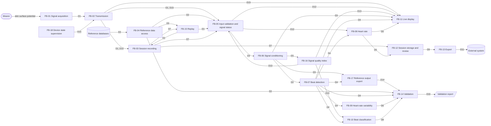

# Functional analysis

_Version 0.2.1, 2026-09-29. Status: confirmed by the project owner (Milestone 0)._

This document describes **what** Sinus does, from the point of view of its users: intended use, use scenarios, functional architecture and features per milestone. It is the input to the software requirements in [`srs.md`](srs.md) and to the user-level hazards in [`risk-analysis.md`](risk-analysis.md). How the functions are built is described in [`architecture.md`](architecture.md).

## Conventions

- Functional blocks are identified as `FB-01`, data flows as `D1`, use scenarios as `US-1`, features as `F<milestone>.<n>` (e.g. `F1.3`). These IDs are stable and never reused.
- The milestone prefix of a feature ID is the milestone in which the feature was first planned. A feature that moves to another milestone keeps its ID; the section in which it is listed gives its current milestone. New features take the next free number under the prefix of the milestone that introduces them.
- Every undecided or deferred item cites its open point `OP-xxx` in [`open-points.md`](open-points.md).
- Acceptance criteria are stated at feature level. The requirements in `srs.md` refine them into testable statements; each Milestone 1 feature lists the requirements that currently specify it. Requirements for later milestones are written at the start of each milestone.
- This document names functions and the data they exchange, not how or where they are implemented. The allocation of functions to software items (device firmware, desktop application, backend, shared signal-processing library) is in [`architecture.md`](architecture.md).

## Revision history

| Version | Date | Changes |
|---|---|---|
| 0.1 | 2026-09-28 | First version, confirmed by the project owner: US-1 to US-8, FB-01 to FB-14, D1 to D12, features F1.1 to F5.4 |
| 0.2 | 2026-09-29 | New roadmap in seven milestones (M0 to M6): a portable real-time implementation of the signal processing (M2) and a desktop application with replay (M3) come before the device (M4), the backend (M5) and classification (M6). The receiving application is a desktop application. Added US-9 to US-11; FB-15 (replay), FB-16 (signal quality index), FB-17 (reference outputs for equivalence), FB-18 (device state supervision); D13 to D15; features F1.10 to F1.12, F2.5 to F2.9, F3.8 to F3.11, F4.5 to F4.9, F6.1 and F6.2. Features F2.1 to F5.4 moved to their new milestones, with their IDs unchanged. Abstention added to beat classification. Confirmed by the project owner on 2026-09-29 |
| 0.2.1 | 2026-09-29 | Process review: F4.9 (second front end) moved after Milestone 6 as decided for OP-042; F2.10 and US-10 cite OP-051; wording of the reader example |

## 1. Purpose

Sinus is an open-source, single-lead wearable ECG built as an engineering and portfolio project. It demonstrates the complete path from electrodes to stored data: a battery-powered device, a desktop application that shows and records the signal, and a backend that stores sessions and exports them in a standard format. Heartbeat detection is validated on public reference databases using industry-standard scoring, including performance under noise; the real-time signal processing is checked against that validated reference; and the development documentation is structured after medical device software practice.

The desktop application can replay reference records and recorded sessions as if they came from the device, so that the whole processing and display chain can be demonstrated and verified without hardware.

Sinus is **not a medical device** and makes no clinical claim.

## 2. Intended use and users

### 2.1 Intended use

As stated in [`safety-class.md`](safety-class.md) §Intended use, which this section must not contradict:

- Sinus records and displays a single-lead ECG, detects heartbeats and computes heart rate and heart-rate variability **for technical demonstration**.
- It is **not** intended for diagnosis, for monitoring a medical condition, or for generating alarms or notifications, and its output must not be used to make health decisions.
- The device runs **only on battery power** while electrodes are attached. It is never connected to USB, a charger or any mains-powered equipment while worn.

Any function that interprets the ECG for the user (e.g. beat classification) or that prompts the user to act is a trigger for reviewing the safety classification (see `safety-class.md` §Review triggers).

### 2.2 Users

| User | Description | Main needs |
|---|---|---|
| Developer | The project owner or a contributor: technically trained, familiar with ECG basics and with the documentation in this repository | Reproduce and trust the validation results; process reference and recorded signals offline; check the real-time processing against the reference; demonstrate the system by replay without hardware; measure real-time performance |
| Wearer | An adult volunteer, usually the developer, who wears the device for a demonstration session. No medical training is assumed. Not a patient using Sinus for their health | Attach the device safely, see the live waveform and heart rate, know when the signal is not usable or the device is not working, and never mistake replayed data for their own signal |
| Reader | Anyone reading the published results and documentation (e.g. reviewers of the project) | Understand what was measured, how, and what the results do and do not mean |

Wearer exclusions and use-environment limits (e.g. age, implanted cardiac devices, exposure to water) are to be defined before the first worn session (OP-028). The use specification and the user interface are described in [`usability.md`](usability.md).

### 2.3 Use environment

- Offline use: any computer able to run the validation pipeline, with network access for the one-time download of the reference databases.
- Replay use: the desktop application on a personal computer, fed by replayed records or by a test input; no device and no person connected.
- Worn use: indoors, at rest or during light activity, for a demonstration session of limited duration (target duration OP-023), with the device on battery and the desktop application running on a nearby computer. The device and the computer communicate only over the wireless link while the device is worn.

### 2.4 Foreseeable misuse

- Reading heart rate, beat marks or (later) beat classes as health information, including sharing them with a clinician. Controlled by RC-005 and by the absence of alarms; see HAZ-001 to HAZ-003.
- Wearing the device while it is connected to a charger, a computer (including a wired test or debug link) or other mains-powered equipment. See HAZ-005, RC-006, OP-024, OP-038.
- Treating published results or exported data as clinical-grade measurements. See HAZ-010, RC-011, OP-027.
- Taking replayed reference data or a recorded session for the wearer's live signal. See HAZ-013, RC-015.
- Ignoring the signal quality indicator or a "not usable" status and reading the heart rate anyway. See HAZ-006, RC-007.

## 3. Use scenarios

| ID | Scenario | Users | Blocks involved | Milestone |
|---|---|---|---|---|
| US-1 | **Offline validation on reference data.** The developer downloads the MIT-BIH Arrhythmia Database and the MIT-BIH Noise Stress Test Database, verifies their integrity, runs beat detection on every record and generates the EC57 validation report, including performance versus signal-to-noise ratio, with one command. A second run produces an identical report. On every change, an automated build regenerates the report on a subset of records and flags any change in results. | Developer, Reader | FB-04, FB-05, FB-06, FB-07, FB-14 | M1 |
| US-2 | **Recording a session.** The wearer attaches the electrodes to the battery-powered device. The device acquires the ECG and sends it over the wireless link to the desktop application, which saves the session in a standard format. | Wearer | FB-01, FB-02, FB-03, FB-05, FB-18 | M4 |
| US-3 | **Offline analysis of a recorded session.** The developer processes a recorded session with the same offline functions used for the reference data (US-1) and inspects the detected beats. | Developer | FB-04, FB-05, FB-06, FB-07 | M4 |
| US-4 | **Live view.** While wearing the device, the wearer watches the live waveform with detected beats marked, the current heart rate and the signal quality. When the electrodes lose contact, the signal quality is too low or data stops arriving, the display shows that the signal is not usable instead of a heart rate. The data source and the intended-use statement are visible. | Wearer | FB-01, FB-02, FB-05 to FB-08, FB-11, FB-16, FB-18 | M3 (with replay); M4 (with the device) |
| US-5 | **Real-time performance check.** The developer measures the sampling-time jitter of the device, the delay between acquisition and display, and the number of samples lost, over a session. | Developer | FB-01, FB-02, FB-11, FB-14 | M4 |
| US-6 | **Reviewing a stored session.** After a session, the wearer or developer uploads it, later retrieves it and reviews the waveform, beats and heart-rate trend. Only the owner of the session can access it. Where the review takes place is to be decided (OP-026). | Wearer, Developer | FB-12 | M5 |
| US-7 | **Export.** The developer exports the measurements of a stored session as HL7 FHIR R4 `Observation` resources to demonstrate interoperability. The exported data states that it does not come from a medical device (OP-027). | Developer | FB-12, FB-13 | M5 |
| US-8 | **Rhythm analysis demonstration.** The developer computes heart-rate variability for a session, and runs beat classification offline, with results validated on reference data using an inter-patient split. Beats whose signal quality or classification confidence is too low are left unclassified, and the results state how many. | Developer, Reader | FB-09, FB-10, FB-14, FB-16 | M6 |
| US-9 | **Demonstration by replay.** Without hardware, the developer selects a reference record or a recorded session in the desktop application and replays it as if it came from the device. The live view (US-4) works as with the device, and the screen shows at all times that the data is replayed and from which record. | Developer, Reader | FB-15, FB-05 to FB-08, FB-11, FB-16 | M3 |
| US-10 | **Checking the real-time processing against the reference.** The developer runs the real-time signal conditioning and beat detection on the reference outputs exported by the offline functions (golden vectors), on a computer and on the device, and confirms that the results agree within a defined tolerance. | Developer | FB-06, FB-07, FB-14, FB-17 | M2 (computer); M4 (device), see OP-051 |
| US-11 | **Device fault during a session.** During a worn session the battery runs low, the device detects a fault, or it restarts after a watchdog reset. The desktop application shows the device state, stops presenting the signal as valid, and the recording keeps the data acquired before the event, with the gap marked. | Wearer, Developer | FB-02, FB-03, FB-11, FB-18 | M4 |

## 4. Functional architecture

### 4.1 Overview

The same functions (FB-05 to FB-08, FB-16) process reference records, recorded sessions, replayed streams (from Milestone 3) and the live stream of the device (from Milestone 4). They exist in two forms:

- the **offline reference** (Milestone 1), validated on the reference databases;
- the **real-time implementation** (Milestone 2), which processes one sample at a time with bounded memory and delay, so that the same implementation can run on the device and in the desktop application. It is verified against the offline reference on the reference outputs exported by FB-17, within a tolerance to be defined (OP-005).

Which real-time functions run on the device and which in the desktop application is an architecture decision ([`architecture.md`](architecture.md)).

### 4.2 Functional blocks

| ID | Block | Function | Input | Output | Milestone |
|---|---|---|---|---|---|
| FB-01 | Signal acquisition | Senses a single-lead ECG through skin electrodes and digitizes it at a fixed sampling rate of 360 Hz (OP-004, closed), on battery power only | Skin surface potential | D1 | M4 |
| FB-02 | Transmission | Carries the acquired stream and the device state from the worn device to the desktop application over a short-range wireless link, in numbered packets, so that every lost sample is detectable by the receiver | D1, D15 | D1, D15 | M4 |
| FB-03 | Session recording | Saves a session (signal, metadata, device events and gaps) in the WFDB format (EDF also: OP-034), so that it can be processed like a reference record. Recordings of replayed or test data are marked as such | D1, D15 | D7 | M3 (replayed data); M4 (device) |
| FB-04 | Reference data access | Obtains the public reference databases (MIT-BIH Arrhythmia, MIT-BIH Noise Stress Test), verifies their integrity and provides records and reference annotations | Reference databases | D2 | M1 |
| FB-05 | Input validation and signal status | Rejects input that cannot give meaningful results (M1: non-finite values, too short, unsupported sampling frequency). In real time, combines the signal quality index, electrode contact, data interruptions and the device state into the signal status, and reports the signal as not usable when any of them requires it (OP-020) | D1, D2, D7, D13, D15 | D3, D12 | M1 (offline input); M2 (signal quality); M3 (interruptions); M4 (contact, device state) |
| FB-06 | Signal conditioning | Removes baseline wander, mains interference (50 Hz or 60 Hz) and high-frequency noise while preserving the ECG band and the time base. In real time, also reduces mains and motion interference adaptively, using a motion reference when the device provides one (OP-041) | D3 | D3 (conditioned) | M1 (offline); M2 (real time, OP-005) |
| FB-07 | Beat detection | Locates each QRS complex in the signal; in real time, sample by sample with a bounded delay | D3 (conditioned) | D4 | M1 (offline); M2 (real time, OP-005) |
| FB-08 | Heart rate | Tracks the heart rate from the beat intervals, tolerating isolated missed or extra beats, and withholds it when it cannot be computed reliably or when the signal is not usable (OP-021) | D4, D12 | D5 | M2 (tracking); M3 (display rules) |
| FB-09 | Heart-rate variability | Computes time-domain and frequency-domain HRV measures over a session or segment | D4 | D6 | M6 |
| FB-10 | Beat classification | Assigns each detected beat to an AAMI class, or abstains when the signal quality or the classification confidence is too low (OP-017, OP-039) | D3, D4, D13 | D8 | M6 |
| FB-11 | Live display | Shows the live waveform with beat marks, the heart rate, the signal quality, the signal status, the device state (including battery), the data source (device, replay, test input) and the intended-use statement (OP-015) | D3, D4, D5, D12, D13, D15 | Screen | M3 |
| FB-12 | Session storage and review | Uploads, stores and retrieves sessions, restricted to their owner, and lets the user review them (OP-016, OP-026) | D7, D5 | D9 | M5 |
| FB-13 | Export | Exports session measurements as HL7 FHIR R4 `Observation` resources (OP-027) | D9 | D11 | M5 |
| FB-14 | Validation | Scores the functions against reference annotations and reference outputs with standard methods, and produces reproducible reports: QRS detection per ANSI/AAMI EC57, including noise stress (M1); equivalence of the real-time implementation with the reference (M2); sampling jitter, latency and lost samples (M4); beat classification with an inter-patient split and abstention, and HRV (M6) | D2, D4, D6, D8, D14, measurements | D10 | M1; M2; M4; M6 |
| FB-15 | Replay | Plays a reference record or a recorded session into the desktop application as a stream with the content and timing of the device stream, so that every downstream function behaves as with the device; also accepts a stream from a test input that is not worn (OP-037, OP-038) | D2, D7 | D1 | M3 |
| FB-16 | Signal quality index | Computes a signal quality index for each window of the signal, and marks windows below a threshold as not usable (OP-032) | D3 (conditioned) | D13 | M2 |
| FB-17 | Reference output export | Exports the outputs of the offline signal conditioning and beat detection on a defined set of inputs (golden vectors), deterministically and in a documented format, as the reference for FB-14 equivalence checks | D3, D4 | D14 | M1 |
| FB-18 | Device state supervision | Monitors the device (battery level, faults, restarts after a watchdog reset) and puts it in an explicit state (normal, low battery, error) that is sent with the stream; stops acquisition in an orderly way when it cannot continue (OP-035, OP-036) | Device internal status | D15 | M4 |

Battery-only operation while worn is a constraint on the whole system, enforced by the hardware design (RC-006, OP-024), not a software function.

### 4.3 Data flows

| ID | Data | Content and units |
|---|---|---|
| D1 | Live ECG stream | ECG samples with a known scale to millivolts (mV); sampling frequency in Hz (360 Hz from the device, OP-004 closed); packet sequence numbers and a continuous sample counter so that gaps are detectable; electrode-contact status; motion reference samples when the device provides them (OP-041); the data source (device, replay of a named record or session, test input) |
| D2 | Reference record | ECG signal in mV; sampling frequency in Hz (360 Hz for MIT-BIH); reference beat annotations (sample index, beat label); non-beat annotations (rhythm, signal quality) kept separate from beats; database name and version |
| D3 | ECG signal | ECG in mV at the source sampling frequency. Sample indices refer to the source time base (sample 0 = first sample of the record or session), before and after conditioning |
| D4 | Beat positions | Sample index of each detected QRS complex in the source time base (time in s = index / sampling frequency); RR intervals derived from them in ms |
| D5 | Heart rate | Beats per minute (bpm), with a validity flag (valid, or withheld with a reason) |
| D6 | HRV measures | SDNN and RMSSD in ms; LF and HF power in ms²; LF/HF ratio (dimensionless); analysed duration in s |
| D7 | Session record | D1 content saved in WFDB format (EDF also: OP-034), with metadata: start date and time (UTC), sampling frequency, scale to mV, device and software versions, data source, electrode-contact events, device state events (D15) and gaps |
| D8 | Beat classes | One AAMI class per detected beat (N, SVEB, VEB, F or Q), or "not classified" with the reason (low signal quality or low confidence) |
| D9 | Stored session | D7 plus the derived D4 and D5 (and D6, D8 once available), linked to its owner |
| D10 | Validation results | Per record and aggregate: true positives, false negatives, false positives, sensitivity (Se, %) and positive predictive value (+P, %), also per signal-to-noise ratio (dB) for the noise stress records (M1); differences between the real-time implementation and the reference outputs against their tolerance (M2); sampling-time jitter (µs), latency (ms) and lost samples (count and %) (M4); classification metrics per AAMI class on all beats and on accepted beats, and the abstention rate (%) (M6). Each report identifies the software version, data version and settings used |
| D11 | Export | HL7 FHIR R4 `Observation` resources (content OP-027) |
| D12 | Signal status | Usable or not usable, with the reason (input rejected, low signal quality, electrode contact lost, data interrupted, device low battery or in error) |
| D13 | Signal quality | A signal quality index per window of the signal, with the window position in the source time base, and whether the window is usable (OP-032) |
| D14 | Reference outputs (golden vectors) | For each defined input: input identifier, sampling frequency, settings, software version, input samples in mV, output of each conditioning stage in mV, detected beat positions; in a documented format, identical on every run |
| D15 | Device state | Normal, low battery or error (with a fault code); battery level; restart after a watchdog reset; time of each change in the sample time base |

## 5. Features and acceptance criteria

### 5.1 Milestone 1: Offline reference and validation

Scope: FB-04, FB-05 (offline input), FB-06 and FB-07 (offline reference), FB-14 (QRS detection, noise stress), FB-17. Scenario US-1.

| ID | Feature | Acceptance criteria | Specified by (SRS v0.3) |
|---|---|---|---|
| F1.1 | Obtain the reference database | MIT-BIH Arrhythmia Database version 1.0.0 is obtained from PhysioNet by one command. Every file is verified against the checksums published by PhysioNet; any missing or altered file stops the process with an error naming it. The data is never committed to the repository. | SRS-001 |
| F1.2 | Load a record | For a named record and channel: the ECG in mV, the sampling frequency in Hz and the reference beat annotations (sample index and label) are available. Annotations that are not beats are not reported as beats. | SRS-002 |
| F1.3 | Reject unusable input | Input with non-finite values, shorter than the minimum duration, or with a sampling frequency outside the supported range is rejected with an explicit error, and no beats are reported for it. | SRS-003 |
| F1.4 | Remove baseline wander | Components at 0.1 Hz and below are attenuated by at least 20 dB; the 1–40 Hz ECG band changes by no more than ±0.5 dB. | SRS-004 |
| F1.5 | Remove mains interference | For a selected mains frequency (50 Hz or 60 Hz), interference at that frequency is attenuated by at least 30 dB; the 1–40 Hz ECG band changes by no more than ±0.5 dB. | SRS-005 |
| F1.6 | Detect beats | Each QRS complex is reported once, at a position within 150 ms of the true QRS in the source time base; positions are increasing and at least 200 ms apart. Detection still meets these criteria when baseline wander and mains interference are present in the input. | SRS-006, SRS-010 |
| F1.7 | Detection performance | On all 48 MIT-BIH records, gross Se and gross +P are both at least 99.5%. | SRS-007 |
| F1.8 | Score detection per EC57 | Detections are matched to reference beats one to one within 150 ms, excluding the first 5 minutes of each record. Counts, Se and +P are reported per record, and as gross and average values for the whole set. | SRS-008, SRS-011 |
| F1.9 | Reproducible validation report | One command produces the complete report in `docs/validation/`; two runs on the same inputs and software version give identical reports. The report identifies the software version, the database version and the settings used, lists the records with the weakest performance, and states that the results are a technical evaluation, not a clinical validation. | SRS-009, SRS-012 |
| F1.10 | Performance under noise | The MIT-BIH Noise Stress Test Database is obtained and verified like F1.1. Detection is scored per F1.8 on its records (electrode motion noise at 24, 18, 12, 6, 0 and −6 dB SNR), and the report of F1.9 shows Se and +P per record and per SNR, next to the same records without added noise. Performance thresholds under noise: OP-031. | SRS-013, SRS-014 |
| F1.11 | Reference outputs for equivalence | One command exports, for a defined set of synthetic inputs and record segments, the outputs of each conditioning stage and the detected beats, with the input and settings, in a documented format. Two runs give identical files. The values read back equal the ones computed. | SRS-015 |
| F1.12 | Regression check on every change | On every change, an automated build obtains and verifies a defined subset of reference records, regenerates a subset report, and fails when the results differ from the stored subset report or the data fails verification. The subset report states that it is a regression check, not the performance evaluation of F1.7. | SRS-016 |

### 5.2 Milestone 2: Portable real-time signal processing

Scope: FB-06, FB-07, FB-08 (tracking) and FB-16 in real time; FB-14 (equivalence with the reference). Scenario US-10 (on a computer; on the device processor without a person connected).

| ID | Feature | Acceptance criteria |
|---|---|---|
| F2.5 | Real-time signal conditioning | Baseline wander, mains interference (50 Hz or 60 Hz) and high-frequency noise are removed one sample at a time, with fixed memory and a bounded, documented delay. The band criteria of F1.4 and F1.5 hold at the sampling rates of the reference validation and of the device (360 Hz, OP-004 closed). |
| F2.6 | Adaptive interference reduction | Mains interference whose frequency or amplitude drifts, and motion artefact when a motion reference is available (OP-041), are reduced adaptively. On test signals with known interference, the interference is measurably reduced and detection still meets the criteria of F1.6. |
| F2.7 | Streaming beat detection | Beats are reported sample by sample with a bounded, documented delay; their positions refer to the source time base and meet the criteria of F1.6. |
| F2.8 | Heart-rate tracking | The heart rate is tracked from beat intervals. An isolated missed or extra beat changes the reported heart rate by less than a defined amount, and the estimate is never reported as current beyond a defined time without new beats (OP-021). |
| F2.9 | Signal quality index | Every window of the signal gets a signal quality index. Windows of clean ECG are marked usable; windows of noise only, flat line or saturated signal are marked not usable. On the noise stress records of F1.10 the index decreases as the SNR decreases (OP-032). |
| F3.4 | Real-time detection equivalent to the reference (moved from Milestone 3) | On the reference outputs of F1.11, the real-time conditioning outputs and beat positions agree with the offline reference within a defined tolerance (OP-005). The check runs on every change. |
| F2.10 | Same implementation on computer and device | The real-time functions pass the same equivalence checks when built for a computer and for the device processor, so that the desktop application and the device use one implementation (where and when the device build is checked: OP-051). |

### 5.3 Milestone 3: Desktop application and replay

Scope: FB-03 (replayed data), FB-05 (interruptions), FB-08 (display rules), FB-11, FB-15. Scenarios US-4 (with replayed data) and US-9.

| ID | Feature | Acceptance criteria |
|---|---|---|
| F3.8 | Replay | A reference record or a recorded session is replayed into the desktop application at its original rate, as if it came from the device; the beats, heart rate and signal quality shown match those of the real-time implementation on the same data. Replay can be paused and stopped (OP-037). |
| F3.1 | Live waveform | The conditioned waveform is displayed continuously with detected beats marked. |
| F3.2 | Live heart rate | The heart rate is displayed in bpm, updated regularly, and withheld when the signal is not usable or too few beats are available (OP-021). |
| F3.9 | Signal quality indicator | The signal quality of the current window is shown next to the heart rate, and a not-usable window is shown as such (OP-032). |
| F3.3 | Signal status | When the signal quality is too low, electrode contact is lost or data stops arriving, the display shows it within a defined time and does not keep showing the last heart rate as current (OP-020, OP-021). |
| F3.10 | Data source shown | The data source (device, replay with the record name, test input) is shown at all times on the live view, and recordings of replayed or test data are marked as such (OP-037). |
| F3.11 | Test input without hardware | The desktop application accepts a stream from a wired or network test input (e.g. serial or UDP) for tests without the device. The application states that the test input is never to be used with a device worn by a person (OP-038). |
| F2.4 | Record a session (moved from Milestone 2) | A session is saved in WFDB format with the metadata of D7, and loads in the offline functions of Milestone 1 (F1.2) without conversion (EDF also: OP-034). |
| F3.6 | Intended-use statement | The statement "Not a medical device, not for diagnosis or health decisions" is visible at all times in the desktop application (OP-015). |
| F3.7 | Mains frequency | The mains interference filter uses the correct mains frequency for the place of use (OP-022). |

### 5.4 Milestone 4: Hardware, firmware and integration

Scope: FB-01, FB-02, FB-03 (device), FB-05 (electrode contact, device state), FB-18, FB-14 (jitter, latency, lost samples); the real-time functions of Milestone 2 on the device. Scenarios US-2, US-3, US-4 (with the device), US-5, US-10 (on the device), US-11.

| ID | Feature | Acceptance criteria |
|---|---|---|
| F2.1 | Acquire a single-lead ECG on battery (moved from Milestone 2) | The device acquires a single-lead ECG at a fixed sampling rate of 360 Hz (OP-004, closed), continuously for the target session duration (OP-023). It cannot be worn while connected to a charger or other mains-powered equipment (OP-024, OP-013). |
| F2.2 | Stream to the desktop application (moved from Milestone 2) | Samples are sent in numbered packets and arrive in order; every lost sample is detectable by the receiver and counted (OP-012). |
| F2.3 | Detect electrode contact loss (moved from Milestone 2) | Loss of electrode contact is detected and reported with the stream (OP-020). |
| F4.5 | Explicit device state | The device is always in a defined state (normal, low battery, error) that is sent with the stream and shown by the desktop application. In the error state the signal is reported as not usable (OP-036). |
| F4.6 | Low battery | At a defined battery level the device reports low battery before the signal degrades; it then stops acquisition in an orderly way, and the recording up to that point is kept with the event marked (OP-035). |
| F4.7 | Recovery from a watchdog reset | After a watchdog reset the device restarts in a defined state and reports the restart; the desktop application marks the gap in the recording and does not compute beat intervals across it (OP-036). |
| F3.5 | Sampling jitter, latency and lost samples (moved from Milestone 3) | Sampling-time jitter on the device, end-to-end latency from acquisition to display and lost samples are measured over a session and reported against targets (OP-014). |
| F4.8 | End-to-end integration | A worn session is shown live and recorded by the desktop application, and the recording loads in the offline functions (F1.2). Integration is verified by replaying reference records through the device and the desktop application (OP-007). |

### 5.5 Milestone 5: Backend and interoperability

Scope: FB-12, FB-13. Scenarios US-6, US-7.

| ID | Feature | Acceptance criteria |
|---|---|---|
| F4.1 | Upload and store sessions (moved from Milestone 4) | A recorded session is uploaded and retrieved unchanged, and only its authenticated owner can access it. Stored data is encrypted at rest (OP-016). |
| F4.2 | Review a stored session (moved from Milestone 4) | The waveform, beats and heart-rate trend of a stored session can be reviewed (where and how: OP-026). |
| F4.3 | FHIR export (moved from Milestone 4) | The heart rate of a session is exported as valid HL7 FHIR R4 `Observation` resources that reference the session recording and state their non-medical origin (OP-027). |
| F4.4 | Security and privacy review (moved from Milestone 4) | Authentication, encryption at rest and GDPR notes are reviewed and documented (OP-016). |

### 5.6 Milestone 6: Classification, HRV and final report

Scope: FB-09, FB-10, FB-14 (classification, HRV, final report). Scenario US-8.

| ID | Feature | Acceptance criteria |
|---|---|---|
| F5.1 | HRV analysis (moved from Milestone 5) | SDNN, RMSSD, LF, HF and LF/HF are computed from detected beats and checked against reference values on reference data. |
| F5.2 | Beat classification (moved from Milestone 5) | Beats are classified into the AAMI classes and validated with an inter-patient split (no patient in both training and test data). A feature-based model and a small neural network are compared. Results are reported per class. Adding this feature triggers the review of the safety classification (OP-017). |
| F6.1 | Abstention | A beat is left unclassified when its signal quality or the classification confidence is below a threshold (OP-039). Results are reported on all beats, on accepted beats only, and as the abstention rate, per class. |
| F6.2 | Dataset and model documentation | A dataset card (composition, limits, class and record imbalance, inter-patient split) and a model card (intended use, performance with and without abstention, limits) are published with the results. |
| F5.3 | Independent performance evidence (moved from Milestone 5) | Detection performance is also reported on a reference database not used during development (OP-029). Noise stress moved to F1.10. |
| F5.4 | Final verification report (moved from Milestone 5) | A final report summarises the verification of every requirement and the validation results of all milestones. |

### 5.7 After Milestone 6

Planned after the six milestones; listed so that the functional architecture stays complete.

| ID | Feature | Acceptance criteria |
|---|---|---|
| F4.9 | Second front end | A multi-channel, higher-resolution front end can replace the first one, still used as a single lead, with the same stream (D1) to the desktop application (OP-042). |

## 6. Open points referenced

OP-005, OP-007, OP-012 to OP-017, OP-020 to OP-029, OP-031, OP-032, OP-034 to OP-039, OP-041, OP-042, OP-051. See [`open-points.md`](open-points.md). The review of the requirements against this document (OP-019) and the device sampling rate (OP-004, 360 Hz) are closed.
