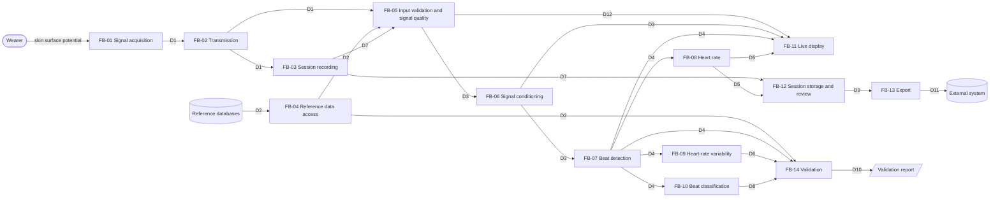

# Functional analysis

_Version 0.1, 2026-09-28. Status: confirmed by the project owner (Milestone 0)._

This document describes **what** Sinus does, from the point of view of its users: intended use, use scenarios, functional architecture and features per milestone. It is the input to the software requirements in [`srs.md`](srs.md) and to the user-level hazards in [`risk-analysis.md`](risk-analysis.md). How the functions are built is described in [`architecture.md`](architecture.md).

## Conventions

- Functional blocks are identified as `FB-01`, data flows as `D1`, use scenarios as `US-1`, features as `F<milestone>.<n>` (e.g. `F1.3`). These IDs are stable and never reused.
- Every undecided or deferred item cites its open point `OP-xxx` in [`open-points.md`](open-points.md).
- Acceptance criteria are stated at feature level. The requirements in `srs.md` refine them into testable statements; each Milestone 1 feature lists the requirements that currently specify it.

## 1. Purpose

Sinus is an open-source, single-lead wearable ECG built as an engineering and portfolio project. It demonstrates the complete path from electrodes to stored data, with heartbeat detection validated on public reference databases using industry-standard scoring, and with development documentation structured after medical device software practice.

Sinus is **not a medical device** and makes no clinical claim.

## 2. Intended use and users

### 2.1 Intended use

As stated in [`safety-class.md`](safety-class.md) §Intended use, which this section must not contradict:

- Sinus records and displays a single-lead ECG, detects heartbeats and computes heart rate and heart-rate variability **for technical demonstration**.
- It is **not** intended for diagnosis, for monitoring a medical condition, or for generating alarms or notifications, and its output must not be used to make health decisions.
- The device runs **only on battery power** while electrodes are attached. It is never connected to USB, a charger or any mains-powered equipment while worn.

Any function that interprets the ECG for the user (e.g. beat classification) or that prompts the user to act is a trigger for reviewing the safety classification (see `safety-class.md` §Review triggers).

### 2.2 Users

| User | Description | Main needs |
|---|---|---|
| Developer | The project owner or a contributor: technically trained, familiar with ECG basics and with the documentation in this repository | Reproduce and trust the validation results; process reference and recorded signals offline; measure real-time performance |
| Wearer | An adult volunteer, usually the developer, who wears the device for a demonstration session. No medical training is assumed. Not a patient using Sinus for their health | Attach the device safely, see the live waveform and heart rate, know when the signal is not usable |
| Reader | Anyone reading the published results and documentation (e.g. reviewers of the portfolio) | Understand what was measured, how, and what the results do and do not mean |

Wearer exclusions and use-environment limits (e.g. age, implanted cardiac devices, exposure to water) are to be defined before the first worn session (OP-028).

### 2.3 Use environment

- Offline use: any computer able to run the validation pipeline, with network access for the one-time download of the reference databases.
- Worn use: indoors, at rest or during light activity, for a demonstration session of limited duration (target duration OP-023), with the device on battery and the receiving application nearby.

### 2.4 Foreseeable misuse

- Reading heart rate, beat marks or (later) beat classes as health information, including sharing them with a clinician. Controlled by RC-005 and by the absence of alarms; see HAZ-001 to HAZ-003.
- Wearing the device while it is connected to a charger, a computer or other mains-powered equipment. See HAZ-005, RC-006, OP-024.
- Treating published results or exported data as clinical-grade measurements. See HAZ-010, RC-011, OP-027.

## 3. Use scenarios

| ID | Scenario | Users | Blocks involved | Milestone |
|---|---|---|---|---|
| US-1 | **Offline validation on reference data.** The developer downloads the MIT-BIH Arrhythmia Database, verifies its integrity, runs beat detection on every record and generates the EC57 validation report with one command. A second run produces an identical report. | Developer, Reader | FB-04, FB-05, FB-06, FB-07, FB-14 | M1 |
| US-2 | **Recording a session.** The wearer attaches the electrodes to the battery-powered device. The device acquires the ECG and sends it to the receiving application, which saves the session in the standard WFDB format. | Wearer | FB-01, FB-02, FB-03, FB-05 | M2 |
| US-3 | **Offline analysis of a recorded session.** The developer processes a recorded session with the same offline functions used for the reference data (US-1) and inspects the detected beats. | Developer | FB-04, FB-05, FB-06, FB-07 | M2 |
| US-4 | **Live view.** While wearing the device, the wearer watches the live waveform with detected beats marked and the current heart rate. When the electrodes lose contact or data stops arriving, the display shows that the signal is not usable instead of a heart rate. The intended-use statement is visible. | Wearer | FB-01, FB-02, FB-05 to FB-08, FB-11 | M3 |
| US-5 | **Real-time performance check.** The developer measures the delay between acquisition and display, and the number of samples lost, over a session. | Developer | FB-01, FB-02, FB-11, FB-14 | M3 |
| US-6 | **Reviewing a stored session.** After a session, the wearer or developer uploads it, later retrieves it and reviews the waveform, beats and heart-rate trend. Only the owner of the session can access it. Where the review takes place is to be decided (OP-026). | Wearer, Developer | FB-12 | M4 |
| US-7 | **Export.** The developer exports the measurements of a stored session as HL7 FHIR `Observation` resources to demonstrate interoperability. The exported data states that it does not come from a medical device (OP-027). | Developer | FB-12, FB-13 | M4 |
| US-8 | **Rhythm analysis demonstration.** The developer computes heart-rate variability for a session, and runs beat classification offline, with results validated on reference data using an inter-patient split. | Developer, Reader | FB-09, FB-10, FB-14 | M5 |

## 4. Functional architecture

### 4.1 Overview

The same functions (FB-05 to FB-07) process reference records, recorded sessions and, from Milestone 3, the live stream. The offline functions are the reference against which the real-time functions are verified (OP-005).

### 4.2 Functional blocks

| ID | Block | Function | Input | Output | Milestone |
|---|---|---|---|---|---|
| FB-01 | Signal acquisition | Senses a single-lead ECG through skin electrodes and digitizes it at a fixed sampling rate (OP-004), on battery power only | Skin surface potential | D1 | M2 |
| FB-02 | Transmission | Carries the acquired stream from the worn device to the receiving application over a short-range wireless link, so that every lost sample is detectable by the receiver | D1 | D1 | M2 |
| FB-03 | Session recording | Saves a session (signal and metadata) in the WFDB format, so that it can be processed like a reference record | D1 | D7 | M2 |
| FB-04 | Reference data access | Obtains the public reference databases, verifies their integrity and provides records and reference annotations | Reference databases | D2 | M1 |
| FB-05 | Input validation and signal quality | Rejects input that cannot give meaningful results (M1: non-finite values, too short, unsupported sampling frequency). From M2/M3 also detects electrode contact loss and interrupted data, and reports the signal as not usable (OP-020) | D1, D2, D7 | D3, D12 | M1 (offline input); M2–M3 (live signal) |
| FB-06 | Signal conditioning | Removes baseline wander and mains interference (50 Hz or 60 Hz) while preserving the ECG band and the time base | D3 | D3 (conditioned) | M1 (offline); M3 (real time, OP-005) |
| FB-07 | Beat detection | Locates each QRS complex in the signal | D3 (conditioned) | D4 | M1 (offline); M3 (real time, OP-005) |
| FB-08 | Heart rate | Derives the heart rate from recent beat intervals, and withholds it when it cannot be computed reliably (OP-021) | D4, D12 | D5 | M3 |
| FB-09 | Heart-rate variability | Computes time-domain and frequency-domain HRV measures over a session or segment | D4 | D6 | M5 |
| FB-10 | Beat classification | Assigns each detected beat to an AAMI class (OP-017) | D3, D4 | D8 | M5 |
| FB-11 | Live display | Shows the live waveform with beat marks, the heart rate, the signal status and the intended-use statement (OP-015) | D3, D4, D5, D12 | Screen | M3 |
| FB-12 | Session storage and review | Uploads, stores and retrieves sessions, restricted to their owner, and lets the user review them (OP-016, OP-026) | D7, D5 | D9 | M4 |
| FB-13 | Export | Exports session measurements as HL7 FHIR `Observation` resources (OP-027) | D9 | D11 | M4 |
| FB-14 | Validation | Scores the algorithms against reference annotations with standard methods and produces reproducible reports: QRS detection per ANSI/AAMI EC57 (M1); latency and lost samples (M3); beat classification with an inter-patient split and HRV (M5) | D2, D4, D6, D8, measurements | D10 | M1; M3; M5 |

Battery-only operation while worn is a constraint on the whole system, enforced by the hardware design (RC-006, OP-024), not a software function.

### 4.3 Data flows

| ID | Data | Content and units |
|---|---|---|
| D1 | Live ECG stream | ECG samples with a known scale to millivolts (mV); sampling frequency in Hz (OP-004); a continuous sample counter so that gaps are detectable; electrode-contact status |
| D2 | Reference record | ECG signal in mV; sampling frequency in Hz (360 Hz for MIT-BIH); reference beat annotations (sample index, beat label); non-beat annotations (rhythm, signal quality) kept separate from beats; database name and version |
| D3 | ECG signal | ECG in mV at the source sampling frequency. Sample indices refer to the source time base (sample 0 = first sample of the record or session), before and after conditioning |
| D4 | Beat positions | Sample index of each detected QRS complex in the source time base (time in s = index / sampling frequency); RR intervals derived from them in ms |
| D5 | Heart rate | Beats per minute (bpm), with a validity flag (valid, or withheld with a reason) |
| D6 | HRV measures | SDNN and RMSSD in ms; LF and HF power in ms²; LF/HF ratio (dimensionless); analysed duration in s |
| D7 | Session record | D1 content saved in WFDB format, with metadata: start date and time (UTC), sampling frequency, scale to mV, device and software versions, electrode-contact events |
| D8 | Beat classes | One AAMI class per detected beat: N, SVEB, VEB, F or Q |
| D9 | Stored session | D7 plus the derived D4 and D5 (and D6, D8 once available), linked to its owner |
| D10 | Validation results | Per record and aggregate: true positives, false negatives, false positives, sensitivity (Se, %) and positive predictive value (+P, %); from M3 latency (ms) and lost samples (count and %); from M5 classification metrics per AAMI class. Each report identifies the software version, data version and settings used |
| D11 | Export | HL7 FHIR `Observation` resources (content OP-027) |
| D12 | Signal status | Usable or not usable, with the reason (input rejected, electrode contact lost, data interrupted) |

## 5. Features and acceptance criteria

### 5.1 Milestone 1: Offline algorithms

Scope: FB-04, FB-05 (offline input), FB-06 and FB-07 (offline), FB-14 (QRS detection). Scenario US-1.

| ID | Feature | Acceptance criteria | Specified by (SRS v0.2) |
|---|---|---|---|
| F1.1 | Obtain the reference database | MIT-BIH Arrhythmia Database version 1.0.0 is obtained from PhysioNet by one command. Every file is verified against the checksums published by PhysioNet; any missing or altered file stops the process with an error naming it. The data is never committed to the repository. | SRS-001 |
| F1.2 | Load a record | For a named record and channel: the ECG in mV, the sampling frequency in Hz and the reference beat annotations (sample index and label) are available. Annotations that are not beats are not reported as beats. | SRS-002 |
| F1.3 | Reject unusable input | Input with non-finite values, shorter than the minimum duration, or with a sampling frequency outside the supported range is rejected with an explicit error, and no beats are reported for it. | SRS-003 |
| F1.4 | Remove baseline wander | Components at 0.1 Hz and below are attenuated by at least 20 dB; the 1–40 Hz ECG band changes by no more than ±0.5 dB. | SRS-004 |
| F1.5 | Remove mains interference | For a selected mains frequency (50 Hz or 60 Hz), interference at that frequency is attenuated by at least 30 dB; the 1–40 Hz ECG band changes by no more than ±0.5 dB. | SRS-005 |
| F1.6 | Detect beats | Each QRS complex is reported once, at a position within 150 ms of the true QRS in the source time base; positions are increasing and at least 200 ms apart. Detection still meets these criteria when baseline wander and mains interference are present in the input. | SRS-006, SRS-010 |
| F1.7 | Detection performance | On all 48 MIT-BIH records, gross Se and gross +P are both at least 99.5%. | SRS-007 |
| F1.8 | Score detection per EC57 | Detections are matched to reference beats one to one within 150 ms, excluding the first 5 minutes of each record. Counts, Se and +P are reported per record, and as gross and average values for the whole set. | SRS-008, SRS-011 |
| F1.9 | Reproducible validation report | One command produces the complete report in `docs/validation/`; two runs on the same inputs and software version give identical reports. The report identifies the software version, the database version and the settings used, lists the records with the weakest performance, and states that the results are a technical evaluation, not a clinical validation. | SRS-009, SRS-012 |

### 5.2 Milestone 2: Hardware and firmware

Scope: FB-01, FB-02, FB-03, FB-05 (electrode contact). Scenarios US-2, US-3.

| ID | Feature | Acceptance criteria |
|---|---|---|
| F2.1 | Acquire a single-lead ECG on battery | The device acquires a single-lead ECG at a fixed sampling rate (OP-004), continuously for the target session duration (OP-023). It cannot be worn while connected to a charger or other mains-powered equipment (OP-024, OP-013). |
| F2.2 | Stream to the receiving application | Samples arrive in order; every lost sample is detectable by the receiver and counted (risk analysis OP-012). |
| F2.3 | Detect electrode contact loss | Loss of electrode contact is detected and reported with the stream (OP-020). |
| F2.4 | Record a session | A session is saved in WFDB format with the metadata of D7, and loads in the offline functions of Milestone 1 (F1.2) without conversion. |

### 5.3 Milestone 3: Real-time pipeline

Scope: FB-05 to FB-08 (real time), FB-11, FB-14 (latency, lost samples). Scenarios US-4, US-5.

| ID | Feature | Acceptance criteria |
|---|---|---|
| F3.1 | Live waveform | The conditioned waveform is displayed continuously with detected beats marked. |
| F3.2 | Live heart rate | The heart rate is displayed in bpm, updated regularly, and withheld when the signal is not usable or too few beats are available (OP-021). |
| F3.3 | Signal status | When electrode contact is lost or data stops arriving, the display shows it within a defined time and does not keep showing the last heart rate as current (OP-020, OP-021). |
| F3.4 | Real-time detection | Real-time conditioning and detection give the same beats as the offline reference within a defined tolerance (OP-005). |
| F3.5 | Latency and lost samples | End-to-end latency and lost samples are measured and reported against targets to be defined (OP-014). |
| F3.6 | Intended-use statement | The statement "Not a medical device, not for diagnosis or health decisions" is visible in the application (OP-015). |
| F3.7 | Mains frequency | The mains interference filter uses the correct mains frequency for the place of use (OP-022). |

### 5.4 Milestone 4: Backend and interoperability

Scope: FB-12, FB-13. Scenarios US-6, US-7.

| ID | Feature | Acceptance criteria |
|---|---|---|
| F4.1 | Upload and store sessions | A recorded session is uploaded and retrieved unchanged, and only its owner can access it (OP-016). |
| F4.2 | Review a stored session | The waveform, beats and heart-rate trend of a stored session can be reviewed (where and how: OP-026). |
| F4.3 | FHIR export | Session measurements are exported as valid HL7 FHIR `Observation` resources that state their non-medical origin (OP-027). |
| F4.4 | Security review | Authentication, data at rest and GDPR notes are reviewed and documented (OP-016). |

### 5.5 Milestone 5: Classification and polish

Scope: FB-09, FB-10, FB-14 (classification, HRV, final report). Scenario US-8.

| ID | Feature | Acceptance criteria |
|---|---|---|
| F5.1 | HRV analysis | SDNN, RMSSD, LF, HF and LF/HF are computed from detected beats and checked against reference values on reference data. |
| F5.2 | Beat classification | Beats are classified into the AAMI classes and validated with an inter-patient split (no patient in both training and test data). Results are reported per class. Adding this feature triggers the review of the safety classification (OP-017). |
| F5.3 | Independent performance evidence | Detection performance is also reported on data not used during development, including noise stress (OP-029). |
| F5.4 | Final verification report | A final report summarises the verification of every requirement and the validation results of all milestones. |

## 6. Open points referenced

OP-004, OP-005, OP-012 to OP-017, OP-020 to OP-029. See [`open-points.md`](open-points.md). The review of the requirements against this document (OP-019) is closed.
